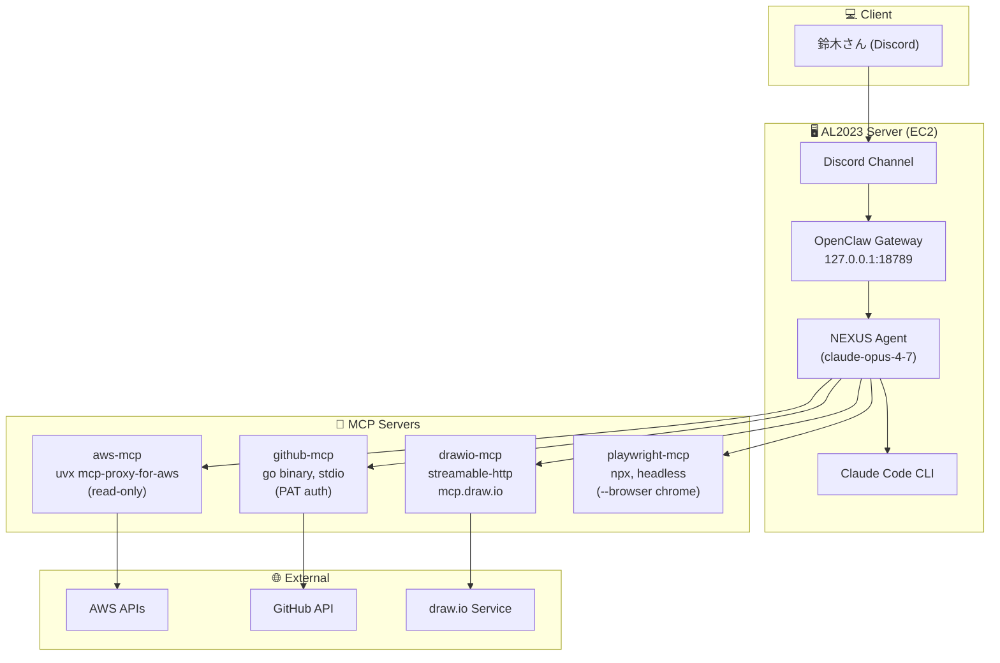

# public-openclaw-01

OpenClaw 実行プラットフォーム関連の公開ドキュメント・動作確認資料を集めたリポジトリです。

- **対象:** AL2023（Amazon Linux 2023）on EC2 上で稼働する OpenClaw + Claude Code + MCP サーバ群
- **方針:** ホスト名・内部 IP・OS ユーザ名等の固有情報は全て placeholder（`<your-user>` 等）に伏字化
- **マスター:** ローカル `/opt/docs/openclaw/` 配下（本リポジトリはミラー）

## 🏗 アーキテクチャ

## 📁 ディレクトリ構成

| パス | 用途 |
|---|---|
| `docs/openclaw/` | OpenClaw のセットアップ・設定・運用手順書（連番管理） |
| `docs/info/` | 調査・ニュース・セキュリティ等の情報ノート（`research` / `news` / `security`） |
| `tests/` | 動作確認・実験・スクラッチ的な成果物 |

### 命名規則

- **`docs/openclaw/`**: `NNN_STATUS_CATEGORY_name.md`（push 時刻の古い順に連番）
  - STATUS = `DONE` / `TODO` / `INFO`、CATEGORY = `SETUP` / `GUIDE` / `REF` / `PLAN` / `SEC`
- **`docs/info/`**: `YYYYMMDD_STATUS_TOPIC_title.md`
  - STATUS = `INFO` / `WIP` / `DONE` / `TODO`（security は `OPEN` / `FIXED` も可）

### 収録ドキュメント

#### docs/openclaw/（セットアップ・運用手順）

| # | ドキュメント | 概要 |
|---|---|---|
| 001 | [server-initial-setup](docs/openclaw/001_DONE_SETUP_server-initial-setup.md) | AL2023 + EC2 でのサーバ初期構築（ユーザ / SSH / Node.js / Swap / Claude Code / OpenClaw 導入） |
| 002 | [mcp-setup-guide](docs/openclaw/002_DONE_SETUP_mcp-setup-guide.md) | MCP サーバ群のセットアップ手順 |
| 003 | [slash-commands-cheatsheet](docs/openclaw/003_INFO_REF_slash-commands-cheatsheet.md) | スラッシュコマンド早見表 |
| 004 | [skills-cheatsheet](docs/openclaw/004_INFO_REF_skills-cheatsheet.md) | スキル早見表 |
| 005 | [workspace-tuning-guide](docs/openclaw/005_DONE_GUIDE_workspace-tuning-guide.md) | ワークスペース調整ガイド |
| 006 | [playwright-mcp-setup](docs/openclaw/006_DONE_SETUP_playwright-mcp-setup.md) | playwright-mcp の設定 |
| 007 | [playwright-browser-setup](docs/openclaw/007_DONE_SETUP_playwright-browser-setup.md) | ブラウザ依存ライブラリ／Google Chrome 導入（ヘッドレス） |
| 008 | [security-remote-access](docs/openclaw/008_INFO_SEC_security-remote-access.md) | リモートアクセスのセキュリティ検討 |
| 009 | [weekly-github-trending-task](docs/openclaw/009_DONE_SETUP_weekly-github-trending-task.md) | 週次 GitHub トレンド記事タスクの構築手順 |
| 010 | [gemini-fallback](docs/openclaw/010_DONE_SETUP_gemini-fallback.md) | Claude 障害時に Gemini（無料枠）へ自動フォールバックする構成の構築手順 |
| 011 | [fallback-notify](docs/openclaw/011_DONE_SETUP_fallback-notify.md) | Claude→fallback 切替の発生を Discord へ即時通知する常駐サービスの構築手順 |
| 012 | [al2023-security-task](docs/openclaw/012_DONE_SETUP_al2023-security-task.md) | AL2023 セキュリティアドバイザリを日次監視し docs/info/security へ要約記事を公開するタスクの構築手順 |

#### docs/info/news/（情報記事）

| 日付 | ドキュメント | 概要 |
|---|---|---|
| 2026-06-07 | [system-design-primer](docs/info/news/20260607_INFO_SYSDESIGN_system-design-primer.md) | 大規模システム設計の定番学習リポジトリ |
| 2026-06-07 | [public-apis](docs/info/news/20260607_INFO_API_public-apis.md) | 無料 API カタログ |
| 2026-06-07 | [generative-ai-for-beginners](docs/info/news/20260607_INFO_GENAI_generative-ai-for-beginners.md) | Microsoft 製 生成AI入門 21レッスン |
| 2026-06-07 | [dify](docs/info/news/20260607_INFO_AGENT_dify.md) | AIエージェント／LLMアプリ開発基盤 |
| 2026-06-07 | [ollama](docs/info/news/20260607_INFO_LLM_ollama.md) | ローカル LLM 実行ツール |
| 2026-06-07 | [markitdown](docs/info/news/20260607_INFO_TOOL_markitdown.md) | ファイル→Markdown 変換ツール |
| 2026-06-07 | [claude-code](docs/info/news/20260607_INFO_CLAUDE_claude-code.md) | ターミナル常駐のエージェント型コーディングツール |

> `docs/info/news/` は毎週土曜 06:30 JST の自動タスクで追記されます（構築手順は 009 を参照）。
> `docs/info/security/` は毎日 07:02 JST の自動タスクで追記されます（AL2023 の新規 Critical/Important のみ。構築手順は 012 を参照）。

#### tests/（動作確認）

- [mcp-architecture-test.md](tests/mcp-architecture-test.md) — drawio-mcp 動作確認時の構成図と検証ログ
- [mcp-architecture-test.mmd](tests/mcp-architecture-test.mmd) — 上記の Mermaid 原本

## 🔗 関連

- [Claude Code 公式ドキュメント (ja)](https://code.claude.com/docs/ja/quickstart)
- [OpenClaw 公式](https://openclaw.ai/)
- [AL2023 リリースノート](https://docs.aws.amazon.com/linux/al2023/release-notes/)

## Author and Ownership / 著作権と所属について

This project was created as a personal initiative and is not connected to any organization or group.
It is published as an individual creative work.

本プロジェクトは個人の活動として作成したものであり、特定の組織や団体の業務とは関係ありません。
個人の創作物として公開しています。

## 📜 License

[MIT License](LICENSE)
