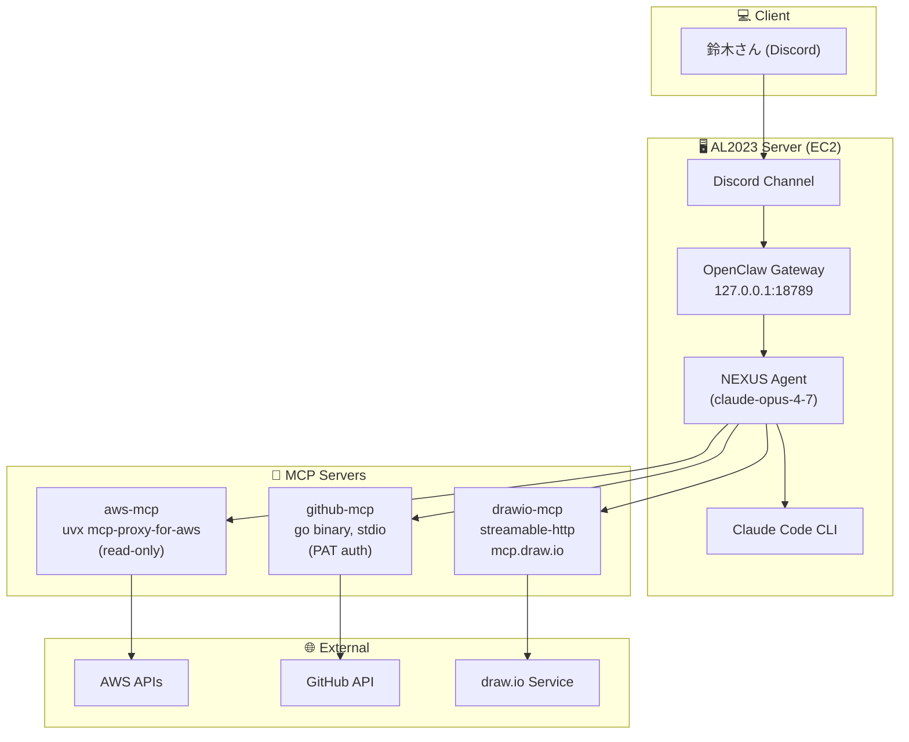

# public-openclaw-01

OpenClaw 実行プラットフォーム関連の公開ドキュメント・動作確認資料を集めたリポジトリです。

- **対象:** AL2023（Amazon Linux 2023）on EC2 上で稼働する OpenClaw + Claude Code + MCP サーバ群
- **方針:** ホスト名・内部 IP・OS ユーザ名等の固有情報は全て placeholder（`<your-user>` 等）に伏字化
- **マスター:** ローカル `/opt/docs/openclaw/` 配下（本リポジトリはミラー）

## 🏗 アーキテクチャ

## 📁 ディレクトリ構成

| パス | 用途 |
|---|---|
| `docs/<project>/` | プロジェクトごとの永続ドキュメント（手順書・設計書・運用ノート等） |
| `tests/` | 動作確認・実験・スクラッチ的な成果物 |

### 収録ドキュメント

- **[docs/openclaw/server-initial-setup.md](docs/openclaw/server-initial-setup.md)** — AL2023 + EC2 環境で OpenClaw を稼働させるためのサーバ初期構築手順（ユーザ作成 / SSH / Node.js 24.x / Swap / Claude Code / OpenClaw インストールまで）
- **[tests/mcp-architecture-test.md](tests/mcp-architecture-test.md)** — drawio-mcp 動作確認時の構成図と検証ログ
- **[tests/mcp-architecture-test.mmd](tests/mcp-architecture-test.mmd)** — 上記の Mermaid 原本

## 🔗 関連

- [Claude Code 公式ドキュメント (ja)](https://code.claude.com/docs/ja/quickstart)
- [OpenClaw 公式](https://openclaw.ai/)
- [AL2023 リリースノート](https://docs.aws.amazon.com/linux/al2023/release-notes/)

## Author and Ownership / 著作権と所属について

This project was created as a personal initiative and is not connected to any organization or group.
It is published as an individual creative work.

本プロジェクトは個人の活動として作成したものであり、特定の組織や団体の業務とは関係ありません。
個人の創作物として公開しています。

## 📜 License

[MIT License](LICENSE)
