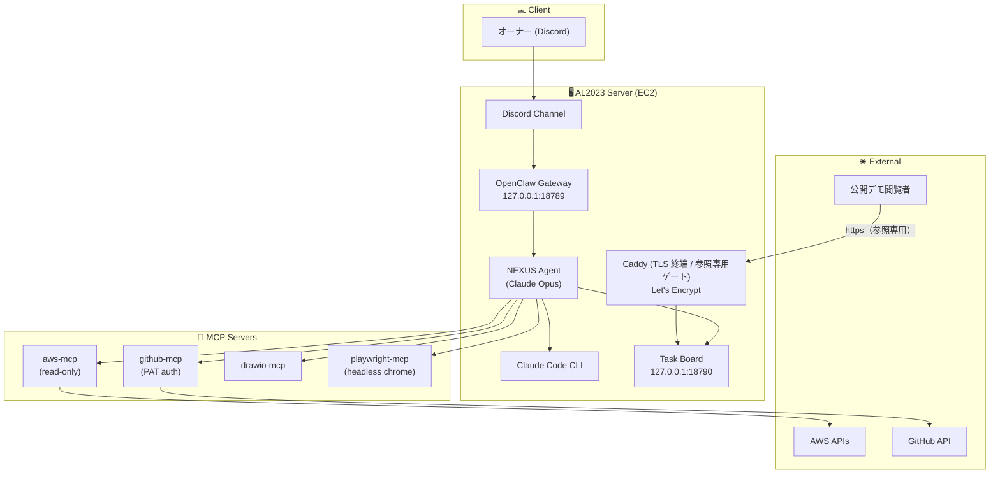

# NEXUS — AI アシスタント × タスクボード（個人開発ポートフォリオ）

**NEXUS** は、[OpenClaw](https://openclaw.ai/) と Claude を土台に個人開発した AI アシスタントです。Discord チャットから指示すると、タスク管理・調査・ドキュメント生成・サーバ運用などを実行します。本リポジトリは、その公開ドキュメントと、Web ダッシュボード（タスクボード）のポートフォリオ資料をまとめたものです。

---

## 🌐 ライブデモ

- **URL: https://demo.demosites.click/**
- **参照専用（閲覧のみ）** のデモサイトです。入力フォーム・書き込み操作は無効化されており、どなたでも安全にご覧いただけます。
- ログイン不要。上部ナビゲーションから各画面を開くだけで動作を確認できます。

> ⚠️ **サーバはコスト最適化のため常時起動していません（必要なときだけ起動する運用です）。**
> ポートフォリオとしてサイトをご覧になりたい場合は、お手数ですが **ご案内元（本人）までご連絡ください**。稼働を開始します。
> アクセスして表示されない場合は、サーバが停止中の可能性があります。

### 画面の見どころ（はじめての方へ）

| 画面 | 内容 |
|---|---|
| 🏠 ホーム | 天気・サーバ / システム状況の概況ダッシュボード |
| 🔗 タスクボード | チャット駆動のタスク管理。カードのステータス・優先度・履歴を可視化（デモはサンプルタスクを表示） |
| 📖 ドキュメント | 技術リサーチ／構築手順記事のビューア（Mermaid 図もその場で描画） |
| 🏋 トレーニング | トレーニング記録の分析ダッシュボード（種目別・部位別・推移） |
| 🩺 ヘルスケア | ボディメイク（体組成）記録と推移 |

### 技術メモ（このデモで見せているもの）

- **正式 HTTPS**: 独自ドメイン ＋ Let's Encrypt の正式証明書（🔒）。リバースプロキシは Caddy。
- **参照専用の作り込み**: 公開面はサーバ側で書き込み（非 GET）を一律遮断＋UI 側でも入力を無効化。見た目はそのままに「壊せない」デモを実現。
- **軽量アーキテクチャ**: バックエンドは npm 依存ゼロ（Node 標準のみ）、4 層構成（interface → application → domain → repository/infra）。「追加のみ＝デグレ無し」を原則に段階的に機能拡張。
- **運用の自動化**: 週次のトレンド/セキュリティ監視、障害時フォールバック通知などを常駐タスクで自動化。
- **再起動耐性**: `systemd` による自動起動・自動更新（TLS 証明書は無人更新）。構築の詳細は下記ドキュメント参照。

---

## 🏗 アーキテクチャ

```mermaid
flowchart TD
    subgraph client["💻 Client"]
        user["オーナー (Discord)"]
    end

    subgraph host["🖥️ AL2023 Server (EC2)"]
        discord_ch["Discord Channel"]
        openclaw["OpenClaw Gateway<br/>127.0.0.1:18789"]
        nexus["NEXUS Agent<br/>(Claude Opus)"]
        claude_cli["Claude Code CLI"]
        caddy["Caddy (TLS 終端 / 参照専用ゲート)<br/>Let's Encrypt"]
        board["Task Board<br/>127.0.0.1:18790"]
    end

    subgraph mcp["🔌 MCP Servers"]
        aws_mcp["aws-mcp<br/>(read-only)"]
        github_mcp["github-mcp<br/>(PAT auth)"]
        drawio_mcp["drawio-mcp"]
        playwright_mcp["playwright-mcp<br/>(headless chrome)"]
    end

    subgraph ext["🌐 External"]
        visitor["公開デモ閲覧者"]
        aws_api["AWS APIs"]
        github_api["GitHub API"]
    end

    user --> discord_ch --> openclaw --> nexus
    nexus --> claude_cli
    nexus --> aws_mcp --> aws_api
    nexus --> github_mcp --> github_api
    nexus --> drawio_mcp
    nexus --> playwright_mcp
    nexus --> board
    visitor -->|"https（参照専用）"| caddy --> board
```

---

## 📁 リポジトリ構成

| パス | 用途 |
|---|---|
| `docs/openclaw/` | OpenClaw のセットアップ・設定・運用手順書（連番管理） |
| `docs/info/` | 調査・ニュース・セキュリティ等の情報ノート（`research` / `news` / `security`） |
| `tests/` | 動作確認・実験・スクラッチ的な成果物 |

> **方針:** ホスト名・内部 IP・OS ユーザ名等の固有情報は全て placeholder（`<your-user>` 等）に伏字化。マスターはローカル `/opt/docs/openclaw/`（本リポジトリはミラー）。

### 命名規則

- **`docs/openclaw/`**: `NNN_STATUS_CATEGORY_name.md`（push 時刻の古い順に連番）
  - STATUS = `DONE` / `TODO` / `INFO`、CATEGORY = `SETUP` / `GUIDE` / `REF` / `PLAN` / `SEC`
- **`docs/info/`**: `YYYYMMDD_STATUS_TOPIC_title.md`
  - STATUS = `INFO` / `WIP` / `DONE` / `TODO`（security は `OPEN` / `FIXED` も可）

### 主な構築ドキュメント（抜粋）

> 構築ドキュメントは継続的に追加しています（現在 **001〜053**）。全件は [`docs/openclaw/`](docs/openclaw/) を参照してください。

| # | ドキュメント | 概要 |
|---|---|---|
| 001 | [server-initial-setup](docs/openclaw/001_DONE_SETUP_server-initial-setup.md) | AL2023 + EC2 のサーバ初期構築（ユーザ / SSH / Node.js / Swap / Claude Code / OpenClaw） |
| 002 | [mcp-setup-guide](docs/openclaw/002_DONE_SETUP_mcp-setup-guide.md) | MCP サーバ群のセットアップ手順 |
| 012 | [al2023-security-task](docs/openclaw/012_DONE_SETUP_al2023-security-task.md) | AL2023 セキュリティを日次監視し要約記事を公開するタスク |
| 051 | [demo-exposure-hardening](docs/openclaw/051_DONE_SEC_demo-exposure-hardening.md) | 公開デモの個人情報露出ハードニング（地点名マスク等） |
| 052 | [demo-read-only-redesign](docs/openclaw/052_DONE_SETUP_demo-read-only-redesign.md) | 公開デモを「参照専用サイト」へ再設計（書き込み無効化） |
| 053 | [demo-domain-https-caddy](docs/openclaw/053_DONE_SETUP_demo-domain-https-caddy.md) | 独自ドメイン ＋ Let's Encrypt 正式 HTTPS 化（Caddy 導入・再起動耐性） |

---

## 🔗 関連

- [Claude Code 公式ドキュメント (ja)](https://code.claude.com/docs/ja/quickstart)
- [OpenClaw 公式](https://openclaw.ai/)
- [Caddy 公式](https://caddyserver.com/docs/)
- [AL2023 リリースノート](https://docs.aws.amazon.com/linux/al2023/release-notes/)

## Author and Ownership / 著作権と所属について

This project was created as a personal initiative and is not connected to any organization or group.
It is published as an individual creative work.

本プロジェクトは個人の活動として作成したものであり、特定の組織や団体の業務とは関係ありません。
個人の創作物として公開しています。

## 📜 License

[MIT License](LICENSE)
