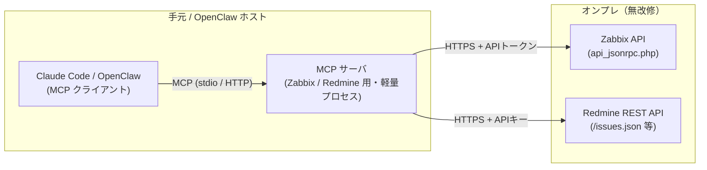

# オンプレ Zabbix / Redmine の MCP サーバ化 調査レポート

- **作成日:** 2026-06-10 (JST)
- **対象タスク:** タスクボード #15
- **目的:** Claude Code / OpenClaw から MCP（Model Context Protocol）経由で、稼働中のオンプレ Zabbix・Redmine に接続できるようにする。
- **制約条件:** 最小構成・最小変更・**稼働中サーバへのサービス影響を最小限**・コスト最適化。
- **マスキング方針:** ホスト名・IP・URL・トークン類は placeholder（`<...>`）で記載。実値は記録しない。

> 本レポートは**調査（検討）レポート**です。公開: 2026-06-10（承認のうえ GitHub `docs/info/research/` へ反映）。実際の MCP サーバ構築（PoC）は未着手で、対象・配置の選定は判断待ちです。

---

## 0. 結論（先に要点）

- **どちらも「サーバ本体を改修する」必要はない。** Zabbix も Redmine も既に**標準で REST/JSON-RPC API を持つ**。MCP 化とは「その API を MCP プロトコルに翻訳する小さな仲介プロセス（MCP サーバ）を**別に立てる**」だけ。
- オンプレ側の変更は最小限で **「API を有効化」＋「専用 API トークン/キーを発行」** のみ。再起動不要・既存サービス無停止で完結する。
- **成熟した OSS 実装が既に存在**するため、自作不要。Zabbix・Redmine とも複数の実績ある MCP サーバが公開されている。
- コストは **OSS・セルフホストでクラウド課金ゼロ**。仲介プロセスは数十 MB 程度の軽量な Python/Node プロセス1個。



ポイント: **MCP サーバはオンプレ本体ではなく「クライアント側（または DMZ）」に置ける**。オンプレには HTTPS で API を叩きに行くだけなので、本体への侵襲が無い。

---

## 1. MCP 化の基本構造

MCP サーバは「既存 API → MCP ツール」の薄い変換層。オンプレ側に同居させる必要はなく、配置の自由度が高い。

| 配置パターン | 説明 | サービス影響 | 推奨度 |
|---|---|---|---|
| **A. クライアント同居（stdio）** | OpenClaw/Claude Code と同じホストで MCP サーバを起動、オンプレ API へ HTTPS 接続 | オンプレ無改修・無停止 | ★最小変更でおすすめ |
| **B. 中継ホスト（HTTP）** | 別の小VM/コンテナで MCP サーバを streamable-http で常駐、複数クライアント共有 | オンプレ無改修 | 複数人/常時利用時 |
| **C. オンプレ同居** | オンプレ内に MCP サーバを同居 | プロセス1個増（影響軽微だが本体ホストに手を入れる） | 非推奨（最小変更に反する） |

→ **本要件（最小変更・影響最小）では A を第一候補**。まず手元 1 ホストで stdio 起動し、必要になったら B へ拡張。

---

## 2. Zabbix の MCP 化

### 2.1 既存 API
Zabbix は標準で **JSON-RPC API（`/api_jsonrpc.php`）** を提供。`host.get` / `problem.get` / `item.get` など 100+ メソッド。**API は標準機能なので新規導入不要**、利用するには API トークン（または ユーザ/パスワード）があればよい。

### 2.2 推奨 OSS 実装
**`mpeirone/zabbix-mcp-server`**（Python 3.10+ / FastMCP / GPLv3, Zabbix 6.0/6.4/7.0+ 対応）
- 特徴: Zabbix API 全体を **わずか 3 ツール**（`zabbix_api` / `zabbix_api_docs` / `zabbix_api_list`）で公開。LLM のコンテキスト消費が小さい（50+ ツールを羅列しない設計）。
- 出典: `https://github.com/mpeirone/zabbix-mcp-server`
- 参考実装: `kairogyn/zabbix-ai-mcp`（別実装）も存在。
- 公式の MCP 標準サポートは未実装（要望チケット `ZBXNEXT-10113` が起票段階）。→ 当面は OSS ラッパー方式が現実解。

### 2.3 オンプレ側に必要な変更（最小）
1. Zabbix 管理画面で **API 用ユーザを作成**（最小権限。読み取り中心なら閲覧グループのみ）。
2. **API トークンを発行**（Zabbix 5.4+ の API token 機能。ユーザ/パスワードでも可だがトークン推奨）。
3. 以上のみ。**Zabbix サーバの再起動・設定ファイル改変は不要。**

### 2.4 セットアップ（パターン A: Claude Code stdio）
```bash
# uv 経由でそのまま起動（リポジトリを clone せず利用可）
claude mcp add zabbix \
  --env ZABBIX_URL=<zabbix-url> \
  --env ZABBIX_TOKEN=<zabbix-api-token> \
  -- uvx --from git+https://github.com/mpeirone/zabbix-mcp-server@main zabbix-mcp
```

### 2.5 安全弁（サービス影響を抑える設定）
| 環境変数 | 推奨値 | 効果 |
|---|---|---|
| `READ_ONLY` | `true` | get/version/check/export のみ許可。**書き込み・削除を全面ブロック**（本番監視への誤操作防止） |
| `ZABBIX_API_WHITELIST` | 例 `host\..*,item\.get,problem\..*` | 呼べるメソッドを正規表現で限定 |
| `ZABBIX_API_BLACKLIST` | 例 `.*\.delete,.*\.create` | 危険系を明示ブロック（blacklist 優先評価） |
| `VERIFY_SSL` | `true` | 証明書検証を有効化 |
| `ZABBIX_API_TIMEOUT` | `30` | タイムアウトで API 滞留を防止 |

→ **まず `READ_ONLY=true` で開始**するのが本番影響ゼロの安全策。

---

## 3. Redmine の MCP 化

### 3.1 既存 API
Redmine は標準で **REST API（`/issues.json`, `/projects.json` 等）** を提供。**管理設定で「REST による Web サービスを有効化」**し、ユーザ設定画面で **API アクセスキー**を取得すれば利用可能。本体改修は不要。

### 3.2 推奨 OSS 実装
複数の実績ある実装が存在。用途で選択:

| 実装 | 技術 | ライセンス | 特徴 |
|---|---|---|---|
| **`yonaka15/mcp-server-redmine`** | Node.js 18+ / TS / MCP SDK | MIT | Issues/Projects/Users/TimeEntries を網羅。読み書き対応。ADR ドキュメント有り。第一候補 |
| `@informatik_tirol/redmine-mcp-server` (npm) | Node.js | - | REST API を包括カバー。Claude Desktop 等から操作 |
| `redmine-mcp-server` (PyPI) | Python | - | セキュリティ・ページネーション・enterprise 機能 |
| `mcpworld` 系 read-only 版 | - | - | **参照専用**。安全重視ならこれ |

- 出典: `https://github.com/yonaka15/mcp-server-redmine` / `https://www.npmjs.com/package/@informatik_tirol/redmine-mcp-server` / `https://pypi.org/project/redmine-mcp-server/`

### 3.3 オンプレ側に必要な変更（最小）
1. 管理 → 設定 → API で **「REST による Web サービスを有効にする」にチェック**。
2. 対象ユーザの設定ページで **API アクセスキー**を取得。
3. 以上のみ。**Redmine の再起動不要**（設定反映は即時）。

### 3.4 セットアップ（パターン A: Claude Code stdio / yonaka15 版）
```bash
# 取得・ビルド
git clone https://github.com/yonaka15/mcp-server-redmine
cd mcp-server-redmine
npm install && npm run build
chmod +x dist/index.js

# Claude Code に登録
claude mcp add redmine \
  --env REDMINE_HOST=<redmine-url> \
  --env REDMINE_API_KEY=<redmine-api-key> \
  -- node /path/to/mcp-server-redmine/dist/index.js
```

接続確認（API 単体テスト）:
```bash
curl -H "X-Redmine-API-Key: <redmine-api-key>" "<redmine-url>/projects.json"
```

### 3.5 安全弁
- **read-only 実装を選ぶ**か、書き込み可能版でも **専用 API キーの権限を閲覧者ロールに限定**する。
- `list_users` / `create_user` 等は **管理者権限が必要**。AI から触らせたくない操作は、API キーを非管理者ユーザにすることで構造的にブロックできる。

---

## 4. 共通: セキュリティ・運用上の注意

- **トークン/APIキーは MCP クライアント側の env（OpenClaw の secret 管理 / `.env`）に保持**し、ドキュメント・ログ・コミットに**絶対残さない**（AGENTS.md セキュリティ原則）。
- **最小権限の専用ユーザ**を作成（既存の管理者キーを流用しない）。
- 当面は **read-only 運用から開始** → 必要が固まってから書き込みを段階的に解放。
- 通信は **HTTPS + 証明書検証**を必須に。オンプレが社内 HTTP の場合は、中継ホスト（パターン B）を内側に置き外部公開しない。
- オンプレ API へのアクセスは**監査ログ**（Zabbix 監査ログ / Redmine の操作履歴）で追跡可能にしておく。

## 5. コスト評価

| 項目 | コスト |
|---|---|
| ソフトウェア | OSS（GPLv3 / MIT 等）・**ライセンス費ゼロ** |
| インフラ | 既存ホスト同居なら**追加ゼロ**。中継 VM を別建てしても小規模 1 台で十分 |
| 運用 | プロセス1個（uvx/npx 常駐）。systemd 化で自動再起動 |
| LLM コンテキスト | Zabbix 版は 3 ツール設計でトークン消費小 |

→ **追加クラウド課金なしで実現可能**。最小構成は「手元ホストで stdio 起動」、費用は実質ゼロ。

## 6. 推奨ステップ（最小変更ロードマップ）

1. **PoC（影響ゼロ）:** 手元 1 ホストで Zabbix=`READ_ONLY=true` / Redmine=read-only API キーで stdio 起動 → 参照系のみで動作確認。
2. **限定書き込み:** 必要なら whitelist で対象メソッドを絞り、書き込みを段階解放。
3. **常駐化:** 利用が定着したら中継ホスト（パターン B / streamable-http）＋ systemd 常駐へ。
4. **手順書化:** 確定構成を `docs/openclaw/` に構築手順として記録（AGENTS.md ドキュメント規約）。

---

## 7. 参考リンク（出典）

- Zabbix MCP: <https://github.com/mpeirone/zabbix-mcp-server>
- Zabbix MCP（別実装）: <https://github.com/kairogyn/zabbix-ai-mcp>
- Zabbix 公式 MCP サポート要望: <https://support.zabbix.com/browse/ZBXNEXT-10113>
- Redmine MCP（TS/MIT）: <https://github.com/yonaka15/mcp-server-redmine>
- Redmine MCP（npm）: <https://www.npmjs.com/package/@informatik_tirol/redmine-mcp-server>
- Redmine MCP（PyPI）: <https://pypi.org/project/redmine-mcp-server/>
- Model Context Protocol: <https://modelcontextprotocol.io/>

---

## 8. 今後（次アクション）

- 本レポートは 2026-06-10 に承認のうえ GitHub（`docs/info/research/`）へ公開済み。
- 実際の MCP サーバ構築（PoC）は未着手。実施可否・対象サーバ（Zabbix/Redmine いずれから）・配置パターン（**A: 手元 stdio が第一候補**）の選定は判断待ち。
- 着手時は確定構成を `docs/openclaw/` に構築手順として記録する（AGENTS.md ドキュメント規約）。

---

## Author and Ownership / 著作権と所属について

This project was created as a personal initiative and is not connected to any organization or group.
It is published as an individual creative work.

本プロジェクトは個人の活動として作成したものであり、特定の組織や団体の業務とは関係ありません。
個人の創作物として公開しています。
