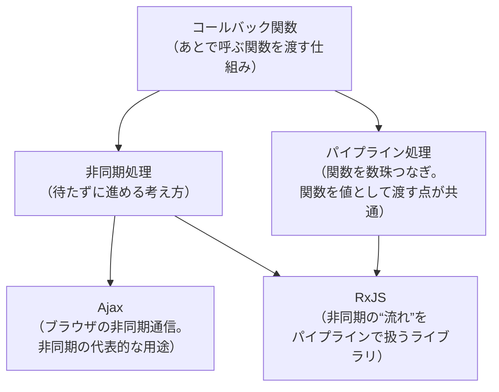
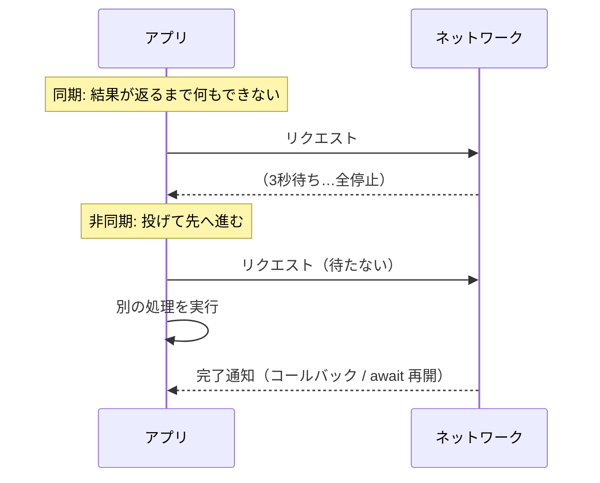
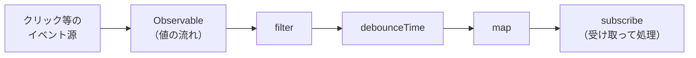

# 再キャッチアップ：コールバック関数・非同期処理・パイプライン処理・Ajax・RxJS

- 作成日: 2026-06-12
- カテゴリ: INFO / RESEARCH
- 依頼: タスクボード #57（特定技術のキャッチアップ。特にコールバック関数。Go / Python / TypeScript で例えて説明）
- 対象読者: Go・Python・TypeScript の経験がある現役エンジニア（＝鈴木さん）

> 用語メモ:
> - **同期（synchronous）**＝処理を「上から順に」実行し、ひとつ終わるまで次に進まない。
> - **非同期（asynchronous）**＝時間のかかる処理（通信・I/O）を「待たずに」先へ進み、終わったら結果を受け取る。
> - **コールバック（callback）**＝「あとで呼んでね」と他の関数に渡す関数。
> - **I/O**＝Input/Output。ネットワーク通信・ファイル読み書き・DBアクセスなど「CPU の外」を待つ処理。

---

## 0. 全体像（1枚で把握）



ひとことで言うと:
- **コールバック関数**は「関数を値として他人に渡す」という土台の発想。
- その代表的な使い道が **非同期処理**（待ち時間を有効活用）。
- ブラウザでの非同期通信の歴史的代表が **Ajax**。
- 「関数を数珠つなぎにする」発想が **パイプライン処理**。
- 非同期 ×（連続して流れてくるデータ）× パイプラインを束ねたのが **RxJS**。

---

## 1. コールバック関数（本題・最重要）

### 1-1. 定義

**コールバック関数 = 「引数として他の関数に渡す関数」**。
渡された側が「都合の良いタイミングで」その関数を呼び出す（＝呼び戻す＝call back）。

ポイントは2つだけ:
1. 関数を「値」として扱える（変数に入れたり、引数で渡せる）。
2. 「いつ呼ぶか」を**渡された側**が決める。

鈴木さんはすでに無意識に使っています。`sort` に比較関数を渡す、`map` に変換関数を渡す——あれが全部コールバックです。

### 1-2. 3言語で「同じこと」を書く

#### Go — `sort.Slice` に比較ロジックを渡す

```go
nums := []int{3, 1, 2}
// 第2引数の func(i, j int) bool が "コールバック"。
// sort 側が、要素を比較したいタイミングで何度も呼び戻す。
sort.Slice(nums, func(i, j int) bool {
    return nums[i] < nums[j]
})
// nums => [1 2 3]
```

#### Python — `sorted` の `key` に関数を渡す

```python
words = ["bbb", "a", "cc"]
# key= に渡す関数がコールバック。sorted 側が各要素に対して呼び戻す。
result = sorted(words, key=lambda w: len(w))
# result => ['a', 'cc', 'bbb']
```

#### TypeScript — `map` に変換関数を渡す

```ts
const nums = [1, 2, 3];
// arrow function がコールバック。map 側が各要素ごとに呼び戻す。
const doubled = nums.map((n) => n * 2);
// doubled => [2, 4, 6]
```

→ 3つとも「**処理の一部（どう比較するか／どう変換するか）を、関数として外から注入している**」という同じ構造です。これがコールバックの本質。

### 1-3. 「非同期」と結びつくとこうなる

上の例は「同期的なコールバック」（その場で呼ばれる）。
コールバックが真価を発揮するのは「**時間のかかる処理が終わったら呼んでね**」という非同期の文脈です。

#### Go — 別ゴルーチンの完了を通知

```go
// 「読み込みが終わったら結果を渡してこの関数を呼んでね」
func fetchAsync(url string, done func(result string, err error)) {
    go func() {
        // ...時間のかかる通信...
        done("response body", nil) // 終わったら呼び戻す
    }()
}

fetchAsync("https://example.com", func(result string, err error) {
    if err != nil { /* ... */ }
    fmt.Println("受け取った:", result)
})
```
※ Go は実際にはコールバックより `channel` で待つのが主流（後述 1-5）。

#### Python — 「終わったら呼ぶ」コールバック

```python
import threading

def fetch_async(url, on_done):
    def worker():
        # ...時間のかかる通信...
        on_done("response body")  # 終わったら呼び戻す
    threading.Thread(target=worker).start()

fetch_async("https://example.com", lambda body: print("受け取った:", body))
```

#### TypeScript — 最も「コールバックらしい」世界

```ts
// Node.js 旧来スタイル: 最後の引数に (err, data) のコールバック
import { readFile } from "node:fs";

readFile("data.txt", "utf-8", (err, data) => {
  if (err) { console.error(err); return; }
  console.log("読み込み完了:", data);
});
```

### 1-4. コールバックの“闇”——コールバック地獄（callback hell）

「終わったら次、終わったらまた次」を**入れ子のコールバック**で書くと、右へ右へ深くなって読めなくなります。

```ts
// ❌ 読みづらい例
login(user, (err, session) => {
  getProfile(session, (err, profile) => {
    getOrders(profile, (err, orders) => {
      render(orders, (err) => {
        // ここまで来るともう何階層目か分からない…
      });
    });
  });
});
```

これを解消するために生まれたのが **Promise / async-await**（次章）。

### 1-5. 言語ごとの“今どきの作法”（重要）

| 言語 | 非同期の主役 | コールバックの立ち位置 |
|---|---|---|
| **Go** | `goroutine` + `channel`（待ち合わせは channel や `sync.WaitGroup`） | コールバックは使えるが少数派。チャネルで「結果を受け取る」のが主流 |
| **Python** | `async`/`await` + `asyncio`（イベントループ） | コールバックは低レベル API（`loop.call_soon` 等）に残るが、通常は async/await |
| **TypeScript/JS** | `Promise` + `async`/`await` | 元はコールバック文化。今は Promise でラップして async/await で書く |

> Go だけ毛色が違います。Go は「コールバックを渡す」より「**チャネルで結果を待つ**」言語です。
> ```go
> ch := make(chan string)
> go func() { ch <- "result" }() // 別ゴルーチンが結果を流す
> fmt.Println(<-ch)              // 受け取るまでここで待つ
> ```

---

## 2. 非同期処理（asynchronous）

### 2-1. なぜ必要か

通信やファイル I/O は「CPU がヒマなまま待つ」時間が長い。
**同期**だとその間プログラム全体が止まる。**非同期**なら「待ち」を投げておいて他の仕事を進められる。



### 2-2. 3言語の async/await

#### Python
```python
import asyncio

async def main():
    body = await fetch("https://example.com")  # ここで「中断」して他を進める
    print(body)

asyncio.run(main())
```

#### TypeScript
```ts
async function main() {
  const res = await fetch("https://example.com"); // 待つが、スレッドは止めない
  const body = await res.text();
  console.log(body);
}
```

#### Go（await はない。goroutine で表現）
```go
func main() {
    ch := make(chan string)
    go func() {
        body := fetch("https://example.com") // 別ゴルーチンで通信
        ch <- body
    }()
    // ここで他の処理もできる
    fmt.Println(<-ch) // 必要になったら受け取る
}
```

> **`await` は「コールバックの読みやすい書き方」**だと思うとスッキリします。
> 内部的には「終わったら続きを実行する関数（＝コールバック）」を登録しているだけ。`await` はそれを「同期コードのように」見せる糖衣構文です。

---

## 3. Ajax（Asynchronous JavaScript and XML）

### 3-1. 何か

**ブラウザが「ページを再読み込みせずに」サーバと通信する技術**の総称。
2005年頃に普及し、「画面の一部だけ動的に更新する」Web（地図のドラッグ、検索サジェスト等）を可能にしました。名前に XML とあるが、今は JSON が主流。

### 3-2. 進化の歴史 = コールバック→Promise の縮図

```ts
// ① 大昔: XMLHttpRequest（コールバックそのもの）
const xhr = new XMLHttpRequest();
xhr.open("GET", "/api/users");
xhr.onload = () => console.log(xhr.responseText); // コールバック
xhr.send();

// ② 今: fetch（Promise ベース → async/await）
async function load() {
  const res = await fetch("/api/users");
  const users = await res.json();
  console.log(users);
}
```

→ Ajax は「非同期処理の**最も身近な実例**」であり、その API 自体が**コールバック時代から Promise 時代への移行**をそのまま体現しています。

> Go / Python との対応: サーバサイドの「HTTP クライアントで API を叩く」処理（Go の `http.Get`、Python の `requests` / `httpx`）が、ブラウザの Ajax に相当する役割です。

---

## 4. パイプライン処理（pipeline）

### 4-1. 何か

**データを「処理の段（ステージ）」に次々と通していく**設計。
Unix の `cat file | grep foo | sort | uniq` がまさにこれ。各段は「入力を受けて出力を返す」だけで、段同士は疎結合。

コールバックとの接点：**各ステージに渡す処理を「関数」として並べる**ので、関数を値として扱う発想（＝コールバックと同じ）が土台にあります。

### 4-2. 3言語で

#### TypeScript — 配列メソッドチェーン（最も直感的）
```ts
const result = [1, 2, 3, 4, 5, 6]
  .filter((n) => n % 2 === 0) // 段1: 偶数だけ
  .map((n) => n * 10)         // 段2: 10倍
  .reduce((a, b) => a + b, 0); // 段3: 合計
// result => 120  (2,4,6 → 20,40,60 → 120)
```

#### Python — ジェネレータで“流す”
```python
nums = range(1, 7)
evens = (n for n in nums if n % 2 == 0)  # 段1
tens  = (n * 10 for n in evens)          # 段2
total = sum(tens)                        # 段3
# total => 120
```
> ジェネレータ（`yield` / `(... for ...)`）は「**1件ずつ遅延評価で流す**」ので、巨大データでもメモリを食わないパイプラインになります。

#### Go — channel をステージ間配管に使う（Go らしい王道）
```go
// 各ステージが channel で受けて channel に流す
func gen(nums ...int) <-chan int {
    out := make(chan int)
    go func() { for _, n := range nums { out <- n }; close(out) }()
    return out
}
func double(in <-chan int) <-chan int {
    out := make(chan int)
    go func() { for n := range in { out <- n * 2 }; close(out) }()
    return out
}
// gen(1,2,3) → double → ... と channel を数珠つなぎ
```
→ Go では channel が「パイプの管」、goroutine が「各ステージの作業員」。Unix パイプの構造そのものです。

---

## 5. RxJS（Reactive Extensions for JavaScript）

### 5-1. 何か

**「時間とともに次々流れてくるデータ（＝ストリーム）」を、パイプライン処理で扱うためのライブラリ**。
クリック連打・WebSocket・API レスポンス・タイマーなど「複数回・非同期に発生するイベント」を、配列の `map`/`filter` のように宣言的に処理できます。

中心概念は **Observable（オブザーバブル）**：「**未来にわたって0回以上値を発行するもの**」。



### 5-2. Promise との違い（ここが肝）

| | Promise | Observable (RxJS) |
|---|---|---|
| 値の回数 | **1回だけ** | **0回〜無限回**（流れ続ける） |
| キャンセル | 基本不可 | `unsubscribe()` で可能 |
| 演算子 | なし | `map` `filter` `debounceTime` 等が豊富 |

### 5-3. 例：検索ボックスのインクリメンタル検索

```ts
import { fromEvent } from "rxjs";
import { map, debounceTime, distinctUntilChanged, switchMap } from "rxjs/operators";

const input = document.querySelector("#search")!;

fromEvent(input, "input").pipe(
  map((e) => (e.target as HTMLInputElement).value),
  debounceTime(300),          // 300ms 入力が止まるまで待つ（連打を間引く）
  distinctUntilChanged(),     // 前回と同じ語なら無視
  switchMap((q) => fetch(`/api/search?q=${q}`).then(r => r.json())) // 古い通信は自動キャンセル
).subscribe((results) => render(results));
```

→ 「キー入力という**無限に流れるイベント**」を、`.pipe()` で**パイプライン**処理し、各オペレータ（`map` 等）に**コールバック**を渡している——本書の全テーマが1つに合流する例です。

> Go / Python での近い発想:
> - **Go**: channel + goroutine のパイプライン（4-2）が「流れるデータの処理」という点で思想的に近い。
> - **Python**: ジェネレータ／`asyncio` のストリーム、または ReactiveX 移植版 `RxPY`。

---

## 6. まとめ（相互関係）

1. **コールバック関数** = 関数を値として渡し、相手が好きなタイミングで呼ぶ。すべての土台。
2. **非同期処理** = 待ち時間を無駄にしない考え方。「終わったら呼ぶ」＝コールバックが原型、`await` はその読みやすい糖衣。
3. **Ajax** = ブラウザの非同期通信の代表例。API がコールバック→Promise へ進化した歴史そのもの。
4. **パイプライン処理** = 処理を段に分けて数珠つなぎ。各段に関数（＝コールバック的なもの）を渡す。
5. **RxJS** = 「非同期に流れ続けるデータ」を「パイプライン」で扱う。1〜4 が全部合流する到達点。

**言語別の勘所:**
- **Go** … コールバックより `goroutine` + `channel`。パイプラインも channel で組む。
- **Python** … `async`/`await` + `asyncio`。パイプラインはジェネレータ。
- **TypeScript** … コールバック文化の出身。今は `Promise` → `async`/`await`、流れるデータは RxJS。

---

## 参考（一次情報・公式ドキュメント）

- MDN「非同期 JavaScript」: <https://developer.mozilla.org/ja/docs/Learn/JavaScript/Asynchronous>
- MDN「コールバック関数」: <https://developer.mozilla.org/ja/docs/Glossary/Callback_function>
- MDN「Ajax をはじめる」: <https://developer.mozilla.org/ja/docs/Web/Guide/AJAX>
- Go公式「Concurrency / Pipelines」: <https://go.dev/blog/pipelines>
- Python公式「asyncio」: <https://docs.python.org/ja/3/library/asyncio.html>
- RxJS公式: <https://rxjs.dev/guide/overview>

---

## Author and Ownership / 著作権と所属について

This project was created as a personal initiative and is not connected to any organization or group.
It is published as an individual creative work.

本プロジェクトは個人の活動として作成したものであり、特定の組織や団体の業務とは関係ありません。
個人の創作物として公開しています。
