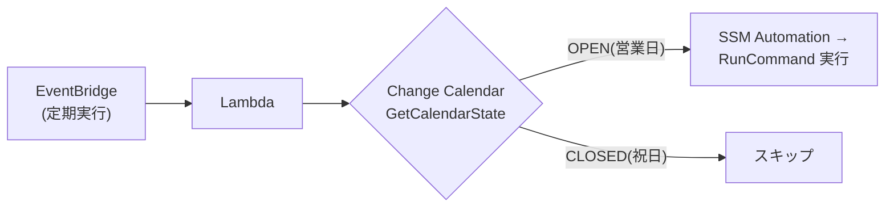
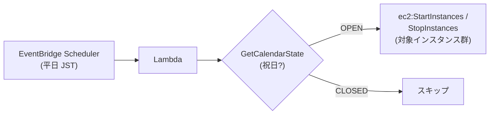
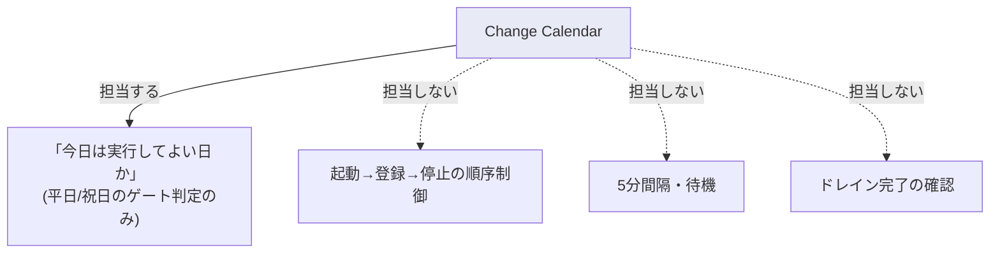
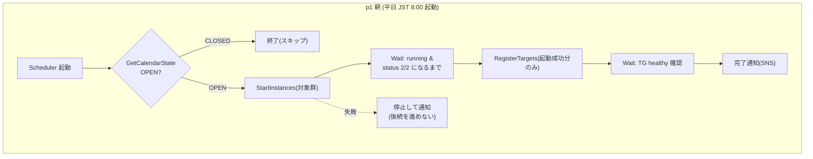
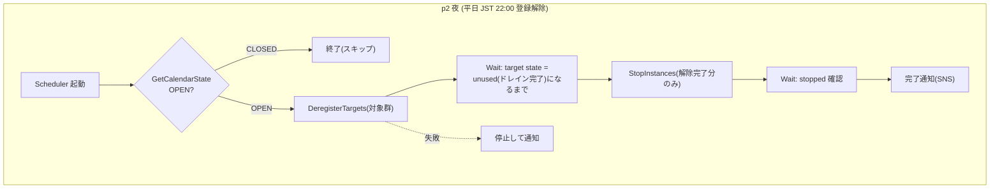

# Change Calendar × EventBridge で複数EC2の自動起動・停止＋ターゲットグループ登録/解除を本番運用できるか

> 作成日 2026-06-16 ／ カテゴリ: AWS / 運用自動化
> 出典の起点: クラスメソッド DevelopersIO「[Change Calendar × Lambda で祝日なら翌営業日に延期](https://dev.classmethod.jp/articles/changecalendar-holiday/)」
> ⚠️ 本番運用を前提とした技術検討。実値（インスタンスID・ARN・TG名）は記載せず placeholder（`<...>`）とする。

---

## 0. 結論（先に要点）

| 問い | 結論 |
|---|---|
| **Q1.** 元記事の RunCommand を「start/stop instances」に置き換え、Change Calendar を考慮した複数EC2の自動起動・停止はできるか | **できる。** 構成はほぼそのまま流用可能。Change Calendar は「今日は実行してよい日か（平日/祝日）」のゲートとして機能する |
| **Q2.** 「起動→5分後にTG登録」「TG登録解除→5分後に停止」の2パターンは Change Calendar で実装可能か | **実装可能。ただし固定5分待ちは本番では危険。**特に夜間の「登録解除→5分後に停止」は**コネクションドレイン（登録解除遅延）と競合し、通信断＝サービス影響を起こしうる**。固定タイマーではなく **Step Functions による状態ベースの待機**を強く推奨する |

> Change Calendar が担うのは「**祝日/平日のゲート判定だけ**」。起動・登録・停止の**順序制御や5分間隔は Change Calendar の機能ではない**。順序制御は別の仕組み（複数スケジュール or Step Functions）で設計する。ここの誤解が事故の元になりやすい。

---

## 1. 元記事の理解（おさらい）

元記事のゴールは「定期ジョブを、その日が祝日なら実行スキップ（翌営業日へスライド）」。構成は次のとおり。

要点:
- **Change Calendar** … 「実行してよい期間（OPEN）／してはいけない期間（CLOSED）」をカレンダーで管理する SSM の機能。`.ics`（iCalendar）ファイルで祝日を取り込む。
- **DEFAULT_OPEN** で作ると「イベント（＝祝日）がある日だけ CLOSED」になる。
- Lambda が `ssm:GetCalendarState` で当日の OPEN/CLOSED を判定し、OPEN のときだけ処理を実行。
- 運用注意: `.ics` の祝日は**年1回手動更新**が必要（合計64KB上限・分割可）。

---

## 2. Q1. RunCommand → start/stop instances への置き換え

### 2.1 置き換えの考え方

元記事の「RunCommand を流す」部分を、**EC2 の起動/停止 API**に差し替えるだけで成立する。

| 元記事 | 置き換え後 |
|---|---|
| `ssm:StartAutomationExecution` → `AWS-RunPatchBaseline` | `ec2:StartInstances` / `ec2:StopInstances`（複数インスタンスID指定可） |
| 対象: パッチ適用 | 対象: 複数EC2の起動・停止 |

### 2.2 「平日のみ」の実現方法（2層で堅くする）

「平日のみ」は**2つの仕組みを併用**するのが堅い。

1. **EventBridge Scheduler の cron で月〜金に限定**（土日は発火させない）。
   - EventBridge **Scheduler** は **タイムゾーン指定（`Asia/Tokyo`）に対応**。旧 EventBridge **Rules** は UTC cron のみで JST 変換ミスが起きやすいため、**Scheduler を推奨**。
   - 例: `cron(0 8 ? * MON-FRI *)` ＋ TimeZone `Asia/Tokyo` → 平日 JST 8:00。
2. **Change Calendar で祝日を CLOSED**にし、Lambda 側で当日判定。
   - 「平日だが祝日」を確実に除外できる。

> なぜ2層か: cron だけでは祝日を除外できない。Change Calendar だけでも土日を CLOSED にできるが、`.ics` の祝日定義に土日は含まれないため別途土日イベント追加が必要になり煩雑。**cron=曜日、Change Calendar=祝日**と役割分担するのが最も保守的で分かりやすい。

### 2.3 複数EC2を扱うときの本番上の注意（重要）

- **start/stop は非同期 API**。`StartInstances` を呼んでも即 running にはならない（`pending → running`）。**「呼んだ＝成功」ではない**。状態確認（`DescribeInstanceStatus`）まで含めて設計する。
- **対象の指定はタグ駆動が安全**。インスタンスIDべた書きは増減時に事故る。`tag:AutoStartStop=true` 等で `DescribeInstances` → 対象を動的取得。
- **部分失敗の扱い**。一部インスタンスが起動失敗した場合に「黙って進める」のは本番でNG。失敗は SNS 等で**即通知**し、後続（TG登録等）を止める判断を入れる。
- **冪等性（idempotency）**。既に running のものに再度 Start を投げても害は小さいが、ログ・通知が混乱しないよう状態で分岐する。
- **最小権限IAM**。`ec2:StartInstances`/`StopInstances` は**対象を tag 条件やリソースARNで限定**する（誤って別系統を止めない）。

> Q1単体（起動・停止だけ）であれば、Change Calendar 考慮の自動化は**素直に実現可能**。落とし穴は「非同期APIの状態確認」と「対象スコープの限定」。

---

## 3. Q2. 2つの本番パターン（TG登録/解除を含む）

### 3.1 要件の再掲

- **p1（朝）**: 平日のみ。JST **8:00** に複数の対象インスタンスを**自動起動** → JST **8:05** に、起動した複数インスタンスを**1つのターゲットグループ（TG）に登録**。
- **p2（夜）**: 平日のみ。JST **22:00** に複数の対象インスタンスを**TGから登録解除** → JST **22:05** に、登録解除したインスタンスを**自動停止**。

> 用語: **ターゲットグループ（Target Group / TG）** … ALB/NLB が振り分け先（EC2など）をまとめる単位。登録（RegisterTargets）/登録解除（DeregisterTargets）は `elasticloadbalancing` API。

### 3.2 実装可能か？ → 可能。ただし「固定5分」が最大の論点

Change Calendar によるゲート自体は p1/p2 とも問題なく成立する。**争点は「5分後」という固定タイマーの安全性**。ここが本番事故の起点になりうる。

#### ❗ p1（起動 → 5分後にTG登録）のリスク

- EC2 は 8:00 に起動指示しても、**OS起動＋アプリ起動＋ELBヘルスチェック合格**までに5分で足りるとは限らない。
- ただし **ALB/NLB は「healthy になった target にしかルーティングしない」**。未起動のうちに登録しても、ヘルスチェックが通るまでは振り分け対象外（`initial`/`unhealthy`）。→ **即サービス影響にはなりにくい**が、「登録した＝配信開始」ではない点に注意。
- 真のリスク: 5分でアプリが立ち上がらないと、登録後もしばらく `unhealthy` のままで**可用性が遅延**する。最悪、グレースピリオド超過で flapping。
- **対策**: 固定5分ではなく、**インスタンスのステータスチェック 2/2 通過**を確認してから登録、登録後は**TGヘルスチェックが healthy になるまで確認**して「完了」とする。

#### ❗❗ p2（TG登録解除 → 5分後に停止）のリスク（最重要・本番影響に直結）

- DeregisterTargets を呼ぶと、その target は即座に切り離されるのではなく **`draining`（コネクションドレイン）状態**になる。処理中の通信を流し切るための猶予が **登録解除遅延（deregistration delay、既定 300秒＝5分）**。
- **5分後ぴったりに StopInstances すると、ドレイン完了の境界と重なり、流し切れていない通信を強制切断＝通信断（サービス影響）** が起こりうる。登録解除遅延を既定の300秒以上にしている場合は**確実に危険**。
- **対策（必須）**: 「5分後」という固定値で止めず、**target の状態が `unused`（ドレイン完了）になったことを確認してから StopInstances**。または登録解除遅延を5分より十分短く設定し、さらに余裕を持たせる。**固定タイマーでの停止は避ける。**

### 3.3 Change Calendar はどこまで面倒を見るか

→ **順序制御・待機・ドレイン確認は別の仕組みで実装する必要がある。** 選択肢は次の2案。

### 3.4 実装方式の比較

#### 方式A: スケジュール2本（8:00/8:05、22:00/22:05）+ 各Lambda

- EventBridge Scheduler を 4本（or 2本×2処理）作り、各 Lambda が個別に Change Calendar を判定。
- **メリット**: 構成が単純。元記事の延長で作れる。
- **デメリット（本番では致命的になりうる）**:
  - 8:00 と 8:05 が**独立**しているため、「8:00 の起動が失敗/遅延しても 8:05 の登録が走る」リスク。**“起動したものだけ登録” という依存関係を保証できない。**
  - 22:00 と 22:05 が独立し、**“ドレイン完了を待たずに停止”** が起こる（固定5分の弊害そのもの）。
  - 8:00〜8:05 の間にカレンダーが手動変更される等の境界ケースで不整合。

#### 方式B（推奨）: EventBridge Scheduler → Step Functions（状態ベース待機）

- 朝・夜それぞれ **1本のスケジュール**で **Step Functions ステートマシン**を起動し、内部で順序・待機・確認・エラー処理を**まとめて**制御する。

- **メリット（本番向き）**:
  - **固定5分を「状態確認」に置き換えられる**（5分はあくまで目安）。ドレイン完了・healthy 化を待ってから次へ。
  - **依存関係を保証**: 「起動成功したものだけ登録」「登録解除完了したものだけ停止」。
  - **エラー処理・リトライ・部分失敗の分岐**を1か所に集約。
  - Change Calendar 判定もステートマシンの最初の1ステップに入れられる（朝夜とも先頭でゲート）。
- **デメリット**: 構成要素が増える（Step Functions の学習・定義）。ただし本番の安全性を考えれば見合う。

> 「**判断ミス絶対NG・本番影響絶対NG**」という前提では、**方式B（Step Functions）一択**。固定5分の方式Aは PoC/検証までに留め、本番投入は非推奨。

### 3.5 「5分」をどう扱うか（明確な指針）

- 朝の「5分後登録」: 5分は**最短の目安**。実際は**ステータスチェック2/2＋アプリ起動確認**を待って登録。アプリ起動が5分超なら登録を遅らせる。
- 夜の「5分後停止」: **登録解除遅延（既定300秒）＋安全マージン**を満たすまで停止しない。**`unused` 確認後に停止**。登録解除遅延を5分未満に縮める場合も、長時間コネクション（WebSocket等）の有無を確認。

---

## 4. 本番投入のチェックリスト（事故防止）

- [ ] EventBridge は **Scheduler** を使い **TimeZone=Asia/Tokyo**、cron は **MON-FRI** に限定。
- [ ] Change Calendar は **DEFAULT_OPEN**、祝日を CLOSED。`.ics` の**年次更新運用**を明文化（更新漏れ＝祝日に起動。コスト影響であって即サービス断ではないが要管理）。
- [ ] 対象EC2は**タグ駆動**で取得（ID直書き禁止）。
- [ ] start/stop/register/deregister は**非同期前提で状態確認**まで実装（Step Functions の Wait/Choice）。
- [ ] **夜間停止は必ずドレイン完了（`unused`）後**。固定タイマー停止を禁止。
- [ ] **部分失敗で後続を止める**フェイルセーフ＋ SNS 通知＋ DLQ。
- [ ] IAM 最小権限（`ec2:Start/StopInstances` と `elasticloadbalancing:Register/DeregisterTargets` を**対象リソース/タグで限定**）。
- [ ] **DRY_RUN**（ログのみ）で本番投入前に挙動確認。検証で使ったテスト対象・データは元に戻す。
- [ ] CloudWatch アラーム（実行失敗・健全性低下）。
- [ ] ロールバック手順（手動で起動/登録、停止/解除を戻す）を用意。

---

## 5. まとめ

- **Q1**: Change Calendar を考慮した複数EC2の自動起動・停止は、元記事の構成を流用して**素直に実装可能**。鍵は「非同期APIの状態確認」「タグ駆動」「最小権限」。
- **Q2**: 2パターン（起動→TG登録／TG登録解除→停止）も**実装可能**だが、**固定5分待ちは本番リスク**。特に夜間の登録解除→停止は**コネクションドレインとの競合で通信断を起こしうる**。
- 本番前提では、**EventBridge Scheduler（JST/平日）＋ Step Functions（状態ベースの待機・順序・エラー処理）** で、固定タイマーを状態確認に置き換える方式を推奨。Change Calendar の役割は**祝日/平日ゲートに限定**して捉えるのが安全。

---

## 参考（2026-06-16 取得・公開情報）

- DevelopersIO（起点記事）: https://dev.classmethod.jp/articles/changecalendar-holiday/
- SSM Change Calendar GetCalendarState（複数カレンダーは全て OPEN のときのみ OPEN）: https://docs.aws.amazon.com/systems-manager/latest/APIReference/API_GetCalendarState.html
- Change Calendar 活用（AWS Cloud Operations Blog）: https://aws.amazon.com/blogs/mt/using-aws-systems-manager-change-calendar-to-prevent-changes-during-critical-events/
- Amazon EventBridge Scheduler（タイムゾーン対応・EC2 start/stop・200+サービス連携）: https://aws.amazon.com/blogs/compute/introducing-amazon-eventbridge-scheduler/ ／ https://aws.amazon.com/eventbridge/scheduler/
- ELB 登録解除遅延（コネクションドレイン）: https://docs.aws.amazon.com/elasticloadbalancing/latest/application/edit-target-group-attributes.html
- AWS Step Functions: https://docs.aws.amazon.com/step-functions/

> 注: 仕様・既定値（登録解除遅延300秒等）は変更されうる。本番設計時は各公式ドキュメントの最新値と、自社アプリの通信特性（長時間接続の有無）を必ず確認すること。
