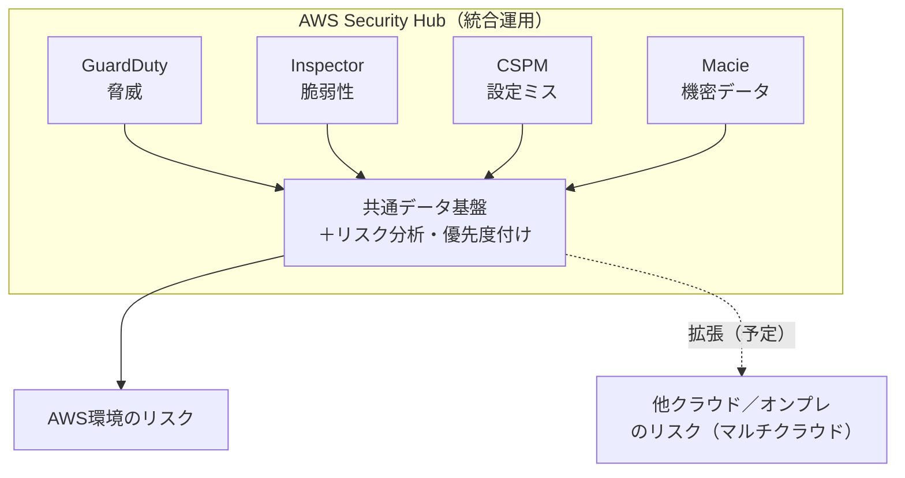

# インフラ記事まとめ：Security Hub マルチクラウド化／IaC 3強比較／AWSコスト最適化／CloudOps

> 作成日 2026-06-16 ／ カテゴリ: AWS・クラウドインフラ
> 4本の公開記事・キュレーションリストを読み、要点を日本語でまとめたもの。各節末に出典を明記。

---

## 全体サマリ（先に要点）

| # | テーマ | ひとことで |
|---|---|---|
| 1 | AWS Security Hub のマルチクラウド拡張 | AWSのセキュリティを「1つの統合運用画面」に集約し、AWS外（マルチクラウド）まで広げる方針 |
| 2 | Terraform vs AWS CDK vs CloudFormation | IaC 3強の選び方。マルチクラウド=Terraform／AWS特化で開発者主導=CDK／AWSネイティブ堅実=CloudFormation |
| 3 | awesome-aws-cost-optimization | AWSコスト最適化ツール/FinOpsの厳選リスト。規模・用途別の選び方つき |
| 4 | awesome-cloudops | CloudOps（クラウド運用）のツール・学習リソース総覧 |

---

## 1. AWS Security Hub がマルチクラウドへ拡張

**何の話か:** AWS の公式セキュリティブログ。AWS Security Hub を、複数のAWSセキュリティサービスを束ねた**統合セキュリティ運用（unified security operations）**基盤として再構築し、さらに**AWS の外（オンプレ・他クラウド）まで対象を広げる**という方針表明。

**現状（すでにGA済みの統合）:**
- Security Hub が次のサービスの検出結果を1つの体験に集約：
  - **Amazon GuardDuty**（脅威検知）
  - **Amazon Inspector**（脆弱性スキャン）
  - **Security Hub CSPM**（設定ミス＝クラウド体制管理）
  - **Amazon Macie**（機密データ検出）
- 集約した上で、**ニアリアルタイムのリスク分析・自動分析・優先度付け**を提供。「シグナルの翻訳」ではなく「対処」に時間を使えるようにする狙い。
- **Extended プラン**：エンドポイント/ID/メール/ネットワーク/データ/ブラウザ/クラウド/AI/SecOps を横断し、**厳選パートナー製品**（CrowdStrike, Okta, Zscaler, Splunk, Proofpoint, SailPoint 等）を Security Hub から調達・展開可能に。AWS が販売元となり、従量課金・一本化された請求・長期契約不要。

**これから（マルチクラウド拡張・数か月以内予定）:**
- **共通データレイヤ**：ワークロードがどこで動いていても、セキュリティシグナルを統一。
- **統一ポリシー＆運用レイヤ**：一貫した体制管理・露出分析・リスク優先度付けを「単一のリスクビュー」で。
- 具体機能：
  - **統一リスク分析**（マルチクラウド全体の重大リスクを可視化）
  - **Security Hub CSPM チェック**で一貫した体制可視化
  - **Inspector 拡張**：VMスキャン／コンテナイメージスキャン／サーバレススキャン
  - **外部ネットワークスキャン**：インターネット露出（AWS外リソース含む）の文脈を付与

**読みどころ:** 「ツールの管理に追われてリスク管理ができていない」という現場課題への回答として、“バラバラのコンソール”を“単一のリスクビュー”に寄せる方向。マルチクラウド統合は**段階的にこれから提供**される点に注意（現時点で全部使えるわけではない）。

> 出典: AWS Security Blog「AWS Security Hub is expanding to unify security operations across multicloud environments」
> https://aws.amazon.com/jp/blogs/security/aws-security-hub-is-expanding-to-unify-security-operations-across-multicloud-environments/

---

## 2. Terraform vs AWS CDK vs CloudFormation（IaC 3強の選び方）

**何の話か:** IaC（Infrastructure as Code）の主要3ツールを、開発者体験・状態管理・マルチクラウド対応・抽象度・長期保守性の観点で正直に比較したガイド。

**3ツールの正体:**

| | CloudFormation | Terraform | AWS CDK |
|---|---|---|---|
| 言語 | JSON / YAML（宣言的） | HCL（宣言的） | TypeScript/Python/Java/C#/Go（手続き的→CFnを生成） |
| 状態管理 | AWSが内部管理（stateファイル不要） | 外部stateファイル（S3等、要管理） | CFnに委譲（stateファイル不要） |
| 対応範囲 | **AWSのみ** | **1,000+プロバイダ（マルチクラウド）** | **AWSのみ** |
| 抽象度 | 低（リソース単位） | 低〜中（リソース＋モジュール） | 高（Construct/パターン） |
| 新AWSサービス対応 | Day1 | プロバイダ更新待ち（数日〜数週） | Day1（CFn経由） |
| テスト | 限定（cfn-lint等） | terratest等 | **Jest/pytestで本格的ユニットテスト** |
| 失敗時ロールバック | **自動** | 手動対応が必要 | 自動（CFn経由） |
| ベンダーロックイン | フルAWS | 移植性あり | フルAWS |

**それぞれの勝ち筋:**
- **CloudFormation** … AWSネイティブで簡潔さ・ゼロコスト・自動ロールバック・深いAWS統合を重視するチーム向け。**StackSets**で多アカウント/多リージョンへ一括展開できるのは Terraform に対する明確な強み。弱点は大規模時のYAML冗長さ・AWS限定・抽象化の弱さ。
- **Terraform** … **マルチクラウド/ハイブリッド**の標準。1,000+プロバイダ、豊富なモジュール、`terraform plan` による事前差分プレビューが強力。弱点はstateファイルのリスク・新AWSサービスのラグ・自動ロールバック無し・BSLライセンス変更（→OpenTofu 分岐）の不確実性。
- **AWS CDK** … **開発者主導でAWSネイティブ**なチーム向け。本物のプログラミング言語＋IDE補完＋型安全＋ユニットテスト、L1/L2/L3のConstructで「暗号化・公開ブロックがデフォルトで効くS3」等を再利用。弱点はAWS限定・運用専任者には学習コスト・生成CFnの不透明さ・破壊的変更の頻度。

**結論（意思決定の指針）:**
- 「客観的にどれが最強か」ではなく**自社のアーキテクチャ・スキル・3〜5年の戦略に合うか**で選ぶ。
- マルチクラウド/非AWSリソースも管理→**Terraform**。
- AWSネイティブ＆開発者中心→**CDK**。
- AWSネイティブで堅実・低コスト・自動ロールバック重視→**CloudFormation**。
- 成熟した企業は**ハイブリッド**（基盤=Terraform／アプリ層=CDK）も。
- 最重要は**一貫性**：1ツールに標準化し、再利用ライブラリを整備し、レビュー運用を初日から徹底。移行コストは現実に高い。

> 出典: go-cloud.io「Terraform vs AWS CDK vs CloudFormation（2026 IaC Guide）」
> https://go-cloud.io/terraform-vs-aws-cdk-vs-cloudformation/

---

## 3. awesome-aws-cost-optimization（AWSコスト最適化リスト）

**何の話か:** AWSコスト最適化のツール・リソース・ベストプラクティスを2026年向けに厳選した GitHub リスト（CC0、2026年2月更新）。

**ツールの分類:**
- **自動最適化プラットフォーム（見つけるだけでなく“直す”）**
  - **CloudFix**（SSM経由で30+の自動“fixer”、EBS/S3/RDS/EC2/Lambda等を自動最適化、RightSpend で割引プログラム最適化）
  - **nOps**（AI自動最適化、EKS特化）、**ProsperOps**（RI/Savings Plan の自動購入。現Flexera傘下）
  - **Ternary / Finout / Vantage / CloudZero**（可視化・ユニットエコノミクス・マルチクラウド）
  - **Kubecost**（K8sコスト、Apptio傘下）
- **オープンソース**
  - **Infracost**（TerraformのコストをCI/CDで見積り）
  - **Cloud Custodian**（ポリシーasコード）、**OpenCost**（K8sコスト監視・ベンダー非依存）
- **AWSネイティブ（無料）**
  - **Cost Explorer**（コスト可視化）、**Compute Optimizer**（ML rightsizing）、**Cost Optimization Hub**（推奨集約）、**Budgets**（予算アラート）、**Trusted Advisor**（ベストプラクティス）
- **FinOpsプラットフォーム（エンタープライズ）**
  - **Apptio Cloudability / CloudHealth / Flexera**

**選び方（規模・用途別）:**

| 規模 | 月額AWS | 推奨 |
|---|---|---|
| スタートアップ | <$5K | Cost Explorer, Infracost |
| 成長期 | $5K–$50K | CloudFix, nOps, Kubecost |
| エンタープライズ | $50K+ | CloudFix RightSpend, ProsperOps, CloudHealth |

| やりたいこと | ツール |
|---|---|
| 自動で直す | CloudFix, nOps |
| K8sコスト | Kubecost, OpenCost |
| IaCコスト見積り | Infracost |
| コミットメント管理 | ProsperOps, CloudFix RightSpend |
| マルチクラウド | Vantage, CloudHealth |
| FinOpsレポート | Finout, CloudZero |

**学習リソース:** AWS Well-Architected コスト最適化ピラー、FinOps Foundation（認定・コミュニティ）、各社ブログ。

> 出典: GitHub「gleesonb/awesome-aws-cost-optimization」（CC0）
> https://github.com/gleesonb/awesome-aws-cost-optimization
> 注: 一覧の製品・価格は提供元の宣伝文を含む。導入時は一次情報で検証を。

---

## 4. awesome-cloudops（CloudOps 総覧）

**何の話か:** CloudOps（クラウド運用）のツールと学習リソースを集めた GitHub キュレーション（Noovolari／TOPS コミュニティ運営）。「アジリティ・速度・自動化」と「セキュリティ・コンプラ・コスト管理」を両立する運用に必要なものを一望できる。

**構成:**
- **Tools（大きな一覧表）** … 名称／リポジトリ（Star数バッジ）／対応クラウド／カテゴリ／説明。例:
  - **Access Undenied AWS**（CloudTrailのAccessDenied理由を解析・是正案）
  - **Atmos**（DevOps/クラウド自動化の万能ツール、IaC/K8s）
  - **AWS CDK**（IaCフレームワーク）、**AWS Deployment Framework**（多アカウント/多リージョン展開）
  - **amazon-ecr-credential-helper**、**AWS IAM Authenticator for Kubernetes**、**AWSConsoleRecorder**（コンソール操作→CLI/CFn/Terraform化） 等
- **Resources（学習）**
  - **Git / GitOps**、**Docker**
  - **Guides & Tutorials**：APIs／DevOps／**Kubernetes**／NoSQL Databases／**Security**
  - **Podcasts & newsletters**

**使いどころ:** 「CloudOpsで何を使うべきか」を俯瞰する入口。特に IaC・K8s・セキュリティ・GitOps まわりのツールを横断的に探せる。網羅性重視の“目次”として活用し、個別ツールは公式で最新状況を確認するのがよい。

> 出典: GitHub「Noovolari/awesome-cloudops」（A curated list of tools and best practices for CloudOps）
> https://github.com/Noovolari/awesome-cloudops

---

## 横断的な所感

- **セキュリティ運用は“統合・単一ビュー”へ**（記事1）。ツール乱立の疲弊を、共通データ基盤＋優先度付けで解消する流れ。
- **IaCは“正解1つ”ではなくフィットで選ぶ**（記事2）。マルチクラウドはTerraform、AWS特化×開発者文化はCDK、堅実なAWSネイティブはCloudFormation。
- **コスト最適化は“見つける→自動で直す→FinOpsで回す”**（記事3）。まず無料のAWSネイティブ、規模に応じて自動最適化/コミットメント管理へ。
- **CloudOps全体像はキュレーションで素早く把握**（記事4）。ただしリストは更新差・宣伝を含むため一次情報で裏取り。

> 注: 各製品の仕様・価格・提供状況、AWSの新機能の提供時期は変動する。導入判断時は必ず各公式ドキュメントの最新情報を確認すること。
