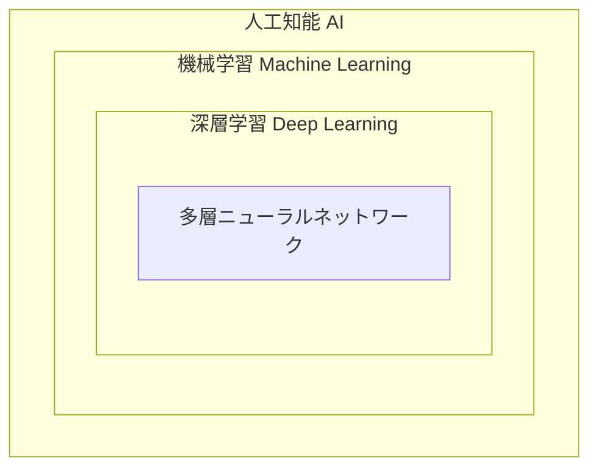
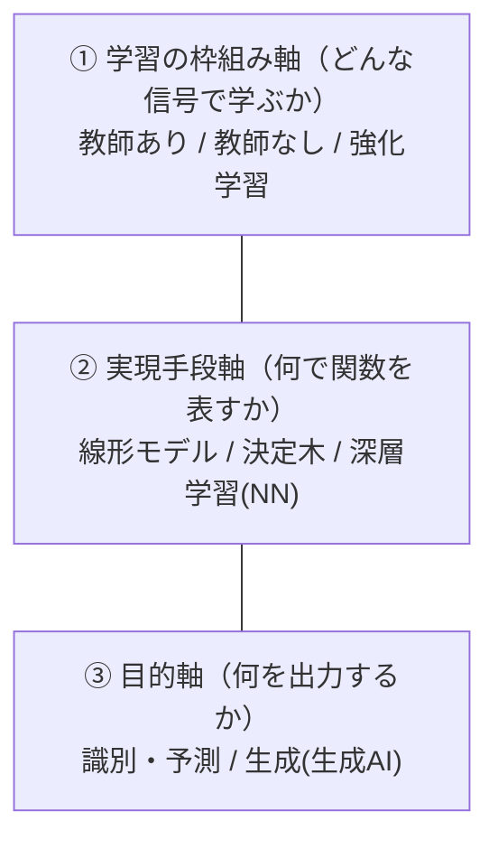
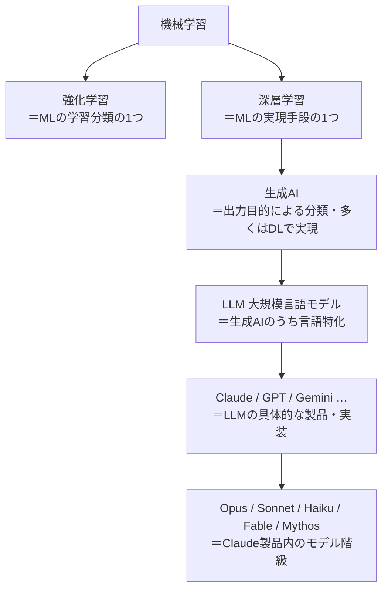

# 機械学習・深層学習 体系ガイド ①全体像と用語の違い

> 作成日: 2026-07-11 / STATUS: INFO / TOPIC: ML / シリーズ 00（目次・全体像・用語整理）
> 本シリーズは3部構成。①全体像と用語の違い（本書）→ ②パーセプトロン〜学習の仕組み → ③誤差逆伝播法。
> 方針: YouTuber「ヨビノリ（予備校のノリで学ぶ大学の数学・物理）」の *前提から積み上げ、直感→数式* のスタイルを踏襲。

---

## 📚 シリーズ目次

| # | ドキュメント | 内容 |
|---|---|---|
| **00** | 本書 | AI/ML/DLの全体像、**機械学習・強化学習・深層学習・生成AI・LLM・Claudeの違い**、学習ロードマップ |
| **01** | `20260711_INFO_ML_01_perceptron-to-neural-network.md` | パーセプトロン → 多層化（ニューラルネット/深層学習）→ 損失関数と勾配降下法 |
| **02** | `20260711_INFO_ML_02_backpropagation.md` | 誤差逆伝播法（連鎖律・順伝播/逆伝播）を単独で詳説 |

---

## 1. 全体像 — AI ⊃ 機械学習 ⊃ 深層学習

3つは入れ子（包含）の関係。まずここを押さえる。

| 用語 | ざっくり定義 | 例 |
|---|---|---|
| **人工知能（AI）** | 人間の知的作業を機械にさせる分野全体（ルールベースも含む広い概念） | 探索、エキスパートシステム、機械学習 全部 |
| **機械学習（ML）** | 明示的にルールを書かず、**データから規則性を自動獲得**する手法群 | 回帰、決定木、SVM、ニューラルネット |
| **深層学習（DL）** | 機械学習のうち、**層を深く重ねたニューラルネットワーク**を使う手法 | 画像認識(CNN)、言語モデル(Transformer) |

---

## 2. 【本題】機械学習・強化学習・深層学習・生成AI・LLM・Claudeの違い

よく混同されるが、これらは**「別々の軸」で切った分類**が入り混じっている。まず「どの軸の話か」を分けると一気に整理できる。

### 2.1 3つの軸で捉える

- **強化学習**は①の軸（学習の"やり方"の一種）。
- **深層学習**は②の軸（モデルの"構造/道具"の一種）。
- **生成AI**は③の軸（"出力の目的"による分類）。
- → 軸が違うので**両立する**。例:「深層強化学習」= ②深層学習で③を実現しつつ①強化学習で学ぶ（AlphaGo等）。「深層学習で作った生成AI」= 現代のLLMそのもの。

### 2.2 階層と包含関係（重要）

### 2.3 一覧で対比

| 用語 | 何による分類か | 一言で | 具体例 |
|---|---|---|---|
| **機械学習(ML)** | 大分野 | データから規則性を学ぶ手法の総称 | 回帰・決定木・SVM・NN |
| **強化学習(RL)** | ①学習の枠組み | 環境から得る**報酬**を頼りに、試行錯誤で最適な行動方針を学ぶ | ゲームAI、ロボット制御、囲碁AI |
| **深層学習(DL)** | ②実現手段 | **多層ニューラルネット**で複雑な関数を表現する手法 | 画像認識(CNN)、音声認識、Transformer |
| **生成AI** | ③出力目的 | 新しいコンテンツ（文章・画像・音声・動画）を**生成**するAIの総称。多くは深層学習で実現 | 文章生成、画像生成、音楽生成 |
| **LLM(大規模言語モデル)** | 生成AIの一種 | **言語**に特化した巨大なニューラルネット（主にTransformer）。膨大なテキストで学習し文章を生成 | Claude、GPT、Gemini |
| **Claude** | LLMの製品 | Anthropic社のLLM製品。複数のモデル階級を持つ | 下記モデル群 |

### 2.4 Claudeのモデル階級（Opus / Sonnet / Haiku / Fable / Mythos）

Claudeは用途に応じた複数モデルを持つ。ざっくり「知能↔速度・コスト」のトレードオフで棲み分ける（2026年時点）。

| モデル | 位置づけ | 向いている用途 |
|---|---|---|
| **Fable 5** | 一般公開されている中で**最も高性能**なモデル | 最難関の推論・長時間の自律エージェント作業 |
| **Mythos 5** | Fable 5と**同等の能力**。限定アクセス（Project Glasswing） | Fable 5と同様（提供枠が限定） |
| **Opus 4.8** | Opus階級の最上位。高い自律性 | 長期のエージェント作業・知識労働・コーディング |
| **Sonnet 5** | 速度と知能の**バランス**型 | 大量処理・実運用ワークロード全般 |
| **Haiku 4.5** | **最速・最低コスト** | 単純・軽量・低レイテンシなタスク（分類等） |

> 補足: 「Mythos」「Fable」はどちらも**実在するClaudeモデル**（Fable系の最上位帯）。Opus/Sonnet/Haiku は Claude の伝統的な3階級（高性能/バランス/軽量）で、Fable/Mythos はさらに上の最難関向けの帯という位置づけ。

### 2.5 一文でまとめると

> **機械学習**という大きな器の中に、学び方の一種である**強化学習**と、道具の一種である**深層学習**がある。深層学習でコンテンツを生み出す使い方が**生成AI**、その中でも言語に特化した巨大モデルが**LLM**、LLMの具体的な製品が**Claude**で、その中の性能階級が**Opus/Sonnet/Haiku/Fable/Mythos**。

---

## 3. 機械学習の3分類

本シリーズの主役（パーセプトロン・深層学習・誤差逆伝播法）は主に**教師あり学習**の文脈。

| 種類 | 与えるデータ | やること | 例 |
|---|---|---|---|
| **教師あり学習** | 入力＋正解ラベル | 入力→出力の対応を学ぶ | 画像分類、価格予測、スパム判定 |
| **教師なし学習** | 入力のみ（正解なし） | データの構造・かたまりを見つける | クラスタリング、次元削減 |
| **強化学習** | 環境からの報酬 | 試行錯誤で最適な行動方針を学ぶ | ゲームAI、ロボット制御 |

---

## 4. 体系的に学ぶロードマップ

### 4.1 前提となる数学（土台。飛ばすと後で詰む）
ヨビノリ流に言えば「道具（数学）を先に握ってから本題へ」。

| 分野 | 最低限おさえること | なぜ必要か |
|---|---|---|
| **線形代数** | ベクトル・行列の積、転置 | 加重和・層の計算は全て行列演算 |
| **微分（偏微分・連鎖律）** | 合成関数の微分、勾配 | 勾配降下法・誤差逆伝播法の心臓部 |
| **確率・統計** | 確率分布、期待値、最尤推定 | 損失関数・分類の理論的背景 |

### 4.2 学ぶ順番（推奨ステップ）
1. **前提数学**（線形代数の行列積 → 偏微分と連鎖律）を先に。
2. **パーセプトロン**（本シリーズ ②）で1ニューロンを完全に理解。
3. **多層化と活性化関数**（②）でネットワークの表現力を理解。
4. **損失関数と勾配降下法**（②）で「学習＝最適化」を理解。
5. **誤差逆伝播法**（③）を連鎖律とセットで手を動かして計算。
6. **実装**: Python + NumPy で小さなネットをスクラッチ実装 → その後 PyTorch/TensorFlow へ。
7. **発展**: CNN（画像）、RNN/Transformer（系列・言語）へ。

### 4.3 教材（無料 → 書籍）
- **YouTube「予備校のノリで学ぶ大学の数学・物理」（ヨビノリ）**: 東大院卒・たくみ氏の解説チャンネル。前提の**線形代数・微分積分**シリーズで土台を作り、機械学習／ディープラーニング関連の動画で直感をつかむのに最適。まず数学の前提動画 → ML/DL動画の順が効く。公式: https://yobinori.jp/ ／ チャンネル: https://www.youtube.com/channel/UCqmWJJolqAgjIdLqK3zD1QQ
- **書籍『ゼロから作るDeep Learning』（斎藤康毅, オライリー）**: パーセプトロン → 誤差逆伝播法 → CNN を **NumPyでスクラッチ実装**しながら学ぶ定番。本シリーズと相性が良い。
- **講義『Stanford CS231n』『CS229』**: より理論的に深めたい場合の定番（英語・無料公開）。

---

## 参考・出典
- Wikipedia「ヨビノリたくみ」／公式サイト https://yobinori.jp/
- 斎藤康毅『ゼロから作るDeep Learning』オライリー・ジャパン
- Anthropic 公開情報（Claude モデル family: Opus / Sonnet / Haiku / Fable / Mythos）

> ※ 本ドキュメントは一般公開情報に基づく学習用のリサーチメモであり、特定の組織の業務とは関係しない個人の創作物。
