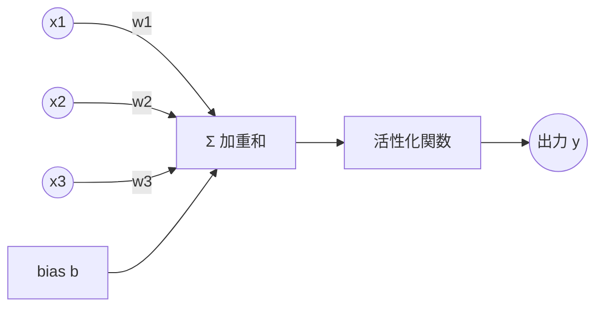
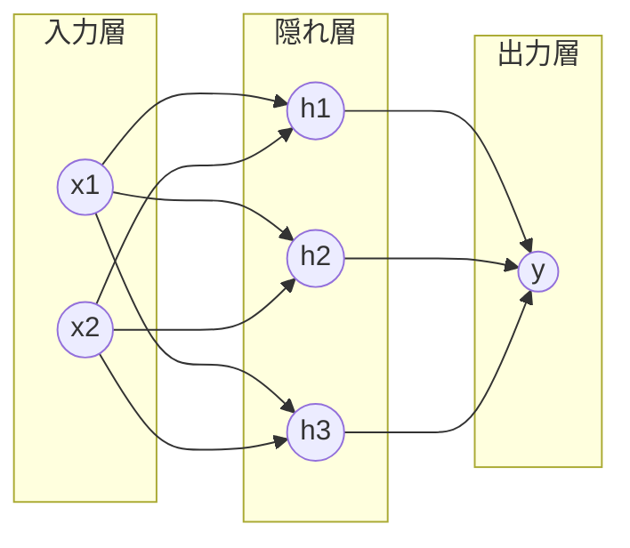

# 機械学習・深層学習 体系ガイド ②パーセプトロン〜学習の仕組み

> 作成日: 2026-07-11 / STATUS: INFO / TOPIC: ML / シリーズ 01
> 前提: ①（`20260711_INFO_ML_00_overview-and-differences.md`）で全体像を把握済みであること。
> 本書の次: ③ 誤差逆伝播法（`20260711_INFO_ML_02_backpropagation.md`）。

---

## この章の地図


「パーセプトロン（部品）→ 積み重ねてネットワーク（構造）→ 損失を減らす向きに重みを更新（学習）」。この一本道を押さえれば、次章の誤差逆伝播法が自然につながる。

---

## 1. パーセプトロン — ニューラルネットの最小部品

深層学習の理解は、まずこの1個の「人工ニューロン」から始まる。

### 1.1 生物のニューロンの模倣
脳の神経細胞は「複数の入力を受け取り、合計がある閾値を超えたら発火（信号を出す）」する。これを数式で真似たのがパーセプトロン（1958年、ローゼンブラット）。



### 1.2 数式
入力 x1, x2, …, xn に重み w1, …, wn を掛けて合計し、バイアス b を足す:

```
z = w1·x1 + w2·x2 + … + wn·xn + b   （加重和）
y = f(z)                              （活性化関数を通す）
```

- **重み w**: その入力をどれだけ重視するか（学習で調整される主役）。
- **バイアス b**: 発火しやすさの下駄（閾値の役割）。
- **活性化関数 f**: 単純パーセプトロンでは「z>0 なら 1、そうでなければ 0」のステップ関数。

### 1.3 パーセプトロンの意味 = 直線で分ける
入力が2次元なら、`w1·x1 + w2·x2 + b = 0` は1本の**直線**。パーセプトロンは「その直線のどちら側か」で 0/1 を判定する **線形分類器**。AND・OR はこれで表現できる。

### 1.4 限界: XOR 問題（重要）
XOR（排他的論理和）は、1本の直線では 0 と 1 を分けられない（**線形分離不可能**）。
→ 単純パーセプトロンには原理的な限界がある。1969年にこれが指摘され、一度ブームが冷えた（第1次AI冬の時代）。

**この限界の突破策が「層を重ねる」= 次節。**

---

## 2. 多層化 → ニューラルネットワーク → 深層学習

### 2.1 多層パーセプトロン（MLP）
パーセプトロンを**層状に並べ、間に「隠れ層」を挟む**と、直線を組み合わせて曲がった境界を作れる。XOR も解ける。



- **入力層**: データを受け取る。
- **隠れ層**: 特徴を段階的に抽出する中間層。**ここを増やす（深くする）のが「深層」学習**。
- **出力層**: 最終的な予測を出す。

### 2.2 非線形活性化関数が必須な理由
隠れ層を入れても、活性化関数が「ただの直線（線形）」だと、何層重ねても結局1つの直線に潰れてしまう。だから**非線形**な活性化関数が必要:

| 関数 | 式 / 特徴 | 用途 |
|---|---|---|
| **シグモイド** | 0〜1に滑らかに圧縮。昔の定番 | 出力を確率的に |
| **ReLU** | `max(0, z)`。負を0に。計算軽く勾配消失に強い | 現在の隠れ層の標準 |
| **ソフトマックス** | 複数出力を合計1の確率に | 多クラス分類の出力層 |

### 2.3 なぜ「深い」と強いのか
浅い層は「線・エッジ」、中間は「模様・部品」、深い層は「物体全体」…と、**層が深いほど抽象的で複雑な特徴を段階的に学習**できる。理論上は隠れ層1つでも十分な幅があれば任意の関数を近似できる（**万能近似定理**）が、実際は"深く"した方が少ないパラメータで効率よく表現できる。これが深層学習の強さ。

---

## 3. どうやって学習するのか — 損失関数と勾配降下法

「学習 = 誤差が減る向きに重みを更新」を具体化する。

### 3.1 損失関数（Loss）: 間違いの大きさを測る
予測 y と正解 t のズレを1つの数値にする関数。

- **回帰**: 平均二乗誤差 MSE = 平均((y − t)²)
- **分類**: 交差エントロピー誤差

損失が小さい = 良いモデル。**学習の目標は損失を最小にする重みを見つけること。**

### 3.2 勾配降下法（Gradient Descent）: 坂を下る
損失 L を「重み w の関数」と見ると、L が谷になる w を探す最適化問題。
勾配（微分＝傾き）を計算し、**傾きと逆向きに少しずつ w を動かす**と谷に近づく。

```
w ← w − η · (∂L/∂w)
```

- **∂L/∂w**: 損失を各重みで微分した「傾き」。
- **η（学習率）**: 一歩の大きさ。大きすぎると発散、小さすぎると遅い。

> イメージ: 霧の山で、足元の一番急な下り方向へ一歩ずつ降りる。それを全ての重みについて繰り返す。

**問題:** 重みは数百万〜数十億個ある。その全部について ∂L/∂w を効率よく計算する必要がある。
→ **それを解決するのが誤差逆伝播法（次章 ③）。**

---

## 用語ミニ辞典（本章ぶん）

| 用語 | 一言で |
|---|---|
| パーセプトロン | 重み付き和を活性化関数に通す最小の人工ニューロン |
| 重み / バイアス | 学習で調整されるパラメータ（重視度／発火しやすさ） |
| 活性化関数 | 非線形性を与える関数（ReLU, シグモイド等） |
| 隠れ層 | 入力と出力の間の中間層。深層学習で増やす対象 |
| 損失関数 | 予測と正解のズレを測る指標（MSE, 交差エントロピー） |
| 勾配降下法 | 損失の傾きと逆向きに重みを更新する最適化 |
| 学習率 η | 1回の更新の歩幅 |

---

## 参考・出典
- 斎藤康毅『ゼロから作るDeep Learning』オライリー・ジャパン
- Rosenblatt (1958) パーセプトロン
- Stanford CS231n / CS229（公開講義）

> ※ 本ドキュメントは一般公開情報に基づく学習用のリサーチメモであり、特定の組織の業務とは関係しない個人の創作物。
