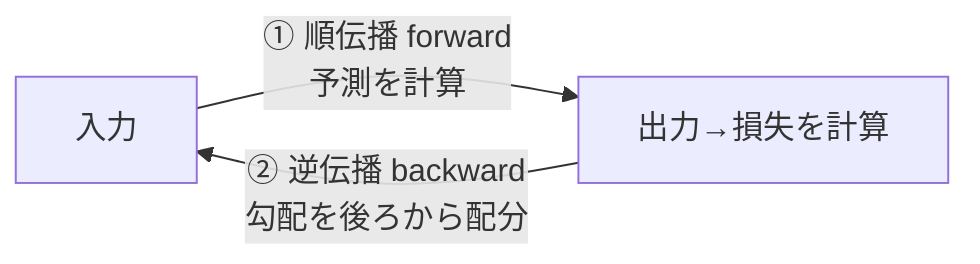

# 機械学習・深層学習 体系ガイド ③誤差逆伝播法（Backpropagation）

> 作成日: 2026-07-11 / STATUS: INFO / TOPIC: ML / シリーズ 02
> 前提: ②（`20260711_INFO_ML_01_perceptron-to-neural-network.md`）で「損失関数」「勾配降下法」を把握済みであること。
> 全体像は ①（`20260711_INFO_ML_00_overview-and-differences.md`）。

---

## 0. なぜ誤差逆伝播法が必要か（前章の続き）

前章で「学習 = 損失 L を勾配降下法で最小化する」ことを見た。更新式は:

```
w ← w − η · (∂L/∂w)
```

問題は、深層ニューラルネットの重み w は**数百万〜数十億個**あること。その全部について「損失 L を各重みで微分した傾き ∂L/∂w」を、**現実的な時間で計算**しなければならない。

> **誤差逆伝播法（Backpropagation）** は、まさにこの「全重みの勾配を一気に・効率よく求める」ためのアルゴリズム。深層学習を実用化させた最重要技術（1986年、ラメルハートら）。

---

## 1. 何をする技術か

「出力の誤差」を**出力側から入力側へ逆向きに伝播**させ、各重みが誤差にどれだけ寄与したか（＝∂L/∂w）を、**一括で効率的に計算**する方法。



---

## 2. 核心は「連鎖律（合成関数の微分）」

ニューラルネットは関数の入れ子（合成関数）。「入力 → 加重和 → 活性化 → … → 損失」と数珠つなぎになっている。合成関数の微分は**掛け算に分解できる**（連鎖律 / chain rule）:

```
∂L/∂w = (∂L/∂y) · (∂y/∂z) · (∂z/∂w)
```

- `∂L/∂y`: 損失が出力でどれだけ変わるか
- `∂y/∂z`: 活性化関数の微分
- `∂z/∂w`: 加重和が重みでどれだけ変わるか（＝その重みへの入力値）

各層で**局所的な微分**を計算し、**後ろから前へ掛け算しながら運んでいく**だけで、全ての重みの勾配 ∂L/∂w が求まる。これが「逆伝播」の実体。

### 2.1 直感的な例え
最終的な「誤差」という責任を、出力層 → 隠れ層 → 入力層へと**逆向きに配っていく**イメージ。各重みは「自分が誤差にどれだけ貢献したか」を、連鎖律の掛け算を通じて受け取る。責任の大きい重みほど大きく修正される。

---

## 3. 2つの流れ：順伝播と逆伝播（訓練の1サイクル）

1. **順伝播（forward）**: 入力を通してネットワークの予測を計算し、正解とのズレ（損失）を求める。各層の中間結果（加重和・活性化出力）は保存しておく。
2. **逆伝播（backward）**: 損失の勾配を出力層 → 隠れ層 → 入力層へ連鎖律で伝え、各重みの ∂L/∂w を得る。**このとき順伝播で保存した中間結果を再利用する**のがミソ。
3. **更新**: 得た勾配で勾配降下法により重みを更新（`w ← w − η·∂L/∂w`）。
4. 1〜3を大量のデータで繰り返す = **訓練（training）**。データ全体を1周する単位を**エポック**と呼ぶ。

---

## 4. なぜ画期的か（効率の話）

素朴に「1つの重みを少し変えて損失の変化を見る」数値微分を全重みに対してやると、**重みの数だけネットワーク全体を再計算**する必要があり、計算量が爆発する（重みN個なら N回のフォワード計算）。

誤差逆伝播法は、順伝播で計算した中間結果を再利用し、**ネットワーク1往復ぶん（順伝播1回＋逆伝播1回）の計算量**で全重みの勾配を一括で求められる。この効率化があるからこそ、層を深く・重みを膨大にしても現実的な時間で学習できる。

> **ひとことで:** 誤差逆伝播法 = 「連鎖律を使って、出力の誤差を逆向きに配り、各重みの直すべき量（勾配）を一括で効率的に求める仕組み」。

---

## 5. 実装との対応（学びを進めるなら）

- 現代のフレームワーク（PyTorch / TensorFlow）は、この逆伝播を**自動微分（autograd）**として自動でやってくれる。順伝播の計算グラフを記録し、`loss.backward()` 一発で全パラメータの勾配を計算する。
- ただし**中身を一度スクラッチ実装しておく**と、勾配消失・学習率・初期値といった実務のハマりどころが腹落ちする。書籍『ゼロから作るDeep Learning』の誤差逆伝播法の章（計算グラフによる説明）が定番。

---

## 用語ミニ辞典（本章ぶん）

| 用語 | 一言で |
|---|---|
| 誤差逆伝播法 | 連鎖律で全重みの勾配を効率的に一括計算する手法 |
| 連鎖律 | 合成関数の微分を掛け算に分解する規則 |
| 順伝播 / 逆伝播 | 予測を出す前向き計算 / 勾配を配る後ろ向き計算 |
| エポック | 訓練データ全体を1周学習する単位 |
| 自動微分(autograd) | フレームワークが逆伝播を自動実行する仕組み |

---

## まとめ（シリーズ全体を1枚で）

> **パーセプトロン**（重み付き和＋活性化）を**多層に重ねて**表現力を得たのが**深層学習**。
> 学習とは**損失関数**を**勾配降下法**で最小化すること。
> その勾配を、連鎖律で出力から入力へ逆向きに効率計算する技術が**誤差逆伝播法**。
> 土台は**線形代数・微分・確率**。まず数学 → 部品(②) → 構造(②) → 学習(②) → 逆伝播(③) → 実装、の順で積み上げる。

---

## 参考・出典
- 斎藤康毅『ゼロから作るDeep Learning』オライリー・ジャパン（誤差逆伝播法・計算グラフの章）
- Rumelhart, Hinton & Williams (1986) 誤差逆伝播法
- Stanford CS231n / CS229（公開講義）

> ※ 本ドキュメントは一般公開情報に基づく学習用のリサーチメモであり、特定の組織の業務とは関係しない個人の創作物。
