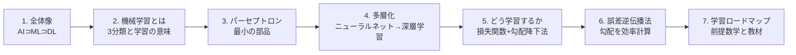
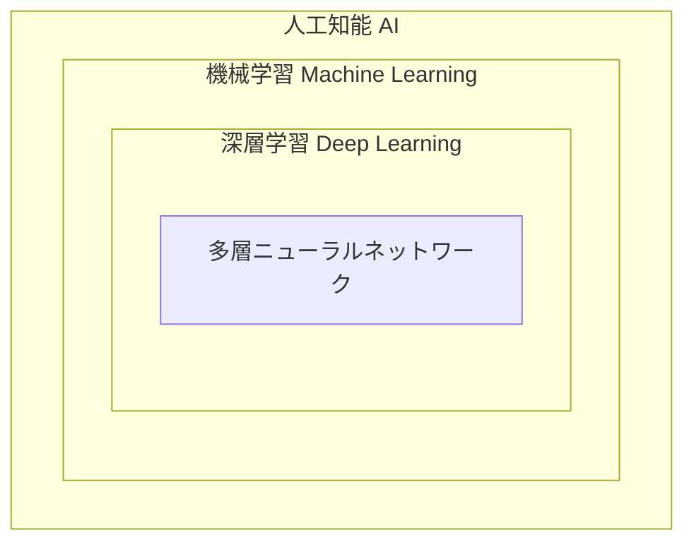
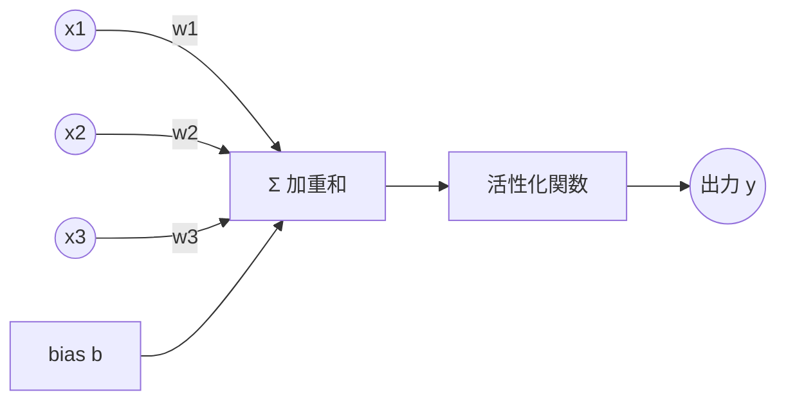
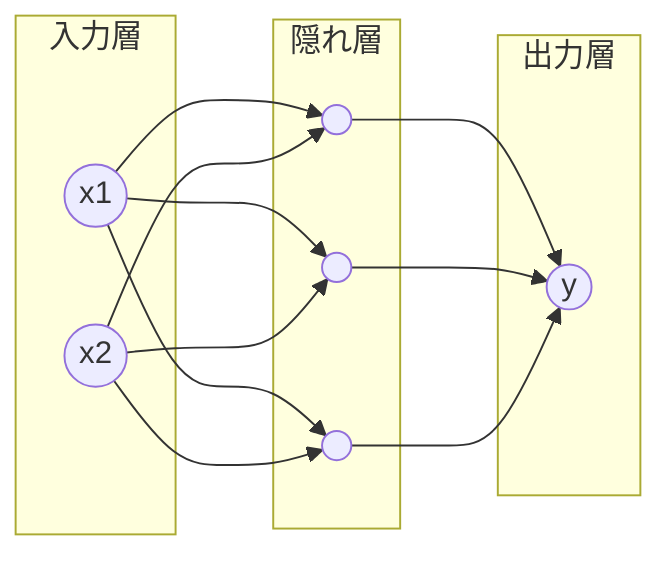
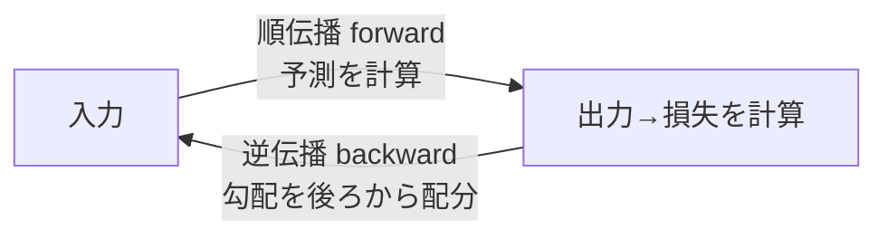

# 機械学習・深層学習を体系的に学ぶ — パーセプトロンから誤差逆伝播法まで

> 作成日: 2026-07-11 / STATUS: INFO / TOPIC: ML
> 対象: 機械学習 / 深層学習 / パーセプトロンモデル / 誤差逆伝播法
> 方針: YouTuber「ヨビノリ（予備校のノリで学ぶ大学の数学・物理）」の *前提から順に積み上げ、直感 → 数式* のスタイルを踏襲。まず全体像、次に最小部品、最後に学習の仕組みへ。

---

## 0. 読む順番（このドキュメントの地図）



**最短の理解の筋道:**「パーセプトロン（部品）→ 積み重ねてネットワーク（構造）→ 損失を減らす向きに重みを更新（学習）→ その更新量を効率よく求める技術が誤差逆伝播法」。この一本道を押さえれば全体がつながる。

---

## 1. 全体像 — AI ⊃ 機械学習 ⊃ 深層学習

3つは入れ子の包含関係。混同しやすいので最初に整理する。



| 用語 | ざっくり定義 | 例 |
|---|---|---|
| **人工知能（AI）** | 人間の知的作業を機械にさせる分野全体（ルールベースも含む広い概念） | エキスパートシステム、探索、機械学習 全部 |
| **機械学習（ML）** | 明示的にルールを書かず、**データから規則性を自動で獲得**する手法群 | 回帰、決定木、SVM、ニューラルネット |
| **深層学習（DL）** | 機械学習のうち、**層を深く重ねたニューラルネットワーク**を使う手法 | 画像認識(CNN)、言語モデル(Transformer) |

ポイント: 深層学習は機械学習の"一部分"。ニューラルネットを「深く（多層に）」したものが深層学習で、別物ではない。

---

## 2. 機械学習とは何か

### 2.1 「学習する」とは
従来のプログラム = 人間が**ルール**を書く（if 〜 then 〜）。
機械学習 = 人間は**データ**と**目標**を与え、**ルール（＝内部のパラメータ）を機械が自動調整**する。

> 学習 = 「予測の誤差が小さくなるように、内部のパラメータ（重み）を少しずつ調整していく作業」。この一言が全ての土台。

### 2.2 機械学習の3分類

| 種類 | 与えるデータ | やること | 例 |
|---|---|---|---|
| **教師あり学習** | 入力＋正解ラベル | 入力→出力の対応を学ぶ | 画像分類、価格予測、スパム判定 |
| **教師なし学習** | 入力のみ（正解なし） | データの構造・かたまりを見つける | クラスタリング、次元削減 |
| **強化学習** | 環境からの報酬 | 試行錯誤で最適な行動方針を学ぶ | ゲームAI、ロボット制御 |

本ドキュメントの主役（パーセプトロン・深層学習・誤差逆伝播法）は主に **教師あり学習** の文脈。

---

## 3. パーセプトロン — ニューラルネットの最小部品

深層学習の理解は、まずこの1個の「人工ニューロン」から始まる。

### 3.1 生物のニューロンの模倣
脳の神経細胞は「複数の入力を受け取り、合計がある閾値を超えたら発火（信号を出す）」する。これを数式で真似たのがパーセプトロン（1958年、ローゼンブラット）。



### 3.2 数式
入力 x1, x2, …, xn に重み w1, …, wn を掛けて合計し、バイアス b を足す:

```
z = w1·x1 + w2·x2 + … + wn·xn + b   （加重和）
y = f(z)                              （活性化関数を通す）
```

- **重み w**: その入力をどれだけ重視するか（学習で調整される主役）。
- **バイアス b**: 発火しやすさの下駄（閾値の役割）。
- **活性化関数 f**: 単純パーセプトロンでは「z>0 なら 1、そうでなければ 0」のステップ関数。

### 3.3 パーセプトロンの意味 = 直線で分ける
入力が2次元なら、`w1·x1 + w2·x2 + b = 0` は1本の**直線**。パーセプトロンは「その直線のどちら側か」で 0/1 を判定する **線形分類器**。AND・OR はこれで表現できる。

### 3.4 限界: XOR 問題（重要）
XOR（排他的論理和）は、1本の直線では 0 と 1 を分けられない（**線形分離不可能**）。
→ 単純パーセプトロンには原理的な限界がある。1969年にこれが指摘され、一度ブームが冷えた（第1次AI冬の時代）。

**この限界の突破策が「層を重ねる」= 次章。**

---

## 4. 多層化 → ニューラルネットワーク → 深層学習

### 4.1 多層パーセプトロン（MLP）
パーセプトロンを**層状に並べ、間に「隠れ層」を挟む**と、直線を組み合わせて曲がった境界を作れる。XOR も解ける。



- **入力層**: データを受け取る。
- **隠れ層**: 特徴を段階的に抽出する中間層。**ここを増やす（深くする）のが「深層」学習**。
- **出力層**: 最終的な予測を出す。

### 4.2 非線形活性化関数が必須な理由
隠れ層を入れても、活性化関数が「ただの直線（線形）」だと、何層重ねても結局1つの直線に潰れてしまう。だから**非線形**な活性化関数が必要:

| 関数 | 式 / 特徴 | 用途 |
|---|---|---|
| **シグモイド** | 0〜1に滑らかに圧縮。昔の定番 | 出力を確率的に |
| **ReLU** | `max(0, z)`。負を0に。計算軽く勾配消失に強い | 現在の隠れ層の標準 |
| **ソフトマックス** | 複数出力を合計1の確率に | 多クラス分類の出力層 |

### 4.3 なぜ「深い」と強いのか
浅い層は「線・エッジ」、中間は「模様・部品」、深い層は「物体全体」…と、**層が深いほど抽象的で複雑な特徴を段階的に学習**できる。理論上は隠れ層1つでも十分な幅があれば任意の関数を近似できる（**万能近似定理**）が、実際は"深く"した方が少ないパラメータで効率よく表現できる。これが深層学習の強さ。

---

## 5. どうやって学習するのか — 損失関数と勾配降下法

「学習 = 誤差が減る向きに重みを更新」を具体化する。

### 5.1 損失関数（Loss）: 間違いの大きさを測る
予測 y と正解 t のズレを1つの数値にする関数。

- **回帰**: 平均二乗誤差 MSE = 平均((y − t)²)
- **分類**: 交差エントロピー誤差

損失が小さい = 良いモデル。**学習の目標は損失を最小にする重みを見つけること。**

### 5.2 勾配降下法（Gradient Descent）: 坂を下る
損失 L を「重み w の関数」と見ると、L が谷になる w を探す最適化問題。
勾配（微分＝傾き）を計算し、**傾きと逆向きに少しずつ w を動かす**と谷に近づく。

```
w ← w − η · (∂L/∂w)
```

- **∂L/∂w**: 損失を各重みで微分した「傾き」。
- **η（学習率）**: 一歩の大きさ。大きすぎると発散、小さすぎると遅い。

> イメージ: 霧の山で、足元の一番急な下り方向へ一歩ずつ降りる。それを全ての重みについて繰り返す。

**問題:** 重みは数百万〜数十億個ある。その全部について ∂L/∂w を効率よく計算する必要がある。
→ **それを解決するのが誤差逆伝播法。**

---

## 6. 誤差逆伝播法（Backpropagation） — 本命

深層学習を実用化させた最重要アルゴリズム（1986年、ラメルハートら）。

### 6.1 何をする技術か
「出力の誤差」を**出力側から入力側へ逆向きに伝播**させ、各重みが誤差にどれだけ寄与したか（＝∂L/∂w）を、**一気に・効率よく計算**する方法。

### 6.2 核心は「連鎖律（合成関数の微分）」
ネットワークは関数の入れ子（合成関数）。「入力→加重和→活性化→…→損失」と繋がる。合成関数の微分は**掛け算で分解できる**（連鎖律）:

```
∂L/∂w = (∂L/∂y) · (∂y/∂z) · (∂z/∂w)
```

各層でこの局所的な微分を計算し、**後ろから前へ掛け算しながら運んでいく**だけで全重みの勾配が求まる。

### 6.3 2つの流れ：順伝播と逆伝播



1. **順伝播（forward）**: 入力を通して予測を出し、損失を計算。
2. **逆伝播（backward）**: 損失の勾配を出力層→隠れ層→入力層へ連鎖律で伝え、各重みの ∂L/∂w を得る。
3. その勾配で勾配降下法により重みを更新（5章）。
4. 1〜3を大量のデータで繰り返す = **訓練（training）**。

### 6.4 なぜ画期的か
素朴に1つずつ数値微分すると、重みの数だけネットワーク全体の再計算が必要で**計算量が爆発**する。逆伝播は順伝播での中間結果を再利用し、**ネットワーク1往復ぶんの計算量**で全勾配を求められる。この効率化が、層を深くしても現実的な時間で学習できる理由。

> ひとことで: 誤差逆伝播法 = 「連鎖律を使って、出力の誤差を逆向きに配って、各重みの直すべき量を一括で求める仕組み」。

---

## 7. 体系的に学ぶロードマップ

### 7.1 前提となる数学（ここが土台。飛ばすと後で詰む）
ヨビノリ流に言えば「道具（数学）を先に握ってから本題へ」。

| 分野 | 最低限おさえること | なぜ必要か |
|---|---|---|
| **線形代数** | ベクトル・行列の積、転置 | 加重和・層の計算は全て行列演算 |
| **微分（偏微分・連鎖律）** | 合成関数の微分、勾配 | 勾配降下法・誤差逆伝播法の心臓部 |
| **確率・統計** | 確率分布、期待値、最尤推定 | 損失関数・分類の理論的背景 |

### 7.2 学ぶ順番（推奨ステップ）
1. **前提数学**（線形代数の行列積 → 偏微分と連鎖律）を先に。
2. **パーセプトロン**（本書3章）で1ニューロンを完全に理解。
3. **多層化と活性化関数**（4章）でネットワークの表現力を理解。
4. **損失関数と勾配降下法**（5章）で「学習＝最適化」を理解。
5. **誤差逆伝播法**（6章）を連鎖律とセットで手を動かして計算。
6. **実装**: Python + NumPy で小さなネットをスクラッチ実装 → その後 PyTorch/TensorFlow へ。
7. **発展**: CNN（画像）、RNN/Transformer（系列・言語）へ。

### 7.3 教材（無料 → 書籍）
- **YouTube「予備校のノリで学ぶ大学の数学・物理」（ヨビノリ）**: 東大院卒・たくみ氏による解説チャンネル。前提の**線形代数・微分積分**シリーズで土台を作り、機械学習／ディープラーニング関連の解説動画で直感をつかむのに最適。まず数学の前提動画 → ML/DL動画の順が効く。公式: https://yobinori.jp/ ／ チャンネル: https://www.youtube.com/channel/UCqmWJJolqAgjIdLqK3zD1QQ
- **書籍『ゼロから作るDeep Learning』（斎藤康毅, オライリー）**: パーセプトロン → 誤差逆伝播法 → CNN を **NumPyでスクラッチ実装**しながら学ぶ定番。本書の流れと相性が良い。
- **講義『Stanford CS231n』『CS229』**: より理論的に深めたい場合の定番（英語・無料公開）。

---

## 8. 用語ミニ辞典

| 用語 | 一言で |
|---|---|
| パーセプトロン | 重み付き和を活性化関数に通す最小の人工ニューロン |
| 重み / バイアス | 学習で調整されるパラメータ（重視度／発火しやすさ） |
| 活性化関数 | 非線形性を与える関数（ReLU, シグモイド等） |
| 隠れ層 | 入力と出力の間の中間層。深層学習で増やす対象 |
| 損失関数 | 予測と正解のズレを測る指標（MSE, 交差エントロピー） |
| 勾配降下法 | 損失の傾きと逆向きに重みを更新する最適化 |
| 学習率 η | 1回の更新の歩幅 |
| 連鎖律 | 合成関数の微分を掛け算に分解する規則 |
| 誤差逆伝播法 | 連鎖律で全重みの勾配を効率的に一括計算する手法 |
| エポック | 訓練データ全体を1周学習する単位 |

---

## まとめ（1枚で）

> **パーセプトロン**（重み付き和＋活性化）を**多層に重ねて**表現力を得たのが**深層学習**。
> 学習とは**損失関数**を**勾配降下法**で最小化すること。
> その勾配を、連鎖律で出力から入力へ逆向きに効率計算する技術が**誤差逆伝播法**。
> 土台は**線形代数・微分・確率**。まず数学 → 部品 → 構造 → 学習 → 逆伝播 → 実装、の順で積み上げる。

---

## 参考・出典
- Wikipedia「ヨビノリたくみ」／公式サイト https://yobinori.jp/
- 斎藤康毅『ゼロから作るDeep Learning』オライリー・ジャパン
- Rosenblatt (1958) パーセプトロン ／ Rumelhart, Hinton & Williams (1986) 誤差逆伝播法
- Stanford CS231n / CS229（公開講義）

> ※ 本ドキュメントは一般公開情報に基づく学習用のリサーチメモであり、特定の組織の業務とは関係しない個人の創作物。
