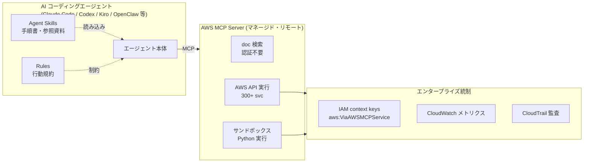

# Agent Toolkit for AWS 調査 — この OpenClaw サーバへの適用ユースケースとメリデメ

> 目的: AI コーディングエージェント向けの公式ツール群「Agent Toolkit for AWS」の実体を一次情報で整理し、**本 OpenClaw サーバ（AI エージェント基盤）に適用・活用する場合**の具体的ユースケース・メリット・デメリット・導入手順・セキュリティ上の注意をまとめる。
>
> 作成日: 2026-07-17 / STATUS: INFO / TOPIC: AWS
> 一次情報（公式）:
> - 製品ページ: <https://aws.amazon.com/products/developer-tools/agent-toolkit-for-aws/>
> - ユーザーガイド: <https://docs.aws.amazon.com/agent-toolkit/latest/userguide/>
> - GitHub（公式）: <https://github.com/aws/agent-toolkit-for-aws>
> - IAM ポリシー例: <https://docs.aws.amazon.com/agent-toolkit/latest/userguide/security_iam_id-based-policy-examples.html>

## 1. これは何か（概要）

**Agent Toolkit for AWS** は、AI コーディングエージェント（Claude Code / Codex / Cursor / Kiro など、MCP に対応する任意のエージェント）に対して、**AWS を正しく・安全に操作するための「ツール・知識・ガードレール」**を与える AWS 公式のツール群。2026-05-06 リリース。

背景の課題はシンプルで、基盤モデル（LLM）の知識は**学習時点で止まっており**、新しい AWS サービスや最近の仕様変更を知らない。その結果エージェントは「古い API を叩く → エラー → 試行錯誤でトークンを浪費」しがち。Toolkit は**最新ドキュメント・検証済み手順・ベストプラクティス**を与えて成功率を上げ、無駄を減らす。

**3 つの構成要素**:

| 層 | 役割 | 認証（AWS 資格情報） |
|---|---|---|
| **AWS MCP Server** | 300+ サービス / 15,000+ API アクションを単一エンドポイントで提供。サンドボックス Python 実行、リアルタイム doc 検索 | API 呼び出し・スクリプト実行は**必要**。doc 検索・スキル探索は**不要** |
| **Agent Skills** | AWS タスク別の手順書＋参照資料（例: 本番 VPC 作成、Lambda↔API Gateway 連携）。オンデマンドで必要な分だけ読み込む | 不要（ローカル or レジストリから取得） |
| **Rules / Plugins** | 「行動前に doc 検索・スキル参照せよ」等のプロジェクト規約。Plugin は MCP 設定＋Skills を一括導入 | 不要 |

## 2. アーキテクチャ

要点: **doc 検索・スキル探索は認証なし**で使えるため、資格情報を渡さなくても「最新知識の付与」だけを安全に享受できる。実際の AWS 操作（API 実行・スクリプト）を許すかどうかは、資格情報と IAM で**別レイヤとして制御**できる。

## 3. 主要機能

- **フル API カバレッジ**: 300+ サービス・15,000+ アクションを 1 ツールで。ローカルへ AWS CLI を入れなくてよい。
- **サンドボックス Python 実行**: 複数ステップ処理を隔離環境で実行。**ローカルのファイルシステム・ネットワークにはアクセスしない**。
- **リアルタイム doc 検索**: 学習カットオフ後に出たサービス（S3 Tables / Aurora DSQL / Bedrock AgentCore 等）でも最新仕様を参照可能。
- **Agent Skills（20+）**: タスクに一致したときだけ読み込む「検証済み手順」。文脈（コンテキスト）を汚さない。
- **Plugins**: `aws-core`（サービス選定・CDK/CFN・サーバレス・コンテナ・ストレージ・可観測性・課金・デプロイ）、`aws-agents`（Bedrock/AgentCore でのエージェント構築）、`aws-data-analytics`（S3 Tables/Glue/Athena）、`aws-agents-for-devsecops`（インシデント調査・UAT・脆弱性スキャン・ペネトレーション）。

## 4. IAM ガードレール（セキュリティの核心）

AWS MCP Server 経由のリクエストには、**自動で以下のグローバル条件コンテキストキー**が付与される。これにより「人間の直接操作」と「エージェントが MCP 経由で行う操作」を IAM ポリシー / SCP で**区別**できる。

| コンテキストキー | 型 | 意味 |
|---|---|---|
| `aws:ViaAWSMCPService` | Boolean | AWS マネージド MCP 経由なら `true`。MCP 経由の全操作を一括で許可/拒否できる |
| `aws:CalledViaAWSMCP` | String | 実際に呼び出した MCP サーバのサービスプリンシパル（例: `aws-mcp.amazonaws.com`）。特定 MCP に限定した制御に使う |

公式が示す代表的なポリシー例:
- **MCP 経由の全操作を拒否**（エージェントには一切 AWS を触らせない運用）
- **破壊的操作だけ MCP 経由で拒否**（`Delete*` / `Terminate*` 等を deny しつつ読み取り系は許可）
- **特定の MCP サーバに限定**

これに加えて **CloudWatch メトリクス**（エージェント活動の監視）と **CloudTrail 監査**（誰が・いつ・何をしたか）で追跡できる。ローカル端末から直接 CLI を叩く方式では得られない「エージェント専用のガードレールと監査証跡」が最大の価値。

## 5. この OpenClaw サーバへの適用

### 5-1. 現状（すでに一部稼働している）

本サーバ（OpenClaw, EC2 / Amazon Linux 2023 上で稼働）には、**Agent Toolkit の AWS MCP Server 実体である `mcp-proxy-for-aws` が MCP として接続済み**。調査時に以下を実機確認した:

- **認証不要のドキュメント検索が実働**: 「Agent Toolkit の IAM ガードレール」を検索し、IAM ポリシー実文・コンテキストキー定義を取得できた。
- **Agent Skills 探索が実働**: `aws-iam` スキル（IAM のよくある誤りの是正・最小権限ポリシー生成の手順）を発見できた。

つまり**「最新 AWS 知識の付与」レイヤは追加コストなしで既に使える状態**。未整備なのは「実際に AWS を操作させる（API 実行・スクリプト）」レイヤの資格情報・IAM 設計。

### 5-2. 具体的ユースケース

1. **AWS 調査タスクの精度・鮮度向上**（今すぐ・低リスク）
   NEXUS が週次で作る AWS 系リサーチ記事（`docs/info/research/`）で、モデル知識ではなく**公式 doc をリアルタイム参照**して執筆。カットオフ後の新機能も正確に書ける。
2. **IaC / 構成レビューの裏取り**（低リスク）
   CDK / CloudFormation の書き方や制約を `aws-core` スキル・doc 検索で確認しながら提案。既存の「提案ベース・HITL」方針と相性が良い（読み取り中心）。
3. **読み取り専用の AWS 状態把握**（中リスク・要 IAM 設計）
   CloudWatch ログ/メトリクス、CFN スタック状態、コスト増加の一次調査を**参照権限のみ**のロールで実施。障害・コスト調査の初動を省力化。
4. **サンドボックスでの多段処理**（中リスク）
   ローカル FS/ネットワークに触れない隔離 Python で、複数 API をまたぐ集計・照合を実行。ローカル汚染リスクなし。
5. **DevSecOps 補助**（将来・要承認）
   `aws-agents-for-devsecops` で脆弱性スキャンや UAT を補助。セキュリティ監視タスク（ALAS/MSRC 監視）の発展形として検討可。

### 5-3. メリット / デメリット

| 観点 | メリット | デメリット・注意点 |
|---|---|---|
| 知識鮮度 | カットオフ後の新サービスも正確に扱える | doc 検索自体は外部 API 依存（レイテンシ・可用性） |
| 成功率/コスト | 試行錯誤が減りトークン浪費を抑制 | MCP 経由 API 実行はサーバ側課金・レート制限の考慮が要る |
| セキュリティ | IAM context key で「エージェント操作」を人間と分離・deny 可能。CloudTrail で監査 | **資格情報を与えると本サーバから AWS を変更可能に**。最小権限・破壊操作 deny の設計が必須 |
| 運用統制 | CloudWatch でエージェント活動を可視化 | 設定不備だと過剰権限・想定外操作のリスク |
| 導入容易性 | doc/スキル層は認証不要で即利用（本サーバは接続済み） | サプライチェーン: MCP プロキシ/スキルの**バージョン固定**が推奨 |
| 本方針との整合 | 「読み取り・調査は自由」に合致 | 「書き込みは HITL」の原則を IAM 側でも二重化すべき |

### 5-4. 導入手順（本環境向け・提案）

> ⚠️ 実操作（API 実行）を伴う 3・4・5 は書き込み系。AGENTS.md の HITL 原則に従い、**IAM 設計と承認を経てから**有効化する。

1. **知識層のみ活用（承認不要・現状で可）**: 既に接続済みの `aws-mcp` を使い、AWS 調査・IaC レビューで doc 検索/スキル参照を実施。
2. **バージョン固定の確認**: `mcp-proxy-for-aws` はバージョンピン（例 `@1.6.3`）を推奨。設定を確認し、PyPI の安定版を定期チェック。
3. **操作層を足す場合の最小権限ロール設計（HITL）**:
   - 最初は**読み取り専用ポリシー**（CloudWatch/CFN/コスト参照など）から。
   - SCP/IAM で `aws:ViaAWSMCPService = true` の**破壊的操作を deny**（`Delete*`/`Terminate*`/`Put*` の危険系）。
   - `aws:CalledViaAWSMCP` で許可する MCP を限定。
4. **監査の有効化**: CloudTrail でエージェント操作を記録、CloudWatch でメトリクス監視。
5. **ドキュメント化**: 設定を行ったら AGENTS.md の「セットアップ記録義務」に従い `docs/openclaw/` に構築手順を残す。

### 5-5. セキュリティ上の推奨（重要）

- **資格情報は最小・段階的に**。まず doc/スキル層のみ（認証不要）で価値検証し、操作層は読み取り専用から。
- **本サーバの EC2 インスタンスロールをそのまま流用しない**。エージェント用途は専用ロール＋ `aws:ViaAWSMCPService` ガードレールで隔離する。
- **破壊的操作は IAM 側でも deny** し、OpenClaw の HITL（人間承認）と二重の歯止めにする。
- **サプライチェーン**: MCP プロキシ・スキルはバージョン固定し、更新時に差分を確認。

## 6. 結論・推奨

- **今すぐやる価値があるのは「知識層」**（doc 検索・スキル参照）。本サーバは既に接続済みで、**追加の資格情報なし・低リスク**で調査精度と鮮度を底上げできる。まずは AWS 系リサーチ・IaC レビューで活用する。
- **「操作層」（AWS を変更する）は段階導入**。最小権限ロール＋ `aws:ViaAWSMCPService` の破壊操作 deny＋CloudTrail 監査を前提に、読み取り専用から始めるのが安全。OpenClaw の HITL 原則と IAM ガードレールを二重化することで、利便性と安全性を両立できる。

## 7. 参照

- 製品ページ: <https://aws.amazon.com/products/developer-tools/agent-toolkit-for-aws/>
- ユーザーガイド: <https://docs.aws.amazon.com/agent-toolkit/latest/userguide/>
- AWS MCP Server ツール解説: <https://docs.aws.amazon.com/agent-toolkit/latest/userguide/understanding-mcp-server-tools.html>
- IAM 連携（コンテキストキー）: <https://docs.aws.amazon.com/agent-toolkit/latest/userguide/security_iam_service-with-iam.html>
- IAM ポリシー例（deny 例）: <https://docs.aws.amazon.com/agent-toolkit/latest/userguide/security_iam_id-based-policy-examples.html>
- GitHub（公式）: <https://github.com/aws/agent-toolkit-for-aws>
