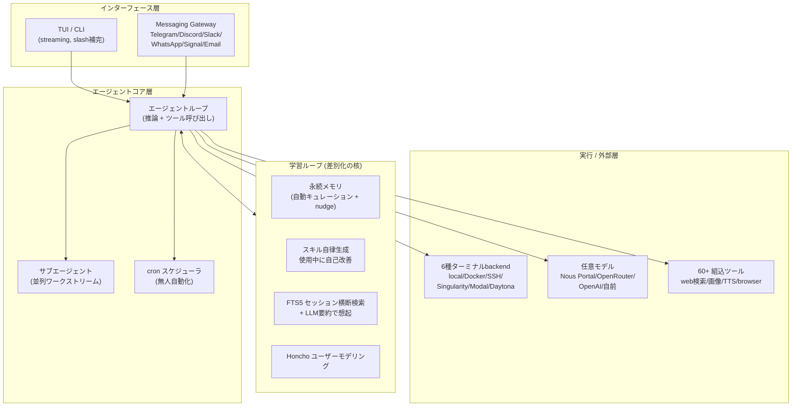

# Hermes Agent — 「使うほど賢くなる」自己改善型・常駐AIエージェント（OpenClaw比較つき）

> 作成日: 2026-07-18 / STATUS: INFO / TOPIC: AGENT
> ※ 個別指定で作成した調査記事です。情報は 2026-07 時点の公式一次情報に基づきます（本分野は流動的なため、最新は公式を確認してください）。

## TL;DR（要点3行）

- **Hermes Agent** は、Llama 系ファインチューンで知られる研究ラボ **[Nous Research](https://nousresearch.com)** が作った OSS の自律型 AI エージェント。キャッチコピーは **"The agent that grows with you"（あなたと共に成長する）**。
- 最大の差別化は **「クローズドな学習ループ（closed learning loop）」** ＝ 経験から**スキルを自律生成**し、使用中に**自己改善**、知識を**永続化**し、過去会話を**横断検索**して**ユーザー像を深めていく**点。
- 常駐・マルチチャネル Gateway・ツール実行・メモリ・スキル・cron など **OpenClaw と設計思想が非常に似ており**、公式が **`hermes claw migrate`（OpenClaw からの移行コマンド）** まで用意している。海外で「OpenClaw から乗り換えろ」と話題になっているのはこのため。

---

## 1. 概要 — なぜ話題なのか

Hermes Agent は「IDE に付くコーディング補助」でも「単一 API を包んだチャットボット」でもなく、**使えば使うほど賢くなる自己改善型・常駐エージェント**を標榜しています。ノート PC に縛られず、**月 5 ドルの VPS・GPU クラスタ・サーバレス基盤**の上で常駐し、**Telegram などから遠隔操作**しながらクラウド VM 上で作業を進めます。

"乗り換えろ" 論の中身は主に次の2点です。

1. **OpenClaw とアーキテクチャが酷似** — 常駐プロセス、マルチチャネル Gateway、ツール実行、メモリ、スキル、cron。既存 OpenClaw ユーザーがそのまま馴染める設計。公式に **移行コマンド `hermes claw migrate`** が存在する。
2. **「学習ループ」という明確な上乗せ価値** — 単なる常駐エージェントではなく、「自律的にスキルを生み・磨き・記憶を育てる」点を前面に出している。ここが刺さって話題化した。

> ⚠️ 冷静な補足: 機能一覧の重なりが大きく、"乗り換え" は**思想的なアピール**の色が濃い。実際に置き換わるかは、後述の学習ループ品質・成熟度・自社モデル依存度をどう評価するか次第（2026-07 時点では登場して間もない）。

---

## 2. 設計思想・背景（Nous Research と "grows with you"）

- **作り手**: Nous Research。オープンモデル（Hermes シリーズ等）や分散学習（Psyche）で知られるラボ。**自社モデル + 自社エージェント**を垂直統合する戦略が背景にある。
- **思想**: 「エージェントは道具ではなく“共に育つ相棒”」。セッションをまたいで**あなたという人物のモデル**を深めていく（[Honcho](https://github.com/plastic-labs/honcho) の弁証法的ユーザーモデリングを採用）。
- **囲い込み回避も同時に主張**: モデルは Nous Portal / OpenRouter / OpenAI / 自前エンドポイント等**何でも使える**、`hermes model` でコード変更なしに切替可能（no lock-in）。

---

## 3. アーキテクチャ（3層 + 学習ループ）

**ポイント**: 一般的なエージェント（インターフェース→コア→実行の3層）に、**学習ループを常時フックさせている**のが特徴。タスク完了後にスキルを生成し、記憶へ nudge（自己催促）で書き戻す。

---

## 4. 主要機能・技術スタック

| 分類 | 内容 |
|---|---|
| **インターフェース** | フル TUI（複数行編集・slash補完・履歴・割り込み/リダイレクト・ストリーミング出力） |
| **マルチチャネル** | Telegram / Discord / Slack / WhatsApp / Signal / Email / CLI を単一 Gateway プロセスで。音声メモ文字起こし、プラットフォーム跨ぎの会話継続 |
| **学習ループ** | スキル自律生成＋使用中の自己改善／エージェント主導メモリ＋定期nudge／FTS5 検索＋LLM要約でクロスセッション想起／Honcho ユーザーモデリング。**[agentskills.io](https://agentskills.io) 標準に準拠** |
| **自動化** | 組込 cron スケジューラ。自然言語で「毎日レポート」「夜間バックアップ」「週次監査」を無人実行 |
| **並列/委譲** | 隔離サブエージェントを spawn。**Python スクリプトから RPC 経由でツール呼び出し**し、多段パイプラインを "ゼロコンテキストコストのターン" に畳む |
| **実行backend** | local / Docker / SSH / Singularity / Modal / Daytona の6種。**Modal・Daytona はサーバレス**でアイドル時ほぼ無料（休眠→オンデマンド起動） |
| **モデル** | Nous Portal（300+モデル）/ OpenRouter / OpenAI / 自前エンドポイント等。`hermes model` で切替（ロックインなし） |
| **ツール** | 60+ 組込。Nous Portal のサブスクなら Tool Gateway（web検索=Firecrawl / 画像=FAL / TTS=OpenAI / クラウドブラウザ=Browser Use）を OAuth 一括接続 |
| **導入** | `install.sh`（Linux/macOS/WSL2）/ `install.ps1`（**ネイティブ Windows、WSL不要**）。uv・Python 3.11・Node.js・ripgrep・ffmpeg・MinGit を同梱。Termux（Android）手順あり。Hermes Desktop（Win/mac）あり |
| **研究向け** | バッチ軌跡（trajectory）生成・圧縮。次世代ツール呼び出しモデルの学習データ生成用途 |

---

## 5. OpenClaw との比較

```mermaid
flowchart LR
    subgraph HERMES["Hermes Agent"]
        H1["学習ループ<br/>スキル自律生成/自己改善"]
        H2["Honcho ユーザーモデリング"]
        H3["Nousモデル垂直統合<br/>Portal 一括サブスク"]
        H4["サーバレスbackend<br/>Modal/Daytona"]
    end
    subgraph COMMON["共通（重なりが大きい）"]
        C1["常駐プロセス"]
        C2["マルチチャネルGateway"]
        C3["ツール実行 / スキル"]
        C4["永続メモリ"]
        C5["cron / サブエージェント"]
        C6["任意モデル / no lock-in"]
    end
    subgraph OPENCLAW["OpenClaw"]
        O1["MCP エコシステム重視"]
        O2["成熟した運用実績<br/>(本ドキュメント基盤)"]
        O3["Skill Workshop / 各種MCP"]
    end
    HERMES --- COMMON --- OPENCLAW
```

| 観点 | Hermes Agent | OpenClaw |
|---|---|---|
| 常駐 / デーモン | ○ | ○ |
| マルチチャネル Gateway | ○（Telegram/Discord/Slack/WhatsApp/Signal/Email/CLI） | ○（Discord ほか多数） |
| ツール実行 | 60+組込 + Tool Gateway | MCP 中心の広大なエコシステム |
| メモリ | 自動キュレーション + nudge + FTS5横断検索 | ファイルベース memory + 日次/長期ノート |
| スキル | **自律生成 + 使用中に自己改善**（agentskills.io 準拠） | Skill / Skill Workshop（人＋AIで整備） |
| ユーザーモデリング | **Honcho で弁証法的に深化** | 明示なし（USER.md 等の手動運用） |
| モデル | 任意 + **Nous 自社モデル垂直統合** | 任意（Claude 等） |
| 実行backend | **6種（serverless含む）** | ホスト常駐中心 |
| ライセンス | **MIT** | — |
| 成熟度 | 新しい（2025〜） | 実運用実績あり |

### 優位点（Hermes 側）
- **学習ループ**という明確な上乗せ価値（スキル自律生成・自己改善・ユーザーモデリング）。
- **サーバレス backend（Modal/Daytona）** でアイドル時ほぼ無料 → コスト面が魅力。
- **MIT ライセンス**で明快。ネイティブ Windows 対応も丁寧。

### 課題・留意点
- **成熟度**: 登場して日が浅く、実運用実績・エコシステムはこれから。
- **学習ループの実効性は要検証**: 「自己改善スキル」がどこまで実務品質かは使ってみないと不明。
- **Nous 垂直統合の色**: Portal を使うと便利な反面、モデル/ツールが Nous 寄りに誘導される面もある（任意モデルは可）。

### 実際に "置き換わる" のか？
2026-07 時点の結論は **「機能は大きく重なるが、置換は各自の評価次第」**。既存 OpenClaw 運用（本ドキュメント基盤・MCP群・タスクボード等）が安定稼働しているなら、**まず併走で試用**し、学習ループの価値を実測するのが妥当。`hermes claw migrate` で移行導線は用意されている。

---

## 6. 複雑タスク実行能力の観点（マルチエージェント / 並列 / 長時間）

- **マルチエージェント**: 隔離サブエージェント（独自の会話・ターミナル・Python RPC）を spawn し**並列ワークストリーム**を構成。
- **並列 / パイプライン**: Python スクリプトから RPC でツールを呼ぶことで、多段処理を**1ターンに畳んでコンテキストコストを抑える**設計。
- **長時間 / 無人**: 常駐 + cron + サーバレス backend により、**アイドル休眠→オンデマンド起動**で長時間・無人タスクを低コストに回せる。
- 位置づけ: OpenClaw の「サブエージェント + cron + セッション」思想と同方向。Hermes は **serverless 常駐 + 学習ループ**でコスト効率と自己改善を強調している。

---

## 7. ライセンス・コスト・コミュニティ・成熟度

- **ライセンス**: **MIT**（Copyright (c) 2025 Nous Research）。商用含め扱いやすい。
- **コスト**: OSS 本体は無料。$5 VPS / サーバレス（Modal・Daytona）でアイドルほぼ無料。任意モデル利用時は各プロバイダ従量。Nous Portal はモデル+4種ツールを一括サブスク。
- **コミュニティ**: Nous Research の Discord（`discord.gg/NousResearch`）。README は多言語（中文・ウルドゥー語・スペイン語版あり）で国際展開を意識。
- **成熟度**: 新興（2025〜）。勢いはあるが実運用実績はこれから積む段階。

---

## 8. まとめ（鈴木さん環境での所感）

- **要点**: Hermes は「OpenClaw によく似た常駐エージェント + 学習ループ（自己改善・ユーザーモデリング）」。MIT・サーバレス対応・ネイティブ Windows など間口は広い。
- **試用可否の所感**: 現行 OpenClaw 運用は安定しているため、**乗り換えではなく別環境での併走試用**が無難。特に「スキル自律生成・自己改善」の実効性と、サーバレス backend のコスト感を実測する価値が高い。導入検証は**HITL の別タスク**として切り出すのが適切（本ドキュメントは調査ベース。インストール/実行は未実施）。
- **一言**: "grows with you" のコンセプトは魅力的だが、真価は学習ループの中身。話題性 ≠ 置換必然性、という距離感で見るのが健全。

---

## 出典（一次情報・2026-07 時点）

- 公式サイト: https://hermes-agent.nousresearch.com/
- 公式ドキュメント: https://hermes-agent.nousresearch.com/docs/
- GitHub リポジトリ: https://github.com/NousResearch/hermes-agent
- LICENSE（MIT）: https://github.com/NousResearch/hermes-agent/blob/main/LICENSE
- Nous Research: https://nousresearch.com
- Nous Portal: https://portal.nousresearch.com
- Honcho（ユーザーモデリング）: https://github.com/plastic-labs/honcho
- AgentSkills 標準: https://agentskills.io

> ※ 本記事は公式・公開ドキュメント/リポジトリの閲覧のみに基づき作成しています（スクレイピングは行っていません）。ホスト名・IP・実ユーザー名等の環境固有情報は含みません。
