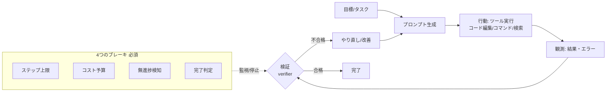

# Loopエンジニアリング（Loop Engineering）とは — AIエージェントを「回す仕組み」を設計する

> STATUS: INFO / CATEGORY: research / TOPIC: RESEARCH / 作成日: 2026-07-18（情報は 2026-07 時点）
> 2026年に AIコーディングエージェントの文脈で広まった新興語 **「Loop Engineering（ループエンジニアリング）」** を、初心者にも分かるように整理したドキュメントです。まだ確立した単一定義は無いため、**多義性を明示**しつつ、主流の意味・構成要素・メリデメ・アンチパターンを複数の一次情報から相互裏取りしてまとめます。専門用語は綴りと意味をセットで補足します。

---

## 1. TL;DR（一行定義）

- **Loopエンジニアリング** ＝ **「プロンプトを手で書く」から「エージェントを自律的に回す“仕組み（ループ＝harness）”を設計する」への 2026年のシフト**。
- つまり、AIエージェントが自分で **プロンプトを出し → 結果を確認し → やり直す** ループそのものを、停止条件・フィードバック・ガードレール込みで**設計する営み**。
- 「あなたが寝ている間にコーディングエージェントを走らせ続ける」ような自律運用を、**暴走させずに品質を出す**ための工学。**品質は harness（ループの外枠）に宿る**、というのが中心思想。

> 提唱時期: 2026年6月頃。Addy Osmani／Boris Cherny らの発信を機に広まったとされる（複数解説記事）。

---

## 2. 用語の定義と「多義性」（先に整理）

「Loop Engineering」は文脈で意味が変わりうる。混同を避けるため、まず3つの解釈を併記する。

| 解釈 | 何を指すか | 本ドキュメントでの扱い |
|---|---|---|
| **(A) AIエージェントのループ設計**（2026・主流） | LLMエージェントの「観測→判断→行動→やり直し」ループと停止条件・検証を設計する | **本命。§3以降で詳述** |
| (B) 制御工学のフィードバックループ | センサ→制御→アクチュエータの閉ループ制御（古典） | 隣接概念として言及 |
| (C) 開発プロセスの改善ループ | OODA / PDCA・継続的改善・MLの学習→評価→改善 | 思想的ルーツとして言及 |

補足用語（綴り＋意味）:

| 用語 | 綴り | 意味 |
|---|---|---|
| ハーネス | harness | エージェントの「外枠」。ループ・ツール・検証・停止条件をまとめた実行基盤。 |
| エージェントループ | agent loop | 観測→判断→行動を繰り返す中核ループ（数行で書ける＝“解決済み”とされる）。 |
| ベリファイア | verifier | エージェントの出力が正しいか検証する仕組み。**品質の律速（ボトルネック）**。 |
| メイカー/チェッカー | maker/checker | 作る役と検証する役を分けるパターン（自己採点の甘さを補う）。 |
| コンテキストロット | context rot | 文脈が肥大・劣化して判断精度が落ちる現象。 |
| ドゥームループ | doom loop | 同じ失敗を延々繰り返す無限ループ（暴走）。 |
| Ralphループ | Ralph loop/technique | 単純なループでエージェントを繰り返し走らせる素朴な手法の通称。 |

---

## 3. 主流の定義（AIエージェント文脈・2026）

エンジニアリングの重心は、次のように移ってきたと整理される（複数解説の共通見解）:

**プロンプトエンジニアリング → コンテキストエンジニアリング → ハーネス／ループエンジニアリング**

- **プロンプト**（1回の指示の書き方）→ **コンテキスト**（何を渡すか）→ **ループ**（エージェントを自律的に回す仕組みの設計）へ。
- 「6行で書ける単純なエージェントループ自体は“解決済み”。**差がつくのは harness（外枠）**」というのが要点。エージェントに **プロンプトを出させ・結果を検査し・再実行させる**システムを作ることが Loopエンジニアリング。

---

## 4. 主要な構成要素・レバー

主要解説がほぼ共通で挙げる要素:

### 4-1. 5つの構成要素（＋メモリ）
概ね **① ループ（反復駆動）② ツール（行動手段）③ コンテキスト供給 ④ 検証（verifier）⑤ 停止条件**。加えて **メモリ**（状態の持ち越し）。Claude Code や OpenAI Codex は、これらを各々の仕組み（コマンド/サブエージェント/MCP 等）で実装している。

### 4-2. 4つのブレーキ（暴走を止める・必須）
1. **ステップ上限（step caps）**: 反復回数の上限。
2. **コスト予算（budgets）**: トークン/課金の上限。
3. **無進捗検知（no-progress detection）**: 進んでいなければ止める。
4. **完了判定（completion checks）**: 「終わった」を客観的に判断する条件。

### 4-3. ツール契約（tool contracts）
- **少なく・焦点を絞る（few/focused）**、**冪等な書き込み（idempotent writes）**、**エージェントが読めるエラー（agent-readable errors）**。ツールの設計品質がループの安定性を決める。

### 4-4. 検証（verifier）が律速
- **「verifier がボトルネック」**。エージェントは自己採点が甘くなりがちなので、**maker/checker（作る役と検証役の分離）** や **write-time の検証**でごまかしを防ぐ。良いループとは「良い検証を持つループ」。

---

## 5. メリット / デメリット・アンチパターン

### メリット
- **自律運用**: 人が張り付かずに、反復作業（実装→テスト→修正）を回せる。
- **スケール**: 手作業プロンプトの限界を超え、長時間・多ステップのタスクをこなせる。
- **再現性**: 仕組み化するので、属人的なプロンプト職人芸に依存しない。

### デメリット・アンチパターン（改善するほど鋭くなるリスク）
- **ドゥームループ／無限ループ**: 同じ失敗を延々繰り返す（→ ブレーキで停止）。
- **コスト暴発**: 予算上限が無いとトークン課金が膨張。
- **コンテキストロット**: 文脈肥大で精度低下（→ コンテキストの整理・要約）。
- **偽の完了**: verifier が甘いと「できたつもり」で終わる（→ maker/checker）。
- **過信・無人化のしすぎ**: 不可逆・本番反映を無人で走らせると事故に直結（→ HITL）。

---

## 6. AIエージェント運用への適用視点

Loopエンジニアリングの考え方は、常駐エージェントの安全・効率運用にそのまま効く:

- **停止条件を必ず設計**: ステップ上限・コスト予算・無進捗検知・完了判定をループに組み込む。
- **HITL 承認ゲート**: 不可逆・外部送信・本番反映など重要操作は人間の承認を挟み、無人で暴走させない。
- **検証を厚くする**: 自己採点でなく独立した verifier（テスト・チェック）で品質を担保。
- **トークン/コスト管理**: 予算を明示し、ループのコストを可視化。
- **ツールは少数精鋭・冪等**: 副作用のある操作は冪等に設計し、失敗しても壊れないように。

> まとめ: Loopエンジニアリングは「**エージェントを速く回すこと**」ではなく「**安全に・検証しながら・止められる形で回すこと**」の工学。品質は個々のプロンプトより、**ループ全体の設計（harness）**で決まる。

---

## 7. 参考（出典・2026-07 時点／複数ソースで相互裏取り）

- Lushbinary — Loop Engineering: Designing Systems That Prompt AI Agents（2026-06-09）: <https://lushbinary.com/blog/loop-engineering-ai-coding-agents-guide/>
- explainx.ai — What Is Loop Engineering? Beyond Prompt Engineering in 2026: <https://explainx.ai/blog/what-is-loop-engineering-ai-agents-2026>
- appscale — Loop Engineering for AI Agents: The Complete Guide: <https://appscale.blog/en/blog/loop-engineering-ai-agents-complete-guide-2026>
- freeacademy.ai — Loop Engineering Explained: Beyond Prompts (2026): <https://freeacademy.ai/blog/loop-engineering-beyond-prompt-engineering-ai-agents-2026>
- AI Builder Club — Loop Engineering Guide (2026): <https://www.aibuilderclub.com/blog/loop-engineering-guide-2026>
- tosea.ai — What Is Loop Engineering? A Complete Guide from Prompt to Harness: <https://tosea.ai/blog/loop-engineering-ai-agents-complete-guide-2026>

> 注記: 「Loop Engineering」は 2026年に広まった新興語で、単一の公式定義は未確立。本ドキュメントは複数の解説記事の共通項を抽出し、誇張や単一ソース依存を避けて整理した。用語・実装は今後変わりうるため、実運用では最新の一次情報を確認すること。

---

## Author and Ownership / 著作権と所属について

This project was created as a personal initiative and is not connected to any organization or group.
It is published as an individual creative work.

本プロジェクトは個人の活動として作成したものであり、特定の組織や団体の業務とは関係ありません。
個人の創作物として公開しています。
