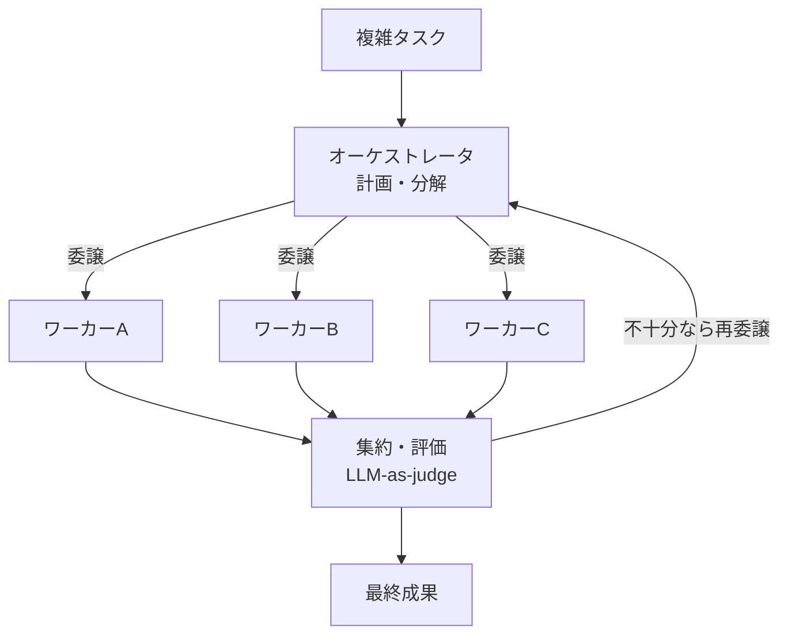

# 複雑タスクを半自動・完全自動で実行する ― マルチエージェント/並列/長時間の技術（Claude・OpenAI中心）

> STATUS: INFO / CATEGORY: research / TOPIC: AGENT / 作成日: 2026-07-19（情報は 2026-07 時点。SDK/仕様は変わるため公式で最終確認）
> 生成AI/AIエージェントで **複雑なタスクを「半自動（HITL）」または「完全自動」で実行**するための技術を、Anthropic（Claude）と OpenAI を中心に、**①マルチエージェント ②マルチタスク ③並列 ④長時間** の4観点で整理します。専門用語は綴りと意味をセットで補足します。

---

## 1. TL;DR

- **マルチエージェント**の主流は **オーケストレータ–ワーカー（orchestrator-worker）** 型。親エージェントが計画し、**専門サブエージェントに並列委譲**する（Anthropic の Research システムがこの構成）。
- **並列**でスループットは上がるが、**整合性・重複・コスト**の管理が要る。**長時間タスク**は チェックポイント/再開・状態永続化・監視・失敗回復が肝。
- **半自動（HITL）と完全自動（無人）は使い分け**る。不可逆・外部影響・高コストは**承認ゲート（HITL）**、定型・低リスクは自動化。

---

## 2. 用語（綴り＋意味）

| 用語 | 綴り | 意味 |
|---|---|---|
| オーケストレータ | orchestrator | 全体を計画・統括し、作業を割り振る親エージェント。 |
| ワーカー/サブエージェント | worker / subagent | 割り当てられた部分課題を実行する子エージェント。 |
| ハンドオフ | handoff | あるエージェントから別エージェントへ制御・文脈を引き継ぐこと（OpenAI Agents SDK の中核概念）。 |
| タスク分解 | task decomposition / planning | 大タスクを実行可能な小タスクに分ける計画工程。 |
| ファンアウト/イン | fan-out / fan-in | 並列に分岐（out）し、結果を集約（in）するパターン。 |
| LLM-as-judge | LLM as a judge | 出力の良否を別のLLMに評価させる手法。 |
| 長時間タスク | long-horizon | 多ステップ・長時間の自律実行。 |
| HITL | Human-in-the-Loop | 人間が承認・介在する仕組み（半自動）。 |

---

## 3. ①マルチエージェント（役割分担とオーケストレーション）

- **オーケストレータ–ワーカー型**: 親（lead）が課題を分析し、**専門サブエージェントを動的に生成・並列委譲**。Anthropic は自社 Research 機能をこの構成で構築（親が調整、子が並列で調査）。
- **Anthropic の提供**: **Claude Agent SDK**（Claude Code と同じツール・エージェントループ・コンテキスト管理を Python/TS で使える）、**Managed Agents / Multiagent orchestration**（マネージド版・メモリストア等）。パターン集は claude-cookbooks の `orchestrator_workers` 等。
- **OpenAI の提供**: 実験的 **Swarm** → 正式 **Agents SDK** へ。中核プリミティブは **agents / handoffs / guardrails / sessions**。エージェント間の**ハンドオフ**で協調を表現。
- **協調・品質**: **LLM-as-judge** や maker/checker（作る役と検証役の分離）で、自己採点の甘さを補正。

---

## 4. ②マルチタスク（1エージェントで複数課題）

- **計画と分解（planning / decomposition）**: ゴールを小タスク列に分け、順に実行。
- **ツール使用**: ファイル操作・コマンド・検索等をツールとして呼び、外界と相互作用。
- **コンテキスト/メモリ管理**: 文脈が肥大（context rot）しないよう、要約・外部メモリ（メモリストア）で状態を持ち越す。

---

## 5. ③並列タスク（スループットと整合性）

- **ファンアウト/ファンイン**: 独立サブタスクを並列に投げ、結果を集約。調査・大量ファイル読み等に有効。
- **同時ツール呼び出し**: 依存の無いツールは1ターンで並行実行。
- **トレードオフ**: 速いが **重複・競合・コスト増**のリスク。**原子的なタスク割り当て（二重取得防止）** と **書き込みの整合性（冪等・排他）** が必須。並列度に上限を設けて安定運用する。

> 注意: 並列化は「速さ」と引き換えに「競合管理」を要求する。共有リソース（DB・ファイル・リポジトリ）への書き込みは**排他制御・原子的クレーム**で守る。

---

## 6. ④長時間タスク（long-horizon・自律実行）

- **チェックポイント/再開**: 途中状態を保存し、失敗・中断から再開できるように。
- **状態永続化**: 進捗・記憶を外部ストア（DB/メモリストア）に保存。
- **監視と失敗回復**: 進捗・異常を監視し、リトライ/ロールバック。**無進捗検知・ステップ上限・コスト予算**で暴走を止める。
- **コスト/トークン最適化**: 不要な文脈を渡さない、要約、モデルの使い分け。

---

## 7. 半自動（HITL）と完全自動（無人）の使い分け

| 観点 | 半自動（HITL） | 完全自動（無人） |
|---|---|---|
| 適する対象 | 不可逆・外部影響・高コスト・曖昧 | 定型・低リスク・可逆 |
| 安全性 | 高（人が承認） | 承認ゲートが無い分、設計で守る |
| 速度/コスト | 人待ちで遅い | 速いが暴走リスク |
| 設計の肝 | 承認ゲート・差し戻し | ガードレール・停止条件・監査ログ |

> 原則: 「**外部送信・本番反映・課金・権限昇格**は HITL」「**低リスクの反復は自動**」。完全自動でも、停止条件・監査ログ・ロールバックを必ず備える。

---

## 8. 本サーバ（サブエージェント/cron/タスクボードを持つ基盤）への適用

- **オーケストレータ–ワーカーの写像**: 親（統括）がタスクボードの承認済みタスクを**サブエージェントに委譲**して並列処理する構成が、そのまま当てはまる。
- **半自動の徹底**: タスクは「承認（queued）」を経てから実行＝**承認ゲート**。外部push等はHITL/常設承認の範囲で。
- **並列の安全化（要注意）**: 複数ワーカーで同じタスクを二重取得しないよう **原子的クレーム**、共有リポへの書き込みは**逐次/排他**で競合回避。並列度に上限。
- **長時間対策**: 状態はDBに永続化、失敗時は差し戻し、監査ログと着手前バックアップで復旧可能に。
- **注記**: これらの並列・自律実行の恒久導入は設計・安全検証（原子的クレーム／セッション種別のツール可用性／二重起動防止）を要する検討事項として管理するのが望ましい。

---

## 9. 参考（出典・一次情報優先／2026-07 時点）

- Anthropic — How we built our multi-agent research system: <https://www.anthropic.com/engineering/multi-agent-research-system>
- Claude Docs — Agent SDK overview: <https://code.claude.com/docs/en/agent-sdk/overview>
- Claude Platform Docs — Multiagent orchestration（Managed Agents）: <https://platform.claude.com/docs/en/managed-agents/multiagent-orchestration>
- Anthropic Cookbooks — orchestrator_workers パターン: <https://github.com/anthropics/claude-cookbooks/blob/main/patterns/agents/orchestrator_workers.ipynb>
- OpenAI — Agents SDK（Swarm の後継・handoffs/guardrails 等）: <https://openai.github.io/openai-agents-python/>

> 注記: SDK・API（ベータヘッダ等）は頻繁に更新される。実装前に各公式ドキュメントの最新版を必ず確認すること。本書は概念と設計指針の整理を目的とする。

---

## Author and Ownership / 著作権と所属について

This project was created as a personal initiative and is not connected to any organization or group.
It is published as an individual creative work.

本プロジェクトは個人の活動として作成したものであり、特定の組織や団体の業務とは関係ありません。
個人の創作物として公開しています。
