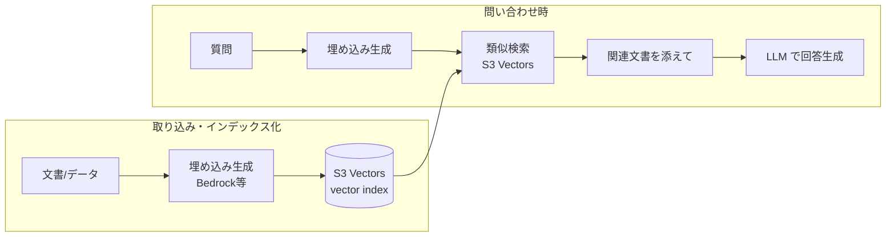

# Amazon S3 Vectors で作る「月額ほぼゼロ」の RAG ― 仕組み・コスト・使いどころ

> STATUS: INFO / CATEGORY: research / TOPIC: AWS / 作成日: 2026-07-19（情報は 2026-07 時点。料金・仕様は変わるため必ず AWS 公式で最終確認）
> **Amazon S3 Vectors** を使った **RAG（Retrieval Augmented Generation＝検索拡張生成）** を、仕組み・なぜ安いか・従来ベクトルDBとの違い・使いどころまで、初心者にも分かるように整理します。専門用語は綴りと意味をセットで補足します。

---

## 1. TL;DR

- **Amazon S3 Vectors** ＝ オブジェクトストレージ S3 に **ベクトル（埋め込み）をそのまま保存・検索**できる、AWS が **2025年7月** に投入した新機能。**「ネイティブにベクトルを扱える初のクラウドオブジェクトストア」**。
- **強み＝コスト**: 常時起動のクラスタ（OpenSearch/Pinecone等）が要らず、**保存＋クエリの従量課金**だけ。AWS は従来型ベクトルDB比で **最大90%のコスト削減** をうたう。個人・低トラフィックRAGなら **月額ほぼゼロ** に近づく。
- **トレードオフ**: 低頻度クエリで**サブ秒**、高頻度でも**最低100ms程度**の遅延。**常時高スループット・超低レイテンシ用途には不向き**。「安くて十分速い」を割り切れる用途に最適。

---

## 2. 用語（綴り＋意味）

| 用語 | 綴り | 意味 |
|---|---|---|
| RAG | Retrieval Augmented Generation | 外部知識を検索して LLM の回答に使う手法。ハルシネーション低減・最新情報反映。 |
| 埋め込み | Embedding | テキスト等を数百〜数千次元の数値ベクトルに変換したもの。意味の近さ＝距離で測る。 |
| ベクトル検索 | Vector / Semantic Search | 意味が近いベクトルを類似度で探す検索。 |
| S3 Vectors | S3 Vectors | S3 上にベクトルを保存・検索できる機能。vector bucket / vector index を使う。 |
| vector bucket | vector bucket | ベクトル専用のS3バケット種別。 |
| ベクトルDB | Vector Database | 埋め込みを格納・検索する専用DB（Pinecone/OpenSearch/pgvector等）。 |

---

## 3. RAG の仕組みと S3 Vectors の位置づけ

RAG は「**検索して → その結果を添えて生成**」する。S3 Vectors は **格納＋検索（Retrieval）** を担う。

- **担当範囲**: 埋め込みの**保存**と、質問ベクトルに近い文書の**検索**。埋め込み生成（Bedrock等）と回答生成（LLM）は別コンポーネント。

---

## 4. なぜ「月額ほぼゼロ」になるのか（コストの肝）

- **常時起動の計算資源が不要**: 従来のベクトルDB（OpenSearch/Pinecone等）は、検索用の**サーバ/クラスタを常時起動**するため、使っていなくても月額が発生する。
- **S3 Vectors は S3 の従量課金**: **保存量（安いオブジェクトストレージ単価）＋クエリ回数**の従量。アイドル時のコストがほぼ発生しない。
- **個人/低トラフィックに効く**: クエリが**低頻度**なら課金も僅少 → 実質「保存代だけ」に近づき、**月額ほぼゼロ**が成立する。
- AWS 公表: 従来型ベクトルDB比 **最大90%削減**（※用途・クエリ量に依存。高頻度なら差は縮む）。

> 割り切りポイント: 「安い」は**低〜中頻度・レイテンシ許容**が前提。常時大量クエリ・超低遅延が要るなら OpenSearch 等が向く。**S3 Vectors に貯めて、ホットな部分だけ高速層に載せる**ハイブリッドも定石。

---

## 5. 従来ベクトルDBとの比較

| 観点 | S3 Vectors | OpenSearch / Pinecone 等 | pgvector（PostgreSQL） |
|---|---|---|---|
| コスト構造 | 保存＋クエリ従量（アイドル安） | 常時起動クラスタ（固定費大） | DB運用費（既存DBに相乗り可） |
| レイテンシ | 低頻度サブ秒／高頻度〜100ms | 数ms〜（高速） | 中程度 |
| 得意 | 低〜中頻度・大量保存・コスト最優先 | 高頻度・低遅延・大規模検索 | 小規模・既存Postgres活用 |
| 運用 | S3並みにマネージド | クラスタ運用/スケーリング | DB運用 |
| AWS統合 | S3/Bedrock等とネイティブ | 各種連携 | RDS/Aurora |

---

## 6. ユースケース・メリデメ

**向くユースケース**: 個人/小規模のRAGチャットボット、社内ドキュメント検索、セマンティック検索、動画/画像アーカイブ検索、めったに引かれない大量データの意味検索。

**メリット**: 圧倒的な低コスト・S3並みの耐久性/可用性・スケール容易・運用レス。
**デメリット**: 高頻度/超低遅延用途には不利・機能は専用ベクトルDBほど richでない場合がある・新しめの機能ゆえ最新の制限は要確認。

---

## 7. 本サーバ（クラウド上のAIエージェント基盤）への適用視点

- **低コストRAGの受け皿**: エージェントのナレッジ（ドキュメント・過去ログ）を S3 Vectors に貯め、**必要時だけ検索** → 常時課金なしで RAG を持てる。
- **ハイブリッド**: よく引く“ホット”データだけ高速層、それ以外は S3 Vectors に置く二層構成でコストと速度を両立。
- **セキュリティ**: 保存データの暗号化・アクセス制御・**機密は入れない/マスキング**を徹底（本ドキュメントのマスキング規約と同じ原則）。

---

## 8. 参考（出典・一次情報優先／2026-07 時点）

- AWS 公式 — Amazon S3 Vectors（機能ページ）: <https://aws.amazon.com/s3/features/vectors/>
- AWS 公式ドキュメント — Working with S3 Vectors and vector buckets: <https://docs.aws.amazon.com/AmazonS3/latest/userguide/s3-vectors.html>
- AWS re:Post — Amazon S3 Vectors: Use Cases（2025年7月ローンチ・最大90%削減）: <https://www.repost.aws/articles/ARY9EKiGFISfisAyvigDX3lQ/amazon-s3-vectors-revolutionizing-ai-data-storage-with-use-cases>
- 参考記事（Qiita, きっかけ）: 「Amazon S3 Vectors で『月額ほぼゼロの RAG』を作ってみた」 <https://qiita.com/musa_rock/items/d90580d5cbcb8215d6f9>

> 注記: S3 Vectors は 2025年7月ローンチの比較的新しい機能。料金・レイテンシ・制限は変わりうるため、実装前に AWS 公式の最新情報と料金ページを必ず確認すること。コスト試算は自分のクエリ量・データ量で行うこと。

---

## Author and Ownership / 著作権と所属について

This project was created as a personal initiative and is not connected to any organization or group.
It is published as an individual creative work.

本プロジェクトは個人の活動として作成したものであり、特定の組織や団体の業務とは関係ありません。
個人の創作物として公開しています。
