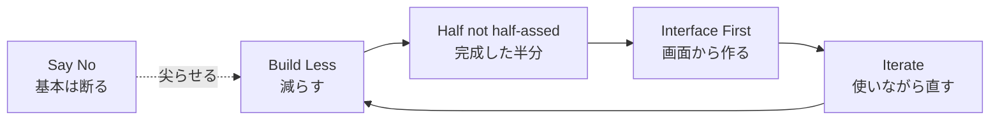

# 『Getting Real』(37signals) ― 小さく・速く・実物で作るための実践ガイド

> 概要: 37signals（現 Basecamp）が2006年に公開した Webアプリ開発の実践論『Getting Real』を、現代の個人開発・小規模プロダクト・意思決定にそのまま使える「行動のルール」に翻訳した実践ノート。分厚いプロセスへのアンチテーゼとして、**少人数・素早く・実物志向**で価値を出す考え方をまとめる。

- **これは何**: 大企業的な重厚な仕様・工程・会議を捨て、**「本当に必要なものだけを、小さく速く作る」**ためのエッセイ集。後の『REWORK』『Shape Up』へと続く 37signals 流の原点。
- **一番の核**: **Build Less（作る量を減らす）**。機能・選択肢・人・会議・約束——すべて「減らす」ほど速く良くなる。
- **対象読者**: 個人開発・小規模チーム・MVPで素早く出したい人。「作りすぎ・決めすぎ・会議しすぎ」で疲れている人。

---

## 1. まず全体像（Getting Real の3つの精神）

1. **Less（減らす）** … 機能もコードも人もプロセスも、少ないほど速く柔軟。
2. **Real（実物で）** … 仕様書や図でなく、**動く画面・本物のインターフェース**で議論する。
3. **Iterate（回す）** … 一発完成を狙わず、小さく出して使いながら直す。

> ポイント: 「立派な計画書」より「動く半分」。**Half a product, not a half-assed product（中途半端な全体より、完成した半分）**。

---

## 2. 実務に効く7つの原則と「今日からの実践」

### ① Build Less ― 作る量を減らす
- **意味**: 機能を足すほど複雑さ・バグ・保守が増える。競合に機能で張り合わない。
- **今日から**: 新機能の前に「これを**やらない**とどうなる？」を問う。要らなければ作らない。

### ② Half, not half-assed ― 完成した半分を出す
- **意味**: 全機能を中途半端に載せるより、**核心機能だけを完成度高く**出す。
- **エンジニア例**: MVP。1つの価値を確実に届け、残りは反応を見て足す（追加のみ）。

### ③ Get Real / Interface First ― 実物・画面から作る
- **意味**: 仕様書やDB設計から始めず、**先に画面（UI）を作る**。UIが仕様そのもの。
- **今日から**: 議論が紛糾したら、口頭でなく**動くモックや画面**を出して決める。

### ④ Epicenter Design ― 中心（震源）から設計する
- **意味**: ページで一番重要な要素（例: ブログなら「本文」）を最初に置き、周辺は後回し。
- **今日から**: 画面/資料は「主役は何か」を決め、そこから外側へ組み立てる。

### ⑤ Say No by default ― 基本は「No」
- **意味**: 機能要望は基本断る。本当に必要なものだけ通す。断る勇気が製品を尖らせる。
- **今日から**: 要望が来たら即YESせず「なぜ必要か」を一度問い返す。

### ⑥ 少人数・短期・仕様より動くもの
- **意味**: 小さいチーム、短いサイクル、分厚い仕様書より**動くプロトタイプ**。会議・見積り・遠い未来の計画を最小化。
- **今日から**: 1〜2週間で「見せられる何か」を必ず作る区切りにする。

### ⑦ It's a problem when it's a problem ― 問題になってから解く
- **意味**: 起きてもいないスケール問題・将来要件を先回りしすぎない（過剰設計を避ける）。
- **エンジニア例**: 「10万ユーザー来たら…」の作り込みより、まず動かして必要になってから対処。

---

## 3. 現代（2026）から見た評価

**今なお有効**:
- MVP・リーン・アジャイルの実務思想を、平易な言葉で先取りしていた。個人開発・小規模SaaSには特に効く。
- 生成AI時代の「小さく速く出して反復」（プロトタイプ→検証→改善）とも相性が良い。

**古くなった／注意点**:
- 「ドキュメントは最小限」は、**チーム拡大・引き継ぎ・規制対応**では通用しにくい（属人化リスク）。
- セキュリティ・アクセシビリティ・テストなど「後回しにできない領域」は、当時より重みが増している。
- 「Say No」は強力だが、**顧客の本質ニーズを切り捨てる**方向に振れすぎないバランスが要る。

---

## 4. 個人開発／本プロジェクトへの適用視点

- **追加のみ・最小構成**: 「Build Less」「Half not half-assed」は、機能を既存に足す形で最小実装し、デグレを避ける方針とそのまま一致する。
- **実物優先**: 仕様の口論より、動く画面・プロトタイプ（spike）で判断する。
- **Say No**: 要望をすべて実装せず、価値の高い一点に集中する（選択と集中）。
- **問題になってから**: 過剰な将来対応より、まず動かして必要時に拡張。

> まとめ: Getting Real は「**やらないことを決める技術**」。速さは機能追加でなく**引き算**から生まれる。

---

## 5. 参考（出典）

- 37signals — *Getting Real*（オンライン公開版・書籍情報）: <https://basecamp.com/gettingreal>
- 37signals — *REWORK*（続編的な経営・仕事論）: <https://basecamp.com/books/rework>
- 37signals — *Shape Up*（開発プロセスの体系化・無料公開）: <https://basecamp.com/shapeup>

> 注記: 『Getting Real』は 2006 年の公開物で、以後 37signals の思想は『REWORK』『Shape Up』へ発展した。原則の背景は上記一次情報を参照。本ドキュメントは要点の理解と現代への応用を目的とする。

---

## Author and Ownership / 著作権と所属について

This project was created as a personal initiative and is not connected to any organization or group.
It is published as an individual creative work.

本プロジェクトは個人の活動として作成したものであり、特定の組織や団体の業務とは関係ありません。
個人の創作物として公開しています。
