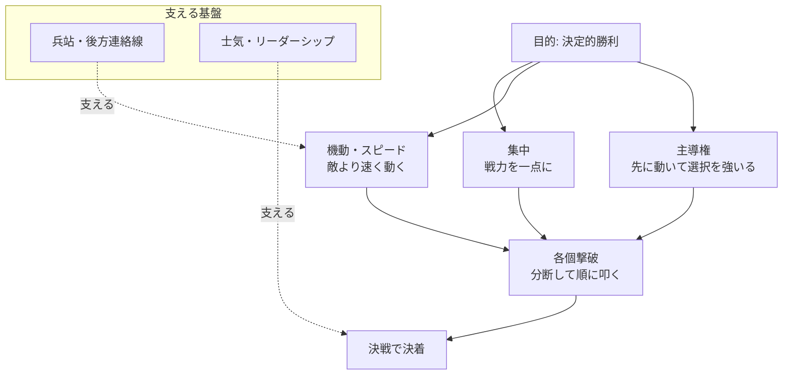

# ナポレオンの戦略・戦術 ― 『戦訓（Maxims of War）』を現代の意思決定に使う実践ガイド

> 概要: ナポレオン・ボナパルトが遺した軍事の原理原則（『ナポレオン戦訓 / The Military Maxims of Napoleon』）を、現代の仕事・プロジェクト・キャリアの意思決定に使える「行動のルール」に翻訳した実践ノート。戦史の解説だけでなく「今日から何をするか」まで落とし込む。既存の CLASSICS 系（孫子・貞観政要・三大戒律）と同じトーンで整理する。

- **これは何**: 19世紀初頭、フランス皇帝ナポレオン1世の膨大な実戦経験から抽出された、約78条の軍事箴言集。後世に『士官必携（The Officer's Manual）』として英訳・普及した。
- **一番の核**: **「戦力の集中（Concentration）」と「機動（Mobility）」で、決定的な地点・時間に相対的な優位を作る**。数で劣っても、一点に集中して各個撃破すれば勝てる。
- **対象読者**: 限られたリソースで成果を出したいエンジニア・リーダー・転職活動中の人。「選択と集中」「スピード」「主導権」を実務に効かせたい人。

---

## 1. まず全体像（ナポレオン用兵の3本柱）

孫子が「戦わずして勝つ」なら、ナポレオンは **「戦うなら、勝てる形を作ってから一点突破で決着をつける」**。核は次の3つ。

1. **集中（Concentration）** … 兵力を分散させず、決定的な地点に最大戦力を投入する。
2. **機動とスピード（Mobility / Speed）** … 敵より速く動き、主導権（イニシアチブ）を握る。「時間は取り返せない」。
3. **各個撃破（Defeat in Detail）** … 敵をまとめて相手にせず、分断して一部ずつ叩く。内線作戦（central position）で敵の中央に位置し、左右の敵が合流する前に順に撃破する。

---

## 2. 実務に効く6つの原理と「今日からの実践」

### ① 戦力の集中 ― 「弱くても、その場で強ければ勝てる」
- **意味**: 全体で劣勢でも、**決定的な地点で相対的に優勢**を作れば勝てる。戦力を薄く広げるのは最悪。
- **仕事**: リソース（人・時間・注意）を最重要の1点に集中する。並行で全部やろうとして全部中途半端、を避ける。
- **今日から**: ToDo を3つに絞り、最重要の1つに午前の全力を割く。
- **キャリア（転職）**: 応募を広げすぎず、**本命（Tier S）に対策を集中**する（＝各社個別最適化）。

### ② スピードと主導権 ― 「時間だけは取り返せない」
- **意味**: ナポレオンは行軍速度で敵の意表を突き、主導権を握った。「失った時間は二度と戻らない」。
- **仕事**: 完璧な計画より**速い着手と反復**。先に動いて相手に選択を強いる。
- **エンジニア例**: 小さく出して検証（MVP・追加のみ）→ フィードバックで修正回数を稼ぐ。
- **今日から**: 迷ったら「まず15分で最小の一歩」を踏む。

### ③ 各個撃破・内線作戦 ― 「敵をまとめて相手にしない」
- **意味**: 分断された敵の一部を、他が来る前に順に叩く。中央に陣取り内側の短い距離で動く（内線）。
- **仕事**: 大きな問題は**分解して1つずつ**。全部同時に抱えて共倒れしない。
- **今日から**: 大タスクを「今日倒す1個」に割り、それだけ確実に片付ける。

### ④ 事前計算と偵察 ― 「即興は、準備した者だけに許される」
- **意味**: ナポレオンは緻密な計画と地形・敵情の把握を重視した。戦場での臨機応変は**周到な準備の裏返し**。
- **仕事**: 会議・交渉・障害対応の前に、想定シナリオと分岐を用意しておく。
- **今日から**: 重要判断の前に「起こりうる3パターンと対応」を1枚にメモ。

### ⑤ 兵站・後方連絡線 ― 「軍隊は胃袋で行進する」
- **意味**: 補給と連絡線（logistics）が続かなければ、どんな快進撃も止まる（ロシア遠征の教訓）。
- **仕事**: 派手な成果の裏で、**継続性（体力・資金・仕組み・ドキュメント）**を切らさない。
- **今日から**: 短距離ダッシュで燃え尽きない。持続可能なペースと「補給線」を確保する。

### ⑥ 士気とリーダーシップ ― 「精神は物質に3倍する」
- **意味**: ナポレオンは「戦争では精神的要素が物量の3対1で効く」とした。士気・信頼・目的意識が戦力を倍化する。
- **仕事**: チームの納得感・目的の共有が、スペックより結果を左右する。
- **今日から**: メンバー（自分自身も）に「なぜやるか」を一言で言える状態にする。

---

## 3. 主要戦術（用兵のディテール）

- **縦隊と横隊の使い分け**: 突破・機動には縦隊（colonne）、火力の展開には横隊（ligne）。状況で切り替える。
- **砲兵の集中運用（Grand Battery）**: 砲を分散させず一箇所に集め、決定的地点に火力を叩き込む（＝①集中の火力版）。
- **諸兵科連合**: 歩兵・騎兵・砲兵を組み合わせて弱点を補い合う軍団（corps）編制で、単独では出せない効果を生む。
- **機動による包囲・迂回**: 正面から押さず、側面・後方へ回る。実例=**ウルム（1805, 機動包囲で無血に近い勝利）**、**アウステルリッツ（1805, わざと右翼を弱く見せ敵を誘引し中央突破＝“三帝会戦”）**、**イエナ／アウエルシュタット（1806）**。

---

## 4. 影響と評価（軍事思想史の中で）

- **クラウゼヴィッツ『戦争論』**: ナポレオン戦争を分析し、「決戦志向」「重心（Schwerpunkt）」「摩擦」などの概念を体系化。ナポレオンの実践を理論へ昇華した。
- **ジョミニ『戦争概論』**: 内線作戦・決定的地点への集中を原則として整理。より“原理・幾何学的”にナポレオン用兵を法則化した。
- **近代への継承**: 集中・機動・主導権・諸兵科連合という考え方は、その後の作戦術（電撃戦や機動戦）やビジネス戦略の「選択と集中」に受け継がれた。

> 注意（現代視点）: ナポレオンは天才的だが、**決戦志向・過剰拡張（ロシア遠征）で自滅**した面もある。「集中と機動」は強力だが、**兵站と持続性を無視すると破綻する**。原理は使いつつ、限界も学ぶのが古典の正しい活かし方。

---

## 5. ビジネス／キャリアへの転用（1枚まとめ）

| ナポレオンの原理 | 現代の言い換え | 実務での使い方 |
|---|---|---|
| 集中 | 選択と集中 | 最重要の1点にリソースを寄せる |
| 機動・スピード | アジャイル／主導権 | 速く着手し反復、先手で選択を強いる |
| 各個撃破 | 分割統治 | 大問題を分解し1つずつ倒す |
| 事前計算 | 準備・シナリオ設計 | 分岐と対応を先に用意 |
| 兵站 | 持続可能性 | 体力・資金・仕組みを切らさない |
| 士気 | エンゲージメント | 「なぜやるか」を共有し納得で動く |

---

## 6. 参考（出典・パブリックドメイン優先）

- Project Gutenberg — *The Officer's Manual: Napoleon's Maxims of War*（Napoleon Bonaparte, 英訳・パブリックドメイン）: <https://www.gutenberg.org/ebooks/50750>
- Internet Archive（同書スキャン・関連資料）: <https://archive.org/>
- クラウゼヴィッツ『戦争論（Vom Kriege / On War）』（軍事思想の古典・各種パブリックドメイン版あり）
- ジョミニ『戦争概論（The Art of War）』（内線作戦・決定的地点の原則）

> 注記: ナポレオン戦訓の条数・訳は版により異なる。本ドキュメントは原理原則の理解と現代への応用を目的とし、原文の逐語引用は最小限とした。正確な条文はパブリックドメイン原文（上記 Gutenberg 版）を参照。

---

## Author and Ownership / 著作権と所属について

This project was created as a personal initiative and is not connected to any organization or group.
It is published as an individual creative work.

本プロジェクトは個人の活動として作成したものであり、特定の組織や団体の業務とは関係ありません。
個人の創作物として公開しています。
