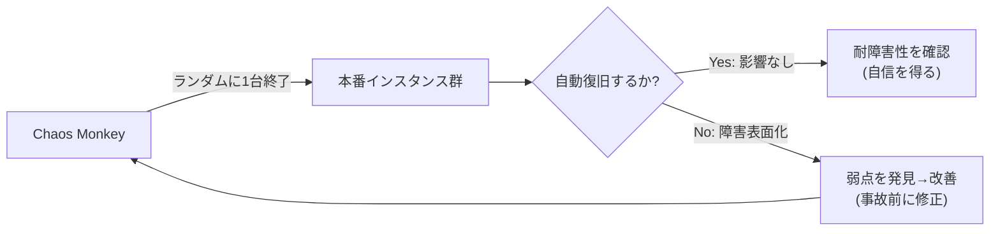
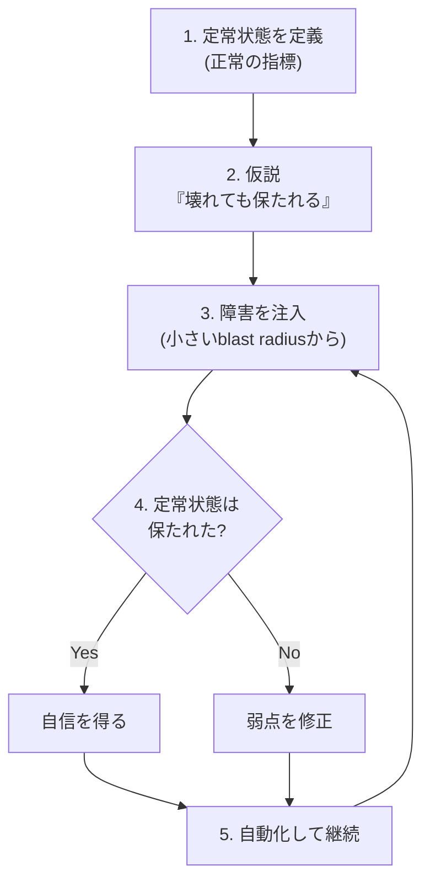

# Netflix「Chaos Monkey」調査 — 本番を"わざと壊して"鍛えるカオスエンジニアリング

> 種別: INFO（記録・参考）／TOPIC: CHAOS（技術リサーチ）／作成日: 2026-07-20
> 対象読者: 分散システム/クラウドの耐障害性・信頼性に関心のあるエンジニア（初心者にも分かるよう用語を補足）。
> 一次情報（Netflix 公式リポジトリ/サイト）を基点に整理。実導入時は末尾「参考リンク」を確認。

---

## 0. 3行サマリ

- **Chaos Monkey** は Netflix 製の**耐障害性ツール**。**本番環境のサーバ（インスタンス）をランダムに強制終了**し、「1台落ちても平気なシステム」をエンジニアに強制的に作らせる。
- 発想の転換: 「障害は起きないようにする」ではなく「**障害は必ず起きる前提で、平時から小さく起こして備える**」。これが**カオスエンジニアリング**の始まり。
- 単体ツールを超え、**Simian Army（一群のツール）→ カオスエンジニアリングという規律**へ発展。現行OSS版は Netflix の CD 基盤 **Spinnaker と統合**（Go 製）。

---

## 1. Chaos Monkey とは

- **定義**: 本番システムでインスタンスを**意図的・ランダムに終了**させ、各サービスが「単一障害に耐える」ように設計されているかを継続検証するツール。
- **名前の由来**: 「データセンターに**猿を放って**ケーブルを引き抜かせるようなもの」という比喩。予測不能な障害を日常的に注入する。
- **狙い**: 障害を"例外イベント"にしない。**しょっちゅう起こることで、耐障害性を"当たり前の常態"にする**。「痛いなら、もっと頻繁にやれ（そして自動化しろ）」という発想。

---

## 2. 誕生の背景

- 2010〜2011年頃、Netflix が自社データセンターから **AWS クラウドへ大規模移行**する中で誕生。
- クラウドでは「インスタンスはいつでも壊れうる（=使い捨て前提）」。ならば**その現実を平時に再現して耐性を確認**しよう、という動機。
- **2011年7月から本番で継続稼働**。以後、Netflix の高可用性文化の象徴となり、業界標準の実践「カオスエンジニアリング」を生んだ。

---

## 3. 何をするのか（動作）

- 対象グループの中から**インスタンスを1つランダムに選び、強制終了**する（主に業務時間帯に実施＝人が対応できる時間に、あえて起こす）。
- 期待する反応: **オートスケーリングや冗長構成が自動で穴を埋め、ユーザー影響ゼロ**で回復する。
- もし障害が表面化したら、それは**"事故が起きる前に見つかった弱点"**。改善して次はもっと強くする。

---

## 4. なぜ有効か（設計思想）

- **"止まらないシステム"は、止められて初めて証明できる**。テスト環境で「たぶん大丈夫」ではなく、本番に近い形で**実証**する。
- 平時に小さく壊すことで、**大規模障害（本物のAWS障害等）が来ても動じない**組織・設計になる。
- 副次効果: エンジニアが最初から「**単一障害点(SPOF)を作らない**」「フェイルオーバー前提で設計する」文化を持つようになる。

---

## 5. Simian Army（シミアン・アーミー＝猿の軍団）

Chaos Monkey は**"猿の軍団"の一員**。各"猿"が別の障害・不整合を担当した（多くは後に Spinnaker 等へ機能吸収・整理）。

- **Chaos Monkey**: インスタンスをランダム終了（本記事の主役）。
- **Chaos Gorilla（ゴリラ）**: **アベイラビリティゾーン(AZ)まるごと**の障害を模擬（より大きな停電）。
- **Chaos Kong（コング）**: **リージョン全体**の障害を模擬（最大規模の実験）。
- **Latency Monkey**: 通信に**遅延やエラー**を注入（依存先の劣化を再現）。
- **Conformity Monkey**: ベストプラクティスに**準拠していないインスタンス**を検出。
- **Janitor Monkey**: **不要リソースの掃除**（コスト/散らかり対策）。
- **Security Monkey**: セキュリティ設定の不備を検出。
- **Doctor Monkey / 10-18 Monkey**: ヘルスチェック、国際化(l10n/i18n)の問題検出 など。

> ポイント: 「小さな障害＝Monkey → AZ障害＝Gorilla → リージョン障害＝Kong」と、**影響範囲(blast radius)を段階的に拡大**して耐性を試す設計になっている。

---

## 6. 現行 OSS 版のアーキテクチャ

- **Spinnaker（Netflix のCD＝継続的デリバリ基盤）と完全統合**。アプリを Spinnaker で管理していることが前提。
- **対応バックエンド**: Spinnaker が対応するもの（**AWS・Google Compute Engine・Azure・Kubernetes・Cloud Foundry**）。実績は AWS と Kubernetes。
- **実装**: Go 製。CLI で操作し、終了スケジュール・頻度・対象・除外を設定。設定は**「平均何営業日に1回終了」**のような頻度（mean time between terminations）で管理。
- 主要構成: CLI／設定システム／Spinnaker API クライアント／終了実行エンジン／監査ログ用DB。

---

## 7. カオスエンジニアリングの原則（Chaos Monkey が生んだ規律）

> カオスエンジニアリング＝「システムが乱調に耐えられるという**確信を得るために、本番で実験する規律**」。デタラメに壊すのではなく**科学的手法**。

進め方（実験サイクル）:
1. **定常状態（steady state）を定義**: 「正常」を表す指標を決める（例: 注文成功率99.9%、p95レイテンシ200ms）。ビジネス指標が望ましい。
2. **仮説を立てる**: 「1台落ちても定常状態は保たれるはず」。
3. **現実の障害を注入**: インスタンス終了・遅延・CPU負荷・ネットワーク断など。
4. **測定して検証**: 定常状態が保たれたか？ 崩れたら**弱点発見→修正**。保たれたら**自信を得る**。
5. **自動化して継続**: 一度きりでなく、CI/CDや定期実行で回し続ける。

重要な安全原則:
- **影響範囲(blast radius)を最小化**: 最初は1台・少数トラフィックなど**小さく**始め、自信がついたら広げる（Monkey→Gorilla→Kong の発想）。
- **停止スイッチ**: 異常時に即座に実験を止められること。
- **GameDay（ゲームデー）**: チームで日時を決め、**計画的に障害を起こして対応訓練**する演習。

---

## 8. 使いどころ・前提・注意点

- **前提（これが無いと"ただの破壊"）**: 冗長化・オートスケール・フェイルオーバー・監視が**先に**あること。土台なしに本番で回すのは危険。
- **段階導入**: まず**非本番/ステージング**で試し、blast radius を絞って本番へ。営業時間帯（人が対応できる時間）に実施。
- **可観測性が必須**: 定常状態を測る監視（メトリクス/ログ/トレース）が無いと「壊れたか」を判断できない。
- **組織の合意**: 「本番を壊す」ことへの理解・オンコール体制・ロールバック手段をセットで。
- **Chaos Monkey 特有**: 現行OSS版は **Spinnaker 必須**。Spinnaker を使っていない場合は後述の代替ツールが現実的。

---

## 9. 関連・代替ツール（2026年時点）

- **Gremlin**: 商用のカオスエンジニアリングSaaS。多様な障害注入・安全機構・GUIが充実。
- **LitmusChaos**: Kubernetes向けOSS（CNCFプロジェクト）。宣言的にカオス実験を定義。
- **Chaos Mesh**: Kubernetes向けOSS（CNCF）。ネットワーク/Pod/IO障害など豊富。
- **AWS Fault Injection Service（FIS）**: AWSマネージドの障害注入サービス。
- **Azure Chaos Studio**: Azureのマネージド版。
- **Chaos Toolkit**: ベンダー中立のOSSフレームワーク（実験をJSON/YAMLで定義）。

> 選び方の目安: **Kubernetes中心なら LitmusChaos / Chaos Mesh**、**クラウドマネージドで手軽に始めるなら AWS FIS / Azure Chaos Studio**、**手厚い商用サポートなら Gremlin**。

---

## 10. 導入の第一歩（おすすめ順）

1. **監視（定常状態の指標）を整える**。まず"正常"を測れるように。
2. **冗長化・自動復旧**を用意（落ちても直る土台）。
3. **非本番で1台終了**の小さな実験から。仮説→注入→検証を回す。
4. **GameDay** をチームで実施し、対応手順・オンコールを鍛える。
5. 自信がついたら**本番で blast radius を絞って**、徐々に自動・継続化。

---

## 11. まとめ

- Chaos Monkey は「**障害を避ける**」から「**障害を飼いならす**」への発想転換を象徴するツール。
- 本質はツールそのものより、**"本番で小さく壊して確信を得る"というカオスエンジニアリングの規律**にある。
- 前提（冗長化・監視・体制）を整えた上で、**小さく始めて継続**するのが成功の鍵。前段の「耐障害性・信頼性」を"実証"する強力な手段。

---

## 12. 参考リンク（公式・一次情報）

- Chaos Monkey 公式サイト: https://netflix.github.io/chaosmonkey/
- Chaos Monkey リポジトリ（Netflix/chaosmonkey・Go）: https://github.com/Netflix/chaosmonkey
- Netflix OSS センター: https://netflix.github.io/
- Simian Army（アーカイブ）: https://github.com/Netflix/SimianArmy
- Spinnaker（CD基盤）: https://spinnaker.io/
- Principles of Chaos Engineering: https://principlesofchaos.org/
- 関連: LitmusChaos https://litmuschaos.io/ ／ Chaos Mesh https://chaos-mesh.org/ ／ AWS FIS https://aws.amazon.com/fis/ ／ Gremlin https://www.gremlin.com/

---

### 付記（本ドキュメントの位置づけ）
- 種別 INFO（記録・参考）。技術リサーチとして `/info` の「🔬技術リサーチ」に分類される想定（TOPIC=CHAOS は未登録＝既定カテゴリ）。
- 事実・構成は 2026-07-20 時点の公式情報に基づく。ツールの対応状況は各公式ドキュメントで最終確認。
