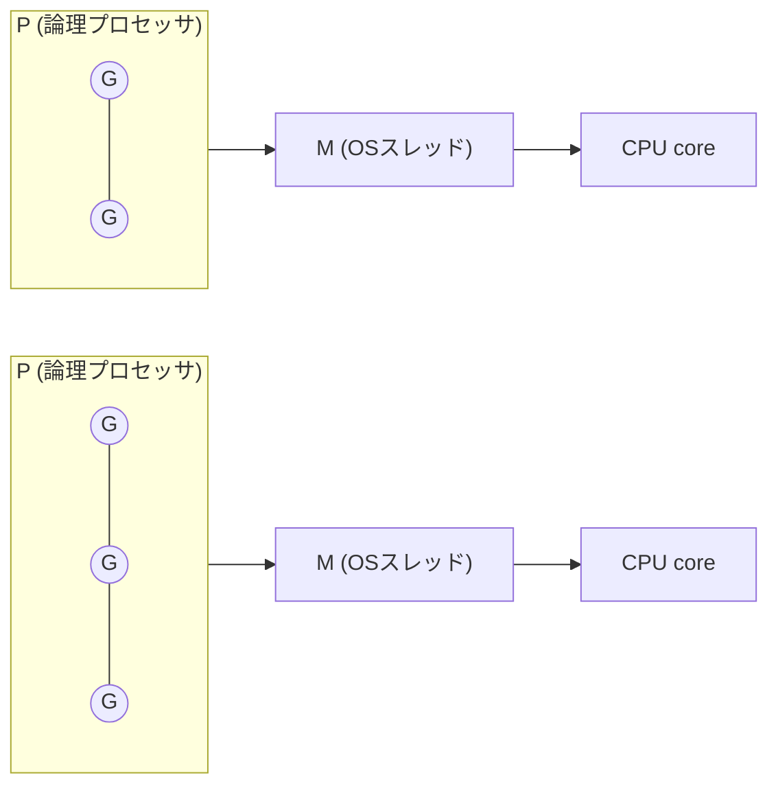
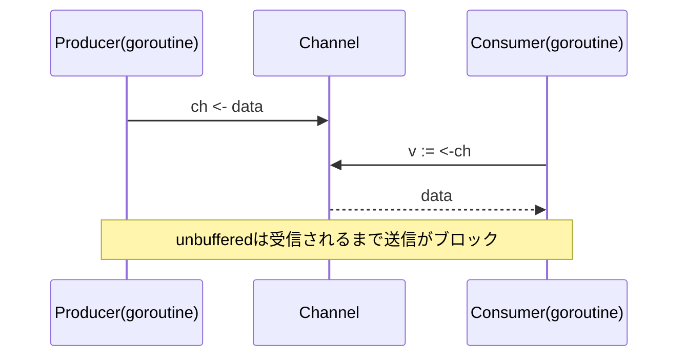
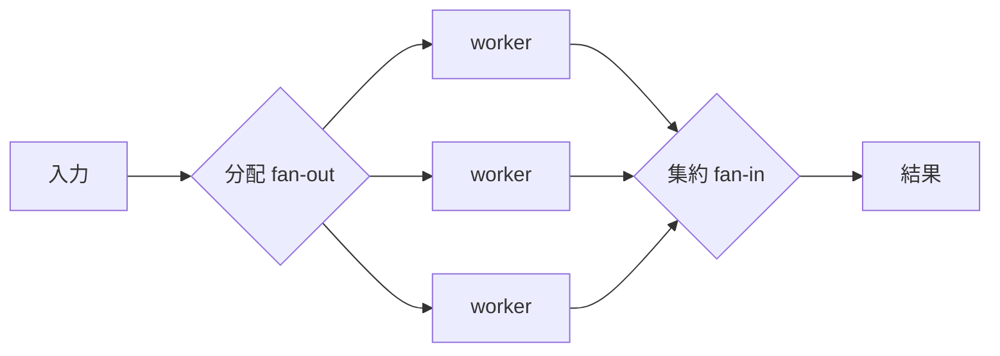

# Go言語 技術書調査 — 効率的なGo（Effective Go）と 並行処理（Concurrency in Go）

> 種別: INFO（記録・参考）／TOPIC: GO（技術リサーチ）／作成日: 2026-07-20
> 対象読者: Go を実務で書く/学ぶエンジニア（初心者にも分かるよう用語を補足）。
> 構成: **Part A「効率的なGo」**（イディオム＝Goらしい書き方）＋**Part B「Goの並行処理」**（goroutine/channel/並行パターン）。
> 一次情報（公式 go.dev）を基点に整理。コードは Go 1.22+ の言語仕様を前提。

---

## 0. 3行サマリ

- **Go は「シンプルさ・並行処理・高速なコンパイル」を軸にした静的型付け言語**。標準ツール（`gofmt`/`go test`/`-race`）が強力で、"書き方が一つに収束"しやすい。
- **効率的なGo（Effective Go）** の核心は、①`gofmt`準拠の統一フォーマット ②`error`を値として明示的に扱う ③**小さなインターフェース**と**ゼロ値の活用** ④無駄なアロケーションを避ける、といった**イディオム**。
- **並行処理**は **goroutine（軽量スレッド）＋ channel（通信路）** が主役。哲学は「**メモリ共有で通信するな、通信でメモリを共有せよ**」。`select`/`sync`/`context` と定番パターン（worker pool・fan-out/in・pipeline）で堅牢に組む。

> 最新版: **Go 1.26（2026年2月リリース）**。Go は**最新2メジャー版**（現行 1.26 と 1.25）をサポート。Go 1.25 で並行処理の書き味を改善する `WaitGroup.Go` と `testing/synctest`（安定化）が入った。

---

## 1. Go とは（前提）

- 2009年に Google が公開。静的型付け・コンパイル型・GC（ガベージコレクション）あり。
- 設計思想は**シンプルさ**（言語機能を絞る）・**明示性**（暗黙を嫌う）・**並行処理を言語機能として組込み**。
- 標準の**フォーマッタ `gofmt`** が事実上唯一のスタイルを強制 → コードレビューで「書式」を議論しない文化。
- 代表用途: **サーバ/API・CLI・クラウド基盤（Docker/Kubernetes/Terraform 等は Go 製）**・ネットワークミドルウェア。

---

# Part A. 効率的なGo（Effective Go / イディオム）

> 出典の中心は公式 "Effective Go"。以下は特に効いてくる要点。

## A-1. フォーマットと命名

- **`gofmt`（`go fmt`）に任せる**。インデント・改行・整列は自動。手で整えない。
- 命名は**短く・文脈依存**。公開は**大文字始まり（exported）**、非公開は小文字始まり。
- **MixedCaps**（`CamelCase`）を使い、`snake_case` は使わない。
- 頭字語は大小を揃える（`URL`/`ID` → `ServeHTTP`, `userID`）。
- パッケージ名は短い小文字単数（`http`, `json`）。呼び出し側で `bytes.Buffer` のように読めるように。

## A-2. エラーハンドリング（Goの心臓部）

Go は例外ではなく **`error` を戻り値**として返す。**明示的に扱う**のがイディオム。

```go
f, err := os.Open(name)
if err != nil {
    return fmt.Errorf("設定を開けません %q: %w", name, err) // %w でラップ
}
defer f.Close()
```

- **早期リターン**（`if err != nil { return }`）でネストを浅く保つ。
- **`%w` でラップ**して文脈を足しつつ、原因を保持。
- 判定は `errors.Is(err, ErrNotFound)`（sentinel比較）／`errors.As(err, &target)`（型で取り出し）。
- **握りつぶさない**（`_ = err` を安易にしない）。無視するなら理由をコメント。

## A-3. ゼロ値・データ構造

- **ゼロ値を有効活用**する設計（初期化不要で使える型が良い）。例: `sync.Mutex` や `bytes.Buffer` はゼロ値のまま使える。
- **スライス**は容量を見積もれるなら**事前確保**して再アロケーションを防ぐ:
  ```go
  xs := make([]int, 0, n)   // len=0, cap=n
  for i := 0; i < n; i++ { xs = append(xs, i) }
  ```
- `new(T)` は「ゼロ値の `*T`」、`make` は slice/map/channel の初期化専用。
- **map は必ず `make` かリテラルで初期化**してから書き込む（nil mapへの書込はpanic）。

## A-4. インターフェースは小さく、受け手側で定義

- **小さいインターフェースほど再利用しやすい**（`io.Reader`/`io.Writer` は1メソッド）。
- インターフェースは**それを使う側（consumer）で定義**するのがGo流（提供側が巨大IFを押し付けない）。
- **構造体埋め込み（embedding）** で合成する（継承ではなくコンポジション）。
  ```go
  type ReadWriter interface { io.Reader; io.Writer } // 既存IFを埋め込み合成
  ```
- 「受け取りは具体型、返すのは…」ではなく **"Accept interfaces, return structs"**（引数はIFで柔軟に、戻り値は具体型で明快に）がよく引かれる指針。

## A-5. パフォーマンス/メモリ効率の勘所

- **値 vs ポインタ**: 大きな構造体はポインタで渡す（コピーコスト減）。小さい値はコピーで十分。レシーバは型内で統一。
- **アロケーション削減**: スライス事前確保、`strings.Builder` での文字列連結、使い回しに `sync.Pool`。
- **`defer` は超ホットパスでは注意**（わずかなオーバーヘッド。通常は可読性優先で使ってよい）。
- **計測してから最適化**: `go test -bench` / `pprof`（CPU・メモリプロファイル）/ `-benchmem`。推測で最適化しない。
- 逃げ道解析（escape analysis）: ヒープに逃げる割当は `go build -gcflags=-m` で確認可能。

## A-6. その他のイディオム

- **複数戻り値**（`value, err`）を活用。名前付き戻り値は短い関数で控えめに。
- **`defer` でクリーンアップ**（Close/Unlock）を確実に。
- **panic/recover は例外機構ではない**。回復可能な想定内エラーは `error`、真に異常系のみ panic。
- スライスの共有に注意（`append` が元配列を書き換えることがある）。必要なら `copy`。

---

# Part B. Goの並行処理（Concurrency in Go）

## B-1. 並行(concurrency) と 並列(parallelism)

- **並行**: 複数の処理を"論理的に同時進行"として**構造化**すること（設計の話）。
- **並列**: 実際に複数CPUコアで"物理的に同時実行"すること（実行の話）。
- Goは**並行を言語で書きやすくし**、ランタイムが並列実行へマッピングする（`GOMAXPROCS`）。
- 標語: **"Don't communicate by sharing memory; share memory by communicating."**（メモリ共有で通信するな、通信でメモリを共有せよ）。

## B-2. goroutine（軽量スレッド）

- `go f()` で**goroutine**を起動。OSスレッドより遥かに軽量（初期数KBのスタック、数十万個も可）。
- ランタイムの **GMP スケジューラ**（G=goroutine, M=OSスレッド, P=論理プロセッサ）が多数のGを少数のMへ多重化。



> ⚠️ **goroutine は投げっぱなしにしない**。いつ終わるか・誰が止めるかを設計する（後述のリーク対策）。

## B-3. channel（goroutine間の通信路）

```go
ch := make(chan int)      // unbuffered（送受信が同期＝ランデブー）
ch := make(chan int, 10)  // buffered（容量10まで非同期）

ch <- 42                  // 送信
v := <-ch                 // 受信
close(ch)                 // クローズ（送信側が行う）
for v := range ch {}      // クローズまで受信し続ける
```

- **unbuffered**: 送信は受信されるまでブロック（強い同期）。
- **buffered**: バッファが空くまでブロック。バックプレッシャ制御に使える。
- **クローズは送信側が1回だけ**。受信は `v, ok := <-ch` の `ok=false` で検知。
- 方向つき型 `chan<- T`（送信専用）/`<-chan T`（受信専用）で誤用を防ぐ。



## B-4. select（複数チャネルの多重化）

```go
select {
case v := <-in:
    process(v)
case out <- result:
    // 送信できたとき
case <-ctx.Done():
    return ctx.Err()          // キャンセル/タイムアウト
case <-time.After(time.Second):
    return errTimeout          // タイムアウト
default:
    // どれも準備できていないとき（ノンブロッキング）
}
```

- 複数の準備完了ケースからランダムに1つ実行。**タイムアウト・キャンセル・ノンブロッキング**の要。

## B-5. sync パッケージ（共有状態の同期）

channelが常に最適とは限らない。**単純な共有状態の保護は Mutex が明快**。

- **`sync.WaitGroup`**: 複数goroutineの完了待ち。
  ```go
  var wg sync.WaitGroup
  for _, u := range urls {
      wg.Go(func() { fetch(u) })   // Go 1.25+: Add/Done が不要に
  }
  wg.Wait()
  ```
  （〜1.24の従来形は `wg.Add(1); go func(){ defer wg.Done(); ... }()`）
- **`sync.Mutex` / `RWMutex`**: 排他制御。`defer mu.Unlock()` とセットで。
- **`sync.Once`**: 初期化を一度だけ。
- **`atomic`**（`sync/atomic`）: カウンタ等の軽量なアトミック操作。

## B-6. context（キャンセル・タイムアウト・値の伝播）

サーバやパイプラインでは **`context.Context` を第1引数**で引き回し、キャンセルを**伝播**させるのが定石。

```go
ctx, cancel := context.WithTimeout(ctx, 3*time.Second)
defer cancel()                       // リソース解放（必ず呼ぶ）

req, _ := http.NewRequestWithContext(ctx, "GET", url, nil)
resp, err := http.DefaultClient.Do(req)  // タイムアウトで自動中断
```

- 慣習: `func Do(ctx context.Context, ...)` のように**先頭引数**。
- キャンセルは下流へ伝わる。goroutine側は `select { case <-ctx.Done(): return }` で降りる。

## B-7. 定番の並行パターン

**(1) Worker Pool（ワーカプール）**: 有限のgoroutineでタスクを捌く（並行度を制御）。
```go
jobs := make(chan Job)
results := make(chan Result)
for i := 0; i < numWorkers; i++ {
    go func() { for j := range jobs { results <- do(j) } }()
}
```

**(2) Fan-out / Fan-in**: 1つの入力を複数workerへ分配(fan-out)し、結果を1つに集約(fan-in)。



**(3) Pipeline（パイプライン）**: ステージをchannelで連結（`gen → sq → sum`）。各ステージがgoroutine。

**(4) セマフォ（並行度制限）**: バッファ付きchannel or `golang.org/x/sync/semaphore` で同時実行数を制限。

**(5) errgroup**: `golang.org/x/sync/errgroup` で「複数goroutineを起動し、最初のエラーで全体キャンセル＋全完了待ち」を簡潔に。
```go
g, ctx := errgroup.WithContext(ctx)
for _, u := range urls {
    g.Go(func() error { return fetch(ctx, u) })
}
if err := g.Wait(); err != nil { return err }  // どれか失敗で err
```

## B-8. よくある落とし穴と対策

- **goroutineリーク**: 受信されないchannelへ送ろうとして永久ブロック。→ `context`/クローズで**終了経路を必ず用意**。
- **データ競合（race）**: 共有変数への未同期アクセス。→ **`go test -race` / `go run -race`** で検出（CI必須級）。
- **デッドロック**: unbufferedへ相互に送受信待ち。→ 設計で送受信の対を明確に。
- **ループ変数キャプチャ**: **Go 1.22 で各イテレーション毎に変数が作られる仕様へ変更**され、従来必要だった `v := v` は不要に（1.21以前のコード/知識に注意）。
- **WaitGroupのAdd位置**: `Add` はgoroutine起動前に呼ぶ（1.25の `wg.Go` を使えば回避しやすい）。
- **channelの多重close/nil送信**: クローズ済みへの送信・二重closeはpanic。所有権（誰がclose するか）を1箇所に。

## B-9. 最新動向（2026-07 時点）

- **Go 1.26（2026年2月）**: 新しいGC・cgoオーバーヘッド削減・実験的 `simd/archsimd`・実験的 `runtime/secret` など（多くはツールチェイン/ランタイム/ライブラリの実装改善）。
- **Go 1.25（2025年8月）**: 並行処理の書き味を改善する **`WaitGroup.Go`** メソッド、**`testing/synctest` の安定化**（並行コードの決定的テスト）を導入。
- サポート: 最新2メジャー版（**1.26 / 1.25**）。半年ごとにリリース。

---

## 2. 学びの地図（推奨書籍・資料）

| 資料 | 位置づけ |
|---|---|
| **Effective Go**（公式） | Goらしい書き方の原典。Part A の基礎 |
| **The Go Programming Language**（Donovan & Kernighan、通称"GOPL"） | 定番の網羅的教科書 |
| **Concurrency in Go**（Katherine Cox-Buday、邦題『Go言語による並行処理』） | 並行パターンの定番書。Part B の深掘り |
| **A Tour of Go**（公式・対話型） | 最初の一歩。ブラウザで実行しながら学べる |
| **Go by Example** | 逆引きスニペット集 |
| **公式ブログ "Go Concurrency Patterns"** | pipeline/fan-in などパターンの原典的解説 |

> 学習順の例: A Tour of Go →（書きながら）Effective Go → GOPL で体系化 → 並行を深めるなら Concurrency in Go。

---

## 3. 参考リンク（公式・一次情報）

- Go 公式サイト: https://go.dev/
- Effective Go: https://go.dev/doc/effective_go
- A Tour of Go: https://go.dev/tour/
- Go by Example: https://gobyexample.com/
- 公式ブログ「Go Concurrency Patterns: Pipelines」: https://go.dev/blog/pipelines
- 公式ブログ「Share Memory By Communicating」: https://go.dev/blog/codelab-share
- The Go Memory Model: https://go.dev/ref/mem
- `sync` パッケージ: https://pkg.go.dev/sync
- `context` パッケージ: https://pkg.go.dev/context
- `golang.org/x/sync/errgroup`: https://pkg.go.dev/golang.org/x/sync/errgroup
- Go 1.26 リリースノート: https://go.dev/doc/go1.26
- Go 1.25 リリースノート: https://go.dev/doc/go1.25

---

### 付記（本ドキュメントの位置づけ）
- 種別 INFO（記録・参考）。技術リサーチとして `/info` の「🔬技術リサーチ」に分類される想定（TOPIC=GO は未登録＝既定カテゴリ）。
- バージョン・機能は 2026-07-20 時点の公式情報に基づく。API・仕様は各バージョンの公式ドキュメントで最終確認。
