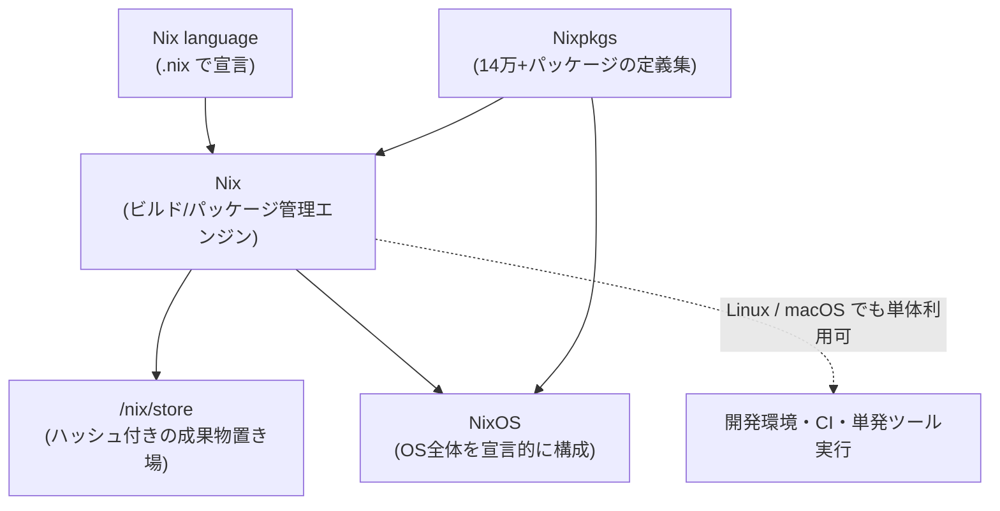
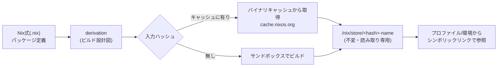
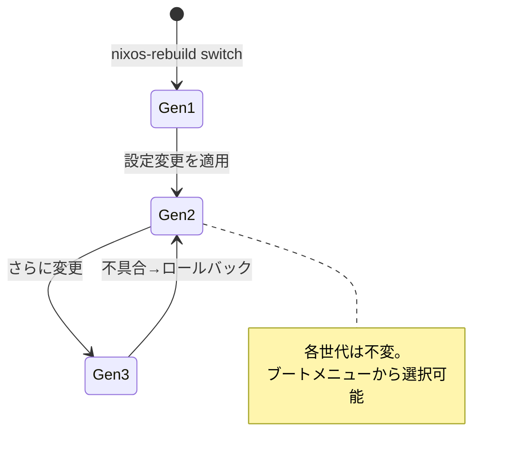

# Nix 入門調査 — 再現可能なビルドとパッケージ管理（Nix / Nixpkgs / NixOS）

> 種別: INFO（記録・参考）／TOPIC: NIX（技術リサーチ）／作成日: 2026-07-20
> 対象読者: パッケージ管理・ビルド再現性・宣言的な環境構築に関心のあるエンジニア（初心者にも分かるよう用語を補足）。
> 一次情報（公式）を基点に整理。実際の導入時は必ず末尾「参考リンク（公式）」を確認してください。

---

## 0. 3行でわかる Nix

- **Nix** は「**ビルドシステム兼パッケージマネージャ**」。パッケージやシステム構成を**コード（宣言的）**で書き、**再現可能・ロールバック可能**な形で管理する。
- パッケージの実体は隔離された `/nix/store` に**入力ハッシュ付き**で置かれるため、**依存の衝突が起きず、複数バージョンを共存**でき、**同じ入力なら同じ出力**が得られる。
- ファミリは3層 —**Nix（ツール/言語）→ Nixpkgs（世界最大級のパッケージ集）→ NixOS（Nixで丸ごと宣言的に構成する Linux ディストロ）**。

> 読み方: Nix=「ニクス」/nɪks/、Nixpkgs=「ニクス・パッケージズ」、NixOS=「ニクス・オー・エス」。ライセンスは LGPL v2.1。

---

## 1. Nix / Nixpkgs / NixOS の関係

「Nix」は文脈で3つの意味を持つため、まず整理する（公式 Glossary に準拠）。

| 用語 | 何か | ひとことで |
|---|---|---|
| **Nix** | ビルドシステム＆パッケージマネージャ本体 | エンジン。Linux / macOS で動く |
| **Nix language** | パッケージ・構成を宣言する専用言語 | 設定を書くための言語（`.nix` ファイル） |
| **Nixpkgs** | Nix で作られたソフトウェア配布物（パッケージ集） | **14万超**のパッケージ。世界最大級のリポジトリ |
| **NixOS** | Nix と Nixpkgs をベースにした Linux ディストロ | OS 全体を宣言的に構成できる |



> ポイント: **Nixpkgs と Nix は NixOS 無しでも使える**。既存の Ubuntu / macOS 上に Nix だけ入れて「再現可能な開発環境」を作る使い方が、最初の入口として人気。

---

## 2. なぜ嬉しいのか（従来手法との違い）

従来の `apt` / `yum` / `brew` などは**グローバルな状態を書き換える**（`/usr/lib` などを上書き）。そのため「自分の環境では動くのに他人の環境では動かない」「依存の食い合い（dependency hell）」が起きやすい。Nix は考え方が根本的に違う。

| 観点 | 従来のパッケージ管理 | Nix |
|---|---|---|
| インストール先 | グローバル（`/usr` 等を上書き） | **隔離**（`/nix/store/<hash>-name`） |
| 依存の指定 | 暗黙・ゆるい | **明示・厳密**（入力を固定） |
| 再現性 | 環境依存で崩れやすい | **同じ入力→同じ出力**を志向 |
| 複数バージョン共存 | 難しい | **容易**（ハッシュで別物扱い） |
| ロールバック | 手動・困難 | **世代管理でワンコマンド** |
| 環境構築 | 手順書ベース（属人的） | **コード（宣言的）** |

**要するに Nix が解く問題**:
1. **再現性** — 「動く環境」をコードで固定し、他人・CI・将来の自分が同じものを再現。
2. **隔離** — パッケージ同士が干渉しない（バージョン違いも並存）。
3. **原子的な更新とロールバック** — 失敗しても前の「世代（generation）」へ即戻せる。
4. **宣言的** — 「どうインストールするか」ではなく「どういう状態が欲しいか」を書く。

---

## 3. 仕組みの核心 — `/nix/store` と純粋関数的ビルド

Nix の中心概念は「**パッケージ＝入力から出力への純粋な関数**」という考え方。

- **derivation（デリベーション）**: 「あるソフトを、どの入力（ソース・依存・ビルド手順・コンパイラ等）から、どう作るか」を記述した**ビルドの設計図**。Nix言語の式から生成される中間表現。
- **入力ハッシュ**: 全入力（依存・フラグ・ソース）からハッシュを計算し、成果物を `/nix/store/<hash>-<name>/` に格納。**入力が1ビットでも変われば別パス**になる。
- **隔離ビルド**: ネットワーク遮断・限定した環境変数など**サンドボックス**でビルドし、外部状態への依存を排除 → **再現性**を高める。
- **バイナリキャッシュ**: 同じ入力ハッシュの成果物が公式キャッシュ（cache.nixos.org）にあれば**ビルドせずダウンロード**。だから毎回ソースからコンパイルされるわけではない。



> 補足（正確性のため）: 「完全な再現性」はビルドの**ブートストラップ問題**（コンパイラを作るのにコンパイラが要る→最初の binary seed が必要）など難所もあり、Nixコミュニティは `reproducible.nixos.org` で継続的に検証している。「入力を固定して限りなく再現に近づける」設計と理解するのが実務的。

---

## 4. Nix 言語のさわり

Nix言語は**遅延評価の関数型・純粋（副作用なし）**な設定記述言語。要点だけ。

```nix
# これは Nix 式の例（コメントは #）
let
  x = 1;
  y = 2;
in x + y            # => 3
```

- **属性セット（attribute set）**: `{ 名前 = 値; }`。JSON のオブジェクト相当。
  ```nix
  { name = "hello"; version = "2.12"; enable = true; }
  ```
- **関数**: `引数: 本体`。
  ```nix
  greet = name: "Hello, ${name}";   # greet "Nix" => "Hello, Nix"
  ```
- **リスト**: 空白区切り `[ 1 2 3 ]`。

「使うだけ」なら言語を深く学ぶ必要は薄く、**Nixpkgs へ貢献したりパッケージを自作する段階で本格的に必要**になる。

---

## 5. 代表的な使い方（コマンド）

Nix には従来型 CLI（`nix-*`）と、新しい統合 CLI（`nix <サブコマンド>`）がある。以下は**新CLIの例**（一部は実験的機能の有効化が必要）。

- **単発でツールを実行**（インストールせず一時利用）:
  ```bash
  nix run nixpkgs#cowsay -- "hello"
  ```
- **一時的な開発シェルに入る**（そのシェル内だけ `python` などが使える）:
  ```bash
  nix shell nixpkgs#python3 nixpkgs#nodejs
  ```
- **プロジェクト用の開発環境**（`flake.nix` の devShell を使う）:
  ```bash
  nix develop      # プロジェクト直下で、宣言した依存が揃ったシェルに入る
  ```
- **パッケージ検索 / 恒久インストール**:
  ```bash
  nix search nixpkgs ripgrep
  nix profile install nixpkgs#ripgrep
  ```

参考: 従来型は `nix-shell`（一時環境）・`nix-env -iA nixpkgs.ripgrep`（インストール）・`nix-build`（ビルド）。新旧が混在するのが学習の混乱ポイント。

---

## 6. Flakes（フレーク）— プロジェクトの標準化とバージョン固定

**Flakes** は Nix プロジェクトに**統一された構造**と**依存のロック（固定）**をもたらす仕組み。

- **`flake.nix`**: 入力（依存する他リポジトリ＝ nixpkgs 等）と出力（パッケージ・devShell・NixOS構成など）を宣言。
- **`flake.lock`**: 入力の**正確なリビジョンを記録**（npm の `package-lock.json`、Cargo の `Cargo.lock` に相当）。これで**チーム・CI・将来で完全に同じ依存**を再現。

```nix
# flake.nix（最小イメージ）
{
  inputs.nixpkgs.url = "github:NixOS/nixpkgs/nixos-26.05";
  outputs = { self, nixpkgs }:
    let pkgs = nixpkgs.legacyPackages.x86_64-linux;
    in {
      devShells.x86_64-linux.default = pkgs.mkShell {
        packages = [ pkgs.nodejs_22 pkgs.ripgrep ];
      };
    };
}
```

> ⚠️ 注意: Flakes は **Nix 2.4（2021-11-01）で導入された "experimental（実験的）" 機能**で、2026年時点でも公式には experimental 扱い（ただし実運用で広く普及）。有効化には `experimental-features = nix-command flakes` の設定が必要。安定志向なら従来型、モダン・チーム開発では Flakes、という住み分けが現実的。

---

## 7. NixOS — OS 全体を宣言的に

**NixOS** は、カーネル・サービス・ユーザー・パッケージまで**1つの構成ファイルで宣言**する Linux ディストロ。

- **`/etc/nixos/configuration.nix`** に「欲しい状態」を書く。
- `sudo nixos-rebuild switch` で適用。適用ごとに**新しい世代（generation）**が作られ、**ブートメニューから過去世代へロールバック**可能（設定ミスでも復旧が容易）。

```nix
# configuration.nix（抜粋イメージ）
{ config, pkgs, ... }:
{
  networking.hostName = "my-nixos";
  services.openssh.enable = true;           # SSH を有効化
  environment.systemPackages = [ pkgs.git pkgs.vim ];
  users.users.alice = {
    isNormalUser = true;
    extraGroups = [ "wheel" ];               # sudo 権限
  };
  system.stateVersion = "26.05";
}
```



> **原子的（atomic）**: 切替は「まるごと成功 or 元のまま」。中途半端に壊れた状態になりにくい。

---

## 8. 周辺エコシステム（よく使うもの）

| ツール | 役割 |
|---|---|
| **Home Manager** | ユーザー環境（dotfiles・CLIツール・シェル設定）を宣言的に管理。NixOS以外のLinux/macOSでも可 |
| **nix-darwin** | **macOS** のシステム設定を宣言的に管理（NixOSのmac版的位置づけ） |
| **devenv** / **nix-shell** | プロジェクト単位の再現可能な**開発環境** |
| **Cachix** | 独自の**バイナリキャッシュ**をホスト（自前ビルドの共有・CI高速化） |
| **Colmena** / deploy-rs | 複数の NixOS サーバへの**リモートデプロイ**（宣言的な構成配布） |
| **Determinate Nix** | 企業向けにサポート・導入を容易にした Nix ディストリビューション |

---

## 9. 長所・短所（導入判断の材料）

**長所**
- **再現性**が非常に高い（CI・チーム・本番で「同じ環境」を担保）。
- **ロールバックが安全**（世代管理・原子的更新）。
- **依存衝突が起きにくい**／複数バージョン共存。
- 開発環境を**リポジトリに閉じ込められる**（`flake.nix` を配れば全員同じ環境）。
- **巨大なパッケージ集**（Nixpkgs 14万超）と活発なコミュニティ。

**短所・注意点**
- **学習曲線が急**（独自言語・独自概念・新旧CLIの混在）。最初の1週間の壁が大きい。
- **Flakes が experimental のまま**で、ドキュメントが新旧混在して迷いやすい。
- **`/nix/store` がディスクを消費**（世代を貯めると肥大化 → `nix-collect-garbage` で掃除）。
- ソフトによっては**Nix流の作法に載せる手間**（バイナリ前提のツール・動的リンク等）。
- macOS 対応はあるが、プラットフォーム固有の落とし穴あり（例: 後述の x86_64-darwin 廃止方針）。

---

## 10. 使いどころ（ユースケース）

1. **再現可能な開発環境** — `flake.nix` / `nix develop` で「READMEに『これ入れて』を書かなくていい」開発体験。**最初の導入はここが王道**。
2. **CI/CD の安定化** — ビルド環境を固定し、"CIだけ落ちる" を減らす。バイナリキャッシュで高速化。
3. **サーバ構成管理（NixOS）** — Ansible等の代替として、OS丸ごと宣言的・ロールバック可能に。
4. **研究・データ分析の再現性** — 解析パイプラインの環境を将来まで固定（学術用途でも採用例）。
5. **dotfiles/端末管理** — Home Manager / nix-darwin で個人環境をコード化。

---

## 11. 最新動向（2026-07 時点）

- **最新安定版: NixOS 26.05 "Yarara"**（2026年リリース）。サポートは **2026-12-31 まで（約7ヶ月）**。旧 25.11 "Xantusia" は 2026-06-30 でEOL。
  - リリース規模: **2,842 コントリビュータ / 59,703 コミット**。新規パッケージ **20,442**、更新 20,641、削除 17,532。新モジュール 85・設定オプション 1,547 追加。
  - **systemd stage 1（initrd）がデフォルト化**。旧スクリプト実装は非推奨（26.11 で削除予定）。
  - **x86_64-darwin（Intel Mac）** はこのリリースを最後にサポート終了方針（Apple Silicon への移行）。
- **リリースサイクル**: 年2回（`YY.05` と `YY.11`）。各安定版は約7ヶ月サポート。常に最新を追う `unstable` チャネルもある。
- **Flakes**: 依然 experimental 表記だが、事実上のデファクト。安定化に向けた議論・改善が継続。

---

## 12. 入門ステップ（おすすめ順）

1. 既存OS（Ubuntu/macOS）に **Nix だけインストール**（公式インストーラ または Determinate インストーラ）。
2. `nix run nixpkgs#cowsay` などで**単発実行**を体験。
3. 小さなプロジェクトで **`flake.nix` + `nix develop`** による開発環境を作る（experimental機能を有効化）。
4. **Home Manager** で dotfiles を宣言的に管理してみる。
5. 興味が続けば **NixOS を VM に入れて** `configuration.nix` と世代ロールバックを体験。

> コツ: 最初から NixOS/Flakes を全部やろうとすると挫折しやすい。「**まず開発環境の再現性**」という一点突破が続けやすい。

---

## 13. 参考リンク（公式・一次情報）

- Nix & NixOS 公式サイト: https://nixos.org/
- 公式ドキュメント（学習の中心）: https://nix.dev/
- 用語集（Glossary）: https://nix.dev/reference/glossary
- Nix language 入門: https://nix.dev/tutorials/nix-language.html
- Flakes（公式Wiki）: https://wiki.nixos.org/wiki/Flakes
- Nixpkgs（GitHub・パッケージ集/NixOS実装）: https://github.com/NixOS/nixpkgs
- Nix 本体（GitHub）: https://github.com/NixOS/nix
- NixOS 26.05 リリース告知: https://nixos.org/blog/announcements/2026/nixos-2605/
- 再現ビルド検証: https://reproducible.nixos.org/
- パッケージ検索: https://search.nixos.org/

---

### 付記（本ドキュメントの位置づけ）
- 種別 INFO（記録・参考）。技術リサーチとして `/info` の「🔬技術リサーチ」に分類される想定（TOPIC=NIX は未登録＝既定カテゴリ）。
- 数値・バージョンは 2026-07-20 時点の公式情報に基づく。導入時は最新のリリースノート・マニュアルを必ず確認。
