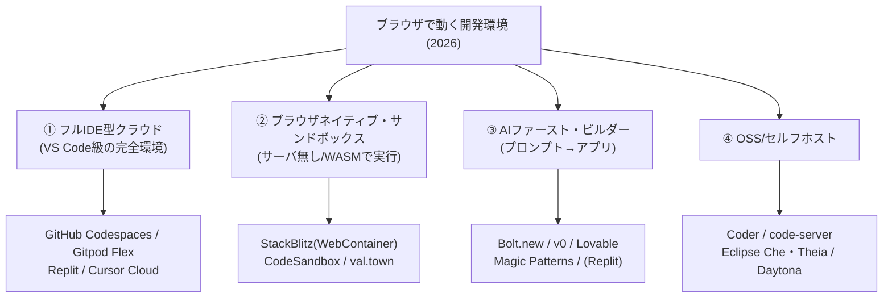

# Replit 調査 — ブラウザで完結するクラウドIDE＋AI（Agent）開発プラットフォーム

> 種別: INFO（記録・参考）／TOPIC: REPLIT（技術リサーチ）／作成日: 2026-07-20
> 対象読者: クラウド開発環境・AIコーディング・"vibe coding" に関心のあるエンジニア/非エンジニア（用語は都度補足）。
> 一次情報（replit.com 公式）を基点に整理。料金・機能は変動が速いため、実利用時は末尾リンクで最新を確認。

---

## 0. 結論から（"ブラウザのIDE？"への答え）

- **はい、Replit はブラウザで動くIDE（統合開発環境）です。** ただし今はそれ以上で、**「ブラウザIDE＋クラウド実行環境＋AI（Agent）＋そのままデプロイ」までを1つにまとめた開発プラットフォーム**。
- **環境構築ゼロ**: ローカルに何もインストールせず、ブラウザを開けばすぐコードを書いて**実行・公開**できる。
- **AIが主役級**: 自然言語で「こんなアプリが欲しい」と伝えると、**Replit Agent が設計・実装・テスト・デプロイまで自走**する（いわゆる "vibe coding" の代表格）。

---

## 1. Replit とは

- 2016年設立（創業者 Amjad Masad ら）。当初は「ブラウザで動く手軽なコーディング環境」として教育・初学者に普及。
- 現在は **AIで加速するクラウド開発プラットフォーム**へ進化。公称で**数千万ユーザー規模**（出典により 3,500万〜5,000万）まで拡大し、AI関連事業の急成長で知られる。
- キャッチコピー: 「**セットアップに1秒も使わず、AIの力でソフトを作ってデプロイ**」。

構成要素をひとことで:
- **Repl（レプル）**: 1つのプロジェクト＝コード＋実行環境＋設定がまとまった単位。
- **クラウド実行環境**: 各Replが隔離されたコンテナで動く（Nix ベースの再現可能な環境を採用）。
- **Replit AI / Agent**: 補完・チャット・自律エージェント。
- **Deployments（Replit Apps）**: 作ったものを本番公開する仕組み。

---

## 2. 「ブラウザIDE」としての Replit

- **エディタ**: シンタックスハイライト・補完・マルチファイル・ターミナル・デバッガをブラウザ内に完備。
- **即時実行**: 「Run」ボタンでビルド〜実行。結果は内蔵のWebプレビュー/コンソールに表示。
- **環境構築不要**: 言語ランタイム・パッケージ・DBが**クラウド側**に用意され、`npm install` 等も自動/簡単。
- **どこでも同じ**: PCでもタブレットでも、ログインすれば同じ環境。ローカルの「自分の環境だと動かない」問題が起きにくい。
- **リアルタイム共同編集**: Google Docs のように**複数人で同じコードを同時編集**（ペアプロ・授業・面接に便利）。

---

## 3. 主な機能

- **多言語対応**: Python / JavaScript・TypeScript / Node.js / Go / Rust / Java / C・C++ など多数（テンプレートから即開始）。
- **パッケージ管理**: 依存を自動解決（内部で Nix を活用し再現性を確保）。
- **データベース**: 内蔵の Key-Value ストアや PostgreSQL 等を数クリックで用意。
- **Secrets 管理**: APIキー等を環境変数として安全に保持（コードに直書きしない）。
- **バージョン管理**: Git 連携（GitHub 連携・履歴）。
- **テンプレート/コミュニティ**: 公開Replをフォークして学べる巨大なコミュニティ。
- **常時稼働/スケジュール実行**: ボットや定期ジョブの常駐も可能（プラン依存）。

---

## 4. Replit AI / Replit Agent（中核）

**Replit AI**（IDEに組み込まれたAIレイヤ。バックエンドに Claude・Gemini などのLLMを利用）:
- **コード補完**（Copilot的な提案）
- **チャット**（コードの説明・デバッグ相談）
- **Agent モード**（自律的にアプリを構築）

**Replit Agent**（自律型AIソフトウェアエンジニア）:
- **プロンプト→完成アプリ**まで一気通貫。**コード生成・パッケージ導入・DB設定・エラー修正・デプロイ準備**まで自分で行う。
- **自己テスト**: 作ったアプリを**ブラウザで自分で操作してテスト**し、レポートを作り、見つけた不具合を**自動修正**する"リフレクションループ"。
- **長時間の自律実行**（例: Agent の新世代では**数十分〜200分規模の連続稼働**）で、大きめのタスクも任せられる。
- Cursor / GitHub Copilot が「編集を"提案"する」のに対し、Replit Agent は**"プロンプトからデプロイ済みアプリまで"ビルドサイクル全体を所有**するのが特徴。

> ⚠️ AIは**確率的**でミスもする。生成物は**レビュー前提**（特にセキュリティ・課金・個人情報を扱う箇所）。

---

## 5. デプロイ（Replit Apps / Deployments）

作ったものを**そのまま本番公開**できるのが強み。主なタイプ:
- **Autoscale**: トラフィックに応じて自動増減（従量課金。Web APIやサイト向け）。
- **Static**: 静的サイトの高速配信。
- **Reserved VM**: 常時稼働の専用VM（ボット・常駐サービス向け）。
- **Scheduled**: 定期実行（cron 的なジョブ）。
- 独自ドメイン割り当ても可能。→ **DevOps 知識ゼロでも公開まで到達**できる。

---

## 6. 料金（2026年2月時点・4ティア）

> 変動が速く、**サブスク＋AIクレジット＋従量課金**が混在して分かりにくい。必ず公式で最新確認。

- **Starter（無料）**: Agent のお試し・**公開アプリ最大10個**・基本的なAI・1 vCPU/2GiB 程度。学習/プロトタイプ向け。
- **Core**: 個人の本格利用。月額サブスク＋**AI利用クレジット**が付与。上位モデル利用可。
- **Pro**（2026/2 追加）: さらに高い上限・高性能モデル・チーム機能。
- **Enterprise**: 席数管理・**SSO/SAML**・高度なプライバシー/管理機能。

補足: **AIクレジット**（Agentの実行量に応じ消費）や**デプロイの従量課金**が別途かかるため、「サブスク料金＝総額」ではない点に注意。

---

## 7. ユースケース

1. **学習・プログラミング教育**: 環境構築の壁がなく、最初の一歩に最適。
2. **プロトタイピング / MVP**: アイデアを**数分で動くアプリ**にして検証。
3. **vibe coding（非エンジニアの開発）**: 自然言語だけで社内ツール・LP・簡易SaaSを作る。
4. **ハッカソン / デモ**: セットアップ不要・共有URLが即出せる。
5. **ボット・定期ジョブ**: Reserved VM / Scheduled で常駐運用。

---

## 8. 長所と注意点

**長所**
- **環境構築ゼロ・即公開**（DevOps不要）。
- **AI Agent で"作れる人"の裾野が広がる**（非エンジニアでも形にできる）。
- **共同編集・共有が容易**（教育/レビュー/面接に強い）。
- どの端末でも同じ環境（再現性）。

**注意点**
- **ベンダーロックイン**: Replit 固有の仕組み・デプロイに依存しやすい（移行性は要検討）。
- **コスト**: AIクレジット・従量課金で**思ったより高くなる**ことがある。大規模/高トラフィックは割高になり得る。
- **AIの品質**: 生成物は不正確・非効率な場合があり**レビュー必須**。セキュリティ実装は特に注意（"作れる"と"安全に運用できる"は別）。
- **重い/特殊なワークロード**: 本格的な大規模本番や特殊要件は、専用インフラの方が適する場合も。
- **ネット必須**: 常時オンライン前提（オフライン開発には不向き）。

---

## 9. 似ているサービス（比較の視点）

- **AIコーディング（エディタ拡張型）**: **Cursor**, **GitHub Copilot** … 既存エディタ/ローカルで"提案"。
- **クラウド開発環境**: **GitHub Codespaces**, **Gitpod**, **StackBlitz**, **CodeSandbox** … ブラウザ/クラウドの開発環境。
- **プロンプト→アプリ生成（Replitと近い層）**: **Bolt.new**, **Lovable**, **v0（Vercel）** … 自然言語からWebアプリ/UIを生成。

> Replit の立ち位置: **「ブラウザIDE＋実行＋AI Agent＋デプロイ」を一体で提供**し、"プロンプトから公開まで"を最短で回せる総合型。

---

## 9B. 競合・類似サービス徹底比較（「ブラウザで動くIDE」観点）

> 2026年のクラウド/ブラウザ開発環境は、大きく**4分類**に整理できる。Replit は「フルIDE型クラウド」でありながら「AIファースト・ビルダー」も兼ねる**ハイブリッド**な立ち位置。

### ① フルIDE型クラウド（本格開発向け・Replitの主戦場）
- **GitHub Codespaces**: **VS Code のブラウザ版**を任意リポジトリから起動（devcontainer 仕様で環境を宣言）。**GitHub と密結合**（PR/Issue/Actions）、Copilot 統合。**プロの実務では最有力の定番**。コンピュート時間で従量課金。
- **Gitpod（Gitpod Flex）**: リポジトリから**使い捨て(エフェメラル)環境**を自動生成。CI 的な再現性・セルフホスト対応。
- **Cursor Cloud**: AIエディタ Cursor のクラウド実行版（ローカル版 Cursor はブラウザではない点に注意）。
- **Replit**: 本ドキュメントの主役。環境ゼロ＋AI Agent＋即デプロイの一体型。

### ② ブラウザネイティブ・サンドボックス（サーバレスで軽快）
- **StackBlitz**: **WebContainer**（WASMで Node.js を**ブラウザ内で直接実行**）。サーバ不要で起動が非常に速く、フロントエンド/Node のプロトタイプ・ドキュメント埋め込みに強い。
- **CodeSandbox**: フロントエンド試作の定番。近年は**クラウドVM**実行も追加し守備範囲拡大。
- **val.town**: 小さな関数/スクリプトをブラウザで書いて即デプロイ。

### ③ AIファースト・ビルダー（プロンプト→アプリ／Replitと競合）
- **Bolt.new（StackBlitz）**: 自然言語からフルスタックWebアプリを生成し、その場で実行（WebContainer基盤）。
- **v0（Vercel）**: UI/フロントを生成、Vercelへデプロイ。
- **Lovable / Magic Patterns**: プロンプトからアプリ/UIを生成する"vibe coding"系。
- → Replit はここにも属し、**「IDE＋実行＋デプロイまで所有」**する点で単なるUI生成系と差別化。

### ④ OSS・セルフホスト（自前運用・ロックイン回避）
- **Coder / code-server**: VS Code を自社サーバ/クラウドでホスト。企業のセキュリティ要件に対応。
- **Eclipse Che / Theia**: ブラウザIDEを作るためのOSSフレームワーク（Theia は VS Code 互換基盤）。
- **Daytona / DevPod**: 開発環境をコード化して任意基盤で再現。

### 軽量エディタ（"ちょい書き"・共有向け）
- **vscode.dev / github.dev**: **ブラウザ版 VS Code**。github.dev は GitHub のリポジトリ画面で **`.` キー**を押すと起動。**コンピュート/ターミナルは無く編集中心**（軽量閲覧・小修正向き）。
- **CodePen / JSFiddle / JSBin**: フロントの**スニペット共有**に特化（フルIDEではない）。

### 主要サービス早見表（ブラウザIDE観点）

| サービス | 分類 | 実行方式 | AI | 特徴/強み |
|---|---|---|---|---|
| **Replit** | ①＋③ | クラウドコンテナ | ◎ Agent | 環境ゼロ〜デプロイ一体。非エンジニアもOK |
| **GitHub Codespaces** | ① | クラウドVM(devcontainer) | ○ Copilot | VS Code品質＋GitHub密結合。実務の定番 |
| **Gitpod Flex** | ① | クラウド/セルフホスト | ○ | 使い捨て環境・再現性・自前運用可 |
| **Firebase Studio**（旧 Project IDX） | ①＋③ | クラウド(VS Codeベース) | ◎ Gemini | Google製・agentic・full-stack/モバイル |
| **StackBlitz** | ② | **WebContainer(WASM)** | ○ | サーバ不要で超高速。Bolt.new の基盤 |
| **CodeSandbox** | ② | ブラウザ＋クラウドVM | ○ | フロント試作の定番 |
| **vscode.dev / github.dev** | 軽量 | 実行なし(編集中心) | △ | ブラウザVS Code。`.`キーで起動 |
| **Coder / Che・Theia** | ④ | セルフホスト | 任意 | OSS・ロックイン回避・企業向け |

### ⚠️ 撤退・終了に注意（2024〜2025）
- **AWS Cloud9**: **新規利用の受付を終了**（実質フェードアウト。新規採用は非推奨）。
- **Glitch**: サービス終了。**JetBrains Space** も終了。
- **Google Project IDX**: **Firebase Studio に統合・改称**（IDX 単体としては終了扱い）。
- → 「ブラウザIDEは入れ替わりが速い」ため、**移行性(エクスポート/OSS互換)** を選定時に重視するとよい。

### Replit を選ぶ/選ばない目安
- **Replit 向き**: セットアップを避けたい／**AIに丸ごと作らせたい**／非エンジニアが形にする／プロトタイプ〜小規模公開まで最短で。
- **Codespaces / Gitpod 向き**: **既存Gitワークフローの本格開発**／VS Code資産・拡張を活かす／チームの標準環境。
- **StackBlitz / CodeSandbox 向き**: **フロントエンドの高速試作**・ドキュメント埋め込み・共有デモ。
- **Coder / Che 向き**: **セルフホストでロックイン回避**・厳格なセキュリティ要件。

---

## 10. 始め方（最初の一歩）

1. replit.com でサインアップ（無料 Starter）。
2. テンプレートから Repl を作る、または **Agent に作りたいアプリを日本語/英語で指示**。
3. Run でプレビュー確認 → 必要なら Agent/AIチャットで修正。
4. Secrets にAPIキーを登録、DBを追加。
5. **Deploy** で公開 → 共有URL/独自ドメインで配布。

---

## 11. 参考リンク（公式・一次情報）

- Replit 公式トップ: https://replit.com/
- Replit AI: https://replit.com/ai
- Replit Agent（製品ページ）: https://replit.com/products/agent
- 料金: https://replit.com/pricing
- 公式ドキュメント: https://docs.replit.com/
- ブログ: https://blog.replit.com/

---

### 付記（本ドキュメントの位置づけ）
- 種別 INFO（記録・参考）。技術リサーチとして `/info` の「🔬技術リサーチ」に分類される想定（TOPIC=REPLIT は未登録＝既定カテゴリ）。
- ユーザー数・ARR・料金・Agentの仕様は 2026-07-20 時点の公開情報に基づく（出典により数値差あり）。最新は公式で要確認。
