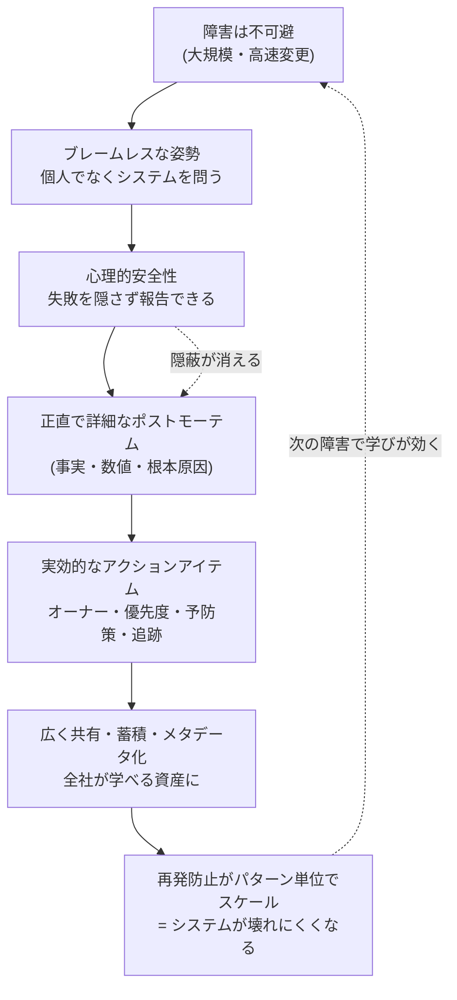

# Google SRE のブレームレス文化とドキュメントのレジリエンス

> 障害を「誰かの失敗」ではなく「システムを強くする学びの機会」として扱う——Google SRE の**ブレームレス・ポストモーテム（blameless postmortem）**文化を、一次資料（Google SRE Book / Workbook）をベースにまとめる。あわせて、この文化がなぜ「ドキュメントのレジリエンス（回復力・耐障害性）」の源泉になるのかを整理する。

- **ステータス:** INFO（記録・参考）
- **作成日:** 2026-07-28
- **一次資料（公式）:**
  - SRE Book Ch.15 "Postmortem Culture: Learning from Failure" — <https://sre.google/sre-book/postmortem-culture/>
  - SRE Workbook Ch.10 "Postmortem Culture: Learning from Failure" — <https://sre.google/workbook/postmortem-culture/>
  - Google Cloud Architecture Center "Conduct thorough postmortems" — <https://docs.cloud.google.com/architecture/framework/reliability/conduct-postmortems>

---

## 0. 用語の整理（最初に）

| 用語 | 綴り | 意味 |
|---|---|---|
| SRE | Site Reliability Engineering | サイト信頼性エンジニアリング。Google が確立した、ソフトウェアエンジニアリングの手法で運用・信頼性を担保する考え方・職種。 |
| ポストモーテム | Postmortem | 「事後検証」。障害（インシデント）の記録・影響・対応・根本原因・再発防止策を書き残した文書、およびそれを書く行為。 |
| ブレームレス | Blameless | 「非難しない」。個人・チームを責める代わりに、システムやプロセスの問題として原因を分析する姿勢。 |
| 心理的安全性 | Psychological Safety | 「失敗を報告しても罰せられない」と信じられる状態。ブレームレス文化が生み出す土台。 |
| レジリエンス | Resilience | 回復力・耐障害性。障害が起きても学習し、より壊れにくくなっていく組織・システムの性質。 |

---

## 1. 核心となる考え方 —「失敗の代償は教育である」

SRE Book の章は、Devin Carraway の一節で始まる:

> **"The cost of failure is education."（失敗の代償は、教育である。）**

大規模で複雑な分散システムを、高い速度で変更し続ける以上、**障害は「起きるか否か」ではなく「いつ起きるか」の問題**である（inevitable = 不可避）。ならば重要なのは、障害から**確実に学ぶ仕組み**を持つこと。学びの仕組みが無ければ、同じ障害は際限なく（ad infinitum）再発し、やがて複雑化・連鎖（cascade）してユーザーに影響する。

だから Google はポストモーテムを SRE の**必須ツール**と位置づける。

**ポストモーテムを書くことは罰ではない。会社全体にとっての学習機会である。**（"Writing a postmortem is not punishment—it is a learning opportunity for the entire company."）

---

## 2. ブレームレス（非難しない）とは何か

### 2.1 定義
ポストモーテムが真に「ブレームレス」であるためには、**個人やチームの「悪い行い」を糾弾せず、インシデントに寄与した要因（contributing causes）の特定に集中**しなければならない。

前提となる姿勢は明快:

> **関わった全員が「善意で、その時点で持っていた情報の範囲で正しいことをした」と仮定する。**
> （"assumes that everyone involved in an incident had good intentions and did the right thing with the information they had."）

### 2.2 なぜ「非難」がシステムを弱くするのか
- 指差し・吊るし上げ（finger pointing / shaming）の文化が支配すると、人は**罰を恐れて問題を表に出さなくなる**。
- 結果、インシデントや不具合が**「絨毯の下に隠される」（swept under the rug）**。組織のリスクはむしろ増大する。
- 人は「直せない（You can't "fix" people）」。だが**システムとプロセスは直せる**。だから改善対象は常に「人」ではなく「仕組み」に向ける。

### 2.3 ルーツは医療・航空業界
ブレームレス文化の起源は、**ミスが死に直結する医療・航空（avionics）業界**にある。これらの業界では「あらゆるミスをシステムを強化する機会と見なす」文化を育ててきた。Google はこれをソフトウェア運用に持ち込んだ。

### 2.4 「非難」と「建設的」の対比（SRE Book の実例）

| ❌ 指差し（Pointing fingers） | ✅ ブレームレス（Blameless） |
|---|---|
| 「あの複雑なバックエンドを全部書き直すべきだ！ 3四半期も毎週壊れてる。もう一度ページ（呼び出し）が来たら自分で書き直すぞ…」 | 「バックエンドの書き直しは、この厄介な呼び出しを本当に止められるかもしれない。保守マニュアルも長くて習熟が難しい。将来のオンコール担当がきっと感謝するはず」 |

同じ「書き直したい」でも、**感情の発散ではなく、改善点を verifiable（検証可能）な形で指し示す**のがブレームレス。人を責めないが、**サービスのどこがどう改善できるかは明確に指摘する**（黙認ではない点が重要）。

---

## 3. ドキュメントとしてのポストモーテム —「レジリエンス」の実体

ここが「ドキュメントのレジリエンス」の核心。ブレームレス文化は、**良質なドキュメントが書かれ・共有され・再利用される**ことで初めて回復力に変わる。

### 3.1 ポストモーテムはいつ書くか（トリガーを事前定義）
「障害が起きてから決める」のではなく、**インシデント前に基準を定義**しておく。共通トリガー例:
- 閾値を超えるユーザー影響（ダウンタイム・劣化）
- 種類を問わないデータ損失
- オンコールエンジニアの介入（ロールバック、トラフィック迂回など）
- 一定時間を超える復旧時間
- 監視の失敗（＝人手で障害に気づいた、を意味する）

加えて、**誰でも（any stakeholder）ポストモーテムを要求できる**。

### 3.2 良いポストモーテムの条件（Workbook のケーススタディより）
Google は実際の障害（rack decommission の自動化バグで、世界中のサテライトのディスクが消去された事例）を使い、**「悪い例」と「良い例」を対比**して教える。

**良いポストモーテムの特徴:**
- **用語集（Glossary）／背景（Background）** — 専門用語を補足し、チーム外の読者にも通じる。**読者は常に「担当チームの外」まで広がる**前提で書く。
- **定量データ（Quantifiable metrics）** — 影響を数値で示す。「測れないなら、直ったかどうかも分からない」。推測でも、無いよりはマシ。
- **アクションアイテム（Action Items, AI）が実効的**であること:
  - **オーナー**と**追跡番号（bug ticket）**が全項目に付く（追跡が無い AI は忘れられ、再発を招く）
  - **優先度**が付く
  - **測定可能な完了状態**を持つ（例:「マシンの X% 以上が失われたらアラートを出す」）
  - **予防的（Preventative）**な項目を含む（緩和策 mitigate だけでなく、再発を防ぐ prevent を必ず入れる）
- **根本原因は「誰が（who）」ではなく「何が（what）」に集中**する。
- **個人名で責めない**。主観的・扇情的な言葉（"careless ignorance"／"which is ridiculous"／"信じられない!!!"）を排し、**事実と検証可能なデータ**で語る。感情的表現は心理的安全性を損なう。

**悪いポストモーテムのアンチパターン:**
- 「人間をミスしにくくする」式の対策 → **人の行動変容に頼るのは、自動化・プロセス改善より信頼性が低い**。Dan Milstein の警句「今日と同じくらい皆が愚かな未来を前提に計画しよう」。
- 全項目が同じ優先度で、どれから着手すべきか分からない。
- 「改善する」「良くする」等の曖昧語で成功基準が測れない。
- 発生から4か月後に公開 → その間に再発し、詳細が失われた（実際に起きた）。**タイムリーさ**も品質の一部。

### 3.3 レビューと共有 —「レビューされていないポストモーテムは、存在しないのと同じ」
- 初稿はチーム内で共有し、**シニアエンジニアが完全性をレビュー**（データは残ったか／影響評価は十分か／根本原因は深掘りされたか／アクションは適切な優先度か／関係者に共有したか）。
- レビュー後は、**可能な限り広い読者**へ共有。既定で**全社アクセス可能**にし、時には顧客にまで共有する。
- **「ポストモーテムの価値は、それが生む学びに比例する」**（The value of a postmortem is proportional to the learning it creates）。学ぶ人が多いほど、再発は減る。
- 完成後はチーム／組織の**過去インシデント・リポジトリ**に蓄積。透明な共有が、他者の発見と学習を容易にする。誠実なポストモーテムは、**失われた信頼を回復する鍵**にもなる。

### 3.4 メタデータ化（ドキュメントのレジリエンスを増幅）
成熟した文化では、**機械可読なタグやメタデータ**を付け、ポストモーテムから**トレンド分析（downstream analytics）**を行う。Google の "Postmortems at Google" ワーキンググループは、テンプレート整備・作成の自動化・データ抽出の自動化を横断的に推進している。
→ ドキュメントが「読み物」から**「分析可能な資産」**になることで、組織の再発防止が個別対応から**パターン撲滅**へスケールする。

---

## 4. 文化をどう根付かせるか（Introducing a Postmortem Culture）

ポストモーテムの導入は、技術的変更である以上に**文化的変更**。一気にやろうとせず、**小さく始めて調整する**（"start small" / one size does not fit all）。

Google が実践する「文化を育てる仕掛け」:
- **Postmortem of the month** — 月刊ニュースレターで良質なポストモーテムを全社共有。
- **ポストモーテム・グループ** — 社内外の事例・ベストプラクティスを議論。
- **Postmortem reading clubs** — 過去（時に数か月〜数年前）のポストモーテムを軽食付きで読み解く読書会。
- **Wheel of Misfortune（不幸のルーレット）** — 新人 SRE が過去のインシデントをロールプレイで再演。当時のインシデント指揮官も参加してリアルさを担保。
- **報酬と称賛** — 良いポストモーテムを書く／冷静に障害対応することを、ピアボーナスや全社集会（TGIF）で公に称える。**シニア層の参加**が文化を後押しする（創業者の Larry Page もポストモーテムの価値を語る）。

**破綻の初期兆候を検知する:** チームに定期アンケートを行い、「文化は仕事を支えているか」「ポストモーテムが過度な toil（苦役）になっていないか」を測り、改善し続ける。

---

## 5. まとめ — なぜ「ブレームレス」が「ドキュメントのレジリエンス」の源泉なのか

因果の連鎖はシンプル:

1. **非難しない**から、人は**失敗を隠さない**（心理的安全性）。
2. 隠さないから、**正直で詳細なドキュメント**が書ける。
3. 詳細なドキュメントがあるから、**実効的な再発防止策**が打てる。
4. 広く共有・蓄積するから、**組織全体が学び**、再発が減る。
5. 結果として、**システムも組織も、障害のたびに壊れにくくなっていく**（＝レジリエンス）。

逆に言えば、**非難文化はこの連鎖の最初の一歩（正直な報告）を断ち切る**。だからドキュメントは薄く・隠蔽的になり、組織は同じ障害を繰り返す。**ブレームレスは「優しさ」の話ではなく、レジリエンスを生むための工学的な要件**である——これが Google SRE の主張の本質。

> Google の結論:「ポストモーテム文化への継続的投資のおかげで、Google は障害が減り、より良いユーザー体験を実現できていると自信を持って言える。」

---

## 参考にした一次資料

- Google, *Site Reliability Engineering* (SRE Book), Ch.15 "Postmortem Culture: Learning from Failure" — <https://sre.google/sre-book/postmortem-culture/>
- Google, *The Site Reliability Workbook*, Ch.10 "Postmortem Culture: Learning from Failure" — <https://sre.google/workbook/postmortem-culture/>
- Google, *Example Postmortem* — <https://sre.google/sre-book/example-postmortem/>
- Google Cloud, Architecture Center "Conduct thorough postmortems" — <https://docs.cloud.google.com/architecture/framework/reliability/conduct-postmortems>
