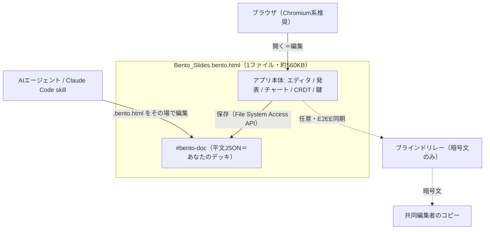

# Bento（bento/slides）— 1枚の HTML ファイルに収まるプレゼンツール（調査メモ）

作成日 2026-07-29 / STATUS: INFO / TOPIC: BENTO

> ひとことで言うと「**プレゼンの TiddlyWiki**」。スライドツール一式（**編集・表示・発表・データ・共同編集**）を丸ごと **1個の HTML ファイル**に詰めたもの。合言葉は **"The file is the software."**（ファイルそのものがソフト）。

## 基本情報

| 項目 | 内容 |
|---|---|
| リポジトリ | `nyblnet/bento`（GitHub、2026-07-17 作成） |
| 公式サイト | bento.page |
| ライセンス | **MIT License**（同梱の reveal.js/Moveable/Selecto も MIT、フォントは OFL） |
| 実装言語 | TypeScript（SPA・バックエンド不要） |
| スター / フォーク | 約 2,980★ / 約 190 fork（2026-07-29 時点） |
| 配布物 | 単一ファイル `Bento_Slides.bento.html`（約 560KB・アカウント/インストーラ不要） |
| 立ち位置 | **bento/slides は第1弾**。今後 spaces（ノート）/ dash（表計算）/ vault が続く「file 完結のオフィススイート」構想 |
| 出自 | Show HN（2026-07-28 週次 HN ダイジェスト #9 で紹介） |

## これは何か / なぜ作ったか

- **背景（作者の動機）**: 「AI にスライドを作らせては直す」無限ループが辛かった＋大企業の**ブランド規定に AI プレゼン生成ツールが対応できない**。そこで「Web アプリをそのままプレゼンにする」路線へ。
- **問題意識**: オフィス文書は「所有するもの」から「（クラウドに）借りるもの」になり、ログインとサーバ稼働に人質化した。Bento は逆張りで**ファイル自己完結**を選ぶ。

## 中核の考え方（4つの柱）

1. **One file, forever（1ファイルで永続）**: デッキ・フォント・画像・チャート・アニメ・**エディタ本体**が1ファイルに同梱。2026年のコピーが2036年にも開ける。
2. **View-source honest（中身が読める）**: データはファイル先頭の**素の JSON ブロック**（`#bento-doc`）。バイナリ形式もロックインも無し。
3. **It saves itself（自分を保存する）**: **File System Access API** で、同じ HTML ファイルの中に JSON を書き戻す（非対応ブラウザはダウンロードにフォールバック）。
4. **Local-first, provably（証明可能なローカル優先）**: オフラインモードで更新・共同編集を**ハードブロック**し、その旨を明示。

## 主な機能

| 機能 | 中身 |
|---|---|
| **モーフ発表（Morph）** | 同じ id を持つ要素がスライド間で補間アニメ（位置・サイズ・色・グラデーション）。スライドを複製して並べ替えると動きが自動生成。 |
| **ライブ共同編集** | **E2EE（AES-GCM）**。鍵は**ファイル内に存在しサーバに置かない**。ファイル自体が招待状＝コピーを開いた人が参加。**自作 CRDT**（文字単位のテキストマージ）でオフライン編集も正確に合流。 |
| **ブラインドリレー** | 任意の同期中継（`server/sync-worker/`）。**暗号文しか見えず**内容・氏名・構造を学習しない。 |
| **内蔵チャート** | 棒/線/円/散布図を**依存ゼロの自作エンジン**で描画。発表中もツールチップ・ズーム・（棒→円などの）データモーフが動く。 |
| **AI 前提設計** | ドキュメントがファイル内の素の JSON なので、エージェントが `.bento.html` を**その場で編集**、チャットボットは JSON を往復（`window.bento.loadDoc`）。 |
| **署名付き自己更新** | リリースは **ECDSA 署名**、アプリ内で更新。更新は**新しいファイルを書き出す**（旧ファイルがロールバックとして残る）。 |
| **その他** | スピーカービュー・コメント・レイアウト・隠しインタラクティブ状態・ホバー表示・モーションパス・**PDF 書き出し**・ページサイズ・**UI 8言語**を ~560KB に。 |

## 技術スタック（アーキテクチャ一段）

- ドキュメントモデル: `slides/src/model.ts`（JSON）。描画は単一レンダラ `render.ts`（エディタ/サムネ/発表を共通化）。
- **ナビゲーションは reveal.js**。ただし**モーフはモデルから計算**（DOM ではない）。**アニメ（`anim.ts`）・チャート（`charts.ts`）・CRDT（`sync/crdt.ts`）はすべて自作**（当初 GSAP/echarts で試作 → 最終的に再実装）。
- シェルは ~560KB に圧縮、**ドキュメントブロックは平文のまま**残す（旧ファイルや外部ツールが常に差し替えできるように）。



## AI との併用（Claude Code / ローカルモデル）

- ドキュメントが1つの平文 JSON ブロックなので、**ファイルを読み書きできる AI なら plugin/API 無しでデッキを編集**できる。
- **Claude Code**: 専用スキル `bento-slides` をこのリポのプラグインマーケットから導入可（`/plugin marketplace add nyblnet/bento`）。最新 Bento アプリの自動ダウンロードまで面倒を見る。
- **完全オフライン**: Ollama / llama.cpp / LM Studio をデッキに向ければ、何も外に出さずに編集可能。エージェント用ガイドは1枚: `bento.page/agents.md`。

## 使ってみるまでの手順

1. <https://bento.page/slides/> を開く（＝そのままアプリ。スターターデッキが機能ツアーを兼ねる）。
2. `Bento_Slides.bento.html`（~560KB）をダウンロード（GitHub Releases か bento.page から）。
3. **ブラウザで開く**（保存書き戻しは Chrome / Edge など Chromium 系が確実。Firefox/Safari はダウンロード保存にフォールバック）。
4. 編集 → **同じファイルに保存**（ファイルが自分を書き換える）。
5. 共同編集: アプリ内でセッション開始 → コピー（＝招待）を共有 → 相手も自分のコピーで参加。中継は暗号文のみ、**鍵ローテーション＝アクセス失効**。

## 刺さるユースケース

- **1ファイルで配れるピッチデック**（メール添付1個、相手はオフラインでどこでも開ける）。
- **Git/差分管理できるスライド**（先頭が素の JSON＝grep・diff・AI 投入が楽）。
- **機密プレゼン**（オフライン完結、クラウドに載らない）。
- **SaaS ロックインなしのリアルタイム共同編集**。
- **AI に叩き台を作らせて手で微調整**。

## セキュリティ・モデル（作者の正直な明示）

- 共同編集の鍵は文書作成時にクライアント側で生成、**ファイル内のみに存在**。ファイル所持＝メンバー、「鍵ローテーション」＝失効。
- リレーが見えるのは**暗号文・接続タイミング・room 鍵のハッシュ**のみ（内容・氏名・構造は不可視）。
- プレゼンス（表示名）は「主張」であって「証明」ではない（共有鍵ルーム内では十分。企業 ID 連携は設計済・未実装）。
- **既知のトレードオフ**: ライブ共同編集中の undo はスナップショット式で、同一プロパティへの相手の同時編集を巻き戻すことがある／**編集はデスクトップ優先**（スマホは閲覧・発表向き）。

## 位置づけ・評判（文脈）

- HN では「単一ファイルなのに CRDT 共同編集、しかも中継は E2E 暗号」に感心する声。作者も一番の自慢点と明言。
- reveal.js 愛好家から「**縦スライド**（聴衆に応じて技術詳細へ潜る）を残してほしい」との要望 → 作者「取り込み検討」。
- 系譜として **TiddlyWiki**（自己保存する単一 HTML）を想起する声。
- 同時期の **OfficeCLI**（AI に Office ファイルを触らせる CLI 基盤）と方向性は対照的: Bento は「**成果物を1ファイルに自己完結**」、OfficeCLI は「**AI に Office を触らせる基盤**」。両者とも “AI×ドキュメント” トレンドの表れ。

## ビルド（開発者向け）

```bash
cd slides
npm install
npm run dev            # 開発サーバ (http://localhost:5173)
npm run build:single   # → dist-single/Bento_Slides.bento.html（製品そのもの）
node scripts/test-sync.ts   # CRDT 収束テスト
```
- Node 20+ と npm のみ。リリースはローカルで作成（**署名鍵はメンテナのマシンから出さない**）。

## 参考リンク

- リポジトリ: <https://github.com/nyblnet/bento>
- 公式 / ショーケース: <https://bento.page/slides/>
- エージェント向けガイド: <https://bento.page/agents.md>
- Show HN スレッド: <https://news.ycombinator.com/item?id=49008211>

---

## Author and Ownership / 著作権と所属について

This project was created as a personal initiative and is not connected to any organization or group.
It is published as an individual creative work.

本プロジェクトは個人の活動として作成したものであり、特定の組織や団体の業務とは関係ありません。
個人の創作物として公開しています。
