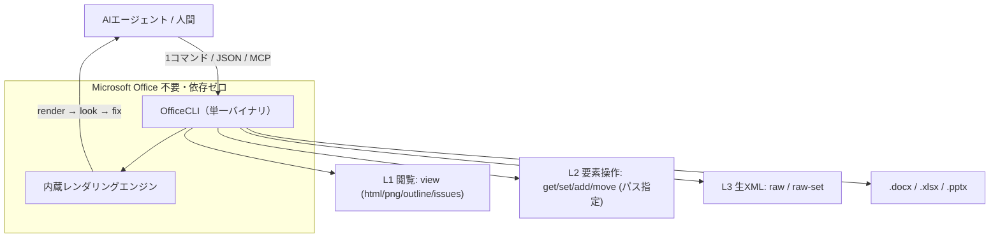

# OfficeCLI — AIエージェントのための Office 操作 CLI（調査メモ）

作成日 2026-07-29 / STATUS: INFO / TOPIC: OFFICECLI

> ひとことで言うと **python-docx / openpyxl / python-pptx の“AI時代版”**。Word / Excel / PowerPoint を、**Microsoft Office を一切インストールせず**にコマンド1つで作成・読取・編集できる、AIエージェント前提の CLI（コマンドラインツール）。

## 基本情報

| 項目 | 内容 |
|---|---|
| リポジトリ | `iOfficeAI/OfficeCLI`（GitHub） |
| 公式サイト | officecli.ai |
| ライセンス | Apache License 2.0（OSS・無料） |
| 実装言語 | C#（.NET。ただしランタイム内蔵＝実行時に .NET 不要） |
| スター / フォーク | 約 23,000★ / 約 1,550 fork（2026-07-29 時点） |
| 最新バージョン | v1.0.143（2026-07-28 リリース。開発は活発） |
| 対応OS | macOS / Linux / Windows（各 x64・ARM64。Alpine 版もあり） |
| 対応フォーマット | `.docx`（Word）/ `.xlsx`（Excel）/ `.pptx`（PowerPoint） |
| GitHub topics | `ai` `agent` `claude-code` `codex` `openclaw` `skills` `office` ほか |

> 補足: topics に **`openclaw` `claude-code` `codex`** が含まれ、**AIエージェント連携を最初から狙った設計**であることが分かる。

## 何を解決するのか

- 従来、プログラムから Office ファイルを触るには **python-docx / openpyxl / python-pptx** のような**言語別ライブラリ**が必要で、**フォーマットごとに別ライブラリ・Python 環境が前提**だった。
- AIエージェントに Office を生成させると「**DOM（内部構造）は読めるが、出来上がりを“見て”いない**」ため、タイトルの溢れや図形の重なりに気づけず直せない、という弱点があった。
- OfficeCLI は「**単一バイナリ・依存ゼロ**」「**内蔵レンダリングで AI に“目”を持たせる**」「**JSON 出力とパス指定でエージェントが扱いやすい**」の3点でこれを解消する。

## 主要機能

### 1. 単一バイナリ・依存ゼロ
- .NET ランタイムを内蔵した自己完結バイナリ。**Office 不要、pip/Python 不要**。CI/Docker/ヘッドレスサーバでも動く。

### 2. 内蔵レンダリングエンジン（最大の売り）
- `.docx/.xlsx/.pptx` を **HTML / PNG に高忠実度で描画**。図形・チャート（トレンドライン、ウォーターフォール、ローソク足等）・数式（LaTeX/KaTeX）・3Dモデル（.glb）・モーフ遷移まで再現。
- これで **「生成 → 見る → 直す（render → look → fix）」ループ**が回る。3モード:
  - `view html`（アセット埋め込みの単体HTML）
  - `view screenshot`（ページ単位PNG。マルチモーダルAIが読む用）
  - `watch`（localhost でライブプレビュー、編集ごとに自動更新）

### 3. パス指定 ＋ JSON 出力
- `/slide[1]/shape[2]` のような**安定パス**で要素を操作（1始まり・要素名ベース、XML名前空間の知識不要）。
- 全コマンド `--json` 対応。エラーも `not_found` 等の**構造化エラーコード＋修正候補**を返すため、**エージェントが自己修正**しやすい。

### 4. 3層設計（必要な深さだけ使う＝トークン節約）
- **L1 閲覧**: `view`（text / outline / stats / issues / html / screenshot …）
- **L2 要素操作**: `get` / `query` / `set` / `add` / `remove` / `move` / `swap`
- **L3 生XML**: `raw` / `raw-set` / `add-part`（万能フォールバック）

### 5. 数式・ピボットエンジン
- **Excel 関数 350+ を書き込み時に自動計算**（`FILTER`/`XLOOKUP`/財務・統計関数、スピル動的配列など）。Office で開き直さずとも値が入る。
- ネイティブ OOXML ピボットテーブルを**1コマンド**で生成。

### 6. テンプレートマージ / dump→batch
- **テンプレートマージ**: `{{key}}` を JSON で差し替え。「**レイアウトは1回設計、量産はN回**」。
- **dump → batch**: 既存ファイルを再生可能な JSON へ変換 → 手本から大量バリエーション生成。

### 7. AIエージェント連携（MCP・スキル自動導入）
- **MCP サーバ内蔵**: `officecli mcp claude` / `cursor` / `vscode` などで即登録。
- **自動スキル導入**: インストール時に Claude Code / Cursor / Codex 等を検出し skill を仕込む。

## 位置づけ（アーキテクチャの考え方）



## 使い方の入口

- **AIエージェント向け**: エージェントのチャットに `curl -fsSL https://officecli.ai/SKILL.md` を貼るだけ（自動でインストール＆使い方習得）。
- **人間向け（GUI）**: デスクトップアプリ **AionUi**（自然言語で Office を作成、裏で OfficeCLI が動く）。
- **人間向け（CLI）**: `brew install officecli` / `scoop install officecli` / `npm i -g @officecli/officecli`、または GitHub Releases からバイナリ取得。
- **30秒デモ**:
  ```bash
  officecli create deck.pptx            # 空のPPTX作成
  officecli watch deck.pptx             # localhost:26315 でライブプレビュー
  officecli add deck.pptx / --type slide --prop title="Hello, World!"
  ```

## 具体例（従来との差）

従来 python-pptx で ~50行書いていた処理が1コマンドに:

```bash
officecli add deck.pptx / --type slide --prop title="Q4 Report"
```

構造化 JSON も即取得:

```bash
officecli get deck.pptx '/slide[1]/shape[1]' --json
# → {"tag":"shape","path":"/slide[1]/shape[1]","attributes":{"text":"Revenue grew 25%", ...}}
```

## 他手段との比較（要点）

- **MS Office**: 有償・GUI/COM前提・ヘッドレス不可。OfficeCLI は無償・CLI・ヘッドレス可。
- **LibreOffice --headless**: 変換はできるが、AIネイティブな JSON/パス操作やレンダリング連携は弱い。
- **python-docx / openpyxl / python-pptx**: フォーマットごとに別ライブラリ＋Python環境。OfficeCLI は単一バイナリで3フォーマット横断、JSON/レンダリング内蔵。
- **差別化の核**: 「**AIネイティブ（JSON・パス・自己修正）**」「**ゼロインストール（単一バイナリ）**」「**レンダリング内蔵（AIに目）**」。

## OpenClaw / Claude Code ユーザーにとっての意味

- MCP を1コマンドで登録でき、Claude Code などから「Office ファイルそのものを触るツール」を即追加できる。
- ドキュメント自動生成パイプライン（DB/APIからレポート量産、テンプレ差し込み、品質チェック→修正）を、**Office ライセンス無し・ヘッドレス**で組める。
- GitHub topics に `openclaw` があるとおり、エージェント基盤への組み込みを想定している。

## 評判・文脈

- 週次 Hacker News / GitHub トレンド界隈で注目された「**AI×ドキュメント**」系の一つ。実バイナリのダウンロード数も多く（各OSで数百件規模）、リリース頻度も高い。
- 同時期に話題の **Bento（PowerPoint一式を1枚のHTMLに閉じる）** と方向性は対照的。Bento が「**成果物を1ファイルに自己完結**」なのに対し、OfficeCLI は「**AIに Office ファイルを触らせる基盤**」。用途が逆側で、両者とも“AI×ドキュメント”トレンドの表れ。

## 留意点

- まだ **v1.0.x** と若く、機能追加・修正が高速（裏を返せば仕様変動に注意）。
- **常駐モード（resident）** では書き込みがディスクへ遅延反映される。他プログラム（python-docx / Word / レンダラ等）が読む前に `officecli save`（フラッシュ）が必要な点に注意。
- 実装は C#/.NET。バイナリは各プラットフォーム向けに配布（.NET 内蔵のためサイズは 33〜35MB 程度）。

## 参考リンク

- リポジトリ: <https://github.com/iOfficeAI/OfficeCLI>
- 公式サイト / SKILL.md: <https://officecli.ai>
- GUI（AionUi）: <https://github.com/iOfficeAI/AionUi>
- Wiki（コマンド/要素/プロパティ詳細）: <https://github.com/iOfficeAI/OfficeCLI/wiki>

---

## Author and Ownership / 著作権と所属について

This project was created as a personal initiative and is not connected to any organization or group.
It is published as an individual creative work.

本プロジェクトは個人の活動として作成したものであり、特定の組織や団体の業務とは関係ありません。
個人の創作物として公開しています。
