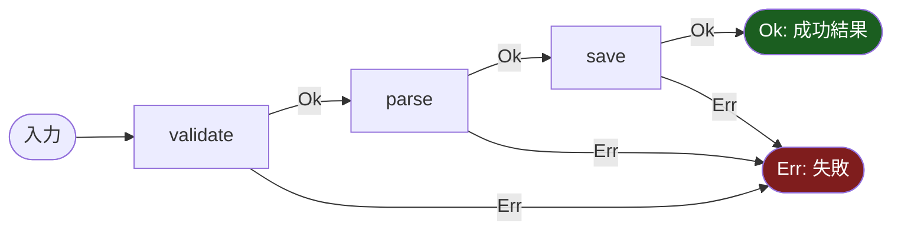
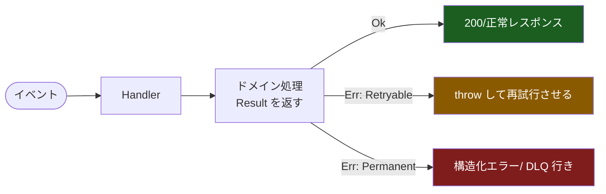

# エラーハンドリングと Result 型 — try-catch なしでどう安全に失敗を扱うか（2026-07-29）

作成日: 2026-07-29 / STATUS: INFO / TOPIC: RESULT / 対象: 設計ナレッジ（言語横断のエラーハンドリング設計）

「例外（try-catch）に頼らず、**失敗を戻り値の型として明示的に扱う**」設計＝ **Result 型** の考え方を整理します。Rust の標準ライブラリ `Result<T, E>` を範とし、**TypeScript / Python / Go** での導入・実装・テスト、そして **FaaS（Lambda 等）でのユースケース**を中心にまとめます。専門用語には都度かんたんな補足を付けています。

---

## 1. 出発点：例外（try-catch）の何が困るのか

多くの言語には `try { ... } catch (e) { ... }` があります。便利ですが、設計上いくつか弱点があります。

- **失敗が型に現れない（暗黙的）:** 関数のシグネチャ `function getUser(id): User` を見ても「これは失敗し得る」ことが分からない。呼び出し側が `catch` を書き忘れても**コンパイルは通ってしまう**。
- **制御フローが飛ぶ:** 例外はコールスタックを一気に遡る「見えない goto」。どこで捕まるか追いにくい。
- **握りつぶし・取りこぼし:** `catch (e) {}` で無言で捨てる、あるいは想定外の例外まで一括で捕まえてバグを隠す。
- **型システムの支援が弱い:** 「どんなエラーが起こり得るか」を型で列挙・網羅チェックしづらい（Java の検査例外は例外的に明示するが、扱いが重く敬遠されがち）。

> 要は「**失敗が第一級の値として扱われていない**」のが根本問題です。

---

## 2. Result 型という発想

**Result 型**は、関数の結果を「**成功（値つき）** または **失敗（エラーつき）** のどちらか」を表す 1 個の値として返す仕組みです。代表格が Rust の標準型です。

```rust
enum Result<T, E> {
    Ok(T),   // 成功。中身は T 型の値
    Err(E),  // 失敗。中身は E 型のエラー
}
```

ポイントは3つ:

1. **失敗が型に現れる:** `fn get_user(id) -> Result<User, DbError>` を見れば「失敗し得る」「失敗の型は `DbError`」が一目で分かる。
2. **無視できない:** Rust では `Result` を使わず放置すると警告。中身を取り出すには「成功/失敗の**両方を処理**する」ことを強制される。
3. **合成できる:** 「成功なら次へ、失敗ならスキップ」を演算子・メソッドで宣言的につなげられる（後述の Railway Oriented Programming）。

> `Result` は「例外の代わり」というより「**失敗を普通のデータとして持ち回る**」設計。`null` を型で潰す `Option`/`Maybe` の兄弟です。

---

## 3. 中核となる操作（言語共通のボキャブラリ）

Result 型のライブラリは、名前が違ってもだいたい同じ操作を持ちます。

| 操作 | 意味 | 直感 |
|---|---|---|
| `map` | 成功値を変換（失敗はそのまま素通り） | 「成功のときだけ中身を加工」 |
| `mapErr` | 失敗値を変換（成功はそのまま） | 「エラーの型/文言を整える」 |
| `andThen` / `flatMap` / `bind` | 「次の失敗し得る処理」へ連結 | 「成功なら次のステップへ、失敗なら以降を飛ばす」 |
| `unwrapOr` / `getOrElse` | 失敗時のデフォルト値を与えて中身を取り出す | 「ダメなら既定値で」 |
| `match` / `fold` | 成功・失敗の**両方**を分岐処理 | 「最終的にどう扱うか決める」 |

### Railway Oriented Programming（線路の比喩）

処理を「**成功の線路**」と「**失敗の線路**」の2本のレールとしてイメージする考え方です。各ステップは成功なら上のレールを進み、どこかで失敗したら下のレールに落ちて、以降のステップを**スキップして終点まで**流れます。



`andThen` はまさにこの「Ok のときだけ次へ進め、Err なら下のレールへ落とす」連結器です。try-catch のように制御が飛ぶのではなく、**値が線路の上を流れていく**ので追いやすいのが利点です。

---

## 4. 言語別：導入・実装・テスト

### 4-1. Rust（標準ライブラリ・お手本）

標準型なので導入不要。`?` 演算子が Railway を言語機能として提供します。

```rust
use std::num::ParseIntError;

fn double(s: &str) -> Result<i32, ParseIntError> {
    let n = s.parse::<i32>()?; // 失敗なら即 Err を return（下のレールへ）
    Ok(n * 2)
}

fn main() {
    match double("21") {
        Ok(v)  => println!("ok: {}", v), // ok: 42
        Err(e) => eprintln!("err: {}", e),
    }
}
```

- **`?` 演算子:** `Result` が `Err` ならその場で関数から `Err` を返す。成功なら中身を取り出して継続。これが「早期リターン＋レール切替」を1文字で表現。
- **テスト:** 標準の `#[test]` で `assert!(matches!(double("x"), Err(_)))` のように成功/失敗の両方を検証。

参考: <https://doc.rust-lang.org/std/result/> ／ 書籍 The Book「Error Handling」<https://doc.rust-lang.org/book/ch09-00-error-handling.html>

### 4-2. TypeScript（`neverthrow`）

JS/TS には Result が標準にないため、デファクトの `neverthrow` を使うのが手軽です。

**導入:**
```bash
npm install neverthrow
```

**実装:**
```typescript
import { ok, err, Result, ResultAsync } from "neverthrow";

type User = { id: string; name: string };

function findUser(id: string): Result<User, "NOT_FOUND"> {
  if (id === "1") return ok({ id, name: "Taro" });
  return err("NOT_FOUND");
}

// 合成（Railway）
const label = findUser("1")
  .map((u) => u.name.toUpperCase())        // 成功時だけ変換
  .mapErr((e) => `error: ${e}`)            // 失敗時だけ整形
  .unwrapOr("(none)");                     // 失敗ならデフォルト

// 非同期は ResultAsync（Promise<Result<T,E>> のラッパ）
const ra = ResultAsync.fromPromise(fetch("/api"), () => "FETCH_FAILED" as const);
```

- `ResultAsync` で `async` 処理も同じ書き味に。`fromThrowable` で**既存の投げる関数を Result 化**できる（境界で例外を型に閉じ込める常套手段）。
- **テスト（Jest/Vitest）:** `expect(findUser("1").isOk()).toBe(true)` ／ `res.match({ ok, err })` で両分岐を検証。`_unsafeUnwrap()` はテスト専用の取り出しに便利。

参考: <https://github.com/supermacro/neverthrow> ／ npm <https://www.npmjs.com/package/neverthrow>
（関数型を深く使うなら `Effect`（<https://effect.website/>）や `fp-ts` の `Either` も選択肢）

### 4-3. Python（`returns`）

`dry-python/returns` が Result/Maybe と Railway を提供します。

**導入:**
```bash
pip install returns
```

**実装:**
```python
from returns.result import Result, Success, Failure, safe

def parse_int(s: str) -> Result[int, str]:
    if s.isdigit():
        return Success(int(s))
    return Failure("not a number")

# @safe: 例外を投げる関数を Result 化（成功=Success / 例外=Failure）
@safe
def divide(a: int, b: int) -> float:
    return a / b   # b=0 なら例外 → Failure(ZeroDivisionError) に変換される

# 合成
result = parse_int("21").map(lambda n: n * 2)   # Success(42)
value = result.value_or(-1)                      # 失敗なら -1
```

- `.map` / `.bind`（＝flatMap）/ `.alt`（mapErr相当）/ `.value_or` を備える。`flow`・`pipe` で宣言的に連結。
- **mypy 連携**が強く、`Result[int, str]` の型で「どんな失敗があるか」を静的検査できる（returns は型チェック前提の設計）。
- **テスト（pytest）:** `assert parse_int("x") == Failure("not a number")`（Success/Failure は等値比較可能で書きやすい）。

参考: <https://github.com/dry-python/returns> ／ Result <https://returns.readthedocs.io/en/latest/pages/result.html> ／ Railway <https://returns.readthedocs.io/en/latest/pages/railway.html>

### 4-4. Go（言語思想としての「明示エラー」）

Go は **`Result` 型を持たない**代わりに、「**エラーを戻り値の第2値として必ず返す**」という規約でほぼ同じ効果を得ます（＝失敗が型・シグネチャに現れる）。

**実装（王道）:**
```go
func FindUser(id string) (User, error) {
    if id != "1" {
        return User{}, fmt.Errorf("find user %s: %w", id, ErrNotFound) // %w でラップ
    }
    return User{ID: id, Name: "Taro"}, nil
}

func caller() error {
    u, err := FindUser("2")
    if err != nil {
        return err // 早期リターン（Go 版 Railway）
    }
    _ = u
    return nil
}
```

- **`errors.Is` / `errors.As`:** ラップされたエラーの**根本原因を判定**・型で取り出す。`fmt.Errorf("...: %w", err)` でチェーンを作る。
- **`errors.Join`（Go 1.20+）:** 複数エラーを束ねる。
- Result ライクな型が欲しい場合はライブラリ `samber/mo`（`mo.Result[T]`）等もあるが、**Go では標準の `(T, error)` 規約が圧倒的主流**。無理に Result 型を持ち込むと非慣用的になりやすい。
- **テスト:** `if !errors.Is(err, ErrNotFound) { t.Fatalf(...) }` のようにセンチネルエラー/型で検証。テーブルドリブンテストと相性が良い。

参考: <https://pkg.go.dev/errors> ／ Go Blog「Working with Errors」<https://go.dev/blog/go1.13-errors>

---

## 5. FaaS（Lambda 等）での適用がなぜ「おすすめ」か

サーバーレス関数（AWS Lambda / Cloud Functions 等）は Result 型の考え方と特に相性が良い領域です。

- **ハンドラ境界で「投げる」は事故になりやすい:** 未捕捉例外はランタイムに握られ、**呼び出し元には曖昧な 500 / スタックトレース**として漏れる。境界で **Result に畳んで「成功レスポンス or 構造化エラーレスポンス」に変換**すると、返り値が予測可能になる。
- **リトライ制御に効く:** SQS/EventBridge 等の非同期起動では「失敗＝再試行」になる。Result でエラーを**分類**（`Retryable` / `Permanent`）しておくと、「一時障害は throw して再試行させる／恒久エラーは Ok 相当で DLQ に流す」など**意図した挙動**を設計できる。
- **部分失敗の表現:** バッチ（複数レコード）処理では「一部成功・一部失敗」を `Result[]` の配列で表し、`BatchItemFailures` として返すのが定石。全体 throw だと成功分までロールバックされる。
- **コールドスタート下の可観測性:** 失敗を値として持つと、ログ/メトリクス（`Ok/Err` のカウント）に落としやすく、例外の飛び先を追う必要が減る。



**設計指針:** 「ドメイン層は Result を返す（純粋・テスト容易）→ **ハンドラの最外周でだけ** Result を HTTP/キューの語彙（レスポンス・throw）に翻訳する」。例外は“境界の外”に閉じ込めるのがコツ。

---

## 6. テスト戦略（共通の勘所）

- **成功と失敗の両方を必ずテストする:** Result 化の最大の効能は「失敗が明示される」こと。テストでも `Ok` ケースと `Err` ケースを対で書く。
- **エラーの種類を検証する:** 単に「失敗した」ではなく「**どの失敗か**」（`NOT_FOUND` か `TIMEOUT` か）まで assert する。ここが例外の `catch (e)` 一括より強い。
- **境界の変換をテストする:** 「例外を投げる外部 SDK を Result 化するアダプタ」を単体テストし、想定外例外が漏れないことを確認（TS `fromThrowable` / Python `@safe` / Go の wrap）。
- **プロパティ/網羅:** `match`/`fold` で全バリアントを処理しているか（Rust は非網羅だとコンパイルエラー、他言語は lint/型で担保）。

---

## 7. 導入の判断（メリット / 注意点）

**メリット**
- 失敗がシグネチャに現れ、**取りこぼしを型/レビューで防げる**。
- 制御フローが値の流れになり、**追跡・合成・テストが容易**。
- エラーの**分類**が自然にでき、リトライ/フォールバック設計に効く。

**注意点（デメリット）**
- **ボイラープレート増**：小さなスクリプトでは例外の方が手軽なことも。
- **境界の翻訳コスト**：既存の投げるライブラリとの間で変換層が要る。
- **言語慣用との衝突**：Go は標準の `(T, error)` が慣用。Python/TS もチーム合意なしに入れると学習コスト。**「ドメイン層＋境界」から段階導入**が現実的。

> ひとことで：**「失敗を戻り値にする」だけの単純な発想**だが、型システムと組み合わせると堅牢性が段違いになる。特に FaaS のように「境界がむき出しで、リトライが絡む」環境で効く。

---

## 8. 参考URL（公式優先・2026-07 到達性確認済み）

- Rust `std::result`: <https://doc.rust-lang.org/std/result/>
- Rust The Book「Error Handling」: <https://doc.rust-lang.org/book/ch09-00-error-handling.html>
- neverthrow（TS）: <https://github.com/supermacro/neverthrow> ／ npm: <https://www.npmjs.com/package/neverthrow>
- Effect（TS・関数型）: <https://effect.website/>
- returns（Python）: <https://github.com/dry-python/returns> ／ Result: <https://returns.readthedocs.io/en/latest/pages/result.html> ／ Railway: <https://returns.readthedocs.io/en/latest/pages/railway.html>
- Go `errors` パッケージ: <https://pkg.go.dev/errors> ／ Go Blog「Working with Errors」: <https://go.dev/blog/go1.13-errors>
- Railway Oriented Programming（原典・F# for Fun and Profit）: <https://fsharpforfunandprofit.com/rop/>
- AWS Lambda エラーハンドリング（公式）: <https://docs.aws.amazon.com/lambda/latest/dg/invocation-retries.html>

---

> 免責: 本記事は設計知識の概説です。コード例は説明用の最小形で、実運用ではライブラリの最新APIとバージョンをご確認ください。情報は2026-07時点です。

## Author and Ownership / 著作権と所属について

This project was created as a personal initiative and is not connected to any organization or group.
It is published as an individual creative work.

本プロジェクトは個人の活動として作成したものであり、特定の組織や団体の業務とは関係ありません。
個人の創作物として公開しています。
