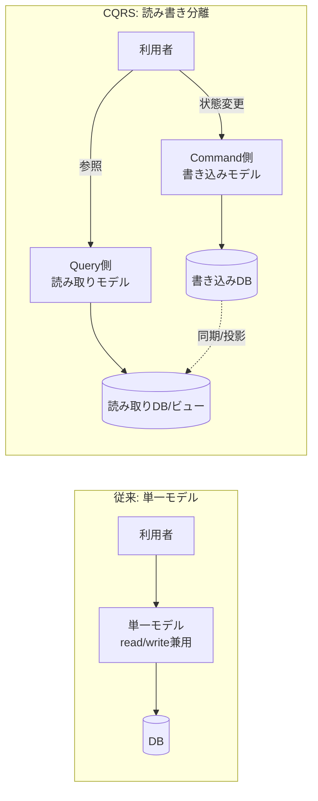
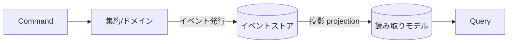

# CQRS 調査 — 読み書きモデルの分離パターン

> **対象**: CQRS（Command Query Responsibility Segregation＝コマンド・クエリ責務分離）。提唱は **Greg Young**、整理・普及は **Martin Fowler**。
> **作成日**: 2026-08-01（JST） / **ステータス**: INFO（情報提供・設計リファレンス）
> **一次情報**: [Martin Fowler: CQRS](https://martinfowler.com/bliki/CQRS.html) / Greg Young の講演・論考

---

## 用語ミニ解説（初心者向け）

- **コマンド（Command）**: システムの**状態を変える**操作。「注文する」「残高を減らす」など。原則、値を返さない（副作用が目的）。
- **クエリ（Query）**: システムの状態を**読み取るだけ**の操作。何も変えず、値を返す。
- **モデル（model）**: データとその扱い方の設計。ここでは「書き込み用モデル」「読み取り用モデル」を指す。
- **CQS（Command Query Separation）**: Bertrand Meyer 提唱の原則。「1つのメソッドはコマンドかクエリのどちらか一方であるべき」。CQRS の源流。
- **イベントソーシング（Event Sourcing）**: 現在の状態ではなく「起きた出来事（イベント）の列」を記録し、再生して状態を導く手法。CQRS とよく併用されるが**別物**。
- **結果整合性（eventual consistency）**: 更新が全体に反映されるまで一時的にズレが生じるが、最終的には一致する、という整合モデル。

---

## 1. CQRS とは（概要）

**CQRS** は、**データを「更新するためのモデル」と「読み取るためのモデル」を分離する**アーキテクチャパターンです。Martin Fowler は次のように説明しています。

> "At its heart is the notion that you can use a **different model to update information** than the model you use to **read information**."
> （中核は「情報を更新するモデルと、情報を読むモデルを別々にできる」という考え方）— [martinfowler.com](https://martinfowler.com/bliki/CQRS.html)

従来の CRUD では、1つのモデル（＝1つのテーブル／エンティティ）で読み書き両方を担います。CQRS では**書き込み系（Command）**と**読み取り系（Query）**を別々の経路・別々のモデルに分けます。

### 通常の CRUD と CQRS の対比

---

## 2. CQS と CQRS の違い

- **CQS（メソッドレベル）**: 「1つのメソッドは、状態を変える(Command)か、値を返す(Query)かのどちらか一方」。オブジェクト内の**メソッド設計**の原則。
- **CQRS（アーキテクチャレベル）**: CQS の考え方を**モデル／システム全体**へ拡張。読み取り側と書き込み側で**別々のオブジェクト・別々のデータストア**を持ってよい、とする。

> つまり CQRS は「CQS をコンポーネント／サービス単位まで押し上げたもの」と理解すると分かりやすい。

---

## 3. 典型的な構成要素

- **Command**: 「〜せよ」という意図を表すオブジェクト（例: `PlaceOrderCommand`）。
- **Command Handler**: コマンドを受け、ビジネスルール検証 → 状態変更を実行。
- **Query**: 「〜を取得」する要求（例: `GetOrderSummaryQuery`）。
- **Query Handler / Read Model**: 画面表示に最適化された非正規化ビューを返す。
- **（任意）同期の仕組み**: 書き込み後、読み取りモデルへ反映（同期更新／イベント経由の非同期投影）。

### イベントソーシングとの併用（発展形）

イベントソーシングと組むと、書き込みは「イベントの追記」、読み取りは「イベントを投影した専用ビュー」となり、CQRS と非常に相性が良い。ただし**CQRS にイベントソーシングは必須ではない**点に注意。

---

## 4. メリット・デメリット

### メリット
- **読み書きを個別に最適化・スケール**: 読み取りが多いシステムで、Query 側だけ複製・キャッシュ・非正規化してスケールできる。
- **モデルの単純化**: 「更新用の複雑な整合性ロジック」と「表示用の見やすい形」を分離でき、各モデルが素直になる。
- **セキュリティ／権限分離**: 書き込み経路を絞りやすい。
- **タスクベースUI・ドメイン駆動設計(DDD)と好相性**。

### デメリット・注意点
- **複雑性の増加**: モデル・経路が2系統になり、コード量とインフラが増える。
- **結果整合性の難しさ**: 読み取りモデルへの反映に遅延が出ると「書いたのにすぐ見えない」問題が生じ、UI設計での配慮が必要。
- **適用範囲を誤ると逆効果**: 単純な CRUD アプリに入れると過剰設計になる。

> **Fowler の警告**: CQRS は有用だが「**多くのシステムでは CRUD のままが最適**であり、複雑さに見合う領域に限定して使うべき」。全体に一律適用せず、**境界づけられたコンテキスト（bounded context）単位**で選択適用するのが定石。

---

## 5. 使いどころ／避けどころ

**向いている**
- 読み取りと書き込みの**負荷・要件が大きく異なる**（読み取りが桁違いに多い等）。
- ドメインが複雑で、更新ロジックと表示要件が食い違う。
- コラボレーティブ／高並行なドメイン（在庫・注文・金融など）。
- イベントソーシングや監査ログが要件にある。

**避けたほうがよい**
- 単純な管理画面・CRUD 中心の小規模アプリ。
- チームが結果整合性を運用しきれない段階。

---

## 参考リンク（一次情報優先）

- [CQRS — Martin Fowler](https://martinfowler.com/bliki/CQRS.html) — 定義の一次解説
- [CQS（Command Query Separation）— Martin Fowler](https://martinfowler.com/bliki/CommandQuerySeparation.html)
- [Microsoft: CQRS pattern（Azure Architecture Center）](https://learn.microsoft.com/azure/architecture/patterns/cqrs)
- Greg Young『CQRS Documents』（提唱者本人の論考）

---

> 関連ドキュメント: `20260801_INFO_SOLID_solid-principles.md`（SOLID原則）/ `20260801_INFO_DESIGNPATTERN_gof-design-patterns.md`（GoFデザインパターン）
