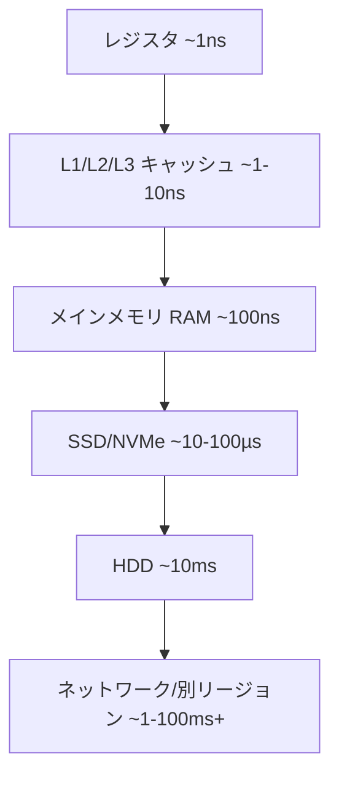
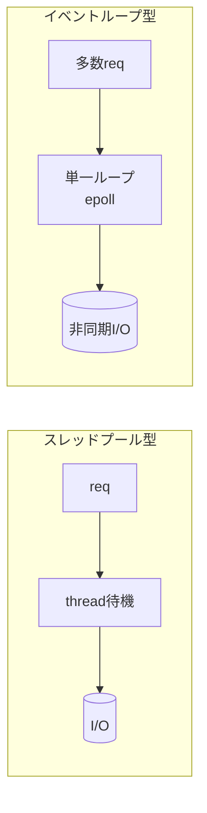
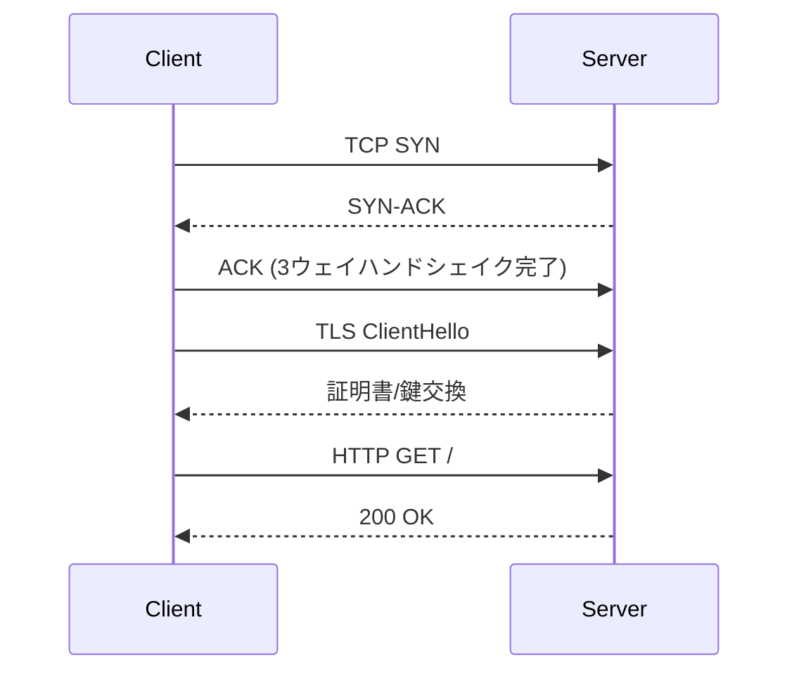

# コンピュータサイエンス基礎 — バックエンド／インフラ／クラウドエンジニア向け

> **対象**: 実務で効くコンピュータサイエンス（CS）の土台。バックエンド／インフラ／クラウド観点で整理。
> **作成日**: 2026-08-01（JST） / **ステータス**: INFO（情報提供・技術リファレンス）
> **狙い**: 「なぜ遅いのか」「なぜ落ちるのか」「なぜスケールするのか」を原理から説明できる土台を作る。

---

## 用語ミニ解説（初心者向け）

- **プロセス（process）**: OS がメモリ空間を割り当てて動かす実行単位。互いのメモリは基本隔離される。
- **スレッド（thread）**: プロセス内の実行の流れ。メモリを共有するため軽いが、競合（レース）に注意。
- **システムコール（system call）**: アプリが OS カーネルの機能（ファイル/ネット/メモリ）を呼ぶ入口。
- **レイテンシ（latency）／スループット（throughput）**: 1件の応答時間 ／ 単位時間あたりの処理量。別物。
- **キャッシュ（cache）**: 速い記憶に「よく使うデータ」を置き、遅い記憶へのアクセスを減らす仕組み。
- **冪等性（idempotency）**: 同じ操作を何度実行しても結果が変わらない性質。リトライ設計の要。

---

## 1. なぜバックエンド/インフラ屋こそ CS を押さえるべきか

フレームワークやマネージドサービスが抽象化してくれても、**性能・信頼性・コストの限界は物理と原理が決める**。CS の基礎は「抽象が漏れた瞬間（The Law of Leaky Abstractions）」に効きます。本書はコード実装というより、**システムの挙動を予測する道具**として CS を整理します。

---

## 2. 記憶階層とレイテンシ感覚（一番大事）

CPU から遠いほど「大容量・低速・低コスト」。この階層感覚が性能設計の根幹です。

**Latency Numbers（概算・桁感覚）**

| 操作 | おおよそ | メモリ比 |
|---|---|---|
| L1 参照 | ~1 ns | 1x |
| メインメモリ参照 | ~100 ns | 100x |
| SSD ランダム読み | ~16 µs | 16万x |
| 同一DC内 往復(RTT) | ~0.5 ms | 50万x |
| リージョン間 往復 | ~数十〜100 ms | 数億x |

> **実務教訓**: 「メモリは速い、ディスクは遅い、ネットワークはもっと遅い」。1リクエストで**遠い層に何回触るか**が性能を決める。N+1クエリやチャットチャッティなAPI呼び出しが致命傷になる理由。

---

## 3. OS の要点（プロセス・スレッド・スケジューリング・仮想メモリ）

- **プロセス vs スレッド**: 隔離が欲しければプロセス、共有・軽量が欲しければスレッド。多くのサーバは「プロセス×コア数＋非同期I/O」で並行性を稼ぐ。
- **コンテキストスイッチ**: CPU が実行対象を切り替えるコスト。スレッド過多はスイッチ地獄を招く。
- **仮想メモリ / ページング**: 各プロセスは「自分専用の連続メモリ」に見える仮想アドレスを持つ。実体は物理ページに写像。足りなくなると**スワップ**（ディスク退避＝激遅）。
- **ブロッキング vs ノンブロッキング I/O**: I/O 待ちでスレッドを止めるか、イベントループ（epoll/kqueue）で多重化するか。Node.js/nginx が少スレッドで高並行を捌ける理由がこれ。

---

## 4. 並行性・並列性（Concurrency vs Parallelism）

- **並行(concurrency)**: 複数タスクを「切り替えながら」進める（見かけ同時）。
- **並列(parallelism)**: 複数コアで「本当に同時」に進める。
- **競合の三悪**: レースコンディション／デッドロック／スタベーション。共有状態には **ロック・アトミック操作・不変データ・メッセージパッシング** で対処。
- **Amdahl の法則**: 直列部分が残る限り、コアを増やしても速度向上には上限がある。「並列化できない20%」があれば最大5倍まで、が示す教訓。

---

## 5. ネットワーク（バックエンド/クラウドの生命線）

- **TCP/IP スタック**: リンク → IP（到達） → TCP（信頼性・順序・再送）/UDP（高速・非保証） → アプリ（HTTP等）。
- **HTTP の進化**: 1.1（keep-alive）→ 2（多重化）→ 3（QUIC/UDP ベース、HoLブロッキング解消）。
- **TLS**: 公開鍵で鍵交換 → 共通鍵で暗号化。ハンドシェイクのRTTコストに注意（TLS1.3で短縮）。
- **DNS**: 名前→IP解決。TTLとキャッシュが挙動・障害に大きく効く。
- **押さえるべき数値**: RTT、帯域、コネクション確立コスト（TCP+TLSで複数RTT）。コネクションプーリングが効く理由。

---

## 6. データの表現（バグの温床）

- **2進数・ビット演算**: フラグ管理、権限ビット、ビットマスク。
- **文字コード（UTF-8）**: 可変長。バイト数≠文字数。切り詰めで文字化けする定番バグ。
- **浮動小数点（IEEE754）**: `0.1 + 0.2 != 0.3`。金額は整数（最小単位）か Decimal 型で扱う。
- **エンディアン / タイムゾーン / エポック**: 分散システムで時刻・バイト順の食い違いが障害を生む。UTCで持ち、境界で変換。

---

## 7. 分散システムの原理（クラウドの核心）

- **CAP 定理**: ネットワーク分断(P)は避けられない前提で、**一貫性(C)と可用性(A)のどちらを優先するか**を選ぶ。多くのクラウドDBは調整可能。
- **結果整合性(eventual consistency)**: 即時一致を諦め、最終的な一致で高可用・高スケールを得る（S3・DynamoDB等の発想）。
- **冪等性とリトライ**: ネットワークは必ず失敗する。**リトライ前提＝冪等な設計**（冪等キー、`PUT`志向）。
- **障害モデル**: タイムアウト・部分障害・スプリットブレイン。ヘルスチェック／サーキットブレーカ／指数バックオフで守る。
- **一貫性ハッシュ / レプリケーション / シャーディング**: スケールアウトとデータ分散の定石（詳細は DSA 編参照）。

---

## 8. 抽象化の階層（コンパイル〜実行）

- **コンパイラ / インタプリタ / JIT**: ソース→機械語の変換方式の違いが起動速度・実行速度・最適化に影響。
- **仮想化 / コンテナ**: VM（ハードを仮想化）vs コンテナ（OSカーネル共有・namespace/cgroups）。**軽量・高密度なコンテナ**がクラウドの主流になった理由。
- **ガベージコレクション(GC)**: 自動メモリ管理。停止時間(GC pause)がレイテンシSLOに響く。

---

## 9. 性能を語るための計算量（DSA編への橋渡し）

- **Big-O**: 入力サイズ n に対する増え方。`O(1) < O(log n) < O(n) < O(n log n) < O(n²)`。
- 実務では「アルゴリズムの計算量 × 記憶階層のレイテンシ」で効くコストが決まる。O(n²) でも n が小さくメモリ内なら速く、O(n) でもリモートI/Oを n 回叩けば遅い。
- 詳細は姉妹ドキュメント **`20260801_INFO_DSA_data-structures-and-algorithms.md`** を参照。

---

## 10. 現場チェックリスト（原理を実務に落とす）

- 遅い時: **どの記憶階層に何回触っているか**を数える（N+1、リモート往復回数）。
- 落ちる時: **部分障害・タイムアウト・リトライの嵐**を疑う。冪等性は担保されているか。
- スケールしない時: **共有状態・ロック・直列部分**（Amdahl）を探す。
- コスト高い時: キャッシュ階層・データ転送（リージョン跨ぎegress）・過剰なポーリングを見直す。

---

## 参考リンク

- [Latency Numbers Every Programmer Should Know（Jeff Dean 由来の一覧）](https://gist.github.com/jboner/2841832)
- [Operating Systems: Three Easy Pieces（無料OS教科書, OSTEP）](https://pages.cs.wisc.edu/~remzi/OSTEP/)
- [High Performance Browser Networking（Ilya Grigorik, 無料）](https://hpbn.co/)
- [The Law of Leaky Abstractions（Joel Spolsky）](https://www.joelonsoftware.com/2002/11/11/the-law-of-leaky-abstractions/)
- 書籍: 『Designing Data-Intensive Applications』(Martin Kleppmann) — 分散データ系の決定版

---

> 関連ドキュメント: `20260801_INFO_DSA_data-structures-and-algorithms.md`（データ構造とアルゴリズム）
