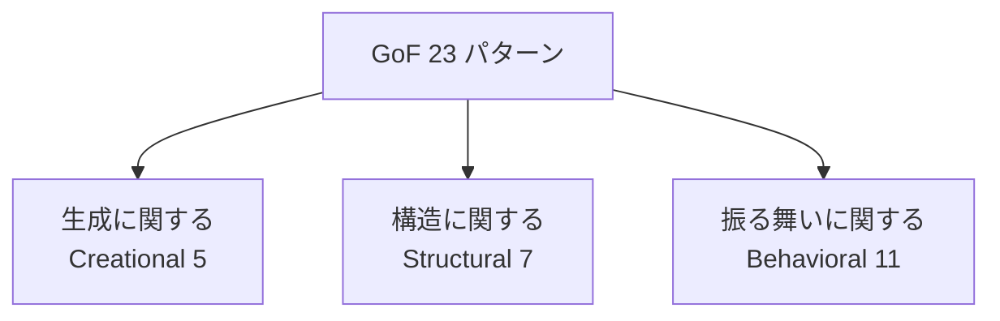

# デザインパターン 調査 — GoF 23パターンの全体像

> **対象**: デザインパターン（Design Patterns）。特に **GoF（Gang of Four）の23パターン**を中心に整理。
> **作成日**: 2026-08-01（JST） / **ステータス**: INFO（情報提供・設計リファレンス）
> **一次情報**: 書籍『Design Patterns: Elements of Reusable Object-Oriented Software』（Gamma, Helm, Johnson, Vlissides, 1994） / [Refactoring.Guru](https://refactoring.guru/design-patterns)

---

## 用語ミニ解説（初心者向け）

- **デザインパターン（design pattern）**: よくある設計上の問題に対する「再利用可能な定石（解決テンプレート）」。コードそのものではなく**設計のアイデア**。
- **GoF（Gang of Four＝四人組）**: 上記書籍の著者4名の通称。ここから「GoF パターン」と呼ばれる23個が有名。
- **委譲（delegation）**: 自分で処理せず、別のオブジェクトに任せること。
- **継承（inheritance）／合成（composition）**: 機能を得る2手段。GoF は「継承より合成を優先せよ」を重視。
- **ポリモーフィズム（polymorphism＝多態性）**: 同じ呼び出しで、対象の型に応じた振る舞いをさせる仕組み。

---

## 1. デザインパターンとは（概要）

デザインパターンは、**熟練者が繰り返し使ってきた設計の解決策に名前を付け、共有可能にしたもの**です。1994年の GoF 本が23個を体系化し、以後の標準語彙になりました。

**なぜ使うのか**
- **共通言語**: 「ここはFactoryで」「Observerで通知」と言えば、設計意図が一瞬で伝わる。
- **実績ある解**: よくある落とし穴を回避した定石を再利用できる。
- **保守性・拡張性**: 変更に強い構造（多くは SOLID と親和）を導きやすい。

**注意（アンチパターン化に注意）**
- パターンは**目的ではなく道具**。「使うために使う」と過剰設計になる。まず問題があり、それに合うパターンを当てる。

---

## 2. GoF 23パターンの3分類

GoF はパターンを目的別に3グループへ分けています。

| 分類 | 主眼 | 含まれるパターン数 |
|---|---|---|
| **Creational（生成）** | オブジェクトの**作り方**を柔軟に | 5 |
| **Structural（構造）** | クラス／オブジェクトの**組み立て方** | 7 |
| **Behavioral（振る舞い）** | オブジェクト間の**責務分担と連携** | 11 |

---

## 3. Creational（生成に関するパターン）5種

| パターン | 一言で | 典型用途 |
|---|---|---|
| **Singleton** | インスタンスを1つに限定 | 設定・ログ・接続プール |
| **Factory Method** | 生成をサブクラスに委ねる | 具象クラスを隠して生成 |
| **Abstract Factory** | 関連オブジェクト群をまとめて生成 | UIテーマ、OS別部品群 |
| **Builder** | 複雑な生成を段階的に組み立て | 多引数オブジェクト、DSL的構築 |
| **Prototype** | 既存インスタンスを複製して生成 | 生成コストが高いオブジェクト |

> ポイント: 「**new を直接書かない**」で、生成箇所の変更に強くする発想。

---

## 4. Structural（構造に関するパターン）7種

| パターン | 一言で | 典型用途 |
|---|---|---|
| **Adapter** | 互換性のない I/F を橋渡し | 既存/外部ライブラリの適合 |
| **Bridge** | 抽象と実装を分離し独立に拡張 | 機能軸×実装軸の組合せ爆発回避 |
| **Composite** | 個と集合を同一視（木構造） | ファイル/フォルダ、UIツリー |
| **Decorator** | 機能を動的に積み重ね | ストリーム加工、権限ラップ |
| **Facade** | 複雑なサブシステムに単純窓口 | ライブラリの入口API |
| **Flyweight** | 共有で大量オブジェクトを軽量化 | 文字・アイコン等の共有 |
| **Proxy** | 代理を挟んでアクセス制御/遅延 | 遅延ロード、キャッシュ、権限 |

> ポイント: 「**継承より合成**」で柔軟に構造を組む（特に Decorator / Bridge）。

---

## 5. Behavioral（振る舞いに関するパターン）11種

| パターン | 一言で | 典型用途 |
|---|---|---|
| **Strategy** | アルゴリズムを差し替え可能に | ソート/課金/割引ロジック切替 |
| **Observer** | 状態変化を購読者へ通知 | イベント、UIバインディング |
| **Command** | 要求をオブジェクト化 | Undo/Redo、キュー、ログ |
| **State** | 状態ごとに振る舞いを切替 | ステートマシン |
| **Template Method** | 手順の骨格を固定し一部を可変 | フレームワークの拡張点 |
| **Iterator** | 集合の走査手段を統一 | コレクション反復 |
| **Chain of Responsibility** | 処理を連鎖で順に委譲 | ミドルウェア、承認フロー |
| **Mediator** | オブジェクト間仲介で結合を低減 | 複雑なUI部品間調整 |
| **Memento** | 状態を保存/復元 | スナップショット、Undo |
| **Visitor** | 構造を変えず新操作を追加 | AST走査、集計処理 |
| **Interpreter** | 簡易言語の文法を解釈 | ルール式、DSL評価 |

> ポイント: 「**振る舞いの変更**」を if 分岐でなく**多態＋委譲**で吸収し、OCP（開放閉鎖）を満たす。

---

## 6. よく使う代表例（実務の頻出度）

現場で特に頻出なのは以下。まずここから押さえると効果的です。

- **Strategy** — 条件分岐の塊をアルゴリズム差し替えに（`if/else` の巨大化を防ぐ）。
- **Factory Method / Abstract Factory** — DI・テスト容易性の土台。
- **Observer** — 現代のイベント駆動／リアクティブ UI の基礎（Pub/Sub）。
- **Decorator** — 機能の合成的追加（ミドルウェア、ラッパー）。
- **Adapter / Facade** — 外部・レガシー統合の定番。
- **Command** — Undo・ジョブキュー・CQRS の Command と概念的に接続。

---

## 7. SOLID・CQRS との関係

- **Strategy / Template Method / Factory** は **OCP（開放閉鎖）** と **DIP（依存性逆転）** を実装レベルで支える。
- **Command パターン**は、CQRS の「Command（状態変更の意図をオブジェクト化）」と発想が地続き。
- パターンは SOLID を「具体的にどう書くか」の**カタログ**、SOLID はパターンが従うべき**原則**、という補完関係。

---

## 8. 使う上での指針

- **問題ドリブンで選ぶ**: 「変化する軸は何か？」を見極め、その変化を吸収するパターンを当てる。
- **入れすぎない**: 小規模・単純なコードに23パターンを敷き詰めない。可読性が最優先。
- **言語機能で代替できることも**: 関数が第一級の言語では Strategy を「関数を渡す」で済ませられる等、言語の表現力に合わせて簡潔に。

---

## 参考リンク（一次情報優先）

- 書籍『Design Patterns: Elements of Reusable Object-Oriented Software』(GoF, 1994) — 原典
- [Refactoring.Guru — Design Patterns（図解豊富・多言語サンプル）](https://refactoring.guru/design-patterns)
- [Design Patterns（Wikipedia, 23パターン一覧）](https://en.wikipedia.org/wiki/Design_Patterns)
- Martin Fowler『Patterns of Enterprise Application Architecture』（エンタープライズ向けパターン集）

---

> 関連ドキュメント: `20260801_INFO_SOLID_solid-principles.md`（SOLID原則）/ `20260801_INFO_CQRS_command-query-responsibility-segregation.md`（CQRS）
