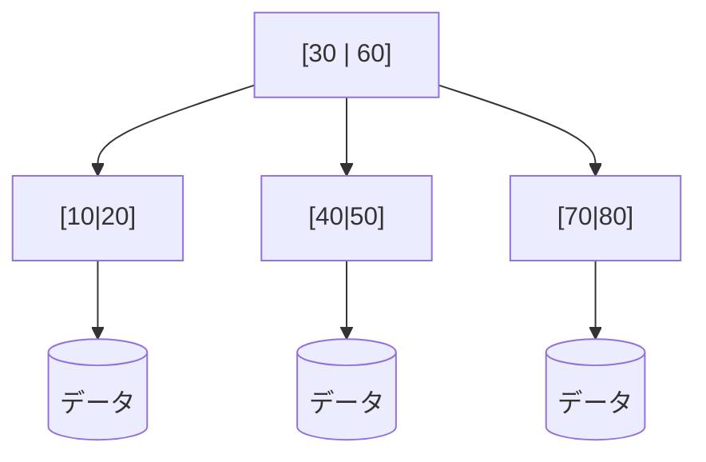
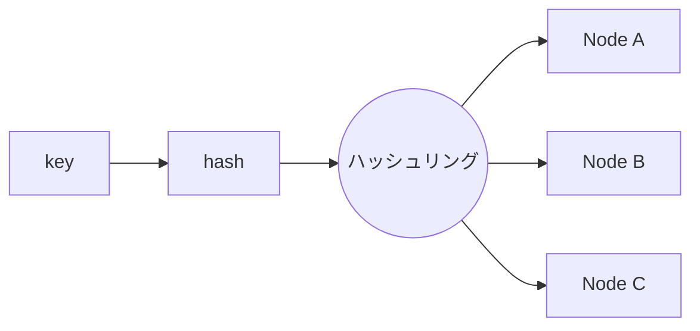
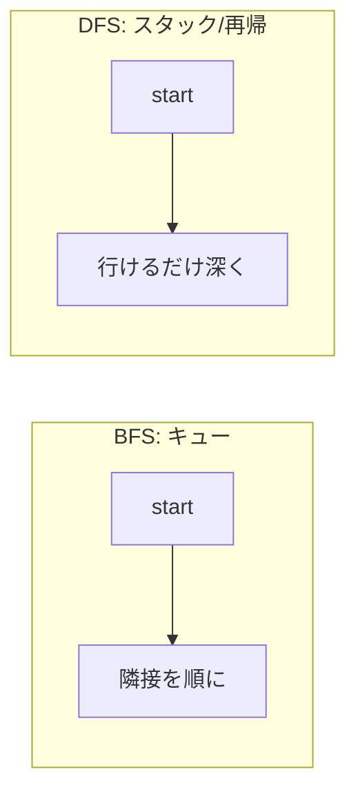

# データ構造とアルゴリズム — バックエンド／インフラ／クラウドエンジニア向け

> **対象**: 実務で効くデータ構造とアルゴリズム（DSA）。DB・キャッシュ・分散システム観点で整理。
> **作成日**: 2026-08-01（JST） / **ステータス**: INFO（情報提供・技術リファレンス）
> **狙い**: 競プロ知識ではなく、「なぜこのDBは速いのか」「なぜこの設計でスケールするのか」を説明できる道具箱。

---

## 用語ミニ解説（初心者向け）

- **計算量（complexity）**: 入力サイズ n が増えたとき、時間やメモリがどれだけ増えるか。
- **Big-O 記法**: 最悪ケースの増え方を表す上界。定数は無視し「増え方の形」だけを見る。
- **償却計算量（amortized）**: たまに重い操作があっても、ならすと平均的に軽い、という見方（動的配列の追加など）。
- **ハッシュ（hash）**: 任意データを固定長の値に変換する関数。分散配置・高速検索の基盤。
- **不変（immutable）**: 一度作ったら変更しないデータ。並行処理で安全。

---

## 1. Big-O：まず速さの物差し

| 記法 | 名前 | n=1,000,000 の目安 | 例 |
|---|---|---|---|
| O(1) | 定数 | 1 | ハッシュ参照、配列index |
| O(log n) | 対数 | ~20 | 二分探索、B木探索 |
| O(n) | 線形 | 1,000,000 | 全走査 |
| O(n log n) | 準線形 | ~2000万 | 高速ソート |
| O(n²) | 二乗 | 1兆 | 二重ループ（要注意） |

> **実務の勘所**: 「計算量 × 記憶階層のレイテンシ」で真のコストが決まる（CS編参照）。O(n) でもリモートI/Oを n 回叩けば遅い。**メモリ内 O(n²) が、リモート O(n) より速いことすらある**。

---

## 2. 基本データ構造と使いどころ

| 構造 | 参照 | 挿入/削除 | 特徴・実務用途 |
|---|---|---|---|
| **配列 (Array)** | O(1) index | O(n) 途中挿入 | 連続メモリでキャッシュ効率◎ |
| **動的配列 (Dynamic Array)** | O(1) | 末尾 O(1)償却 | 大半の「リスト」の実体 |
| **連結リスト (Linked List)** | O(n) | O(1)（位置既知） | ポインタ追跡でキャッシュ効率× |
| **スタック / キュー** | — | O(1) | LIFO/FIFO。ジョブ処理・DFS/BFS |
| **ハッシュテーブル** | O(1)平均 | O(1)平均 | 辞書・インデックス・重複排除の主役 |
| **ヒープ (Heap)** | 最小/最大 O(1) | O(log n) | 優先度付きキュー、スケジューラ |
| **二分探索木/平衡木** | O(log n) | O(log n) | 順序付き集合、範囲検索 |
| **トライ (Trie)** | O(語長) | O(語長) | 前方一致、ルーティング、オートコンプリート |
| **グラフ (Graph)** | — | — | 依存関係、ネットワーク、経路 |

### ハッシュテーブルの注意（実務頻出）
- **衝突(collision)**: 別データが同じハッシュ値に。チェイン法／オープンアドレス法で対処。
- **最悪 O(n)**: 悪意ある衝突攻撃(HashDoS)や偏りで劣化。
- **リハッシュ**: 拡張時に全再配置＝一時的スパイク。

---

## 3. DB を支えるデータ構造（インフラ屋の必修）

### B木 / B+木 — RDB インデックスの心臓
ディスクは「ブロック単位」で読む。**1ノードに多数のキーを詰めた浅い木**にすることで、ディスクI/O回数（＝木の高さ）を最小化します。数百万行でも高さ3〜4段＝数回のI/Oで到達。

- **B+木**: 葉をリンクで繋ぎ**範囲スキャン**が高速。MySQL(InnoDB)/PostgreSQL のインデックス既定。

### LSM木 (Log-Structured Merge Tree) — 書き込み最適化
書き込みをメモリ(memtable)に貯めて順次ディスクへ**追記フラッシュ**、後でバックグラウンド圧縮(compaction)。**書き込みスループット重視**。Cassandra / RocksDB / LevelDB / ScyllaDB の基盤。

> B木＝読み最適・更新ややコスト、LSM＝書き最適・読みは複数SSTable探索＋Bloom filterで補助。**ワークロードで選ぶ**。

### Bloom Filter — 「無い」を高速判定
確率的データ構造。「**確実に無い / たぶん有る**」を極小メモリで判定。偽陽性はあるが偽陰性はゼロ。LSMの無駄なディスク探索削減、キャッシュ前段、重複URL判定などに多用。

---

## 4. スケール/分散を支えるアルゴリズム（クラウド必修）

### 一貫性ハッシュ (Consistent Hashing)
サーバ台数が変わっても**再配置されるキーを最小化**する分散手法。通常のハッシュ(`key % N`)は N が変わると全再配置＝キャッシュ全崩壊。リング上に配置し、追加/削除の影響を隣接区間に限定。**分散キャッシュ(memcached)・DynamoDB・CDN・ロードバランサ**の基盤。

### レートリミット・アルゴリズム
- **Token Bucket / Leaky Bucket**: バースト許容 or 平滑化。API Gateway の定番。
- **Sliding Window**: 期間内カウントで公平に制限。

### キャッシュ追い出し (Eviction)
- **LRU（最も長く使われていないものを捨てる）**: ハッシュ＋双方向リストで O(1) 実装。
- **LFU（使用頻度が低いものを捨てる）** / **TTL**。CDN・Redis・DBバッファプールで選択。

---

## 5. 押さえるべきアルゴリズム

- **二分探索 (Binary Search)**: ソート済みで O(log n)。境界条件バグに注意。
- **ソート**: 実用は O(n log n)（マージ/クイック/Timsort）。安定性・メモリを要件で選ぶ。
- **グラフ探索**:
  - **BFS**（幅優先, キュー）: 最短ホップ数、依存の段階解析。
  - **DFS**（深さ優先, スタック/再帰）: 循環検出、トポロジカルソート（依存関係の実行順・ビルド順）。
  - **Dijkstra**: 重み付き最短経路（ネットワークルーティング）。
- **ハッシュ/ダイジェスト**: 重複排除、整合性検証(チェックサム)、コンテンツアドレス。

---

## 6. トレードオフの原則（意思決定の軸）

- **時間 vs 空間**: 速くしたければメモリ（インデックス/キャッシュ）を使う。逆も然り。
- **読み最適 vs 書き最適**: B木 ↔ LSM木、正規化 ↔ 非正規化（CQRSの読みモデル）。
- **一貫性 vs 可用性/レイテンシ**: 強整合の同期コスト ↔ 結果整合の高スケール。
- **正確 vs 近似**: 正確な集合 ↔ Bloom filter / HyperLogLog（基数推定）でメモリ削減。

> **設計の合言葉**: 「**このワークロードは読みが多いか書きが多いか、正確さはどこまで要るか**」。DSA選択はここから逆算する。

---

## 7. 現場での適用例（まとめ）

- 重複リクエスト排除 → ハッシュセット / Bloom filter。
- ランキング・優先処理 → ヒープ（優先度付きキュー）。
- 範囲検索が多いテーブル → B+木インデックス。
- 書き込み爆速が要る時系列/ログ → LSM系ストア。
- 分散キャッシュ・シャーディング → 一貫性ハッシュ。
- API保護 → Token Bucket レートリミット。
- ビルド順・タスク依存解決 → トポロジカルソート（DFS）。

---

## 参考リンク

- 書籍: 『Introduction to Algorithms（CLRS）』 — アルゴリズムの標準教科書
- 書籍: 『Designing Data-Intensive Applications』(Martin Kleppmann) — B木/LSM/分散の実務決定版
- [Consistent Hashing（原論文, Karger et al. 1997）](https://www.cs.princeton.edu/courses/archive/fall09/cos518/papers/chash.pdf)
- [Bloom Filters（可視化で理解）](https://llimllib.github.io/bloomfilter-tutorial/)
- [Big-O Cheat Sheet](https://www.bigocheatsheet.com/)

---

> 関連ドキュメント: `20260801_INFO_CS_computer-science-for-backend-infra.md`（コンピュータサイエンス基礎）
