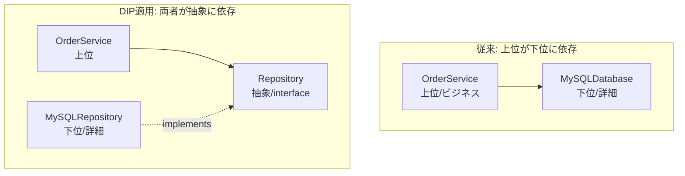

# SOLID 原則 調査 — オブジェクト指向設計の5つの土台

> **対象**: SOLID 原則（オブジェクト指向設計の5原則）。提唱者は **Robert C. Martin（通称 Uncle Bob）**。
> **作成日**: 2026-08-01（JST） / **ステータス**: INFO（情報提供・設計リファレンス）
> **一次情報**: [Uncle Bob / Clean Coder Blog](https://blog.cleancoder.com/) / 書籍『Clean Architecture』『Agile Principles, Patterns, and Practices』

---

## 用語ミニ解説（初心者向け）

- **オブジェクト指向（OOP＝Object-Oriented Programming）**: データ（状態）と処理（振る舞い）を「クラス／オブジェクト」という単位にまとめて設計する手法。
- **クラス（class）**: オブジェクトの設計図。データとメソッド（処理）を持つ。
- **インターフェース（interface）**: 「何ができるか」だけを定めた契約。実装（中身）は持たない。
- **抽象（abstraction）**: 具体的な実装の詳細を隠し、「使い方」だけを見せること。
- **依存（dependency）**: あるコードが別のコードを直接使っている関係。「AがBを呼ぶ」＝AはBに依存する。
- **結合度（coupling）**: モジュール同士の依存の強さ。低いほど良い（変更が波及しにくい）。
- **凝集度（cohesion）**: 1つのモジュール内の要素が「同じ目的」でまとまっている度合い。高いほど良い。

---

## 1. SOLID とは（概要）

**SOLID** は、保守しやすく・拡張しやすいオブジェクト指向コードを書くための **5つの設計原則の頭文字**です。2000年代初頭に Robert C. Martin が整理し、後に Michael Feathers が「SOLID」という語呂で命名しました。

| 文字 | 原則名（英） | 日本語 | ひと言で |
|---|---|---|---|
| **S** | Single Responsibility Principle | 単一責任の原則 | クラスが変わる理由は1つだけ |
| **O** | Open-Closed Principle | 開放閉鎖の原則 | 拡張には開き、修正には閉じる |
| **L** | Liskov Substitution Principle | リスコフの置換原則 | 派生型は基底型と差し替え可能に |
| **I** | Interface Segregation Principle | インターフェース分離の原則 | 使わないメソッドを押し付けない |
| **D** | Dependency Inversion Principle | 依存性逆転の原則 | 具象でなく抽象に依存する |

> **狙い**: 変更に強く（変更の影響範囲を局所化）、再利用しやすく、テストしやすいコードにすること。すべては「**変更コストを下げる**」ために存在します。

---

## 2. 各原則の詳細

### S — Single Responsibility Principle（単一責任の原則）

> 「クラスを変更する理由は、ただ1つであるべき」

正確には「**1つのモジュールは、たった1人（1つのアクター＝利害関係者）に対して責任を負うべき**」という意味です。給与計算・帳票出力・DB保存を1クラスに詰め込むと、経理・総務・DBAという別々の都合で同じクラスが何度も変更され、互いに壊し合います。

**悪い例 / 良い例**
```text
[悪い] Employee クラスが calculatePay() / saveToDB() / generateReport() を全部持つ
[良い] PayCalculator / EmployeeRepository / ReportGenerator に責務を分割
```

- **効果**: 変更の影響が1箇所に閉じる。凝集度が上がる。

### O — Open-Closed Principle（開放閉鎖の原則）

> 「ソフトウェアの構成要素は、**拡張に対して開いて**いて、**修正に対して閉じて**いるべき」（Bertrand Meyer が原型を提唱）

新しい振る舞いを追加するときに、**既存コードを書き換えずに済む**設計を目指します。手段は主に「抽象（インターフェース／基底クラス）＋ポリモーフィズム」。

```text
[悪い] if (shape == CIRCLE) ... else if (shape == SQUARE) ...  ← 図形が増えるたびに if を追記
[良い] Shape インターフェースに area() を定義し、Circle/Square が各自実装
       → 新図形は「クラス追加」だけで済み、既存コードは無変更
```

### L — Liskov Substitution Principle（リスコフの置換原則）

> 「派生型（サブクラス）は、その基底型（スーパークラス）と**置き換えても正しく動作**しなければならない」（Barbara Liskov, 1987）

`親クラスを使っている場所に子クラスを入れても、プログラムの正しさが壊れない」こと。有名な反例が **正方形は長方形か問題**：`Rectangle` を継承した `Square` で `setWidth()` が高さも変えてしまうと、長方形を前提にした処理が破綻します。

- **違反のサイン**: 子クラスでメソッドを空実装したり例外を投げる、`instanceof` で型分岐する。

### I — Interface Segregation Principle（インターフェース分離の原則）

> 「クライアントに、**使わないメソッドへの依存を強制してはならない**」

大きすぎる「何でもインターフェース」を、役割ごとの小さなインターフェースに分割します。

```text
[悪い] Worker { work(); eat(); }  ← ロボットに eat() を実装させる羽目に
[良い] Workable { work(); } と Eatable { eat(); } に分離
```

### D — Dependency Inversion Principle（依存性逆転の原則）

> 「上位モジュールは下位モジュールに依存してはならない。**両者とも抽象に依存すべき**」「抽象は詳細に依存せず、詳細が抽象に依存すべき」

ビジネスロジック（上位）が、DB やライブラリ（下位の詳細）を直接呼ぶのをやめ、**間にインターフェースを挟む**。実装は外から注入（DI＝Dependency Injection）します。

```text
[悪い] OrderService が MySQLDatabase を直接 new する
[良い] OrderService は Repository インターフェースに依存
       MySQLRepository はそのインターフェースを実装（差し替え・テスト容易）
```

---

## 3. 依存の向きを図で理解する（依存性逆転）



矢印の向きが「下位→抽象」に**逆転**しているのがポイント。これで DB を差し替えても上位ロジックは無傷です。

---

## 4. メリット・デメリット（実務観点）

### メリット
- **変更に強い**: 影響範囲が局所化され、機能追加が「追加」で済む（既存改変が減る）。
- **テストしやすい**: 抽象への依存でモック／スタブ差し替えが容易。
- **再利用・並行開発**: 責務が分かれ、チームで分担しやすい。

### デメリット・注意点
- **過剰設計（over-engineering）のリスク**: 小さなスクリプトや使い捨てコードに全部適用すると、抽象・クラスが増えて逆に読みにくくなる。
- **原則は「目的」ではなく「手段」**: Uncle Bob 自身も 2020年の記事で「マイクロサービス時代でも SOLID は有効だが、状況次第」と述べている（[Solid Relevance](https://blog.cleancoder.com/uncle-bob/2020/10/18/Solid-Relevance.html)）。**変更コストを下げる**という目的に照らして、適用度合いを判断する。

---

## 5. 実務での使いどころ

- **中〜大規模／長寿命のコードベース**、複数人で保守するドメインロジックに効く。
- **DIP＋DI** は現代のフレームワーク（Spring, NestJS, .NET など）の中核思想。テスト容易性の要。
- **迷ったら S と D を優先**: 「責務を分ける」「抽象に依存する」の2つだけでも設計品質は大きく向上する。

---

## 参考リンク（一次情報優先）

- [Clean Coder Blog（Robert C. Martin）](https://blog.cleancoder.com/) — 提唱者本人のブログ
- [The Principles of OOD（原典まとめ）](http://butunclebob.com/ArticleS.UncleBob.PrinciplesOfOod)
- [Solid Relevance（2020, Uncle Bob の再評価記事）](https://blog.cleancoder.com/uncle-bob/2020/10/18/Solid-Relevance.html)
- 書籍: 『Clean Architecture』『Agile Software Development, Principles, Patterns, and Practices』（Robert C. Martin）

---

> 関連ドキュメント: `20260801_INFO_DESIGNPATTERN_gof-design-patterns.md`（GoFデザインパターン）/ `20260801_INFO_CQRS_command-query-responsibility-segregation.md`（CQRS）
