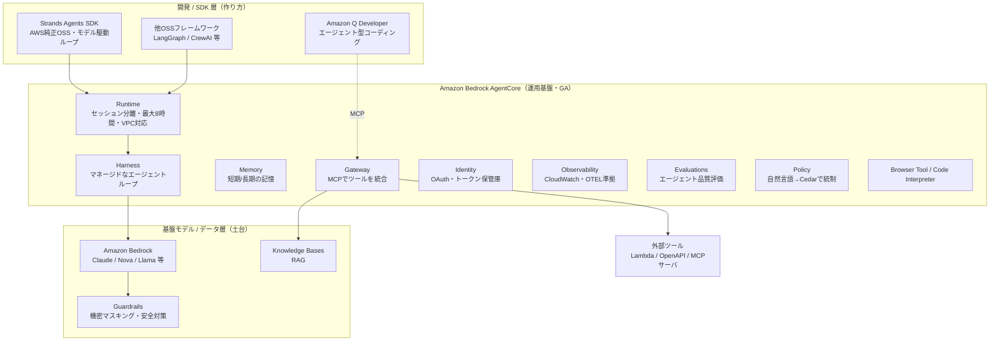
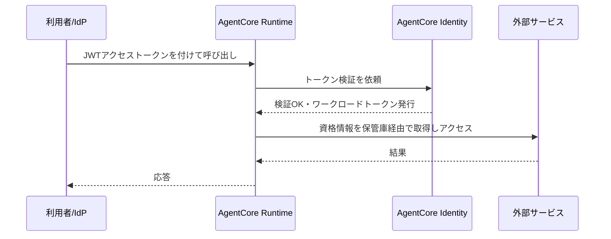
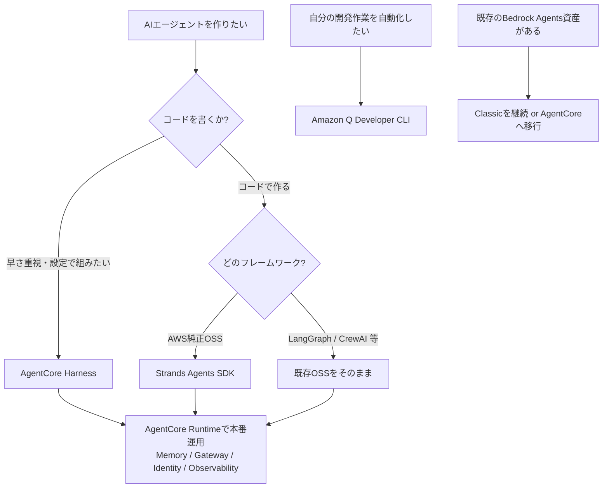

# AWS の AI エージェント関連まとめ（2026-08 時点）

> AWS が提供する「AI エージェント」向けサービス／SDK を、全体像・使い分け・一次情報つきで整理する。初心者にも分かるよう用語は都度補足する。
> 用語: **AI エージェント**＝LLM が「推論 → ツール実行 → 結果を見てまた推論」を自律ループし、タスクを最後までやり切るソフトウェア。**MCP（Model Context Protocol）**＝エージェントとツールをつなぐ標準プロトコル。

## 0. TL;DR（結論だけ）

- **中核は Amazon Bedrock AgentCore**（2025-10 一般提供＝GA）。エージェントを**本番で動かすための運用基盤**（実行・記憶・ツール接続・認証・監視・評価・ガバナンス）を、**モデル非依存・フレームワーク非依存**で提供する。
- **作り方は3系統**: ①**Strands Agents SDK**（AWS純正OSS）でコード実装、②**AgentCore Harness**（設定だけでエージェントループを組むマネージド方式）、③**LangGraph/CrewAI 等の既存OSS**をそのまま載せる。いずれも AgentCore Runtime で運用できる。
- **旧 Amazon Bedrock Agents は「Classic」化**し新規受付停止（メンテナンスモード）。新規は AgentCore へ誘導。
- **開発作業そのものの自動化**は **Amazon Q Developer**（エージェント型コーディング）。
- 土台は **Amazon Bedrock**（Claude/Nova/Llama 等のモデル、Knowledge Bases＝RAG、Guardrails＝安全対策）。

---

## 1. 全体像（レイヤ構造）



---

## 2. 中核：Amazon Bedrock AgentCore（GA・2025-10）

「オープンソースの柔軟さ」と「エンタープライズのセキュリティ」を両立させる、**エージェント運用のためのモジュラー基盤**。任意のモデル・任意のOSSフレームワークと組み合わせられ、9 AWS リージョンで従量課金。

| コンポーネント | 役割（何をしてくれるか） | 補足 |
|---|---|---|
| **Runtime** | エージェントを本番実行。**セッション分離／最大8時間の長時間実行／VPC対応／低レイテンシ**。埋め込みID（IAM SigV4 または JWT/OAuth）で安全に呼び出し。 | 業界最長クラスの8時間実行窓 |
| **Harness**（GA 2026-06） | **マネージドなエージェントループ**。オーケストレーション・ツール実行・状態保持・障害復旧・セッション分離を担う。設定だけで本番級エージェントが数分で起動（ファイルシステム＋シェル、記憶、AWS厳選Skills、Web閲覧つき）。**モデル差し替え自由**、必要なら**Strandsコードへエクスポート**可。 | 「最初の設定のまま本番運用」できる |
| **Memory** | 短期／長期の**記憶**を管理。会話やタスクの文脈を跨いで保持。 | |
| **Gateway** | **MCP でツールを統合**する単一の安全な入口。**Lambda / OpenAPI / Smithy / 既存MCPサーバ**をエージェント用ツールへ変換。ツールの**セマンティック検索**あり。 | 既存API資産を作り直さず公開 |
| **Identity** | エージェント用の**認証・認可・資格情報管理**。OAuth の 2LO/3LO、**トークン保管庫（vault）**。Cognito/Okta/Entra ID と連携し、Slack/Salesforce/GitHub 等へ本人代理でアクセス。 | ユーザ間のトークン混線を暗号的に防止 |
| **Observability**（可観測性） | 実行の**完全な可視化**。CloudWatch ダッシュボード、**OTEL 準拠**のトレース／メトリクス。 | |
| **Browser Tool / Code Interpreter** | **安全なWeb操作**と**安全なコード実行**をサンドボックスで提供。 | データ分析・画面操作に |
| **Evaluations**（GA 2026-03） | エージェント品質を**継続評価**。オンライン評価＋オンデマンド（回帰テスト）。**13種の組込評価器**、Ground Truth、独自評価器（LLM または Python/JS Lambda）。 | Observability と統合 |
| **Policy**（GA 2026-03） | **エージェント↔ツール間の統制**をコード外で定義。**自然言語→Cedar**（AWSのOSSポリシー言語）に変換し Gateway が各リクエストを検査。 | セキュリティ/コンプラ担当がコード非改変で制御 |
| **Payments** | エージェントの**決済**（x402・マイクロトランザクション・Payment Manager）。 | 有料APIの自律利用など |

### 認証フロー（Runtime × Identity）の考え方



---

## 3. Amazon Bedrock Agents（現「Classic」・メンテナンスモード）

- 旧来のマネージド・エージェント。**ReAct（推論と行動の反復）**で、**アクショングループ（API スキーマで定義したツール）**、**Knowledge Bases（RAG）**、**Guardrails**、**Memory**を統合。
- **マルチエージェント協調**をサポート：**Supervisor モード**（主エージェントが分解し副エージェントへ委譲）と **Router＋Supervisor モード**（単純な入力は1つの副エージェントへ振り分け）。
- **重要**: 新規顧客の受付は終了し「Bedrock Agents **Classic**」に。既存顧客は継続利用可。**新規は AgentCore を推奨**。

---

## 4. 作り方①：Strands Agents SDK（AWS純正OSS）

- **モデル駆動アプローチ**：ループやツール選択をハードコードせず、**モデル自身に「いつ何のツールを使うか」を委ねる**。数行で動く。
- **マルチエージェント**：agents-as-tools（オーケストレータが専門家へ委譲）、workflow / graph / swarm、**A2A（Agent-to-Agent）プロトコル**対応。
- MCP サーバや組込ツールを利用でき、そのまま **AgentCore Runtime へデプロイ**可能。

```python
from strands import Agent
from strands_tools import calculator, python_repl

agent = Agent(tools=[calculator, python_repl],
              system_prompt="計算し、必要ならコードで検証するアシスタント")
agent("1万ドルを年5%で10年運用した複利を計算して")
```

## 5. 作り方②：既存OSSフレームワーク

- LangGraph / CrewAI などで作った既存エージェントを、**コード改変を最小限に AgentCore Runtime へ載せて本番運用**できる（AgentCore はフレームワーク非依存）。

## 6. 開発作業の自動化：Amazon Q Developer

- **ターミナル用のエージェント（Q Developer CLI）**：`q chat` で対話し、**ローカルのファイル読み書き・bash 実行・AWS API 呼び出し・コード生成**まで自律実行。ネイティブ／MCP サーバのツールを利用。
- **HITL（人間承認）**：各アクション前に確認を挟める（既定は確認あり）。IDE や JupyterLab にも統合。

---

## 7. 土台：Amazon Bedrock（モデル／データ）

- **モデル呼び出し**：Converse API（対話統一API）／InvokeModel。**Claude・Nova・Llama・Titan** 等から選択。
- **Knowledge Bases**：社内データを使った **RAG**（検索拡張生成）。
- **Guardrails**：不適切出力の抑止と**機密情報のマスキング**。**ApplyGuardrail API** でモデル外からも適用可（ログのマスキング等）。

## 8. MCP × AWS（ツール接続の要）

- **AgentCore Gateway** が MCP のハブ。ターゲットとして **Lambda / OpenAPI / Smithy / 外部MCPサーバ** を統合し、**認証を入口で一元化**、**セマンティック検索**でツールを発見。Gateway 同士の**フェデレーション**も可能。
- AWS 公式の MCP サーバ群（`awslabs/mcp`）もあり、Q Developer 等から AWS 操作を MCP 経由で行える。

---

## 9. 使い分け（どれを選ぶか）



- **とにかく早く本番へ** → AgentCore **Harness**（設定中心）。
- **細かく作り込む** → **Strands**（純正OSS）や既存OSS＋AgentCore Runtime。
- **開発の自動化** → **Q Developer**。
- **社内データ活用（RAG）・安全対策** → Bedrock **Knowledge Bases / Guardrails**。
- **ツール統合・認証・監視・評価・ガバナンス** → AgentCore の **Gateway / Identity / Observability / Evaluations / Policy**。

## 10. 実務での勘所

- **PoC → 本番の壁**（実行の永続化・記憶・認証・監視・評価）を **AgentCore が肩代わり**する設計。まずは Strands か Harness で小さく作り、運用要素は AgentCore に寄せるのが素直。
- **セキュリティ三層**（インフラ＝IAM／アプリ＝ツール単位の権限・スキーマ制限・レート制限／ユーザ＝セッション制御・監査ログ）＋ **Guardrails でログのマスキング**、が公式の推奨線。RAG に機密が混ざる用途では特に重要。

---

## 11. 出典（一次情報優先）

- AgentCore プレビュー発表: https://aws.amazon.com/about-aws/whats-new/2025/07/amazon-bedrock-agentcore-preview/
- AgentCore GA 発表: https://aws.amazon.com/about-aws/whats-new/2025/10/amazon-bedrock-agentcore-available/
- AgentCore Harness GA: https://aws.amazon.com/about-aws/whats-new/2026/06/amazon-bedrock-agentcore-harness-generally-available/
- AgentCore Evaluations GA: https://aws.amazon.com/about-aws/whats-new/2026/03/agentcore-evaluations-generally-available/
- AgentCore Policy GA: https://aws.amazon.com/about-aws/whats-new/2026/03/policy-amazon-bedrock-agentcore-generally-available/
- AgentCore Identity（開発者ガイド）: https://docs.aws.amazon.com/bedrock-agentcore/latest/devguide/identity.html
- AgentCore Gateway コア概念（MCP ツール種別）: https://docs.aws.amazon.com/bedrock-agentcore/latest/devguide/gateway-core-concepts.html
- AgentCore FAQ: https://aws.amazon.com/bedrock/agentcore/faqs/
- Bedrock Agents マルチエージェント協調（Classic 注記あり）: https://docs.aws.amazon.com/bedrock/latest/userguide/agents-multi-agent-collaboration.html
- Strands Agents 紹介（OSS SDK）: https://strandsagents.com/blog/introducing-strands-agents/
- Strands モデル駆動アプローチ: https://strandsagents.com/blog/strands-agents-model-driven-approach/
- Amazon Q Developer（エージェント型コーディング）: https://aws.amazon.com/q/developer/build/
- PoC→本番 / AgentCore 実装ブログ: https://aws.amazon.com/blogs/machine-learning/move-your-ai-agents-from-proof-of-concept-to-production-with-amazon-bedrock-agentcore/

> 注: 本書は 2026-08 時点の公開情報に基づく。サービスは更新が速いため、実装前に必ず各公式ページで最新の提供リージョン・料金・GA 状況を確認すること。
