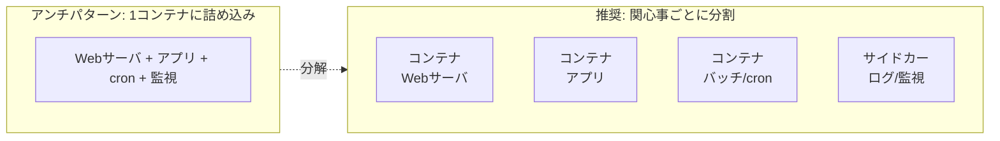
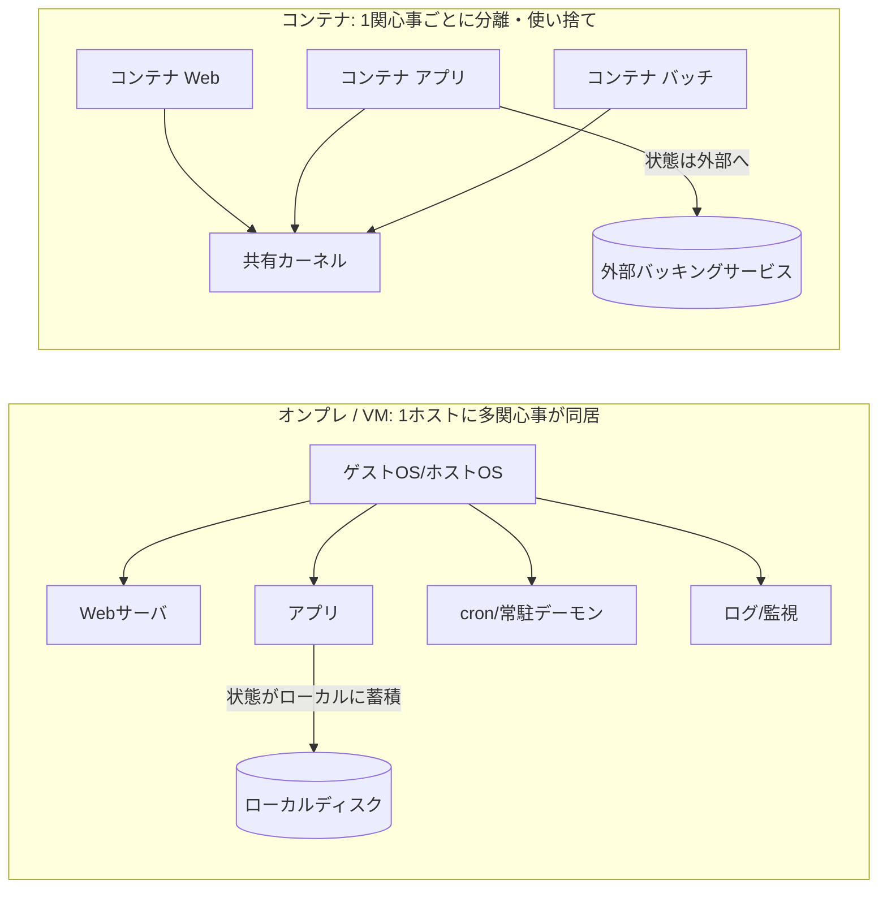
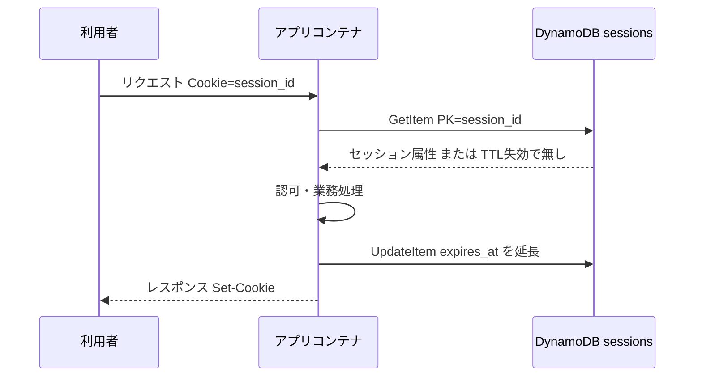

# Docker 調査 — アプリ開発観点でのコンテナ設計

> **対象**: アプリケーション開発者から見た Docker コンテナの使いどころ・設計指針。インフラ運用ではなく「アプリをどう作り・動かすか」の観点で整理する。
> **作成日**: 2026-08-07（JST） / **ステータス**: INFO（情報提供・設計リファレンス）
> **一次情報**: [Docker: Building best practices](https://docs.docker.com/build/building/best-practices/) / [The Twelve-Factor App — VI. Processes](https://12factor.net/processes) / [AWS: Converting stateful application to stateless](https://aws.amazon.com/blogs/architecture/converting-stateful-application-to-stateless-using-aws-services/) / [AWS: DynamoDB TTL](https://docs.aws.amazon.com/amazondynamodb/latest/developerguide/TTL.html)

---

## 用語ミニ解説（初心者向け）

- **コンテナ（container）**: アプリと必要な依存物（ライブラリ等）を1つにまとめ、ホストOSのカーネルを共有して隔離実行する仕組み。VM より軽量。
- **イメージ（image）**: コンテナの「型」。イミュータブル（不変）な読み取り専用テンプレート。イメージからコンテナを起動する。
- **ステートレス（stateless）**: プロセス自身が状態を持たず、必要な状態は外部（DB等）に置く設計。使い捨て・水平スケールしやすい。
- **バッキングサービス（backing service）**: アプリが利用する外部の状態保管先（DB、キャッシュ、キューなど）。12-Factor の用語。
- **関心事（concern）**: そのコンテナが担う単一の責務（Webサーバ、アプリ、バッチ等）。「1コンテナ1関心事」の原則で使う。
- **cattle / pets**: 使い捨て前提で個体を気にしない運用（cattle＝家畜）と、1台1台を手入れする運用（pets＝ペット）の対比。コンテナは前者。

---

## 1. アプリ開発観点での Docker とは

Docker は「アプリと依存関係をイメージに固め、どの環境でも同じように動かす」ための仕組みです。アプリ開発者にとっての本質的な価値は次の3点です。

1. **環境差異の吸収**: 「自分の PC では動くのに本番で動かない」を減らす。イメージに依存物を封じ込め、開発／検証／本番で同一の成果物を動かす。
2. **イミュータブルな成果物**: ビルドしたイメージは変更しない。修正は「新しいイメージを作り直して置き換える」。ロールバックはタグを戻すだけ。
3. **ステートレス前提の設計を促す**: コンテナは使い捨て（cattle）。状態を外へ出す設計が自然と求められ、水平スケールしやすくなる。

---

## 2. メリット・デメリット（アプリ観点で具体的に）

### 2.1 メリット

- **再現性 / 環境一致**: `Dockerfile` がそのまま「動く環境の定義」。オンボーディングが「イメージを pull して起動」で済む。OS・ランタイム・ライブラリのバージョン差異に悩まされにくい。
- **軽量・高速**: VM と違いゲストOSを持たずカーネル共有。起動は秒〜ミリ秒級で、スケールアウトや使い捨てテストに向く。
- **水平スケール容易**: ステートレスに作れば、同じイメージのコンテナを N 個並べるだけで負荷分散できる（後述のセッション設計とセット）。
- **CI/CD との親和性**: 「ビルド＝イメージ生成」「デプロイ＝イメージ差し替え」で一貫。テストも本番と同一イメージで実行可能。
- **依存の隔離**: アプリごとに異なるライブラリ／ランタイムを同一ホストで衝突なく共存できる。
- **マルチステージビルドで軽量化**: ビルド用と実行用のステージを分け、最終イメージに必要物だけを残せる（[公式推奨](https://docs.docker.com/build/building/best-practices/)）。

### 2.2 デメリット / 注意点

- **状態管理が設計課題になる**: コンテナ内のファイル／メモリは使い捨て。セッション・アップロードファイル・ログを**外部化**しないと消える（本書 §5・§6 の主題）。
- **永続データはボリューム設計が必須**: DB をコンテナで動かすなら Volume 設計を誤るとデータ消失。ステートフルなものはマネージドサービスに逃がすのが無難。
- **1コンテナ1関心事の制約**: 従来「1台のサーバに何でも同居」だった構成を分解する必要がある（§3）。設計コストが増える。
- **ネットワーク／権限の理解が要る**: ポート公開、コンテナ間通信、ルート実行回避（非rootユーザ）、シークレット注入など、動かすだけでなく安全に動かす学習コストがある。
- **オーバーヘッドとデバッグ**: 直接ホストで動かすより一段間接。ログ収集・観測（オブザーバビリティ）を最初から設計しないと障害解析が難しい。
- **イメージ肥大・脆弱性**: ベースイメージ選定を誤るとサイズと攻撃面が増える。公式／検証済みイメージを小さく保つのが原則（[公式](https://docs.docker.com/build/building/best-practices/)）。

---

## 3. 「コンテナは 1コンテナ 1プロセス？」— 正確には「1コンテナ 1関心事」

よくある誤解が「1コンテナ＝厳密に1プロセス」です。**正確には「1コンテナ＝1つの関心事（concern）」**が Docker 公式の原則です。

> Docker 公式ビルドベストプラクティスは、アプリを**複数コンテナへ分割（decouple）**し、**各コンテナは1つの関心事だけを持つ**ことを推奨しています。 — [docs.docker.com](https://docs.docker.com/build/building/best-practices/)

### ニュアンスの整理

- **理想**: コンテナの PID 1 として主プロセスを1つ動かす。Webサーバ／アプリ／バッチはそれぞれ別コンテナにする。
- **厳密な1プロセス強制ではない**: 主プロセスが子プロセスをフォークする（例: プリフォーク型 Web サーバのワーカー群）のは自然で問題ない。「1関心事」であれば内部プロセスは複数あってよい。
- **複数の異なる関心事を1コンテナに詰めない**: 「Web＋DB＋cron を1コンテナ」は避ける。スケール単位・ライフサイクル・障害の切り分けが崩れる。
- **PID 1 問題（実務注意点）**: コンテナの PID 1 はシグナル転送やゾンビプロセス回収を自分で行わない場合がある。子プロセスを持つなら `tini` などの軽量 init を PID 1 に置くのが定石。
- **例外パターン**: サイドカー（ログ転送・プロキシ等）は「別コンテナ」として同一 Pod / タスクに同居させる。1コンテナに同居させるのではなく、コンテナを分けて協調させる。

---

## 4. そこから分かる「オンプレ / VM との違い」

「1コンテナ1関心事」「使い捨て」という性質から、従来のオンプレ／VM 運用との差が浮かび上がります。

| 観点 | オンプレ / VM | コンテナ |
|---|---|---|
| プロセスモデル | 1ホストに多数のプロセス・常駐デーモンが同居 | 1コンテナ1関心事に分割 |
| ライフサイクル | 長寿命（pets）。同じ個体を手入れし続ける | 短命・使い捨て（cattle）。壊れたら作り直す |
| 状態の持ち方 | ローカルディスク／メモリに状態が溜まりがち | 状態は外部（DB・キャッシュ）へ。コンテナ内は揮発 |
| スケール | 垂直（スケールアップ）中心。増設は重い | 水平（同一イメージを並べる）が基本 |
| 変更の反映 | サーバに SSH して手当て（構成ドリフトが起きやすい） | イメージを作り直して置換（イミュータブル） |
| 再現性 | 環境差異が出やすい | イメージで同一成果物を各環境へ |

> 要点: オンプレは「1台のサーバを大事に育てる」前提。コンテナは「いつ落ちても・いつ増えても良い」前提。この前提の違いが、次のセッション設計に直結します。

---

## 5. セッション維持のベストプラクティス

コンテナは使い捨て・水平スケールが前提なので、**「どのコンテナに当たっても同じように振る舞う＝ステートレス」**が鉄則です。12-Factor もこれを明言しています。

> "Twelve-factor processes are **stateless** and **share-nothing**. Any data that needs to persist must be stored in a stateful **backing service**, typically a database."
> （12-Factor のプロセスはステートレスかつシェアードナッシング。永続が必要なデータは、状態を持つバッキングサービス＝通常はDBに保存する）— [12factor.net/processes](https://12factor.net/processes)

> "Even when running only one process, a restart ... will usually wipe out all local state."
> （1プロセス運用でも、再起動でローカル状態は基本的に消える）— [12factor.net/processes](https://12factor.net/processes)

つまり**セッションをコンテナのメモリ／ローカルに持たせてはいけない**。選択肢は次の3つです。

### 5.1 選択肢の比較

| 方式 | 概要 | 長所 | 短所 |
|---|---|---|---|
| **① クライアント保持（Cookie / JWT）** | 署名付きトークンにセッション状態を載せ、サーバは検証のみ | サーバ側ストア不要・完全ステートレス | 失効・無効化が難しい／サイズ制限／機密は載せない |
| **② 共有セッションストア** | `session_id` をキーに外部ストア（Redis/ElastiCache, DynamoDB 等）へ状態保存 | どのコンテナからも参照可・水平スケール可・失効制御が容易 | ストアの運用・レイテンシ・可用性設計が必要 |
| **③ スティッキーセッション** | LB が同一利用者を同一コンテナへ固定 | 既存アプリを大きく変えず動く | コンテナ停止で状態消失／偏り／スケールと相性が悪い（**妥協策**） |

### 5.2 推奨

- **新規に作るなら ① か ②**。ステートレス思想と最も整合する。
- **③ スティッキーは最終手段**。コンテナは落ちる前提のため、状態消失リスクが残る。AWS も「セッションデータの外部化（offloading）」を推奨しています（[AWS Architecture Blog](https://aws.amazon.com/blogs/architecture/converting-stateful-application-to-stateless-using-aws-services/)）。
- **機密はクライアントに載せない**。①採用時もトークンにはIDと最小限のクレームのみ。実体はサーバ側で引く。

---

## 6. 「DynamoDB にセッションID保持」はアリか

**結論: 有効なベストプラクティスの1つ**です。特に AWS 上・サーバーレス/コンテナ構成では定番の選択肢です。

### 6.1 なぜ向くか

- **フルマネージド・水平スケール**: 運用負荷が低く、スパイクにも耐えやすい。どのコンテナからも同じ `session_id` で参照できる。
- **TTL による自動失効**: DynamoDB の **TTL 属性**に有効期限（エポック秒）を入れておくと、期限切れアイテムが自動削除される。しかも**削除に書き込みキャパシティを消費しない**（[AWS 公式](https://docs.aws.amazon.com/amazondynamodb/latest/developerguide/TTL.html)）。セッションの掃除が自前不要。
- **キー設計が単純**: パーティションキー＝`session_id` の単一キーで getItem／putItem が高速。

### 6.2 データ設計の例（イメージ）

- **テーブル**: `sessions`
- **パーティションキー**: `session_id`（例: 乱数128bit以上の不透明ID）
- **属性**: `user_id`, `csrf_token`, `data`(任意のセッション値), `expires_at`(TTL・エポック秒)
- **TTL 属性**: `expires_at` を TTL に指定 → 期限切れで自動削除

### 6.3 注意点 / トレードオフ

- **整合性**: 既定は結果整合性読み取り。直後の更新を必ず読みたい箇所は**強い整合性読み取り**を指定する（コスト増）。
- **レイテンシ**: 超低遅延・高頻度アクセスなら **Redis/ElastiCache** の方が速いことが多い。ミリ秒未満を求めるならこちらも比較。
- **TTL の即時性**: TTL 削除は「期限後、通常48時間以内」に行われる非同期処理。**アプリ側でも `expires_at` を必ずチェック**し、期限切れを論理的に無効扱いにする（DynamoDB の物理削除に依存しない）。
- **ホットパーティション**: `session_id` は十分に分散する乱数にする。連番など偏るキーは避ける。
- **コスト**: 高頻度アクセスではオンデマンド/プロビジョンドの見積りを。読み書き回数がそのまま費用に効く。

### 6.4 使い分けの目安

- **AWS 中心・サーバーレス/コンテナ・運用を軽くしたい** → **DynamoDB（TTL付き）**。
- **超低遅延・複雑なデータ構造・pub/sub 等も使う** → **Redis / ElastiCache**。
- **サーバ側ストアを持ちたくない・失効要件が緩い** → **JWT（クライアント保持）**。

---

## 7. まとめ

- Docker のアプリ観点の価値は「**再現性・イミュータブル・ステートレス化の促進**」。
- 「1コンテナ1プロセス」は厳密には**「1コンテナ1関心事」**。子プロセスは可、異なる関心事の同居は不可。PID 1 問題は `tini` 等で対処。
- ここから導かれるオンプレとの差は、**プロセスモデル（同居→分割）・ライフサイクル（pets→cattle）・状態の持ち方（ローカル→外部）**。
- セッションは**コンテナに持たせない**。クライアント保持（JWT）か共有ストア（Redis / **DynamoDB**）へ。スティッキーは妥協策。
- **DynamoDB にセッションID保持は有効**。**TTL で自動失効**でき運用が軽い。整合性・レイテンシ・TTLの非即時性に注意し、アプリ側でも失効チェックを行う。

---

## 参考（一次情報）

- Docker: Building best practices — <https://docs.docker.com/build/building/best-practices/>
- The Twelve-Factor App / VI. Processes — <https://12factor.net/processes>
- AWS Architecture Blog: Converting stateful application to stateless — <https://aws.amazon.com/blogs/architecture/converting-stateful-application-to-stateless-using-aws-services/>
- Amazon DynamoDB: Using Time to Live (TTL) — <https://docs.aws.amazon.com/amazondynamodb/latest/developerguide/TTL.html>
- Amazon DynamoDB: Best practices for design — <https://docs.aws.amazon.com/amazondynamodb/latest/developerguide/best-practices.html>
