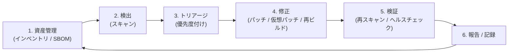
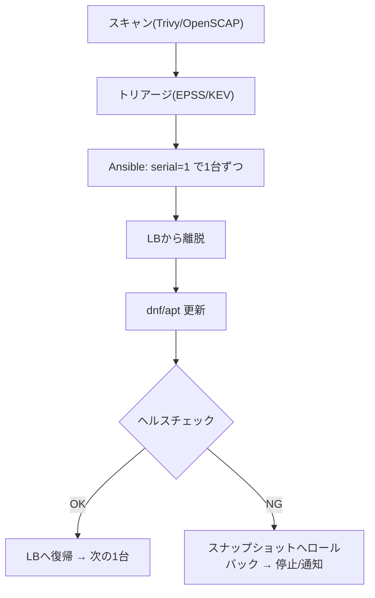
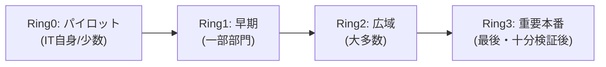
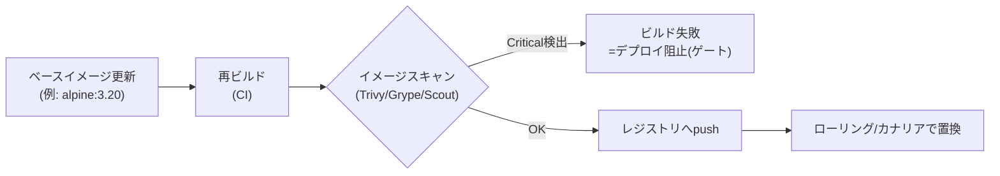
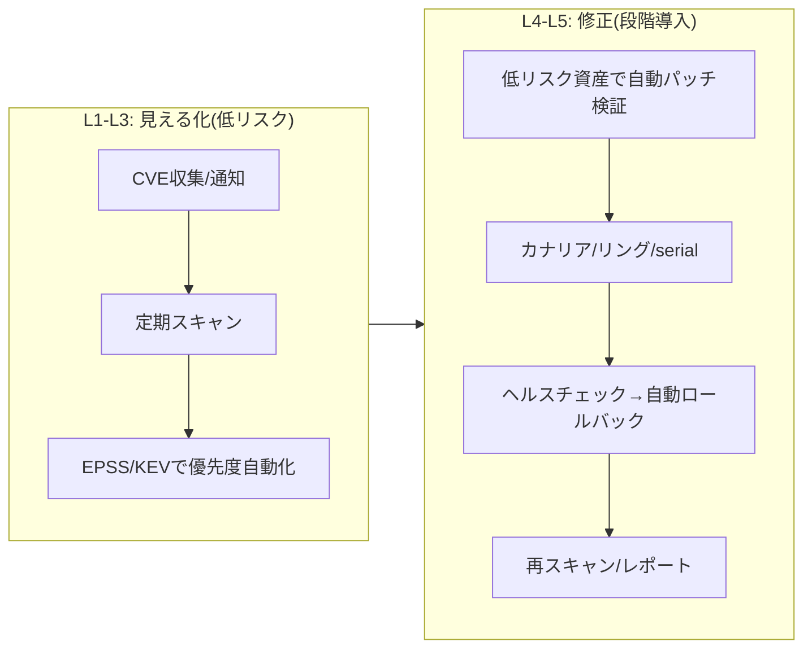

# 脆弱性対応の自動化 実践ガイド — Linux / Windows Server / Docker コンテナ

> STATUS: INFO / CATEGORY: security / 作成日: 2026-07-03
> クラウド・インフラエンジニア向けに、**脆弱性対応（Vulnerability Management）の自動化**を「概念 → ツール → 使い方 → 本番へ無停止で取り込む方法」まで一気通貫でまとめた実践ガイドです。プラットフォーム別に **Linux サーバ / Windows Server / Docker コンテナ**の3つを検討し、最後に横断的な導入戦略を整理します。

---

## 0. なぜ今「脆弱性対応の自動化」か

2026年5月22日、金融庁と日本銀行は連名で「フロンティアAIによる脅威変化を踏まえた金融機関等の短期的な対応」を要請しました。その中で当局は、要請項目を**応急的措置**と位置づけたうえで、中長期的には「**脆弱性対応の自動化**などに取り組むことが必要」と明記しています。

背景はシンプルです。

- 最先端AI（フロンティアAI）は**脆弱性の発見**と**攻撃コード生成**が得意。
- その結果、**公開される脆弱性（CVE）と修正パッチが短期間に大量に出る**時代になる。
- 人手のパッチ運用では物量に追いつけない。→ **検知・優先度付け・修正・検証を機械化**する必要がある。

> 用語: **CVE（Common Vulnerabilities and Exposures）** … 公開された脆弱性に付く世界共通のID（例: `CVE-2024-3094`）。
> 用語: **脆弱性対応（Vulnerability Management, VM）** … 脆弱性を「見つけ → 評価し → 直し → 確認する」一連の運用サイクル。

---

## 1. 全体像 — 脆弱性対応のライフサイクルと「自動化の階層」

まず、自動化する対象の「型」を押さえます。脆弱性対応は次のサイクルで回ります。

自動化は「一気に全部」ではなく、**下の階層から順に**積み上げるのが定石です（クロール→ウォーク→ラン）。

| 階層 | 内容 | 難易度 | 本番リスク |
|---|---|---|---|
| L1 情報収集の自動化 | CVE/パッチ情報の収集・通知 | 低 | ほぼ無し |
| L2 検知の自動化 | 定期スキャンで「どこに何があるか」可視化 | 低〜中 | 低 |
| L3 トリアージの自動化 | 優先度を機械的に算出（EPSS/KEV/SSVC） | 中 | 低 |
| L4 修正の自動化 | パッチ適用・再ビルドを自動実行 | 高 | **高**（要・段階展開） |
| L5 検証・報告の自動化 | 再スキャン・レポート生成 | 中 | 低 |

> **鉄則:** いきなり L4（自動パッチ）から入らない。まず L1〜L3 で「見える化」してから、影響の小さい範囲で L4 を段階導入する。

### 押さえるべきキー概念

- **SBOM（Software Bill of Materials）** … ソフトの「部品表」。どのライブラリの何バージョンを使っているかの一覧。これが無いと「影響あり/なし」を機械判定できない。フォーマットは **SPDX / CycloneDX**。
- **VEX（Vulnerability Exploitability eXchange）** … 「そのCVEは自社の使い方では実際に悪用可能か（影響するか）」を示す注記。誤検知（ノイズ）を減らす。
- **トリアージ指標** … 後述の CVSS / EPSS / KEV / SSVC。「どれから直すか」を機械的に決めるための物差し。
- **イミュータブル・インフラ** … サーバを「直す」のではなく「作り直す」思想。コンテナ運用の基本で、自動化と相性が良い。
- **段階展開（Progressive Delivery）** … dev→staging→カナリア→本番、リングデプロイ等。本番影響を抑える最重要テクニック（§6で詳述）。

---

## 2. トリアージの自動化 — 「どれから直すか」を機械で決める

大量のCVEに順番をつける仕組み。ここを自動化すると運用が劇的に楽になります。

- **CVSS（深刻度スコア 0.0〜10.0）** … 脆弱性の「理論上の深刻さ」。ただし**CVSSだけで優先度を決めるのは誤り**。高スコアでも実際には悪用されないものが大量にある。
- **EPSS（Exploit Prediction Scoring System）** … 「今後30日以内に実際に悪用される確率」。FIRST が提供。CVSSと組み合わせて「深刻 かつ 悪用されそう」を絞る。
- **CISA KEV（Known Exploited Vulnerabilities）** … 「**実際に悪用が確認された**」脆弱性の公式カタログ。KEV掲載はほぼ即対応対象。
- **SSVC（Stakeholder-Specific Vulnerability Categorization）** … 意思決定ツリー方式。「悪用状況 × 自社影響 × 対応の緊急度」で `Act / Attend / Track` 等に分類。金融庁要請が触れる「リスクベース対応」の考え方に近い。

> **実務の型:** `KEV掲載？ → YES: 即対応` / `NO → EPSS高 かつ CVSS高 かつ 自社に影響(VEX) → 優先` という自動フィルタを組む。CVSS単独の閾値運用から卒業するのが今の潮流。

---

## 3. Linux サーバでの自動化

### 3.1 検出（スキャン）
- **Trivy**（Aqua Security, OSS）… パッケージ・OSの脆弱性、設定ミス、SBOM生成まで。導入が最も手軽で第一候補。
- **Grype**（Anchore, OSS）… パッケージ脆弱性スキャン。SBOMツール **Syft** と組み合わせる。
- **OpenSCAP / SCAP Security Guide**（OSS）… CIS/STIG等の**構成コンプライアンス**チェックと修正。`oscap` コマンド＋Ansibleリメディエーション。
- **OpenVAS / Greenbone**（OSS）, **Nessus**, **Qualys**, **Wiz** … ネットワーク型/エージェント型の本格スキャナ（有償含む）。

### 3.2 修正（パッチ自動適用）
- **RHEL系（AL2023 / RHEL / Rocky）: `dnf-automatic`**
  - `/etc/dnf/automatic.conf` で `apply_updates = yes` 等を設定し、`systemctl enable --now dnf-automatic.timer`。
  - セキュリティのみ適用は `upgrade_type = security`。
- **Debian/Ubuntu: `unattended-upgrades`**
  - `dpkg-reconfigure -plow unattended-upgrades`、`/etc/apt/apt.conf.d/50unattended-upgrades` でセキュリティ更新のみ自動化。
- **オーケストレーション: Ansible**
  - 複数台を**バッチ（serial）×ローリング**で更新。`serial: 1`（1台ずつ）、`ansible.builtin.dnf`/`apt`、更新後 `handlers` で再起動＆ヘルスチェック。
  - 大規模なら **AWX / Ansible Automation Platform** でスケジュール実行・承認フロー化。
- **無停止カーネル更新（Live Patching）** … 再起動を避けたい場合。`kpatch`（RHEL）, **Canonical Livepatch**（Ubuntu）, Oracle **Ksplice**。カーネルの緊急CVEを再起動なしで緩和。

### 3.3 本番影響を抑えるLinux特有のコツ
- **serial + ヘルスチェック + 自動ロールバック**：LBから外す→更新→動作確認→戻す、を1台ずつ。
- **スナップショット/AMI**を更新直前に取得（切り戻し可能に）。
- **メンテナンスウィンドウ**内で `dnf-automatic` を走らせ、`needs-restarting -r` で再起動要否を判定。
- クラウドなら **AWS Systems Manager Patch Manager**（パッチベースライン＋メンテナンスウィンドウ＋段階展開）でマネージドに自動化。

---

## 4. Windows Server での自動化

Windowsは「毎月第2火曜（Patch Tuesday）＋随時の緊急パッチ」が基本リズム。管理製品が充実しています。

### 4.1 パッチ配布・管理の中核
- **WSUS（Windows Server Update Services）** … 従来からのオンプレ定番。社内でパッチを承認・配布。※Microsoftは将来的な非推奨方針を示しており、新規はクラウド型併用が無難。
- **Microsoft Configuration Manager（旧 SCCM）** … 大規模オンプレの統合管理（配布・インベントリ・レポート）。
- **Windows Update for Business（WUfB）** … ポリシー（GPO/Intune）で更新リングと延期日数を制御。
- **Microsoft Intune** … クラウドMDM。パッチ・構成・コンプライアンスを一元管理。
- **Azure Update Manager**（+ **Azure Arc**）… オンプレ/他クラウドのWindows/Linuxもまとめてクラウドから**スケジュール更新・評価・段階展開**。現在のMicrosoft推奨のマネージド更新基盤。

### 4.2 スクリプト/オーケストレーション
- **PSWindowsUpdate**（PowerShellモジュール）… `Get-WindowsUpdate` / `Install-WindowsUpdate` で検出・適用・再起動制御をスクリプト化。
- **Ansible**（`ansible.windows.win_updates`）… Linuxと同じ流儀で**リング/バッチ×ヘルスチェック**の自動化。WinRM経由。
- **DSC（Desired State Configuration）** … 構成のあるべき状態を宣言し逸脱を自動修復。

### 4.3 検出（スキャン）
- **OpenSCAP for Windows / SCAP準拠ツール**、**Nessus/Qualys/Wiz エージェント**でCVE・設定監査。
- **Microsoft Defender for Endpoint（脆弱性管理: TVM）** … Windows資産のCVE可視化・優先度付けに強い。

### 4.4 本番影響を抑えるWindows特有のコツ — 「リング展開」
Microsoft公式の考え方が**デプロイリング**です。

- **WUfB/Intuneの延期日数**でリングごとに時間差を作る（例: Ring0=0日, Ring1=3日, Ring2=7日, Ring3=14日）。不具合が上流で見つかれば下流を止められる。
- **WSUS/Configuration Managerの「承認」**でパイロット→本番の手動ゲートを挟む。
- **再起動制御**：業務時間外に限定、`Active Hours` 設定、クラスタは**1ノードずつ**（フェイルオーバー確認込み）。
- 重要サーバは**スナップショット/システムイメージ**を取得してから。

---

## 5. Docker コンテナでの自動化

コンテナは思想が根本的に違います。**「動いているコンテナにパッチを当てない。イメージを直して作り直す（イミュータブル）」** が原則です。

### 5.1 スキャン（ビルド時〜レジストリ〜実行時）
- **Trivy** … コンテナイメージCVE・設定ミス・SBOMの決定版。CIに1行で組み込める。
- **Grype + Syft** … スキャン＋SBOM生成。
- **Docker Scout** … Docker公式。イメージのCVEと「推奨ベースイメージ」提示。
- **Clair** … レジストリ連携型スキャナ。
- **Harbor（レジストリ）+ Trivy** … push時に自動スキャンし、Critical含有イメージのpull禁止ポリシーを設定可能。

### 5.2 依存・ベースイメージ更新の自動化
- **Renovate / Dependabot** … `Dockerfile` のベースイメージや依存ライブラリの新版を検知し、**自動でPR**を作成。CIのスキャン＋テストが通ればマージ→再デプロイ。**コンテナ自動化の心臓部**。
- **最小イメージ化** … `distroless` / `alpine` / スクラッチで**攻撃面（同梱パッケージ）を削減**。そもそも脆弱性が入りにくくする。

### 5.3 実行環境（Kubernetes等）のガード
- **Admission Control: Kyverno / OPA Gatekeeper** … 「スキャン未通過/署名なしイメージはデプロイ拒否」を強制。
- **署名・検証: Cosign（Sigstore）** … イメージの改ざん検知。
- **実行時検知: Falco** … コンテナ内の不審挙動を検知（仮想パッチ的な時間稼ぎにも）。

### 5.4 本番影響を抑えるコンテナ特有のコツ
- **ローリングアップデート**（k8s Deployment）… Podを数個ずつ置換。`readinessProbe`/`livenessProbe` でヘルス確認、失敗なら**自動ロールバック**（`kubectl rollout undo`）。
- **カナリア / Blue-Green**（Argo Rollouts, Flagger）… 新版に数%だけ流し、メトリクス正常なら全面展開。
- **GitOps（Argo CD / Flux）** … 「あるべき状態」をGitで管理。更新もロールバックも**Gitのrevert**で完結し、監査証跡が残る。

---

## 6. 本番ITサービスへ「影響なく」取り込む方法（横断まとめ）

プラットフォームを問わず効く原則です。**これが本題**と言ってよい部分です。

1. **段階展開（Progressive Delivery）を必ず挟む**
   dev → staging → **カナリア/パイロット** → 本番。Linux=serialバッチ、Windows=リング、Docker=ローリング/カナリア。
2. **自動ヘルスチェック＋自動ロールバック**をセットにする
   「更新したら壊れたか自動で確認し、ダメなら自動で戻す」まで組んで初めて“無停止”。
3. **切り戻し可能な状態を先に作る**
   スナップショット/AMI/システムイメージ/イメージの旧タグ保持。
4. **メンテナンスウィンドウ＋チェンジ管理**
   業務影響の少ない時間帯に限定。緊急CVEは例外フローを別途定義。
5. **仮想パッチで“時間を稼ぐ”**
   すぐパッチできない時、**WAF（ModSecurity/クラウドWAF）**やIPS/Falcoで攻撃経路を一時的に塞ぎ、正式パッチまでの猶予を作る（金融庁要請の7項目目に相当）。
6. **クロール→ウォーク→ラン**
   最初は「検知・通知の自動化」だけ。信頼が積み上がったら「低リスク資産の自動パッチ」→「本番の段階自動化」へ。**最初から全自動修正を狙わない**。
7. **可観測性（Observability）**
   更新の前後でメトリクス/ログ/トレースを比較し、劣化を即検知。

---

## 7. プラットフォーム別 早見表

| 観点 | Linux サーバ | Windows Server | Docker コンテナ |
|---|---|---|---|
| 修正の思想 | パッチ適用（可変） | パッチ適用（可変） | **再ビルドで置換（不変）** |
| 検出 | Trivy / OpenSCAP / Grype | Defender TVM / Nessus / OpenSCAP | Trivy / Grype / Docker Scout / Clair |
| 自動適用 | dnf-automatic / unattended-upgrades / Ansible | WSUS / WUfB / Intune / Config Mgr / Azure Update Manager | Renovate/Dependabot → CI再ビルド |
| オーケストレーション | Ansible / AWX / SSM Patch Manager | Ansible(win_updates) / Intune / Azure Arc | Kubernetes / Argo CD(GitOps) |
| 段階展開 | serialバッチ + LB離脱 | デプロイリング + 延期日数 | ローリング / カナリア(Argo Rollouts) |
| 無停止テク | Live patch(kpatch/Livepatch) | クラスタ1ノードずつ | Podローリング + readinessProbe |
| 切り戻し | スナップショット/AMI | システムイメージ | 旧イメージタグ / rollout undo / Git revert |

---

## 8. スモールスタート・ロードマップ（推奨）

1. **週目安 L1-L2**: 全資産に **Trivy**（Linux/コンテナ）＋ **Defender TVM/OpenSCAP**（Windows）で定期スキャンを回し、結果をSlack/Discord等へ通知。
2. **L3**: スキャン結果に **EPSS + CISA KEV** を突き合わせ、「即対応リスト」を自動生成。
3. **コンテナ先行で L4**: **Renovate/Dependabot** を1リポジトリに導入。ベースイメージ更新PR→CIスキャン→自動テスト→ステージング自動デプロイ。コンテナは切り戻しが容易で**自動化の練習に最適**。
4. **Linux L4**: 開発/検証系から **dnf-automatic（securityのみ）** を有効化。安定後、Ansible serial で本番を段階適用。
5. **Windows L4**: **WUfB/Intuneのリング**を設定し、パイロット→本番の時間差展開。
6. **全体**: ヘルスチェック＋自動ロールバックを各パイプラインに組み込み、**「壊れても自動で戻る」**状態にしてから自動化範囲を広げる。

---

## 9. 参考リンク（一次情報中心）

- 金融庁「フロンティアAIによる脅威変化を踏まえた金融機関等の短期的な対応」: <https://www.fsa.go.jp/news/r7/sonota/20260522-5/20260522.html>
- 日本銀行 連名リリース: <https://www.boj.or.jp/finsys/release/frel260522a.htm>
- Trivy: <https://trivy.dev/>
- Grype / Syft（Anchore）: <https://github.com/anchore/grype>
- OpenSCAP: <https://www.open-scap.org/>
- EPSS（FIRST）: <https://www.first.org/epss/>
- CISA KEV Catalog: <https://www.cisa.gov/known-exploited-vulnerabilities-catalog>
- SSVC（CISA）: <https://www.cisa.gov/ssvc>
- Renovate: <https://docs.renovatebot.com/>
- Docker Scout: <https://docs.docker.com/scout/>
- Azure Update Manager: <https://learn.microsoft.com/azure/update-manager/>
- AWS Systems Manager Patch Manager: <https://docs.aws.amazon.com/systems-manager/latest/userguide/systems-manager-patch.html>

---

> 注記: 本記事は一般公開情報に基づく技術解説であり、特定環境の設定値・機密情報は含みません。実導入時は各公式ドキュメントの最新版を確認してください。
