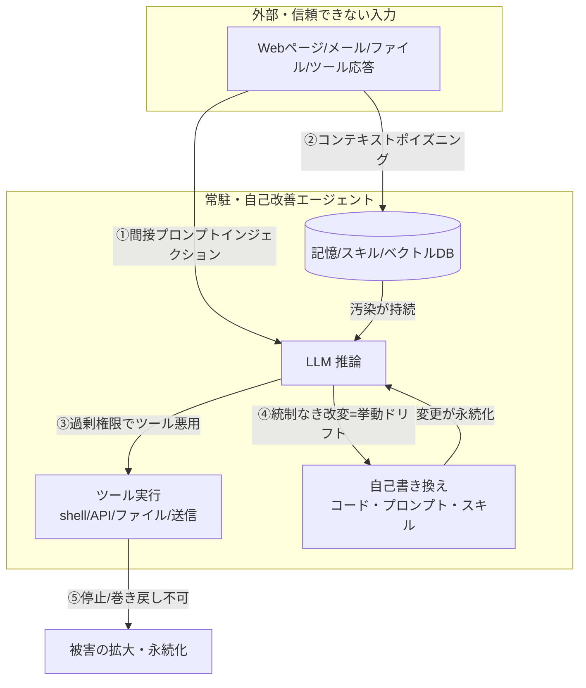

# 常駐型・自己改善型AIエージェントのセキュリティ対策 — 脅威モデルと防御の体系

> STATUS: INFO / CATEGORY: security / TOPIC: AGENT / 作成日: 2026-07-18（情報は 2026-07 時点）
> 「Hermes Agent」など **自己改善型（self-improving）AIエージェント** の話題を起点に、**常駐（long-running / daemon）かつ自己改善する** AIエージェントに固有のセキュリティ脅威と、その防御策を初心者にも分かるように体系化したドキュメントです。専門用語は綴りと意味をセットで補足します。
>
> **本ドキュメントの立場**: 防御・運用のためのガイドです。攻撃手順や悪用テクニックは扱いません。参照はすべて公開の一次情報（OWASP / Cloud Security Alliance / NIST 等）に基づき、要点のみを引用・出典明記します。

---

## 1. TL;DR（3行でわかる）

- **常駐型エージェント**（ずっと動き続ける）＋**自己改善型**（自分のコード・プロンプト・スキル・記憶を書き換えて賢くなる）は、便利さと引き換えに **「一度混入した悪意や逸脱が“永続化・自己増幅”する」** という新種のリスクを抱える。
- 最重要の脅威は **①プロンプトインジェクション（間接）／②メモリ・コンテキストポイズニング／③ツール権限の過剰付与／④自己書き換えの統制欠如による挙動ドリフト／⑤停止・ロールバック手段の不在**。
- 防御の核は **「最小権限 × サンドボックス × HITL 承認ゲート × 監査ログ × 緊急停止（kill switch）」**。外部から来た文章は常に **“データ”** として扱い、**“命令”** として実行しない。

> 誰向け: AIエージェント（LangGraph / AutoGPT / CrewAI / OpenClaw のような常駐エージェント基盤）を**運用・設計する人**、およびその安全性を評価したい人。

---

## 2. 用語（綴り＋意味）

| 用語 | 綴り | 意味 |
|---|---|---|
| エージェント | Agent | LLM が「観測→判断→ツール実行」を自律的に繰り返して目標を達成するソフトウェア。 |
| 常駐型 | long-running / daemon | 一度きりでなく、常時プロセスとして動き続ける形態。累積的な状態・権限を持つ。 |
| 自己改善型 | self-improving | 自分のコード・プロンプト・スキル・記憶を自ら書き換えて能力を更新するエージェント。 |
| 再帰的自己改善 | Recursive Self-Improvement (RSI) | 改善した自分がさらに自分を改善する連鎖。制御喪失リスクの中心概念。 |
| プロンプトインジェクション | Prompt Injection | 入力文に紛れ込ませた指示で、モデルの意図された振る舞いを乗っ取る攻撃。 |
| 間接インジェクション | Indirect Prompt Injection | Webページ・メール・ファイル等**外部データ経由**で注入する手口。エージェントで最重要。 |
| コンテキストポイズニング | Context / Memory Poisoning | エージェントの記憶・スキル・ベクトルDBに悪意ある情報を持続的に混入させること。 |
| 挙動ドリフト | Behavior / Goal Drift | 時間経過や自己改変で、当初の意図から挙動が徐々にずれること。 |
| HITL | Human-in-the-Loop | 人間が判断ループに介在し、重要操作を承認する仕組み。 |
| 最小権限 | Least Privilege | 必要最小限の権限・スコープ・期間だけ与える原則。 |
| 緊急停止 | Kill Switch | 異常時にエージェントを即時停止・隔離する手段。 |
| 責任ある開示 | Coordinated Vulnerability Disclosure | 発見した脆弱性を管理者に責任を持って報告する作法。 |

---

## 3. なぜ「常駐 × 自己改善」で危険が増幅するのか

通常の一回きりの LLM アプリと違い、常駐×自己改善エージェントには **「持続性」と「自己変更」** という2つの増幅器がある。

1. **持続性（常駐）**: セッションが終わらないので、一度混入した悪意・誤りが**記憶やスキルに残り続ける**。累積した権限・認証情報が**長時間さらされる**。
2. **自己変更（自己改善）**: エージェントが**自分のコード／プロンプト／スキルを書き換える**ため、統制がないと**意図しない挙動が自律的に永続化**する。OWASP は「エージェントは自らタスクを起動し、プロセスを増殖させ、他エージェントと連携できるため、**リソース消費や脅威が指数的・システム的**になりうる」と指摘する（OWASP Gen AI: Agentic AI – Threats and Mitigations）。
3. **制御喪失の懸念**: **再帰的自己改善（RSI）** は、2026 International AI Safety Report が「**制御喪失につながる国家安全保障級のリスク**」の一つに挙げるテーマ。CSA も 2026年6月に Anthropic が「自社の本番コードの 80%以上を Claude が書いている」と開示した事実に触れ、**企業レベルでの自己改善の統制**を論点化している（CSA: Recursive AI Self-Improvement – Enterprise Security Implications）。

> ポイント: 「賢くなる」仕組みは、そのまま「悪い方向にも自動で進む」仕組みになりうる。**改善のループには必ずガードレールと停止条件を設計する**。

---

## 4. 脅威モデル（常駐×自己改善エージェント固有の観点）

| # | 脅威 | 何が起きるか | 増幅要因 |
|---|---|---|---|
| ① | **間接プロンプトインジェクション** | 取得したWeb/メール/ファイル内の隠し指示に従い、情報漏洩・不正操作 | 常駐で繰り返し外部データを取り込む |
| ② | **メモリ/コンテキストポイズニング** | 記憶・スキル・RAGに悪意ある情報が残り、以後の判断を汚染 | 記憶が永続化し自己増殖 |
| ③ | **ツール権限の過剰付与** | 必要以上の権限（shell・送信・本番API）で被害が拡大 | 長時間の累積権限・短命化されない鍵 |
| ④ | **自己書き換えの統制欠如** | コード/プロンプト/スキルの自律変更で挙動ドリフト・バックドア化 | RSI による自己増幅・レビュー不在 |
| ⑤ | **停止/ロールバック不在** | 異常を止められず、悪い状態が固定化 | 常駐ゆえ「終わり」が無い |
| ⑥ | **供給網・依存リスク** | 汚染された依存パッケージ・MCPサーバ・外部ツールを取り込む | 自己改善で依存を自律追加 |
| ⑦ | **シークレット露出** | トークン・鍵・PII をログ／出力／コミットに残す | 長時間運用で露出面が拡大 |

補足: NIST の 2026 年資料も「侵害された／悪意あるエージェントが**目標から逸脱し、共謀・自己複製・ワークフロー乗っ取り**を行い、エージェント生態系の中で**自律的な内部脅威（insider threat）**として振る舞う」危険を挙げている。

---

## 5. 防御の体系（レイヤ別ベストプラクティス）

「これさえやれば安全」という単一策は無い。**多層防御（defense in depth）** で積み上げる。

### 5-1. 信頼境界と入出力サニタイズ（最重要）
- **外部から来た文章は常に “データ” として扱い、“命令” として実行しない**。ツール応答・Web・ファイル・他エージェントの出力を「指示」と解釈させない設計にする。
- 出力側もサニタイズ（機密・危険コマンドのフィルタ）。プロンプトに**信頼レベルのタグ付け**をして、低信頼コンテンツからの特権操作を禁じる。

### 5-2. 最小権限（Least Privilege）
- ツール・スコープ・実行期間を**必要最小限**に。**短命（short-lived）クレデンシャル**を使い、長期トークンを常駐プロセスに置かない。
- 「読み取り」と「書き込み／外部送信」を**分離**し、後者は明示的な承認を要求する。

### 5-3. サンドボックス実行
- shell・コード実行は**コンテナ／隔離環境**で。ファイルシステム・ネットワークを制限し、**localhost や内部ネットへの到達を既定で遮断**。

### 5-4. HITL 承認ゲート
- **不可逆・本番反映・外部送信・課金・権限昇格**は、人間の承認を挟む（Human-in-the-Loop）。無人で走らせない。

### 5-5. 自己改変の統制（自己改善型で追加すべき核心）
- 自己生成したコード／プロンプト／スキルは、**差分レビュー → 承認 → バージョン管理（署名付き）→ 反映** のパイプラインを通す。
- **即時ロールバック**できるよう、変更前スナップショットを保持。**改善ループには停止条件（評価が下がったら中断・回数上限）** を設ける。

### 5-6. 監査ログ／オブザーバビリティ
- すべての**ツール呼び出し・自己改変・外部送信を改ざん困難なログ**に残す。異常検知（挙動ドリフトの監視）と紐付ける。

### 5-7. 外部送信ゲート＆ネットワーク分離
- メール投稿・API送信などの**egress（外向き通信）は許可リスト方式**。想定外の宛先をブロック。

### 5-8. シークレット管理
- トークン・鍵・PII は**ログ・出力・コミット・要約に一切残さない**。値は secret manager／環境変数に留め、ドキュメントには placeholder のみ。

### 5-9. 供給網・依存リスク管理
- 追加する依存・MCPサーバ・外部ツールを**検証（署名・出所確認）**。自己改善で依存を自律追加させない／させる場合も承認を挟む。

### 5-10. 緊急停止（Kill Switch）とインシデント対応
- 異常時に**即時停止・隔離**する手段と手順を用意。復旧はスナップショットからのロールバックで。

---

## 6. チェックリスト（運用者向け・最小セット）

- [ ] 外部コンテンツを「命令」として実行しない設計になっているか（信頼境界）
- [ ] ツール権限は最小限か／長期トークンを常駐に置いていないか
- [ ] shell・コード実行はサンドボックス化＋内部ネット遮断か
- [ ] 不可逆・外部送信・本番反映に HITL 承認ゲートがあるか
- [ ] 自己改変に「差分レビュー→承認→バージョン管理→ロールバック」があるか
- [ ] 改善ループに停止条件（回数上限・評価低下で中断）があるか
- [ ] ツール呼び出し・自己改変・送信の監査ログを取っているか
- [ ] egress は許可リスト方式か
- [ ] シークレットをログ／出力／コミットに残していないか
- [ ] 緊急停止（kill switch）とロールバック手順があるか

---

## 7. 適用視点（常駐エージェント基盤の運用に落とすと）

一般に、常駐エージェント基盤を安全に運用するうえで有効とされる実践は次の通り（本ドキュメントの推奨を運用へ写像した例）。

- **HITL の徹底**: 書き込み・外部送信・本番反映は事前承認。承認は対象メッセージと一致させ、曖昧なら再確認する。
- **マスキング／機密ゼロ**: ドキュメント・ログ・要約・コミットに実値（トークン・鍵・PII・ホスト固有情報）を残さず placeholder 化する。
- **隔離実行**: 自動処理（定期ジョブ等）は**exec/read/write を持たせず、内部ネットワークへの到達を遮断**した隔離環境で走らせる。
- **着手前バックアップ**: 破壊的変更の恐れがある作業は、着手前にコード／データをスナップショット退避し、**ロールバック可能**にする。
- **追加のみ・最小変更**: 既存ロジックを書き換えず「追加」で拡張し、デグレ面を最小化する（自己改変の影響範囲を絞る）。
- **検証必須**: 変更後は構文チェック・再起動確認・正常系/異常系のテスト・既存機能のデグレ確認をセットで行う。

> これらは OWASP／CSA／NIST が示す「最小権限・サンドボックス・HITL・監査・ロールバック」の各原則と整合する。**自己改善を導入するほど、変更統制（差分レビュー・承認・ロールバック）と停止条件の重要度が上がる**。

---

## 8. 参考（出典・一次情報優先／2026-07 時点）

- OWASP Gen AI Security Project — Agentic AI: Threats and Mitigations: <https://genai.owasp.org/resource/agentic-ai-threats-and-mitigations/>
- OWASP Gen AI — Agentic Security Initiative: <https://genai.owasp.org/initiatives/agentic-security-initiative/>
- OWASP Top 10 for LLM Applications（LLM01: Prompt Injection ほか）: <https://genai.owasp.org/llm-top-10/>
- Cloud Security Alliance — Recursive AI Self-Improvement: Enterprise Security Implications: <https://labs.cloudsecurityalliance.org/research/csa-whitepaper-ai-recursive-self-improvement-systemic-risk-v/>
- Cloud Security Alliance — Recursive Self-Improvement Signals: Security Implications: <https://labs.cloudsecurityalliance.org/research/ai-recursive-self-improvement-security-implications-v1-0-csa/>
- NIST — Agentic AI: Emerging Threats, Mitigations, and Challenges（2026 presentation）: <https://csrc.nist.gov/>
- 2026 International AI Safety Report（recursive self-improvement による制御喪失リスク）

> 注記: 本テーマは 2026 年時点で急速に発展中。フレームワークやバージョンは更新されるため、実運用では各一次ソースの最新版を確認すること。「Hermes Agent」等の個別プロダクトの機能は各公式情報で確認し、本ドキュメントは一般化した脅威モデルと防御原則を扱う。

---

## Author and Ownership / 著作権と所属について

This project was created as a personal initiative and is not connected to any organization or group.
It is published as an individual creative work.

本プロジェクトは個人の活動として作成したものであり、特定の組織や団体の業務とは関係ありません。
個人の創作物として公開しています。
