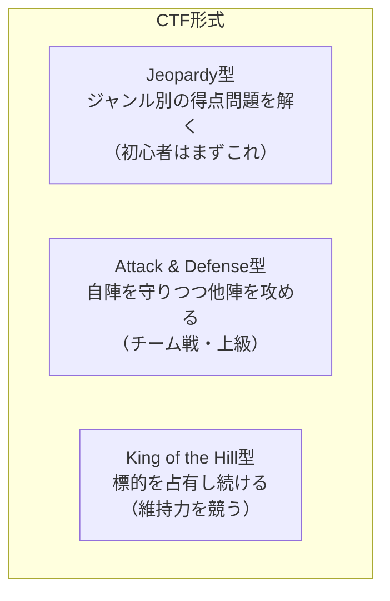
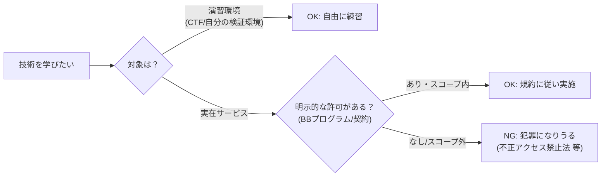
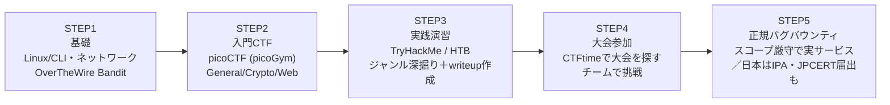

# CTF・バグバウンティ入門ガイド — セキュリティ／脆弱性診断の「入口」を初心者向けに

> STATUS: INFO / CATEGORY: security / TOPIC: CTF / 作成日: 2026-07-18（情報は 2026-07 時点）
> セキュリティ（脆弱性診断・攻防技術）を学びたい初心者に向けて、**CTF（Capture The Flag）** と **バグバウンティ（Bug Bounty）** を、用語・形式・プラットフォーム・入門サンプル問題・学習ロードマップ・法的/倫理の注意まで一気通貫でまとめた入門ガイドです。
>
> **重要（本ガイドの立場）**: 本ガイドは **防御・教育・CTF・正規のバグバウンティ**の文脈に厳格に限定します。実在サービスへの**無許可のテスト・攻撃手順・破壊的手法・具体的エクスプロイト**は一切扱いません（概念説明に留めます）。合法・許可された範囲・**責任ある開示（Coordinated Vulnerability Disclosure）**を必ず守ってください。

---

## 1. TL;DR（3行でわかる）

- **CTF** … 主催者が用意した「箱庭（安全な演習環境）」で、隠された合言葉 **flag（フラッグ）** を見つける競技。**合法・再現可能・安全**にハッキング技術を練習できる。
- **バグバウンティ** … 企業が「**許可した範囲（スコープ）**」で自社サービスの脆弱性を探してもらい、見つけた人に**報奨金**を払う制度。実在サービスが対象＝**法的責任を伴う**。
- **順路**: まず CTF で技術を身につけ（安全）、慣れたら**許可されたスコープ内**でバグバウンティに挑戦する。**無許可のテストは犯罪**（日本では不正アクセス禁止法）。

> 誰に向くか: 「手を動かして攻防技術を学びたい」「脆弱性診断・ペネトレーションテスト・セキュリティエンジニアを目指したい」「謎解き・パズルが好き」な人。

---

## 2. 用語と前提（綴り＋意味）

| 用語 | 綴り | 意味 |
|---|---|---|
| CTF | Capture The Flag | 「旗取り」。隠された `flag` を見つける形式のセキュリティ競技。 |
| flag | flag | 問題を解いた証拠となる合言葉。例: `picoCTF{...}` のような決まった形式の文字列。 |
| Jeopardy | Jeopardy | ジャンル別の得点問題を解く、クイズ番組型の CTF 形式（入門の主流）。 |
| Attack & Defense | Attack and Defense | 自陣サーバを守りつつ他チームを攻める攻防戦型の形式。 |
| KotH | King of the Hill | 1つの標的を「占有し続ける」ことを競う形式。 |
| バグバウンティ | Bug Bounty | 企業が許可範囲で脆弱性報告を募り報奨金を払う制度。 |
| スコープ | Scope | テストしてよい対象（ドメイン・機能）の範囲。**スコープ外は禁止**。 |
| 責任ある開示 | Coordinated Vulnerability Disclosure (CVD) | 脆弱性を勝手に公表せず、ベンダー/調整機関に届け、修正されてから公開する作法。 |
| PoC | Proof of Concept | 「脆弱性が存在する」ことを示す最小限の再現手順（悪用ツールではない）。 |

---

## 3. CTF の全体像

### 3-1. 形式（3種類）



- **Jeopardy（ジェパディ）型**: Web / Crypto などジャンル別に、難易度に応じた得点問題が並ぶ。解くと flag が手に入り加点。**常設・オンラインの入門はほぼこれ**。
- **Attack & Defense（アタック&ディフェンス）型**: 各チームに同じ脆弱なサーバが配られ、**自分のバグを直して守り、他チームの同じバグを突いて攻める**。上級者・チーム戦向け。
- **King of the Hill（KotH）型**: 1つの標的を奪い、**占有し続けた時間**を競う。

### 3-2. 主要ジャンル（7種）

| ジャンル | 綴り | 何をする？ |
|---|---|---|
| Web | Web | Webアプリの脆弱性（入力の扱いの不備、認証の穴 等）を演習環境で見つける。 |
| Pwn | Binary Exploitation | プログラム（バイナリ）のメモリ管理の不備を突いて制御を奪う演習。 |
| Rev | Reverse Engineering | 実行ファイルを解析し、内部ロジックや隠された flag を読み解く。 |
| Crypto | Cryptography | 暗号・エンコードの弱点を解いて平文を復元する。 |
| Forensics | Forensics | ログ・パケット・ファイル・メモリダンプから痕跡や flag を発掘する。 |
| OSINT | Open Source INTelligence | 公開情報（画像のExif・SNS・地図等）から手がかりを集める。 |
| Misc | Miscellaneous | 上記に当てはまらない雑多な問題（プログラミング・パズル等）。 |

> 入門のおすすめ順: **General Skills / Crypto（エンコード）→ Web / Forensics → Rev → Pwn**。Pwn は前提知識が多く最後でよい。

---

## 4. 代表プラットフォーム（合法・教育・公開のもの）

| 名称 | URL | 特徴 | 費用 |
|---|---|---|---|
| picoCTF | <https://picoctf.org/> | 米カーネギーメロン大学運営。**初心者向けの定番**。常設練習場（picoGym）と年次大会。 | 無料 |
| OverTheWire | <https://overthewire.org/wargames/> | SSH で入る **Wargames**。特に `Bandit` は Linux/CLI 入門の名作。 | 無料 |
| TryHackMe | <https://tryhackme.com/> | ブラウザ完結の**ガイド付き学習ルーム**。手取り足取りで進める。 | 無料枠＋有料 |
| Hack The Box (HTB) | <https://www.hackthebox.com/> | 実践的な攻略マシンが豊富。**中〜上級**。学習用の HTB Academy もある。 | 無料枠＋有料 |
| CTFtime | <https://ctftime.org/> | 世界中の CTF 大会の**カレンダー**とチームランキング。「次に出る大会」を探す拠点。 | 無料 |

> 迷ったら: **picoCTF（Web完結・日本語情報も多い）** と **OverTheWire Bandit（Linux基礎）** から始めるのが王道です。

---

## 5. 入門サンプル問題と解法

> ここで扱うのは **公開・教育用の題材のみ**（picoCTF 系の一般的な入門問題、OverTheWire Bandit 公式演習）。実在サービスへの攻撃手順ではありません。flag の形式は例示です。

### 5-1. Crypto入門: 「ずらし暗号（ROT13）」

**問題イメージ**: 次の文字列を復号せよ → `cvpbPGS{ebg13_vf_rnfl}`

- **考え方**: 各文字をアルファベット順に一定数ずらしただけの古典暗号（シーザー暗号）。13ずらしを **ROT13** と呼ぶ。
- **解法ステップ**:
  1. ROT13 は「13文字ずらすと元に戻る」性質を持つ。
  2. コマンド1つで戻せる（Linux）:
     ```bash
     echo 'cvpbPGS{ebg13_vf_rnfl}' | tr 'A-Za-z' 'N-ZA-Mn-za-m'
     ```
- **解答（flag 例）**: `picoCTF{rot13_is_easy}`
- **学べること**: 「暗号らしき文字列を見たら、まず既知のエンコード/古典暗号を疑う」という初動。

### 5-2. Crypto/General入門: 「Base64 エンコード」

**問題イメージ**: `cGljb0NURntiYXNlNjRfZGVjb2RlZH0=` を読める文字に戻せ。

- **考え方**: 末尾が `=` で英数字＋記号のみ → **Base64（バイナリを文字に変換する方式）** の典型。
- **解法ステップ**:
  ```bash
  echo 'cGljb0NURntiYXNlNjRfZGVjb2RlZH0=' | base64 -d
  ```
- **解答（flag 例）**: `picoCTF{base64_decoded}`
- **学べること**: エンコード（可逆変換）と暗号（鍵が必要）の違い。CTF頻出の基礎。

### 5-3. General Skills入門: OverTheWire Bandit「Level 0 → 1」（公式教材）

Bandit は**公式が用意した合法な学習用サーバ**です（誰でも同じ手順を再現できます）。

- **考え方**: SSH でログインし、ホームにあるファイルを読むだけ。**Linux/CLI の基礎練習**。
- **解法ステップ**（公式の公開情報どおり）:
  1. 接続情報は公式ページに明記（ユーザ `bandit0` / パスワード `bandit0` / ポート `2220`）。
     ```bash
     ssh bandit0@bandit.labs.overthewire.org -p 2220
     ```
  2. ログイン後、ホームの `readme` を読む:
     ```bash
     ls
     cat readme
     ```
  3. 表示された文字列が **Level 1 のパスワード**（＝この問題の「flag」に相当）。
- **学べること**: `ssh` / `ls` / `cat` など、あらゆるジャンルの土台になる CLI 操作。

### 5-4. Web入門: 「クライアント側を信用しない」（概念・演習環境限定）

> 具体的な攻撃手順ではなく、**考え方**を示します。実サービスでは絶対に試さないこと。

- **典型テーマ**: CTFのWeb入門では「隠された flag が **ページのソースやコメント、非表示の入力欄、開発者ツールで見える通信**に残っている」問題が多い。
- **考え方（初動チェックリスト）**:
  - ブラウザの**ページのソースを表示**して HTMLコメントを確認する。
  - **開発者ツール（DevTools）**の Network / Application（Cookie・LocalStorage）を見る。
  - `robots.txt` などの公開ファイルにヒントが残っていないか確認する。
- **学べること**: 「**クライアント側（ブラウザ）で隠しただけの情報は秘密ではない**」というWebセキュリティの基本原則。実開発では**サーバ側で必ず検証・認可する**ことの重要性につながる。

### 5-5. なぜ面白い？（やりがい）

- **謎解き感**: 「解けた瞬間」のカタルシス。1問1問がパズル。
- **実務スキル直結**: Linux・ネットワーク・Web・暗号・解析…が**手を動かして**身につく。脆弱性診断/ペネトレーションテスト/セキュリティエンジニアの基礎になる。
- **報奨とキャリア**: CTFの実績や writeup（解法記事）はポートフォリオになり、就職・転職でも評価されやすい。
- **コミュニティ**: チーム戦・writeup 文化・勉強会。仲間と学べる。

---

## 6. バグバウンティ入門

### 6-1. どういう仕組み？

企業が「**この範囲なら脆弱性を探してよい**」と公開し（＝**スコープ**）、見つけて**責任を持って報告**した人に、深刻度に応じて**報奨金（bounty）**や謝辞を出す制度。CTF と違い**実在サービスが対象**なので、**必ず許可（プログラムの規約）に従う**必要があります。

### 6-2. 主要プラットフォーム（グローバル）

| 名称 | URL | メモ |
|---|---|---|
| HackerOne | <https://www.hackerone.com/> | 最大手。企業のプログラム掲載・報告・報奨の仲介。 |
| Bugcrowd | <https://www.bugcrowd.com/> | 同じく大手。クラウドソース型のセキュリティテスト。 |
| YesWeHack | <https://www.yeswehack.com/> | 欧州発の大手プラットフォーム。 |
| Intigriti | <https://www.intigriti.com/> | 欧州発。バグバウンティ／脆弱性開示を提供。 |

### 6-3. 覚えておく基本用語

- **In-scope / Out-of-scope**: テストしてよい対象／**ダメな対象**。out-of-scope への行為は**違反＝報奨対象外どころか法的問題**。
- **Duplicate（重複）**: 既に他の人が報告済みの同じバグ。**先着**が原則。
- **Triage（トリアージ）**: 運営/企業が報告を検証・重大度判定する工程。
- **Severity（深刻度）**: CVSS 等で評価。高いほど報奨が大きい傾向。
- **良いレポートの型**: ①要約 ②影響（何が起きるか）③**再現手順（PoC）** ④修正提案。**攻撃の拡大ではなく、再現に必要な最小限**に留めるのが作法。

### 6-4. 日本の正規制度（届出・調整）

日本には、報奨金型とは別に**公的な脆弱性の届出・調整の枠組み**があります。無許可テストの代わりに、**発見した脆弱性を正規ルートで届け出る**ことができます。

- **情報セキュリティ早期警戒パートナーシップ**（経済産業省告示に基づくガイドライン。最終改正 令和6年）。
  - **受付・調整の窓口**: **IPA（情報処理推進機構）** が届出を受付、**JPCERT/CC** が製品ベンダー等との**調整（Coordinated Disclosure）**を担う。
- 参照:
  - IPA 脆弱性関連情報の届出受付: <https://www.ipa.go.jp/security/todokede/vuln/uketsuke.html>
  - IPA 早期警戒パートナーシップガイドライン: <https://www.ipa.go.jp/security/guide/vuln/partnership_guide.html>
  - JPCERT/CC 脆弱性関連情報の取扱い: <https://www.jpcert.or.jp/vh/>

> ポイント: 「良かれと思って勝手にテスト」ではなく、**制度・プログラムの許可範囲の中で**動くのが、日本でも国際的にも正しい入口です。

---

## 7. 法的・倫理（最重要・必読）



- **日本の法律**: 権限なく他人のシステムへアクセス・侵入する行為は **不正アクセス行為の禁止等に関する法律（不正アクセス禁止法）** 等に触れる可能性があります。**「許可のない実サービスへのテスト」は絶対にしない。**
- **やってはいけないこと（例）**:
  - スコープ外・無許可の対象を触る／サービスを停止させる・データを破壊する／取得したデータを持ち出す・公開する／見つけたバグを脅迫や金銭要求に使う。
- **守るべき作法（責任ある開示）**:
  - 影響は**最小限の再現**に留める（本当の悪用はしない）。
  - 見つけたら**勝手に公表せず**、正規窓口（BBプログラム／IPA・JPCERT）に報告し、**修正後に**必要なら開示する。
- **迷ったら止まる**: 「これは許可されているか？」に自信がなければ**やらない**。これが最大の防御です。

---

## 8. 学習ロードマップ



1. **STEP1 基礎**: `OverTheWire Bandit` で Linux/CLI と SSH に慣れる。
2. **STEP2 入門CTF**: `picoCTF`（picoGym）で General Skills / Crypto / Web を一通り。**解いたら writeup（解法メモ）を書く**と定着する。
3. **STEP3 実践演習**: `TryHackMe`（ガイド付き）→ `Hack The Box`（実践）。得意ジャンルを1つ深掘り。
4. **STEP4 大会参加**: `CTFtime` で開催中/予定の大会を探し、チームで挑戦。順位より「1問解く」を目標に。
5. **STEP5 正規バグバウンティ**: 慣れたら HackerOne / Bugcrowd などで**スコープを熟読**して挑戦。日本なら IPA/JPCERT の届出制度も活用。

> 継続のコツ: **毎回 writeup を残す**／**得意ジャンルを1つ作る**／**コミュニティ（勉強会・チーム）に入る**。焦らず「安全な箱庭」で積み上げるのが最短です。

---

## 9. 出典・参考URL（公式優先・2026-07 到達性確認済み）

- picoCTF（公式）: <https://picoctf.org/>
- OverTheWire Wargames（公式）: <https://overthewire.org/wargames/>
- TryHackMe（公式）: <https://tryhackme.com/>
- Hack The Box（公式）: <https://www.hackthebox.com/>
- CTFtime（大会カレンダー）: <https://ctftime.org/>
- HackerOne（公式）: <https://www.hackerone.com/>
- Bugcrowd（公式）: <https://www.bugcrowd.com/>
- YesWeHack（公式）: <https://www.yeswehack.com/>
- Intigriti（公式）: <https://www.intigriti.com/>
- IPA 脆弱性関連情報の届出受付: <https://www.ipa.go.jp/security/todokede/vuln/uketsuke.html>
- IPA 情報セキュリティ早期警戒パートナーシップガイドライン: <https://www.ipa.go.jp/security/guide/vuln/partnership_guide.html>
- JPCERT/CC 脆弱性関連情報の取扱い: <https://www.jpcert.or.jp/vh/>
- 電子政府 e-Gov「不正アクセス行為の禁止等に関する法律」: <https://laws.e-gov.go.jp/law/411AC0000000128>

---

> 免責: 本ガイドは教育目的の概説です。実在サービスへのテストは、必ず**明示的な許可**と**適用法令**の順守のうえで行ってください。情報は 2026-07 時点であり、各プラットフォームの仕様・制度は変わる可能性があります。最新は各公式をご確認ください。
