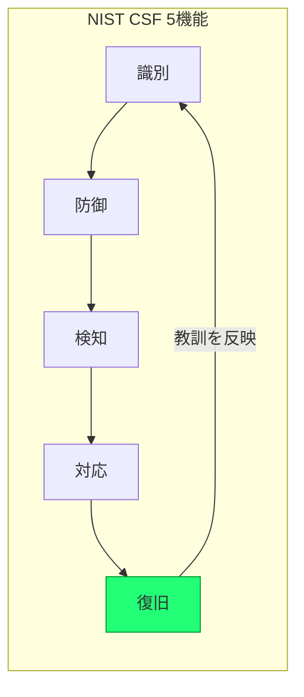

# フロンティアAI時代の「レジリエンス」― 国・デジタル庁の方針と実務への落とし込み

> STATUS: INFO / CATEGORY: security / TOPIC: RESILIENCE / 作成日: 2026-07-19（情報は 2026-07 時点）
> フロンティアAI（先端的な基盤モデル・生成AI）と最新セキュリティの文脈で、**レジリエンス（回復力・耐障害性）** を、特に **日本国の方針・デジタル庁の方針** の観点から整理する政策・ガバナンス寄りのドキュメント。技術実装の一般論（SRE）は既存資料に譲り、本書は**政策の位置づけと実務への接続**に焦点を当てる。

---

## 1. TL;DR

- **レジリエンス** ＝「攻撃・障害を100%防ぐ」ではなく、**やられても止まらない・早く復旧する**能力（予防＋検知＋対応＋復旧）。近年の国家方針は「防御」から**「回復力（レジリエンス）と能動的対応」**へ重心が移っている。
- **国の方針**: 2025年12月に新たな **「サイバーセキュリティ戦略」** を閣議決定。**能動的サイバー防御**（サイバー対処能力強化法）と **国家サイバー統括室（NCO）**、重要インフラ防護が柱。
- **デジタル庁の方針**: 政府情報システムに **サイバーセキュリティフレームワーク（NIST CSF の考え方）** を導入し、専門チームによる検証・監査、ガバメントクラウド等の継続性を推進。
- **フロンティアAI固有**: AI事業者ガイドライン・広島AIプロセス等のガバナンスと、AIワークロード/エージェント基盤の**耐障害・回復設計**が接点になる。

---

## 2. 用語（綴り＋意味）

| 用語 | 綴り | 意味 |
|---|---|---|
| レジリエンス | Resilience | 障害・攻撃を受けても機能を維持・早期回復する力。 |
| サイバーレジリエンス | Cyber Resilience | サイバー攻撃を前提に、被害を受けても事業/サービスを継続・回復する能力。 |
| 能動的サイバー防御 | Active Cyber Defense | 攻撃の未然・被害拡大防止のため、政府が能動的に対処する枠組み。 |
| 重要インフラ | Critical Infrastructure | 電力・通信・金融・医療等、社会機能に不可欠なシステム。 |
| NIST CSF | Cybersecurity Framework | 識別・防御・検知・対応・復旧の5機能で整理する米国発の枠組み。日本政府も参照。 |
| フロンティアAI | Frontier AI | 最先端の大規模基盤モデル。安全性・ガバナンスの主対象。 |

---

## 3. 国（日本政府）の方針とレジリエンス

### 3-1. サイバーセキュリティ戦略（2025年12月23日 閣議決定）
- **今後5年**を念頭に、**国家安全保障戦略**および**サイバー対処能力強化法**に基づく取組を一体的に推進する中長期方針。
- **能動的サイバー防御**への転換が最大の論点。従来の受け身の防御から、**攻撃の未然防止・被害拡大の抑止**へ踏み込む。
- **国家サイバー統括室（NCO）** を中心に、警察・防衛省・自衛隊など関係機関の連携を強化。
- **重要インフラの機能維持・回復（＝レジリエンス）** が国家安全保障の中核課題として位置づけられる。

### 3-2. 能動的サイバー防御（サイバー対処能力強化法・令和7年法律第42号）
- 2024年6月の有識者会議提言 → 同年11月取りまとめ → 法制化。欧米主要国と同等以上の対応能力を目指す。
- 目的は「侵入・潜伏能力を備えた高度な攻撃」から**重要インフラの停止を防ぐ**こと。レジリエンス（止まらない・早く戻す）と表裏一体。

> ポイント: 国の方針では「**防ぎきれない前提**」に立ち、**検知・対応・復旧（＝レジリエンス）** と能動的対処を組み合わせる方向に明確にシフトしている。

---

## 4. デジタル庁の方針とレジリエンス

- **基本的な方針**: 「政府情報システムの管理等に係るサイバーセキュリティについての基本的な方針」（令和3年12月24日 デジタル大臣決定）を土台に実装を推進。
- **専門チーム**: デジタル庁にサイバーセキュリティ専門チームを置き、整備・運用するシステムを中心に**検証・監査**を実施。
- **サイバーセキュリティフレームワーク**: 政府情報システムに **NIST CSF の考え方（識別・防御・検知・対応・復旧）** を導入する方針・実施プロセスを提示。**復旧（Recover）** が明示的に含まれる＝レジリエンス重視。
- **ガバメントクラウド等**: 政府共通のクラウド基盤で、可用性・継続性・回復性を標準化（多重化・バックアップ・監視の共通土台）。

---

## 5. フロンティアAI 固有の観点

- **AIガバナンス**: 「AI事業者ガイドライン」や国際枠組み（広島AIプロセス）は、安全性・透明性・リスク管理を求める。ここにレジリエンス（AIサービスが**誤作動・攻撃・障害から回復**できること）が接続する。
- **AIワークロードの耐障害設計**: モデル/エージェント基盤は、①外部依存（API・モデル提供元）の停止 ②プロンプトインジェクション等の攻撃 ③暴走・コスト暴発 に対し、**フェイルセーフ・停止・ロールバック**を備える必要がある。
- **エージェント基盤との関係**: 常駐・自己改善型エージェントのセキュリティ（別資料参照）と組み合わせ、「壊れても安全に止まり、早く戻せる」設計がレジリエンスの実体。

---

## 6. 実適用（クラウド上のAIエージェント基盤に当てはめる）

一般的な小〜中規模の常駐AIエージェント基盤（クラウド上のVM＋エージェント）で、レジリエンスを高める勘所:

| 観点 | 具体策 | メリット / 勘所 |
|---|---|---|
| バックアップ | 定期スナップショット（マシンイメージ）＋データ退避 | 破壊時に短時間で復元。**着手前バックアップ**を習慣化 |
| 復元手順 | イメージからの復旧手順を文書化・定期訓練 | 「復元できるつもり」を排除（実際に戻せるか検証） |
| 多重化 | 重要コンポーネントの冗長化・自動再起動 | 単一障害点を減らす |
| 監視/自動復旧 | ヘルスチェック＋異常時の自動再起動・通知 | 検知〜対応を自動化（MTTR短縮） |
| 変更統制 | 追加のみ・最小変更・ロールバック可能に | 変更起因の障害を局所化・巻き戻し容易 |
| 緊急停止 | 暴走・攻撃時に安全に停止する手段 | 被害拡大を止める（能動的対処の個人版） |

> 注意: レジリエンスは「予防（防御）」と対立しない。**防御を固めつつ、破られた前提で復旧を設計する**のが要点。過剰投資を避け、重要度に応じて多層化する。

---

## 7. 参考（出典・一次情報／2026-07 時点）

- デジタル庁 — サイバーセキュリティ: <https://www.digital.go.jp/policies/security>
- デジタル庁 — 政府情報システムにおけるサイバーセキュリティフレームワーク（標準ガイドライン群）: <https://www.digital.go.jp/policies/security>
- 内閣サイバーセキュリティ（NISC/NCO）— サイバーセキュリティ戦略（2025）: <https://www.cyber.go.jp/pdf/policy/kihon-s/cs_strategy2025.pdf>
- 内閣官房 — サイバー安全保障に関する取組（能動的サイバー防御）: <https://www.cas.go.jp/jp/seisaku/cyber_anzen_hosyo_torikumi/index.html>

> 注記: 政策文書は改定される。条項・最新版は上記一次情報を参照。本書は既存の SRE/レジリエンスエンジニアリング資料と重複しないよう、政策・ガバナンスと実務接続に絞って整理した。

---

## Author and Ownership / 著作権と所属について

This project was created as a personal initiative and is not connected to any organization or group.
It is published as an individual creative work.

本プロジェクトは個人の活動として作成したものであり、特定の組織や団体の業務とは関係ありません。
個人の創作物として公開しています。
