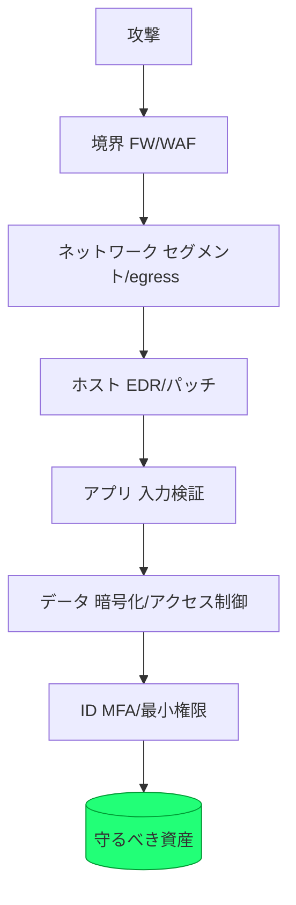

# 多層防御 と マイクロセグメンテーション ― フロンティアAI時代の「壊れにくい」設計

> STATUS: INFO / CATEGORY: security / TOPIC: SECURITY / 作成日: 2026-07-19（情報は 2026-07 時点）
> **多層防御（Defense in Depth）** と **マイクロセグメンテーション（Micro-segmentation）** を、ゼロトラストとの関係、AIエージェント/LLMワークロードへの適用まで、初心者にも分かるように整理します。専門用語は綴りと意味をセットで補足します。

---

## 1. TL;DR

- **多層防御** ＝ 1枚の壁に頼らず、**境界・ネットワーク・ホスト・アプリ・データ・ID の各層で重ねて守る**。1つ破られても次で止める。
- **マイクロセグメンテーション** ＝ ネットワークを**細かく区切り**、必要な通信だけを許可（既定は拒否）。侵入されても**横移動（lateral movement）を封じる**。
- **AI時代**: LLM/エージェントは外部データやツールを扱うため、**ツール実行の隔離・権限分離・egress制御**が多層防御＋マイクロセグメンテーションの主戦場になる。

---

## 2. 用語（綴り＋意味）

| 用語 | 綴り | 意味 |
|---|---|---|
| 多層防御 | Defense in Depth | 複数層で重ねて守り、単一障害点をなくす考え方。 |
| マイクロセグメンテーション | Micro-segmentation | ワークロード単位で細かく区切り、通信を最小許可にする手法。 |
| ゼロトラスト | Zero Trust | 「何も信頼しない・都度検証」。社内外を区別せず常に認証・認可。 |
| 横移動 | Lateral Movement | 侵入後、内部を横に広がって権限・資産を奪う動き。 |
| egress | egress control | 外向き通信の制御（許可リスト方式で情報流出を防ぐ）。 |
| 最小権限 | Least Privilege | 必要最小限の権限だけ与える原則。 |

---

## 3. 多層防御（Defense in Depth）

### レイヤ構成（各層で守る）
| 層 | 守るもの | 代表対策 |
|---|---|---|
| 境界 | 外部との出入口 | FW / WAF / IDS/IPS |
| ネットワーク | 内部通信 | セグメンテーション / egress制御 |
| ホスト | サーバ/OS | パッチ / EDR / 最小サービス |
| アプリ | ソフトウェア | 入力検証 / セキュアコーディング |
| データ | 情報そのもの | 暗号化 / アクセス制御 / バックアップ |
| ID | 認証・認可 | MFA / 最小権限 / 短命クレデンシャル |

### ゼロトラストとの関係・限界
- 多層防御は「重ねて守る」、ゼロトラストは「**そもそも信頼せず都度検証**」。**両者は補完関係**（多層防御の各層でゼロトラスト原則を効かせる）。
- 限界: 層を増やすだけでは**運用が複雑化・穴が残る**。層の間の連携（検知→対応→復旧）と、次章のセグメント化が要。

---

## 4. マイクロセグメンテーション（Micro-segmentation）

### 従来セグメンテーションとの違い
- **従来**: 大きなサブネット単位（例: 「本番ネット」「開発ネット」）でざっくり区切る。内部は割と自由に通信できる＝**侵入後の横移動を許しやすい**。
- **マイクロ**: **ワークロード/サービス単位**で細かく区切り、「AはBの443だけOK、他は全部拒否」のように最小許可。侵入されても**被害を1区画に封じ込める**。

### 実装方式
| 方式 | 概要 |
|---|---|
| ホストエージェント型 | 各ホストにエージェントを入れ、L3/L4/L7で制御 |
| ハイパーバイザ型 | 仮想化基盤で仮想NIC単位に制御 |
| ネットワーク/SDN型 | SDN・スイッチで区切る |
| クラウドSG型 | セキュリティグループ/ネットワークポリシーで最小許可 |

### ゼロトラストにおける役割
- マイクロセグメンテーションは**ゼロトラストの実装手段の一つ**。「区画ごとに都度認可」を実現し、横移動を止める。NIST SP 800-207（ゼロトラスト）や CISA のゼロトラスト成熟度モデルでも中核要素。

---

## 5. フロンティアAI 固有の観点

- **ツール実行の隔離**: LLMエージェントの shell/コード実行は**サンドボックス（コンテナ/隔離環境）**に閉じ込め、内部ネット・本番へ到達させない。
- **権限分離**: エージェントごと・タスクごとに**最小権限＋短命クレデンシャル**。読み取りと書き込み/外部送信を分離。
- **egress制御**: モデルAPI・許可した宛先だけに外向き通信を限定 → **データ流出（exfiltration）と間接プロンプトインジェクションの被害**を抑制。
- **サプライチェーン**: MCPサーバ・依存パッケージ・外部ツールを検証し、汚染の横展開を区画で止める。

---

## 6. 実適用（クラウド上のAIエージェント基盤に当てはめる）

| 観点 | 具体策 | 勘所 |
|---|---|---|
| セグメント | エージェント実行環境を専用区画に隔離 | localhost/内部ネットへの到達を既定拒否 |
| egress | 外向きは許可リスト方式 | 想定外の送信先をブロック（流出防止） |
| ホスト | 最小サービス＋パッチ＋監視 | 攻撃面を減らす |
| ID/権限 | タスク単位の最小権限・短命トークン | 長期トークンを常駐に置かない |
| データ | 暗号化＋バックアップ | 破壊/漏洩の両面に備える |
| 検知/復旧 | 監査ログ＋異常時の停止・ロールバック | 封じ込め＋早期復旧 |

> 注意: いきなり全体をマイクロセグメント化すると運用が破綻する。**重要資産（データ・本番・鍵）から優先的に区切る**のが現実的。多層防御と組み合わせ、「防ぐ＋封じ込める＋戻す」を一体で設計する。

---

## 7. 参考（出典・一次情報／2026-07 時点）

- NIST SP 800-207 — Zero Trust Architecture: <https://csrc.nist.gov/pubs/sp/800/207/final>
- CISA — Zero Trust Maturity Model: <https://www.cisa.gov/zero-trust-maturity-model>
- NIST Cybersecurity Framework（CSF）: <https://www.nist.gov/cyberframework>
- OWASP Gen AI — Agentic AI: Threats and Mitigations（AIエージェントの隔離・権限分離）: <https://genai.owasp.org/resource/agentic-ai-threats-and-mitigations/>

> 注記: 各フレームワークは改定される。最新版は上記一次情報を参照。本書は概念理解と実務適用を目的とし、製品固有の設定値は扱わない（マスキング規約遵守）。

---

## Author and Ownership / 著作権と所属について

This project was created as a personal initiative and is not connected to any organization or group.
It is published as an individual creative work.

本プロジェクトは個人の活動として作成したものであり、特定の組織や団体の業務とは関係ありません。
個人の創作物として公開しています。
