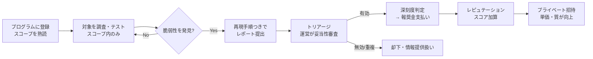

# バグバウンティ入門と「フロンティアAIセキュリティ」— 主要プラットフォーム・始め方・稼ぎ方ガイド（2026-07-29）

作成日: 2026-07-29 / STATUS: INFO / TOPIC: BUGBOUNTY / 対象: 脆弱性報奨金制度の全体像＋AIモデル特化領域

いま最もホットな分野のひとつ「**フロンティアAI（最先端の大規模AIモデル）のセキュリティ**」を軸に、そもそもバグバウンティとは何か、有名なプラットフォーム、初心者〜本格派それぞれの始め方、注意点までを整理したガイドです。専門用語には都度かんたんな補足を付けています。

---

## 1. バグバウンティとは

**バグバウンティ（Bug Bounty＝脆弱性報奨金制度）** とは、企業が自社のソフトウェアやサービスの脆弱性（セキュリティ上の欠陥）を発見・報告してくれた外部の研究者「**バグハンター**」に報奨金を支払う制度です。

- **起源:** 1995年に Netscape（当時のWebブラウザ企業）が始めたのが最初とされます。
- **現在:** Google、Apple、Microsoft、Meta に加え、AI企業（Anthropic、OpenAI など）まで幅広く導入。
- **規模感:** 脆弱性の**深刻度**（Critical＝緊急／High＝高／Medium＝中／Low＝低）に応じて報奨金額が決まり、Critical級には数百万円〜数千万円が支払われることもあります。

> ポイント: 「脆弱性を勝手に探して報告する」のではなく、**企業が公開したプログラム（ルール）の範囲内**で合法的に探し、報告して報酬を得る、という枠組みです（範囲＝スコープの厳守が大前提。§6参照）。

---

## 2. バグバウンティの基本フロー（全体像）

- **トリアージ（triage）:** 提出された報告が本当に有効な脆弱性かを運営側が精査する工程。ここを通らないと報酬は出ません。**レポート品質が通過率と評価額を左右**します。
- **レピュテーション（reputation）:** ハンターの実績スコア。積むと**招待制（プライベート）プログラム**に呼ばれやすくなり、競争が少なく単価も上がる傾向。

---

## 3. 有名なバグバウンティ・プラットフォーム一覧

### 3-1. 総合系プラットフォーム

| サイト | 特徴 | 公式リンク |
|---|---|---|
| **HackerOne** | 最大規模の研究者コミュニティを持つ最大手。初心者向け学習コンテンツ「Hacker101」あり | <https://www.hackerone.com/> |
| **Bugcrowd** | 手厚いマネージドトリアージ（運営代行の審査）が強み。米国企業に強い | <https://www.bugcrowd.com/> |
| **Intigriti** | ベルギー拠点。オンボーディングが分かりやすく初心者に優しい。欧州企業・GDPR対応に強い | <https://www.intigriti.com/> |
| **YesWeHack** | 欧州の企業・政府機関・規制産業のプログラムが多い。フランス語圏に強い。演習環境「DOJO」 | <https://www.yeswehack.com/> |
| **Synack** | 招待制・審査制で報酬が高め。米政府系（FedRAMP）案件に強い | <https://www.synack.com/> |
| **Immunefi** | Web3・スマートコントラクト特化（暗号資産系の高額報酬が特徴） | <https://immunefi.com/> |
| **Yogosha** | フランス発。企業のプライベートプログラムに強い | <https://yogosha.com/> |
| **Open Bug Bounty** | 無料・オープンな脆弱性開示プラットフォーム | <https://www.openbugbounty.org/> |
| **BugBounty.jp** | 日本国内特化。日本語でやり取りしたい人向け | <https://bugbounty.jp/> |

### 3-2. AIモデル特化（フロンティアAI関連）

AIシステムの普及で「**AI特有の脆弱性**（プロンプトインジェクション、ジェイルブレイク、データ漏洩など）」を対象とするプログラムが急増しています。ここが今まさにホットな領域です。

| 提供元 | 内容 | 公式リンク |
|---|---|---|
| **Anthropic** | HackerOne 上で運用する「**Model Safety Bug Bounty**」。Constitutional Classifiers（憲法AI由来の安全分類器）を突破する**万能ジェイルブレイク**（CBRN＝化学・生物・放射性物質・核／サイバー領域）が対象。上限の目安は最大**$15,000** | 発表: <https://www.anthropic.com/news/testing-our-safety-defenses-with-a-new-bug-bounty-program> ／ 制度概要: <https://support.claude.com/en/articles/12119250-model-safety-bug-bounty-program> ／ プログラム: <https://hackerone.com/anthropic> |
| **OpenAI** | 従来のインフラ・API脆弱性は **$200〜$20,000**（特別な発見で最大**$100,000**）。加えて2026年に**エージェント型AIのリスク・プロンプトインジェクション・データ漏洩**に特化した「**Safety Bug Bounty**」を新設 | Security: <https://openai.com/index/bug-bounty-program/> ／ Safety: <https://openai.com/index/safety-bug-bounty/> ／ 運用（Bugcrowd）: <https://bugcrowd.com/engagements/openai> ・ <https://bugcrowd.com/engagements/openai-safety> |
| **Google / Microsoft / xAI（Grok）/ Cohere** | 各社ともAI特有の脆弱性に対する報奨金・報告制度を運用 | Google: <https://bughunters.google.com/> ／ Microsoft: <https://www.microsoft.com/en-us/msrc/bounty> ／ xAI: <https://x.ai/security> ／ Cohere: <https://cohere.com/security> |
| **Mozilla 0din** | Mozilla 提供の**生成AI特化**の脆弱性報奨金・検証プラットフォーム（チャットボット/AIアプリ/エージェントを実攻撃で検証） | <https://0din.ai/> |
| **Gray Swan Arena** | AI特化の**レッドチーム大会**（多数の研究者が敵対的攻撃で競う）プラットフォーム | <https://www.grayswan.ai/> |

> 補足: 各社の金額・スコープは頻繁に更新されます。挑戦前に必ず各公式ページの最新ルールを確認してください（本表は2026-07時点の到達性確認済み）。

---

## 4. 始め方①：初心者向け（6ステップ）

1. **アカウント登録:** まず **HackerOne** と **Intigriti** の両方に登録するのが定番の第一歩。Intigriti は初期フィードバックが速く、より初心者に優しい環境とされます。
2. **無料で学習:** HackerOne の「**Hacker101**」で Web セキュリティの基礎（XSS、IDOR、SSRF など）を学ぶ。YesWeHack の「**DOJO**」も実践演習に有効。
3. **スコープが明確なパブリックプログラムを選ぶ:** 最初から高額を狙わず、対象範囲が明確でシンプルなプログラムで「**有効なバグを1件見つける経験**」を優先。
4. **分解して調べる癖をつける:** 「バグの見つけ方」を漠然と検索せず、「**何を探していて、なぜ見つからないのか**」を具体的に分解して調べるのがコツ。
5. **英語への抵抗をなくす:** 日本の一部プログラムを除き基本は英語ベース。翻訳ツールを使ってでも臆せず取り組む。
6. **低難度の発見からレピュテーションを積む:** まず低〜中深刻度の発見でスコア・評判を築いてから、重大な脆弱性を狙う。

**用語ミニ辞典:**
- **XSS（クロスサイトスクリプティング）:** 他人のブラウザ上で悪意あるスクリプトを実行させる攻撃。
- **IDOR（不適切な直接オブジェクト参照）:** IDを書き換えるだけで他人のデータにアクセスできてしまう不備。
- **SSRF（サーバサイドリクエストフォージェリ）:** サーバに意図しない先へリクエストを送らせ、内部リソース（例: クラウドのメタデータ）を引き出す攻撃。

---

## 5. 始め方②：本格的に稼ぐ人向け（6ステップ）

1. **特定の脆弱性クラスに特化する:** 全方位で探さず、認証バイパス・IDOR・SSRF など**得意クラスを1つ**深掘りする。
2. **狙う対象を選ぶ:** 競争が少ない**新規ローンチのプログラム**を狙うのも有効。
3. **複数プラットフォームで実績→プライベート招待を得る:** 競争率の低い YesWeHack / Intigriti で実績を作り、それを武器に HackerOne / Bugcrowd の**プライベートプログラム招待**へ。招待制の中は単価・質ともに良くなる傾向。
4. **審査制の高額プラットフォームへ進む:** 高深刻度の実績が安定したら **Synack** への応募も選択肢。招待制ながら報酬水準が高い。
5. **AI特化スキルで単価を上げる:** AIモデル特有の脆弱性診断ニーズが上昇中。**プロンプトインジェクション／ジェイルブレイク手法／モデル評価パイプライン**への理解が差別化ポイント。
6. **レポート品質を磨く:** 再現性の高い高品質レポートはトリアージ通過率・評価額に直結。**レポーティング技術そのもの**をスキルとして磨く価値がある。

---

## 6. 注意点（法務・税務・スキル差）

- **スコープの範囲を必ず守る:** プログラムが定めた範囲内のテストは合法だが、**スコープ外は同じ企業の資産でも不正アクセスとみなされ得る**。日本では「不正アクセス行為の禁止等に関する法律」に注意。
- **報奨金には課税が発生:** 副業所得として**確定申告**が必要になるケースが多い。稼ぎ始めたら税理士等に相談を。
- **AI安全性バグバウンティ（ジェイルブレイク系）は別スキル:** 通常のWeb脆弱性診断とは求められる力（プロンプトエンジニアリング、モデル挙動の理解）がかなり異なる点を意識。

---

## 7. クラウド／インフラ経験者の入り方（強みの活かし方）

AWS などクラウド・インフラのバックグラウンドがあるなら、まずは**Webアプリ・クラウド構成系の脆弱性**から入ると強みを活かしやすい領域です。

- **IAM 設定ミス**（過剰権限・信頼ポリシーの不備）
- **SSRF → クラウドメタデータ経由の権限昇格**（インスタンスの一時認証情報の窃取など）
- **公開ストレージ／シークレット露出**（S3 公開設定ミス、鍵のハードコード）

これらは日々の運用知識が直接武器になります。そこから **AI特有の脆弱性（プロンプトインジェクション等）** へ範囲を広げると、「クラウド × AI」という今後価値が上がりやすい掛け算が作れます。

---

## 8. 出典・参考URL（公式優先・2026-07 到達性確認済み）

**総合プラットフォーム:**
- HackerOne: <https://www.hackerone.com/> ／ Hacker101: <https://www.hackerone.com/hackers/hacker101>
- Bugcrowd: <https://www.bugcrowd.com/>
- Intigriti: <https://www.intigriti.com/>
- YesWeHack: <https://www.yeswehack.com/> ／ DOJO: <https://dojo-yeswehack.com/>
- Synack: <https://www.synack.com/>
- Immunefi: <https://immunefi.com/>
- Yogosha: <https://yogosha.com/>
- Open Bug Bounty: <https://www.openbugbounty.org/>
- BugBounty.jp: <https://bugbounty.jp/>

**AI特化・フロンティアAI:**
- Anthropic（発表）: <https://www.anthropic.com/news/testing-our-safety-defenses-with-a-new-bug-bounty-program>
- Anthropic（制度概要）: <https://support.claude.com/en/articles/12119250-model-safety-bug-bounty-program>
- OpenAI（Security）: <https://openai.com/index/bug-bounty-program/> ／（Safety）: <https://openai.com/index/safety-bug-bounty/>
- Google Bug Hunters: <https://bughunters.google.com/>
- Microsoft MSRC: <https://www.microsoft.com/en-us/msrc/bounty>
- Mozilla 0din: <https://0din.ai/>
- Gray Swan: <https://www.grayswan.ai/>

**日本の届出制度（バグバウンティ外の正規ルート）:**
- IPA 脆弱性関連情報の届出受付: <https://www.ipa.go.jp/security/todokede/vuln/uketsuke.html>
- JPCERT/CC 脆弱性関連情報の取扱い: <https://www.jpcert.or.jp/vh/>

---

> 免責: 本記事は教育・情報提供目的の概説です。実在サービスへのテストは、必ず**各プログラムの明示的な許可（スコープ）**と**適用法令**を順守のうえで行ってください。金額・制度・スコープは2026-07時点であり、各プラットフォームの仕様は変わる可能性があります。最新は各公式をご確認ください。

## Author and Ownership / 著作権と所属について

This project was created as a personal initiative and is not connected to any organization or group.
It is published as an individual creative work.

本プロジェクトは個人の活動として作成したものであり、特定の組織や団体の業務とは関係ありません。
個人の創作物として公開しています。
