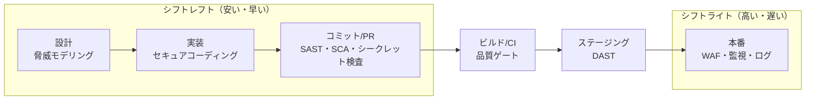
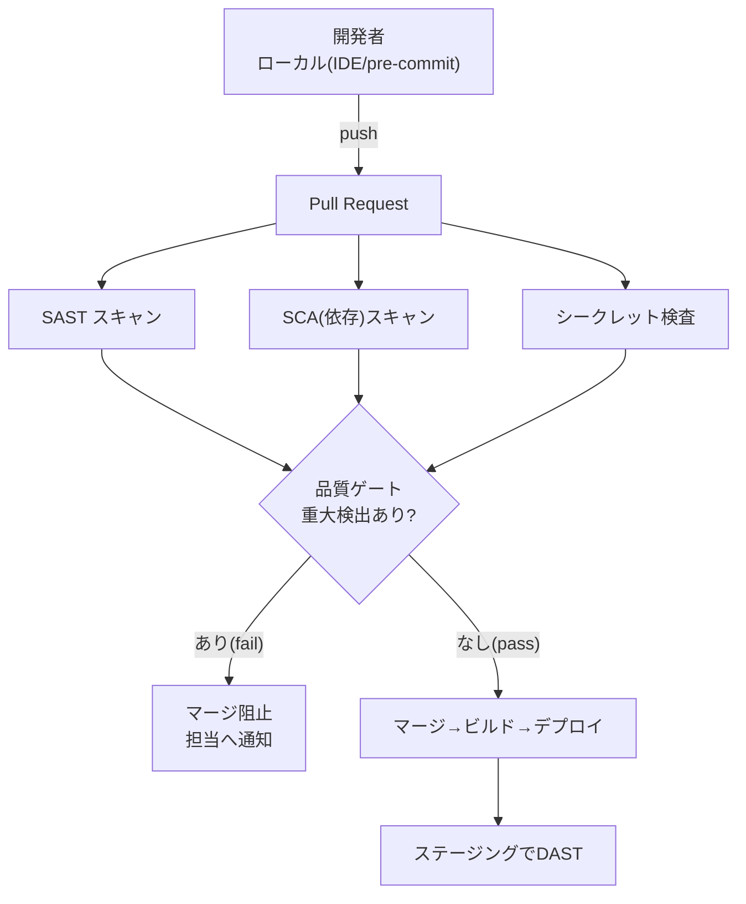

# セキュアコーディング & ソースコードスキャナ（SAST）入門 — サーバ攻撃対策の視点

- **カテゴリ:** Security（セキュリティ）
- **ステータス:** INFO（記録・参考）
- **作成日:** 2026-08-04
- **対象読者:** サーバ／Web アプリを開発・運用するエンジニア（初〜中級）
- **ねらい:** 「攻撃されにくいコードを書く（セキュアコーディング）」と「危険なコードを機械的に見つける（ソースコードスキャナ＝SAST）」の全体像を、サーバ攻撃対策の文脈で整理する。

> **用語補足**
> - **SAST**（Static Application Security Testing／静的アプリケーションセキュリティテスト）＝ ソースコードを**実行せずに**解析し、脆弱性パターンを見つける手法・ツール。本稿で言う「ソースコードスキャナ」。
> - **DAST**（Dynamic〜／動的テスト）＝ 稼働中のアプリに実際にリクエストを投げて外側から脆弱性を探す手法。
> - **SCA**（Software Composition Analysis）＝ OSS ライブラリ・依存関係の既知脆弱性を調べる手法。

---

## 1. なぜ「コードの段階」で守るのか（シフトレフト）

サーバへの攻撃の多くは、ゼロデイのような特殊な穴ではなく、**ごくありふれたコーディングミス**（入力を検証していない、SQL を文字列連結している等）から始まります。攻撃対策は多層防御（Defense in Depth）で行いますが、**最も安く・確実に効くのはコードそのものを堅くすること**です。

- **左（開発の早い段階）ほど修正コストが小さい。** 本番でインシデント対応するより、コミット前に自動で弾く方が桁違いに安い。これを **シフトレフト（Shift Left）** と呼ぶ。
- セキュアコーディング（人の規律）と SAST（機械の網）は**補完関係**。人は原則を守り、機械が見落としを拾う。

**多層防御の中での位置づけ:** WAF やファイアウォールは「入口の防御」、セキュアコーディング＋SAST は「そもそも穴を作らない防御」。入口だけに頼るとバイパスされた瞬間に破られるため、両方が必要です。

---

## 2. まず地図を持つ — OWASP Top 10:2025（サーバ側の主要リスク）

[OWASP Top 10](https://owasp.org/Top10/) は最も広く使われる「Web アプリの重大リスク」標準です。2025 年版（第8版）の並びは以下のとおり。サーバ攻撃対策の観点で、コードで潰せるものが大半です。

| # | カテゴリ | 一言でいうと | コード側の主対策 |
|---|---|---|---|
| A01 | Broken Access Control（アクセス制御不備）※SSRF を統合 | 権限のない操作・リソースにアクセスできてしまう | サーバ側で毎回認可チェック／デフォルト拒否 |
| A02 | Security Misconfiguration（設定不備）| 既定値放置・不要機能・冗長なエラー露出 | 安全な既定値・最小権限・秘匿設定 |
| A03 | Software Supply Chain Failures（サプライチェーン）| 依存パッケージ・ビルド・配布経路の汚染 | SCA・ロックファイル・署名検証 |
| A04 | Cryptographic Failures（暗号の失敗）| 平文保存・弱いアルゴリズム・鍵管理不備 | TLS 強制・強い鍵・秘密の外出し |
| A05 | Injection（インジェクション）| SQL/OS/LDAP 等に悪意の文字列が混入 | パラメータ化クエリ・出力エンコード |
| A06 | Insecure Design（設計上の不備）| そもそも設計が脆弱 | 脅威モデリング・セキュアな設計パターン |
| A07 | Authentication Failures（認証の失敗）| 弱い認証・セッション管理不備 | MFA・堅牢なセッション・レート制限 |
| A08 | Software or Data Integrity Failures（完全性不備）| 未検証の更新・デシリアライズ | 署名検証・安全なデシリアライズ |
| A09 | Security Logging & Alerting Failures（ログ/警告不足）| 攻撃を検知・追跡できない | 監査ログ・改ざん耐性・アラート |
| A10 | Mishandling of Exceptional Conditions（例外処理の誤り）**新設** | エラー時にフェイルオープン・情報漏えい | フェイルセキュア・例外の握りつぶし禁止 |

> **2025 年の主な変化:** ①`Security Misconfiguration` が #5→#2 に急上昇（クラウドの設定複雑化が背景）。②`Vulnerable and Outdated Components` を広義化した **`Software Supply Chain Failures`** が #3 に。③新カテゴリ **`Mishandling of Exceptional Conditions`**（例外処理の誤り）が登場。④**SSRF** は A01 に統合。
> 出典: <https://owasp.org/Top10/2025/0x00_2025-Introduction/>

---

## 3. セキュアコーディングの原則（OWASP Secure Coding Practices 要約）

OWASP の [Secure Coding Practices - Quick Reference Guide](https://owasp.org/www-project-secure-coding-practices-quick-reference-guide/) は、ベンダー中立の実務チェックリストです。要点を抜粋します。

### 3.1 入力検証（Input Validation）
- **検証は必ずサーバ側で**行う（クライアント側のチェックは UX 用であり防御ではない）。
- **許可リスト方式（allow list）** を基本に、型・範囲・長さを検証。拒否リスト（deny list）は抜けが出る。
- 文字コード（UTF-8 等）を先に確定してから検証（正規化・canonicalization で難読化攻撃に対処）。
- 検証失敗は**入力ごと拒否**。

### 3.2 出力エンコード（Output Encoding）
- 出力先の文脈（HTML・属性・JS・SQL・LDAP・OS コマンド）ごとに**適切なエンコード／サニタイズ**を行う。
- SQL・XML・LDAP クエリ、OS コマンドに渡す前は必ずコンテキストに応じて無害化。

### 3.3 認証・パスワード管理
- 認証は集約実装し、**フェイルセキュア**（失敗時は拒否側に倒す）。
- パスワードは**ソルト付きの強い一方向ハッシュ**（bcrypt/scrypt/Argon2 等）で保存。ハッシュはサーバ側で。
- ログイン失敗の応答で「どこが間違いか」を教えない。試行回数でロック。高価値アカウントは **MFA**。
- ベンダー既定のパスワード／アカウントは必ず変更・無効化。

### 3.4 セッション管理
- フレームワーク標準のセッション管理を使う。**推測困難なセッション ID**、ログイン時に再発行、適切なタイムアウト、`HttpOnly`/`Secure`/`SameSite` 属性。

### 3.5 アクセス制御（認可）
- **デフォルト拒否**。すべての要求でサーバ側の認可チェック。直接オブジェクト参照（IDOR）を防ぐ。

### 3.6 暗号
- 通信は TLS 強制。保存データは強いアルゴリズム。**鍵・秘密はコードに埋め込まない**（環境変数／シークレットマネージャへ）。

### 3.7 エラー処理・ログ（A09/A10 対策）
- 例外はフェイルセキュアに。スタックトレースや内部情報をユーザに返さない。
- 認証・アクセス制御・入力検証失敗などのセキュリティイベントを**監査ログ**に記録（改ざん耐性・機微情報はログに残さない）。

---

## 4. 代表的なサーバ側攻撃と「コードでの潰し方」

| 攻撃 | 危険なコードの典型 | 対策の勘所 |
|---|---|---|
| SQL インジェクション | クエリの文字列連結 | **プレースホルダ／パラメータ化クエリ**・ORM の安全 API |
| OS コマンドインジェクション | ユーザ入力を shell に渡す | シェル経由を避け引数配列で実行・許可リスト |
| XSS（保存/反射/DOM）| 未エスケープで HTML 出力 | 文脈別出力エンコード・CSP・テンプレの自動エスケープ |
| SSRF（A01 に統合）| ユーザ指定 URL へサーバが要求 | 宛先の許可リスト・内部メタデータ IP 遮断 |
| パストラバーサル | 入力をそのままファイルパスに | 正規化後にベースディレクトリ内か検証 |
| 安全でないデシリアライズ | 信頼できないデータを復元 | 署名検証・安全なフォーマット・型制限 |
| 認証/セッション不備 | 自前の弱い認証 | 実績あるライブラリ・MFA・レート制限 |

> ポイントは「**危険な関数・パターンを避け、実績ある安全な API に寄せる**」こと。これは人のレビューだけでなく、次章の SAST が機械的に検出できる領域です。

---

## 5. ソースコードスキャナ（SAST）とは

**SAST = ソースコードを実行せずに解析し、脆弱性につながるパターンを機械的に検出する。** IDE・コミット・PR・CI の各段階で回せるのが強みです。

- **得意:** インジェクション、ハードコードされた秘密、危険な API 利用、既知の脆弱パターン。開発の早い段階で網をかけられる。
- **苦手:** 実行時／環境依存の問題、認可ロジックの意図、複雑な多ファイル間のデータフロー（ツールにより精度差）。**誤検知（False Positive）** が出やすく、チューニングが要る。
- **他手法との住み分け:** SAST（コード）＋ SCA（依存ライブラリ）＋ Secrets（鍵の混入）＋ IaC スキャン（インフラ定義）＋ DAST（稼働アプリ）を**組み合わせて多層化**するのが定石。

**精度の勘所（taint analysis）:** 「汚染された入力（source）」が「危険な出力（sink）」に**到達するか**を追う *taint / data-flow 解析* の深さがツールの実力差になります。関数内・単一ファイル止まりか、多ファイル横断で追えるかがポイント。

---

## 6. 主要 SAST ツール比較（OSS 中心）

「まず無料で始める」場合の代表的な自己ホスト型スキャナ。単一の勝者を選ぶより、**言語に応じた複数併用**が実務的です（OSS の SAST は 87% の組織が何らかで利用という調査も）。

| ツール | 主対象言語 | 特徴 | 向く場面 |
|---|---|---|---|
| **Semgrep**（CE）| 30+ 言語 | YAML でルールを書ける汎用パターン照合。高速（50万行を数秒）。3,000+ ルールのレジストリ。深いデータフローは Platform 版 | 多言語・独自ルール・CI 高速化 |
| **CodeQL**（GitHub）| 主要言語 | コードを DB 化しクエリで探す。深い解析。GitHub 統合。公開リポは無料 | 深い解析・GitHub 中心 |
| **SonarQube**（CE）| 多言語 | 品質＋セキュリティ。品質ゲートで pass/fail。管理 UI | 品質と両立・ゲート運用 |
| **Bandit** | Python | Python 特化・軽量・導入容易 | Python プロジェクト |
| **Brakeman** | Ruby on Rails | Rails 特化で深い | Rails |
| **gosec** | Go | Go 特化・高速 | Go |
| **Bearer** | 多言語 | プライバシー／データフロー志向 | 個人データ流れの可視化 |
| **Flawfinder** | C/C++ | 危険関数ベースの軽量スキャン | C/C++ の一次スクリーニング |

> **選定の考え方:** ①主要言語に強いツールを1つ（例: Python→Bandit、Rails→Brakeman、Go→gosec）＋ ②横断の汎用（Semgrep）＋ ③GitHub 利用なら CodeQL。**設定・ルールチューニングが投資額より効く**（OWASP Benchmark でも「よく設定した OSS は雑な商用に匹敵」）。
> 参考比較: <https://appsecsanta.com/sast-tools/open-source-sast-tools> / <https://owasp.org/www-project-benchmark/>

---

## 7. CI/CD への組み込み（実装イメージ）

セキュアコーディングを「仕組み」で担保するには、**PR/CI で自動的にスキャンし、重大検出はマージを止める**のが要点です。

**運用のコツ（誤検知との付き合い方）:**
- **ベースライン化:** 既存の大量検出は一旦ベースラインに退避し、**新規の混入だけを止める**ところから始める（PR を回せなくしない）。
- **重大度でゲート:** 最初は High/Critical のみ fail、Medium 以下は警告。徐々に厳格化。
- **ルールチューニング:** 誤検知の多いルールは無効化・調整。`# nosec` 等の抑制コメントは理由必須でレビュー。
- **一元管理:** 結果を SARIF などで集約し、重複排除・トレンド把握。

---

## 8. 最小構成での始め方（推奨ステップ）

1. **地図を共有:** OWASP Top 10:2025 をチームの共通言語にする。
2. **原則を1枚に:** OWASP Secure Coding Practices チェックリストを PR テンプレ／レビュー観点へ落とし込む。
3. **無料 SAST を1つ CI に:** まず Semgrep CE（多言語）か、主要言語特化ツールを PR チェックに追加。**High/Critical だけ fail** で始める。
4. **依存と秘密も:** SCA（依存脆弱性）とシークレット検査を同時に導入（サプライチェーン A03・秘密混入対策）。
5. **ゲートを段階強化:** ベースライン→新規のみ阻止→重大度を広げる、と少しずつ締める。
6. **ログと例外を仕上げ:** A09/A10 対策として監査ログ・フェイルセキュアな例外処理を整備。

> **原則（本ワークスペースの方針とも整合）:** 最小構成・追加中心・段階導入。いきなり全部を fail にして開発を止めない。**「新規の穴を作らせない」→「既存を計画的に減らす」** の順で。

---

## 9. 参考リンク（一次情報中心）

- OWASP Top 10:2025（公式）: <https://owasp.org/Top10/2025/0x00_2025-Introduction/>
- OWASP Secure Coding Practices - Quick Reference Guide: <https://owasp.org/www-project-secure-coding-practices-quick-reference-guide/>
- OWASP Benchmark（SAST 精度検証）: <https://owasp.org/www-project-benchmark/>
- Semgrep: <https://semgrep.dev/> ／ ルールレジストリ: <https://semgrep.dev/explore>
- CodeQL: <https://codeql.github.com/>
- SonarQube: <https://www.sonarsource.com/products/sonarqube/>
- Bandit（Python）: <https://bandit.readthedocs.io/>
- Brakeman（Rails）: <https://brakemanscanner.org/>
- gosec（Go）: <https://github.com/securego/gosec>
- OSS SAST 比較（参考）: <https://appsecsanta.com/sast-tools/open-source-sast-tools>

---

*本書は調査に基づく参考情報（INFO）です。ツールの機能・料金・言語対応は変わり得るため、導入時は各公式ドキュメントで最新を確認してください。*
