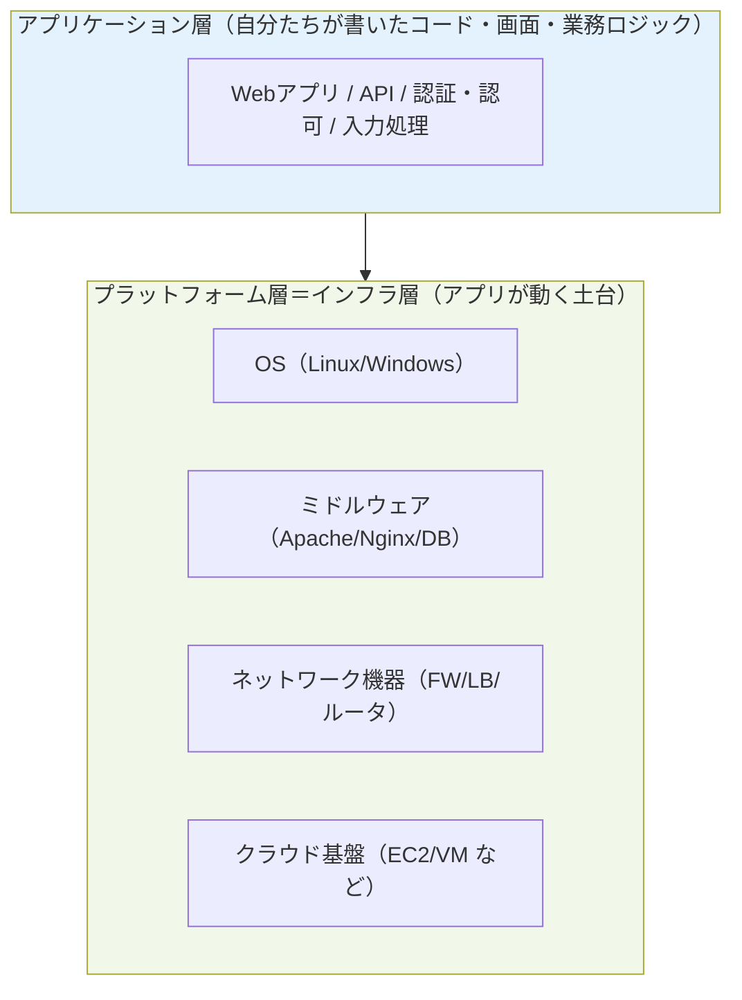
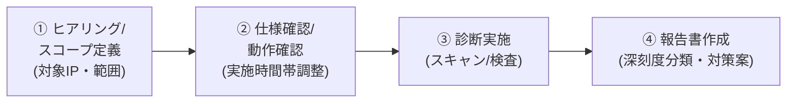
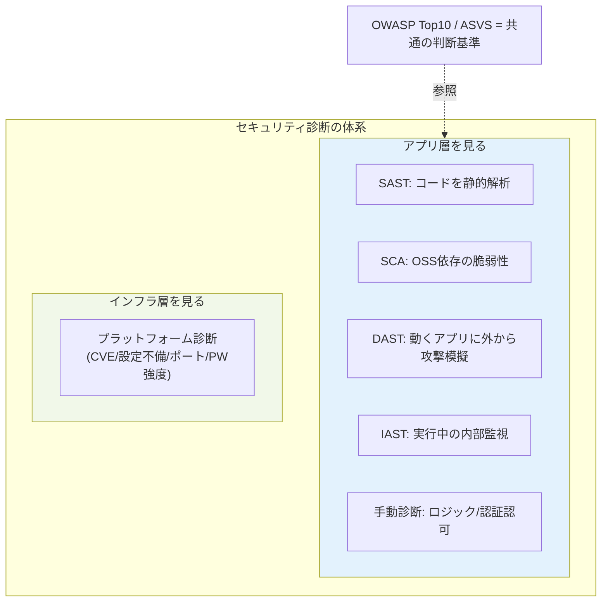

# プラットフォーム診断 入門（1/3）— 診断の全体像と体系

> 作成日 2026-06-16 ／ 対象読者: 自社ITサービスのインフラエンジニア・セキュリティエンジニア（鈴木さん向け）
> シリーズ構成: 本記事(1) 全体像と体系 ／ [(2) 主要ツールとTenable深掘り](20260616_INFO_SECURITY_platform-assessment-02-tools-and-tenable.md) ／ [(3) ベスト/バッドプラクティス](20260616_INFO_SECURITY_platform-assessment-03-bestpractices.md)
> 方針: 専門用語は「綴り＋意味」をセットで補足し、できるだけ平易に説明する。

---

## 0. この記事のゴール

「プラットフォーム診断とは何か」を、他の診断手法（ソースコード診断・脆弱性診断・SAST/DAST・OWASP など）との関係の中で**体系的に**理解する。次の問いに答えられる状態を目指す。

- プラットフォーム診断は **何を対象に・何の目的で・どんなリスクを評価する** ものか
- SAST/DAST/IAST/SCA などの「アプリ寄りの診断」と **どこが違い・どう補完し合う** のか
- 自社サービス運用者として、**どの診断をいつ回すべき** か

---

## 1. まず全体像 — セキュリティ診断は「層」で分かれる

ITシステムは大きく**2つの層**に分けて考えると整理しやすい。

- **アプリケーション層** … 自分たちが作り込んだ部分（業務ロジック、画面遷移、入力処理など）。
- **プラットフォーム層（＝インフラ層）** … その下で動く土台（OS・ミドルウェア・ネットワーク機器・クラウド基盤）。

**セキュリティ診断は「どの層を検査するか」で種類が分かれる。** プラットフォーム診断はこのうち**下の層（インフラ層）**を対象とする検査である。

> ポイント: アプリをどれだけ堅牢に作っても、土台のOSに既知の穴が残っていたり、管理ポートが外部公開されていれば、攻撃者はそこから侵入する。**両層はどちらか一方では不十分で、補完関係**にある。

---

## 2. プラットフォーム診断とは

**プラットフォーム診断**（platform assessment、別名「**ネットワーク診断**」）とは、

> サーバ・ネットワーク機器・ミドルウェアなどの**インフラ層**を対象に、**既知の脆弱性や設定不備**を検出する検査。

一般に「**脆弱性診断**（vulnerability assessment）」というサービスの中の1プランとして提供される。対になるのが次章の「Webアプリケーション診断」。

### 2.1 検査対象（何を見るか）

| 対象 | 具体例 | 主に見るリスク |
|---|---|---|
| サーバ | Linux/Windows 上の Web/メール/DNS サーバ | OSのパッチ未適用、既知脆弱性 |
| ミドルウェア | Apache、Nginx、DB サーバ | 古いバージョン、設定不備 |
| ネットワーク機器 | ルータ、ファイアウォール（FW）、ロードバランサ（LB） | アクセス制御設定、ファームウェア更新状況 |
| クラウド基盤 | AWS/Azure 上の EC2・VM 等 | 利用者側の設定ミス（クラウドでも安全とは限らない） |

### 2.2 主な診断観点（何を検出するか）

1. **ポートスキャン・サービス検出**
   - 開いている通信口（ポート）と、そこで動くサービスを特定する。診断の出発点。
   - 例: 開発時のデバッグ用サービスや管理コンソールが本番に残っている → 侵入経路になる。
2. **既知の脆弱性（CVE）の検出**
   - CVE（Common Vulnerabilities and Exposures＝共通脆弱性識別子。脆弱性に振られる世界共通の番号）に該当する穴を検出。
   - パッチ未適用・古いバージョン放置は、**公開済みの攻撃コード**で悪用されうる。
3. **不要なサービス・設定不備の検出**
   - デフォルト設定のままの管理画面、無効化されていないサンプルページ、過剰な情報を返すエラー等。単体では小さく見えても、組み合わせで深刻化する。
4. **パスワード強度の確認**
   - SSH/FTP/DB管理画面など、認証を要するサービスのパスワードが総当たり（ブルートフォース）に耐えるか。初期パスワードのまま運用、は実際によく見つかる。

### 2.3 外部診断 と 内部診断

検査を行う「ネットワーク上の立ち位置」で2種類ある。**両方やるのが網羅的。**

| | 立ち位置 | 想定する脅威 | 特徴 |
|---|---|---|---|
| **外部診断** | インターネット側から | 外部の攻撃者 | 公開サーバがある場合まず実施。攻撃者と同じ視点 |
| **内部診断** | 社内ネットワーク内から | 侵入後の横展開・内部犯行 | FWで遮断され外から見えない穴も検出できる |

### 2.4 一般的な進め方

> 自社運用での実務メモ: 外部診断では**診断元IPからの通信をFWで許可**しておかないと、FWに弾かれて「穴がない」ように見えてしまう。本番影響を避けるため**実施時間帯と避けるべき操作**を事前にすり合わせる。

---

## 3. Webアプリケーション診断との違い（対になる概念）

| 観点 | プラットフォーム診断 | Webアプリケーション診断 |
|---|---|---|
| 対象の層 | インフラ層（OS・ミドル・NW・クラウド基盤） | アプリ層（機能・画面遷移・データ処理ロジック） |
| 代表的に見つかる問題 | OSの既知脆弱性、設定不備、不要サービス、弱いパスワード | SQLインジェクション、XSS、認証認可の不備、ロジックの欠陥 |
| 検出の主軸 | **既知の脆弱性（CVE）と設定** | **作り込んだロジックの欠陥** |
| 関係 | ↔ 補完関係。Webサービス運用なら**両方**実施が望ましい | ↔ 同上 |

- インフラが堅牢でも、アプリに SQLインジェクション（DBへの不正命令を注入する攻撃）があれば、**正規の通信経路**を通って攻撃が成立する。
- アプリが堅牢でも、OSに既知の穴・管理ポート公開があれば、**そこから侵入**される。
- だから「どちらか」ではなく「両方」。

---

## 4. もう一段広い体系 — AST（アプリ寄りの自動診断）との関係

アプリ層側には、近年 **AST（Application Security Testing＝アプリケーション・セキュリティ・テスト）** と総称される自動診断手法が普及している。プラットフォーム診断を理解するうえで、この「隣の領域」との位置づけを押さえておくと体系が完成する。

### 4.1 用語整理（綴り＋意味）

| 略語 | 正式名称 | ひとことで | 検査対象 | 主なタイミング |
|---|---|---|---|---|
| **SAST** | Static Application Security Testing | **静的**解析。**ソースコードを読んで**穴を探す | ソースコード | コーディング中 |
| **DAST** | Dynamic Application Security Testing | **動的**解析。**動いてるアプリに外から攻撃を模擬**して探す | 実行中のアプリ | リリース前テスト |
| **IAST** | Interactive Application Security Testing | アプリ内部の動きを**リアルタイム監視**して探す | テスト実行中のアプリ内部 | 機能/UIテスト中 |
| **SCA** | Software Composition Analysis | **使っているOSS（外部ライブラリ）の既知脆弱性**を洗い出す | 依存ライブラリ | 全工程 |
| **OWASP** | Open Worldwide Application Security Project | アプリセキュリティの**非営利コミュニティ／知識基盤**（製品名ではない） | — | — |

> よくある誤記注意: 「**DSAT**」という表記を見かけることがあるが、正しくは **DAST**（動的解析）。また「ソースコード診断」はおおむね **SAST + SCA + 手動コードレビュー** を指す。

### 4.2 OWASP とは（道具ではなく「知識の土台」）

OWASP は世界的な非営利プロジェクトで、アプリセキュリティの**共通言語と基準**を提供する。代表的な成果物:

- **OWASP Top 10** … Webアプリで特に重大・頻出な脆弱性の「トップ10」リスト。診断の優先度づけの共通基準として広く参照される。
- **OWASP ASVS**（Application Security Verification Standard）… アプリが満たすべきセキュリティ要件のチェックリスト的標準。
- **OWASP ZAP**（Zed Attack Proxy）… OWASP が提供する**無料のDASTツール**。

> つまり OWASP は「ツール名」ではなく、**Top10やASVSという基準**と、**ZAPのようなツール**の両方を生む“土台”。会話で「OWASPに沿って診断」と言えば、多くは Top10 を基準に検査する、の意味。

### 4.3 SAST / DAST / IAST / 手動診断 の比較（要点）

| 比較軸 | SAST | IAST | DAST | 手動セキュリティ診断 |
|---|---|---|---|---|
| 検査原理 | ソースコード解析 | 実行中アプリの内部挙動を監視 | 外から攻撃を模擬 | 専門家が外部挙動を分析 |
| 言語/FW依存 | 依存する | 依存する | 依存しない | 依存しない |
| 過検知（誤検知）の量 | 多めの傾向 | 非常に少ない | 少ない | ほぼ無し（人が除外） |
| 検査時間 | 短い（数分〜数時間） | テスト時間に依存 | やや長い（数時間〜1日） | 長い（数日〜1か月） |
| 得意領域 | ハードコーディング、IaC設定ミス等コード由来 | 過検知を抑えた自動検査 | 通信暗号化・サーバ設定ミス等、最終アプリの穴 | ロジック・認証認可など機械では拾えない穴 |

**重要な原則**: どの手法も万能ではない。**1つのツールで網羅は不可能**。AST(自動)で早期・継続的に拾い（シフトレフト＝開発の早い段階で対処してコストを下げる考え方）、ロジックや認証認可の重大な穴は**手動診断**で補う。そして**インフラ層はプラットフォーム診断**でカバーする — という**多層の組み合わせ**が現実解。

### 4.4 全体マップ

---

## 5. 自社サービス運用者の視点での「目的とリスク」まとめ

プラットフォーム診断が**評価する（アセスメントする）リスク**を、運用者の言葉で整理する。

| 目的 | 評価するリスク | 放置した場合の典型インシデント |
|---|---|---|
| 既知脆弱性の棚卸し | OS/ミドルのパッチ未適用（CVE） | 公開済み攻撃コードによる侵入・RCE（遠隔コード実行） |
| 攻撃面（アタックサーフェス）の把握 | 不要な公開ポート・サービス | 想定外の入口からの侵入 |
| 設定の健全性確認 | デフォルト設定・情報過多なエラー | 情報収集の足がかり→多段攻撃 |
| 認証の堅牢性 | 弱い/初期パスワード | 総当たりによる乗っ取り |
| 内部からの耐性 | 内部ネットワークでの横展開余地 | 1台侵入後の被害拡大 |

**位置づけの結論**: プラットフォーム診断は「**自分たちが作ったロジックの穴**（=アプリ診断/SAST/DAST/手動の領域）」ではなく、「**動かしている土台に残った既知の穴と設定の甘さ**」を定期的に棚卸しする検査。クラウド移行・OS更改・新規公開のたびに回すのが定石で、**アプリ診断とセットで初めて“面”をカバーできる**。

→ 続き: [(2) 主要ツールとTenable深掘り](20260616_INFO_SECURITY_platform-assessment-02-tools-and-tenable.md)

---

## 参考（2026-06-16 取得・公開情報）

- ステラセキュリティ「プラットフォーム診断とは？」 https://www.sterrasec.com/column/about_platform_assessment
- NRIセキュア「SAST・DAST・IAST 徹底比較」 https://www.nri-secure.co.jp/blog/sast-dast-iast
- OWASP 公式 https://owasp.org/ ／ OWASP Top 10 https://owasp.org/www-project-top-ten/

> 注: 記載内容は公開情報＋一般的な実務知識に基づく解説。診断の要否・範囲は自社の資産重要度・リスク許容度・予算により異なるため、実施時はベンダ/専門家と要確認。
