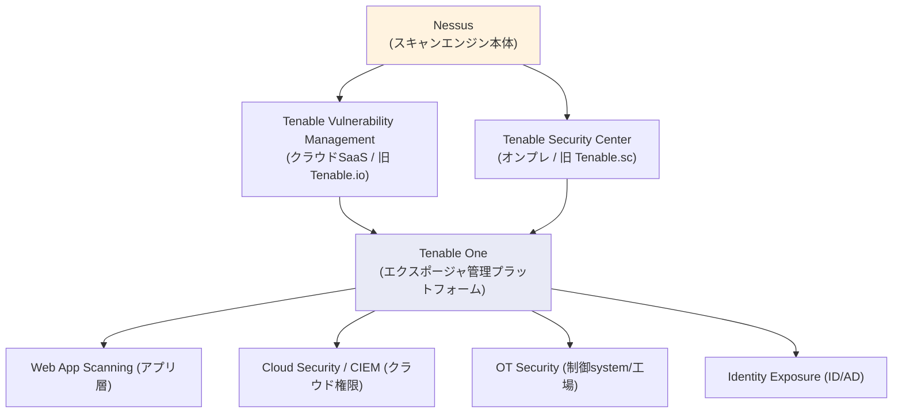
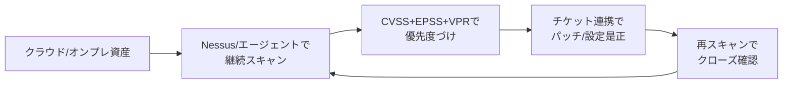

# プラットフォーム診断 入門（2/3）— 主要ツールと Tenable 深掘り

> 作成日 2026-06-16 ／ 対象読者: インフラ/セキュリティエンジニア（鈴木さん向け）
> 前: [(1) 全体像と体系](20260616_INFO_SECURITY_platform-assessment-01-basics.md) ／ 次: [(3) ベスト/バッドプラクティス](20260616_INFO_SECURITY_platform-assessment-03-bestpractices.md)

---

## 0. この記事のゴール

プラットフォーム診断（インフラ層の脆弱性診断）を**自動化するツール**の代表格を把握し、特に **Tenable（テナブル）** 製品を一段深く理解する。

> 用語: ここで扱うツールは一般に **脆弱性スキャナ（vulnerability scanner）** または **VM（Vulnerability Management＝脆弱性管理）プラットフォーム** と呼ばれる。「スキャナ＝検出する道具」「VMプラットフォーム＝検出＋優先度づけ＋対応管理まで回す基盤」という違いがある。

---

## 1. 主要なプラットフォーム診断ツール（超定番）

| ツール | 提供元 | 形態 | ひとことで |
|---|---|---|---|
| **Nessus** | Tenable | 商用（個人/小規模も可） | 業界標準の脆弱性スキャナ。最も広く使われる“定番” |
| **Tenable Vulnerability Management**（旧 Tenable.io） | Tenable | 商用 / クラウドSaaS | Nessusエンジンをクラウドで運用。資産横断で継続管理 |
| **Tenable Security Center**（旧 Tenable.sc） | Tenable | 商用 / オンプレ | 上記のオンプレ版。閉域・データ持ち出し制約に対応 |
| **Qualys VMDR** | Qualys | 商用 / クラウドSaaS | クラウドネイティブ。エージェント＋スキャンで継続検出 |
| **Rapid7 InsightVM**（旧 Nexpose） | Rapid7 | 商用 / クラウド・オンプレ | リスクスコアと可視化、Metasploit連携が強み |
| **Microsoft Defender Vulnerability Management** | Microsoft | 商用 / クラウド | Defender/Intune連携。Windows資産との親和性が高い |
| **OpenVAS / Greenbone** | Greenbone | OSS（無償）＋商用 | 代表的なオープンソース脆弱性スキャナ |
| **OWASP ZAP** | OWASP | OSS（無償） | ※こちらはアプリ層(DAST)向け。インフラ層用ではない点に注意 |

> 選び分けの大枠:
> - **まず一台で試したい／小規模** → Nessus（Professional/Expert）。
> - **資産が多く継続運用したい／クラウド前提** → Tenable VM・Qualys VMDR・Rapid7 InsightVM。
> - **閉域・データを外に出せない** → Tenable Security Center（オンプレ）。
> - **予算ゼロで学習・検証** → OpenVAS/Greenbone（運用負荷は自前）。
> - **Windows/Microsoft中心の組織** → Defender Vulnerability Management。

---

## 2. Tenable 深掘り

「teanable」は **Tenable（テナブル）** のこと。脆弱性管理（VM）分野の最大手の一つで、フラッグシップの脆弱性スキャナ **Nessus** を中核に、用途別の製品ラインを展開している。

### 2.1 製品ラインの全体像

- **Nessus** が共通のスキャンエンジン。**Tenable VM（クラウド）／Security Center（オンプレ）**はそれを資産横断で管理するための上位基盤。さらに上位に統合プラットフォーム **Tenable One** がある（アプリ・クラウド・OT・IDまで“攻撃面”を一元化する「エクスポージャ管理＝exposure management」の考え方）。

### 2.2 Nessus（中核スキャナ）

> 「サイバーセキュリティ・ツール箱の最初の1本」と位置づけられる、業界で最も信頼される脆弱性アセスメント。

**3ステップの基本動作**:
1. **Discovery（検出）** — OS・機器・アプリ横断で、欠陥・未適用パッチ・設定不備を高速スキャンで洗い出す。
2. **Insight（優先度づけ）** — 内蔵のコンプライアンスチェックと、**CVSS / EPSS** によるリスクスコアで高リスクを特定。
3. **Orchestration（対応）** — 修正ガイダンスを提示し、IT/セキュリティ間の連携で素早く是正。

**スコアリング用語（綴り＋意味）**:
- **CVSS**（Common Vulnerability Scoring System）… 脆弱性の深刻度を 0〜10 で表す世界標準スコア。
- **EPSS**（Exploit Prediction Scoring System）… その脆弱性が**実際に悪用される確率**の予測スコア。「深刻度（CVSS）」と「悪用されやすさ（EPSS）」を併用すると優先度が現実的になる。
- **VPR**（Vulnerability Priority Rating）… Tenable独自の優先度指標。脅威インテリジェンス等を加味し「**今すぐ直すべきか**」を示す。

**特徴（公開情報）**:
- プラグイン（検査ルール）は **31万9千以上**、対応 CVE は **11万7千以上**、毎週100以上の新規プラグイン追加。**業界最低水準の誤検知率**を謳う。
- **450以上のテンプレート**（CIS Benchmark 等のコンプライアンス監査含む）。CIS Benchmark＝OS/DB/NW機器を安全に設定するための世界標準のハードニング基準。
- Raspberry Pi含め**どこでも導入可能**。
- エディション: **Nessus Professional**（無制限のIT脆弱性アセスメント＋外部攻撃面スキャン＋Web5FQDN）と、より高機能な **Nessus Expert**。

### 2.3 Tenable Vulnerability Management（クラウド / 旧 Tenable.io）

- Nessusエンジンを**クラウドで運用**し、Web画面で資産・脆弱性を横断管理。
- **継続的（always-on）な資産検出**で、動的なクラウド資産やリモート端末も含めて「常時」可視化。
- **VPR（生成AI活用）**で高リスク脆弱性に絞り込み、双方向チケット連携で是正をオーケストレーション。
- **稼働率SLA 99.95%**（業界初のアップタイム保証）。基盤に AWS を採用。
- 関連: **Cloud Vulnerability Management**（エージェントレスでクラウド/コンテナを検査）、**PCI ASV**（PCI DSS の外部スキャン要件 11.3 に対応）。

### 2.4 Tenable Security Center（オンプレ / 旧 Tenable.sc）

- **オンプレミス**で完結する脆弱性管理。ネットワーク全体の資産・脆弱性を一望し、CIS Benchmark テンプレートで OS/DB/NW機器をハードニング。
- **データを外に出せない／閉域・データレジデンシ要件**がある組織向け。さらに厳格な環境（FedRAMP High、エアギャップ等）向けに **Tenable Enclave Security** もある。

### 2.5 名称の対応（旧称に注意）

| 旧称（よく聞く） | 現名称 |
|---|---|
| Tenable.io | Tenable Vulnerability Management |
| Tenable.sc | Tenable Security Center |
| （統合上位） | Tenable One（Exposure Management Platform） |

### 2.6 自社運用での Tenable の使いどころ（インフラ/セキュリティ視点）

- **棚卸し**: クラウド/オンプレ資産を継続スキャンし、CVE・設定不備を一覧化。
- **優先度づけ**: CVSS（深刻度）だけで判断せず、EPSS/VPR（悪用されやすさ・今直すべきか）で**現実的なトリアージ**。
- **是正→確認のループ**: パッチ/設定修正をチケットで回し、**再スキャンでクローズ確認**するまでが1サイクル。
- 鈴木さんの **AL2023移行・AWS運用** 文脈では、「移行後のEC2/AMIに残存CVEがないか」「不要ポート/SG設定の検査」を Tenable VM/Cloud VM で**定期回し**するのが典型的な活用。

→ 続き: [(3) ベスト/バッドプラクティス](20260616_INFO_SECURITY_platform-assessment-03-bestpractices.md)

---

## 参考（2026-06-16 取得・公開情報）

- Tenable 製品トップ https://www.tenable.com/products
- Tenable Nessus https://www.tenable.com/products/nessus
- Tenable Vulnerability Management https://www.tenable.com/products/vulnerability-management
- Tenable Security Center https://www.tenable.com/products/security-center
- Tenable 技術ドキュメント https://docs.tenable.com
- Qualys VMDR https://www.qualys.com/ ／ Rapid7 InsightVM https://www.rapid7.com/products/insightvm/ ／ Greenbone/OpenVAS https://www.greenbone.net/

> 注: 製品の機能・名称・指標値は更新が早い。導入検討時は各社公式の最新情報・PoC（試用）で要確認。数値（プラグイン数等）は本記事取得時点の公開値。
