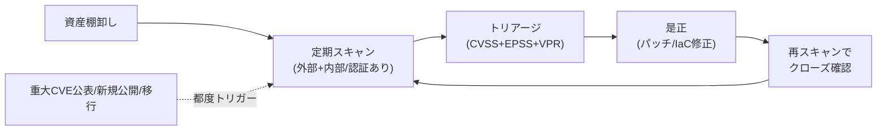

# プラットフォーム診断 入門（3/3）— ベストプラクティスとアンチパターン

> 作成日 2026-06-16 ／ 対象読者: インフラ/セキュリティエンジニア（鈴木さん向け）
> 前: [(1) 全体像と体系](20260616_INFO_SECURITY_platform-assessment-01-basics.md) ／ [(2) 主要ツールとTenable深掘り](20260616_INFO_SECURITY_platform-assessment-02-tools-and-tenable.md)

---

## 0. この記事のゴール

プラットフォーム診断および Tenable 運用の **グッドパターン（やるべき）／バッドパターン（やりがち＝避けたい）** を、実務で判断に使えるレベルで整理する。

---

## 1. プラットフォーム診断 — グッドパターン（ベストプラクティス）

| # | プラクティス | なぜ効くか |
|---|---|---|
| 1 | **資産インベントリを先に作る** | 「知らない資産」は診断できない。まず何が存在するか（IP/ホスト/クラウド資産）を棚卸し。検査漏れ＝最大の穴 |
| 2 | **外部診断＋内部診断の両方** | FWの外と内で見える穴が違う。片方だけでは横展開リスクを見落とす |
| 3 | **定期 ＋ トリガー実行** | 月次/四半期の定期に加え、**OS更改・新規公開・クラウド移行・重大CVE公表時**に都度実行 |
| 4 | **認証スキャン（クレデンシャルド）を使う** | 認証情報を与えて内部から見る方が精度が高く誤検知が減る（後述2-4） |
| 5 | **CVSS だけでなく EPSS/VPR で優先度づけ** | 件数は膨大。深刻度×悪用されやすさで「今直す」を絞る |
| 6 | **検出→是正→再スキャンのループを回す** | 「見つけて終わり」では意味がない。クローズ確認まで含めて1サイクル |
| 7 | **本番影響を事前合意（時間帯・除外操作）** | スキャンは負荷・誤作動を招きうる。メンテ枠・連絡体制を用意 |
| 8 | **結果をチケット/IaCにフィードバック** | 設定不備は IaC（Terraform/CDK）側を直して**再発防止**。手動修正は再発する |
| 9 | **コンプライアンス基準に紐付け（CIS/PCI等）** | CIS Benchmark や PCI DSS 要件に対応づけると、対応の根拠と網羅性が明確に |
| 10 | **アプリ診断と組み合わせる** | プラットフォーム診断単体では“面”をカバーできない（→記事1の補完関係） |

### 1.1 推奨サイクル（イメージ）

---

## 2. プラットフォーム診断 — バッドパターン（アンチパターン）

| # | やりがちな失敗 | 何が問題か | 対策 |
|---|---|---|---|
| 1 | **年1回だけ実施** | 新CVEは毎日出る。1年放置＝1年無防備 | 定期＋トリガー実行へ |
| 2 | **資産の一部しか診断しない** | 影のIT資産（shadow IT）・検証環境が穴になる | 継続的な資産検出で網羅 |
| 3 | **外部診断だけで満足** | 内部の横展開リスクを見落とす | 内部診断も実施 |
| 4 | **非認証スキャンのみ** | 表面しか見えず検出漏れ・誤検知増 | 認証スキャンを併用 |
| 5 | **CVSS高だけ追う** | 悪用されない高スコアに時間を浪費、悪用中の中スコアを放置 | EPSS/VPRで実リスク優先 |
| 6 | **検出しても是正しない（レポート墓場）** | 一番多い失敗。リスクは下がらない | 是正SLAとチケット運用 |
| 7 | **本番で無断フルスキャン** | 高負荷で障害誘発、信頼喪失 | 事前合意・段階的に |
| 8 | **手動修正の場当たり対応** | IaCと乖離し再デプロイで再発 | 設定はIaC側を直す |
| 9 | **誤検知を放置/全部対応** | アラート疲れ。判断基準が無いと回らない | トリアージ基準を定義 |
| 10 | **診断＝ペネトレと混同** | 目的が違う（下記2.1） | 目的に応じて使い分け |

### 2.1 補足: 「脆弱性診断」と「ペネトレーションテスト」は別物

- **脆弱性診断（プラットフォーム診断含む）** … 穴を**網羅的に洗い出す**（広く浅く）。「どこに穴があるか」のリスト化が目的。
- **ペネトレーションテスト（侵入テスト）** … 攻撃者として**実際に侵入できるか試す**（狭く深く）。「この穴で本当に被害が出るか」の実証が目的。
- 両者は補完。まず脆弱性診断で土台を固め、重要システムはペネトレで実証する、が定石。

---

## 3. Tenable 運用 — グッドパターン

| # | プラクティス | ポイント |
|---|---|---|
| 1 | **エンジン/プラグインを常に最新化** | 毎週追加されるプラグインが検出力の源。更新が止まると検出力が劣化 |
| 2 | **VPR/EPSS でダッシュボード運用** | 件数の海でなく「今直すべき」に集約。経営報告にも使える |
| 3 | **CIS Benchmark テンプレートでハードニング監査** | OS/DB/NW機器の設定健全性を標準基準で継続チェック |
| 4 | **クラウドはエージェントレス（Cloud VM）併用** | 動的なクラウド/コンテナ資産を継続把握。エージェント運用負荷も軽減 |
| 5 | **オンプレ要件は Security Center / Enclave** | データ持ち出し制約・閉域・FedRAMP等は用途に合う製品を選ぶ |
| 6 | **チケット双方向連携で是正を計測** | MTTR（平均修復時間）を可視化し改善サイクルに乗せる |
| 7 | **PCI 対象は PCI ASV を活用** | PCI DSS 11.3 のスキャン/アテステーションを効率化 |
| 8 | **スコープ/スキャンウィンドウを設計** | 対象・時間帯・除外を定義し本番影響を制御 |

## 4. Tenable 運用 — バッドパターン

| # | やりがちな失敗 | 何が問題か |
|---|---|---|
| 1 | プラグイン更新を放置 | 最新CVEを検出できず“安全に見える”危険 |
| 2 | 全件を CVSS 順で潰そうとする | 終わらない。VPR/EPSSの存在意義を活かせていない |
| 3 | エージェントとスキャンの役割を未整理 | 重複/抜けが発生。動的資産はエージェント、固定資産はスキャン等の設計が必要 |
| 4 | クラウド資産をオンプレ流儀で扱う | 動的に増減する資産を取りこぼす。エージェントレス継続検出を使う |
| 5 | ライセンス/資産数の設計不足 | 資産（asset=OS付き機器/FQDN付きWebアプリ/有効なクラウド資源）の定義を誤り過不足が出る |
| 6 | レポートを出すだけで是正に繋げない | スキャナを“監査アリバイ”にしてしまう（最頻出のアンチパターン） |
| 7 | 認証情報の管理が雑 | 認証スキャン用クレデンシャルの漏洩は重大リスク。Vault等で厳格管理 |

> セキュリティ運用上の注意: 認証スキャンに使うクレデンシャル（認証情報）は**強い権限を持つ**ことが多い。**最小権限・ローテーション・シークレット管理（Vault等）**を徹底し、診断結果レポートやログにも**実値を残さない**こと。

---

## 5. まとめ（3記事の要点）

1. **プラットフォーム診断**＝インフラ層（OS/ミドル/NW/クラウド基盤）の**既知脆弱性・設定不備**を洗い出す検査。**Webアプリ診断と補完関係**。
2. アプリ層には **SAST/DAST/IAST/SCA**、基準として **OWASP** がある。**1ツールで網羅は不可能**で、多層の組み合わせ＋手動診断が現実解。
3. ツールは **Nessus / Tenable VM・Security Center / Qualys / Rapid7 / Defender / OpenVAS** が定番。**Tenable** は Nessus を中核に用途別ラインを展開し、**CVSS+EPSS+VPR** で現実的な優先度づけが強み。
4. 成否を分けるのは**「検出→是正→再確認のループを回し切るか」**。レポートを出して終わりにしないこと。

---

## 参考（2026-06-16 取得・公開情報）

- ステラセキュリティ「プラットフォーム診断とは？」 https://www.sterrasec.com/column/about_platform_assessment
- NRIセキュア「SAST・DAST・IAST 徹底比較」 https://www.nri-secure.co.jp/blog/sast-dast-iast
- Tenable 公式 https://www.tenable.com/products ／ ドキュメント https://docs.tenable.com
- CIS Benchmarks https://www.cisecurity.org/cis-benchmarks ／ OWASP https://owasp.org/

> 注: ベスト/バッドプラクティスは一般的な実務知見に基づく整理。自社の資産重要度・リスク許容度・規制要件に応じて取捨選択すること。
