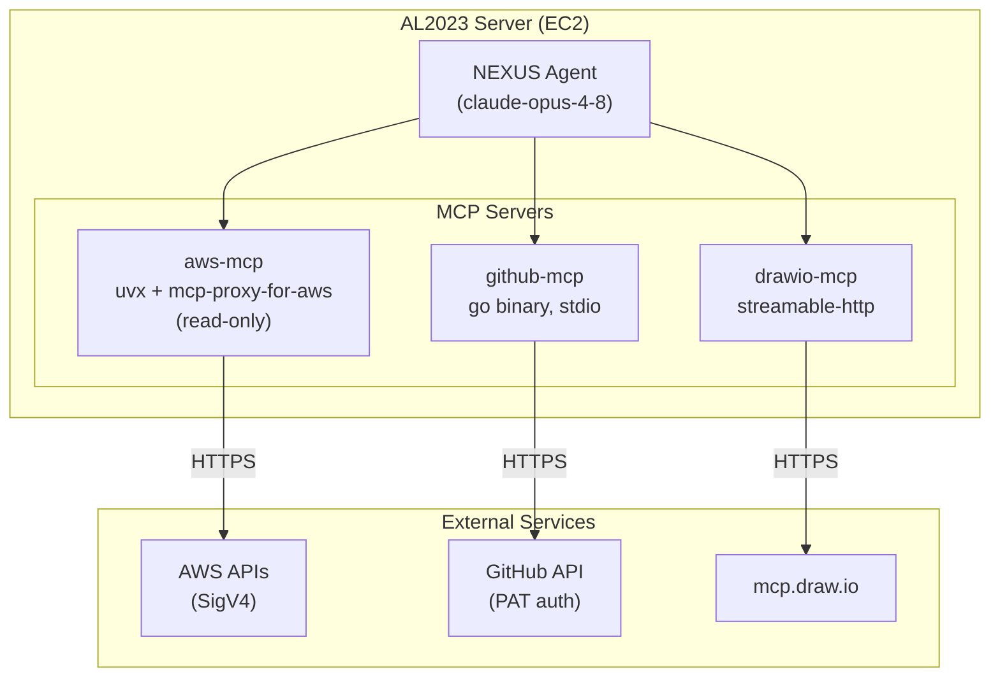
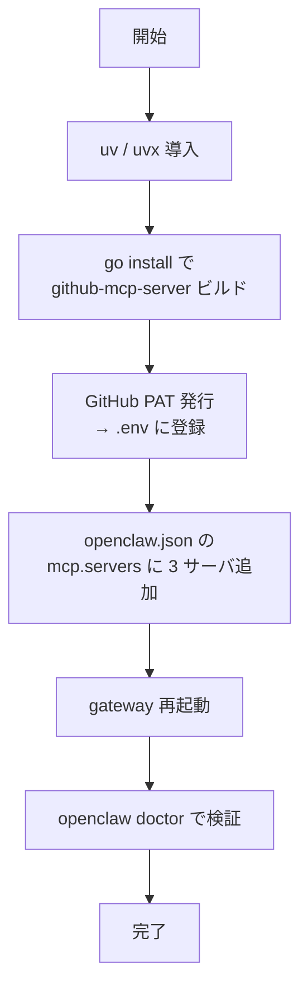
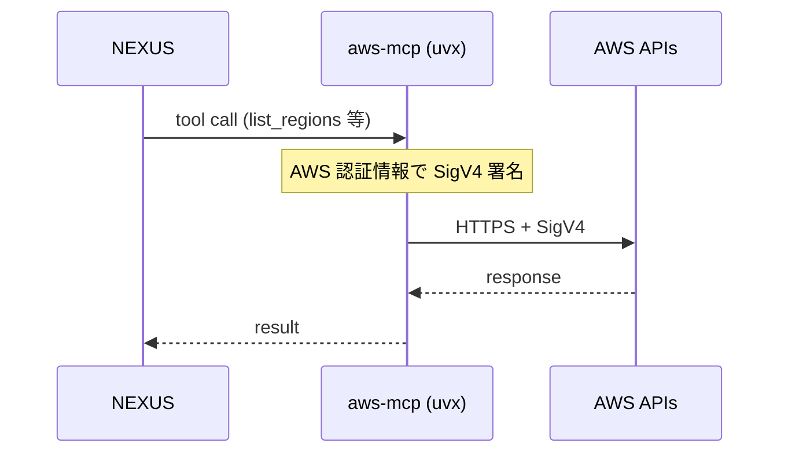
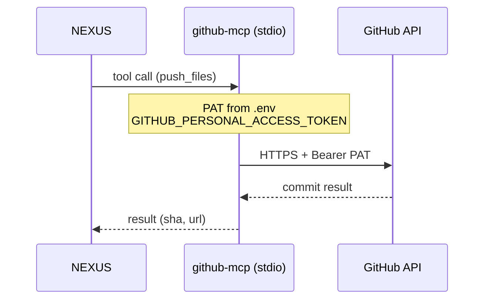
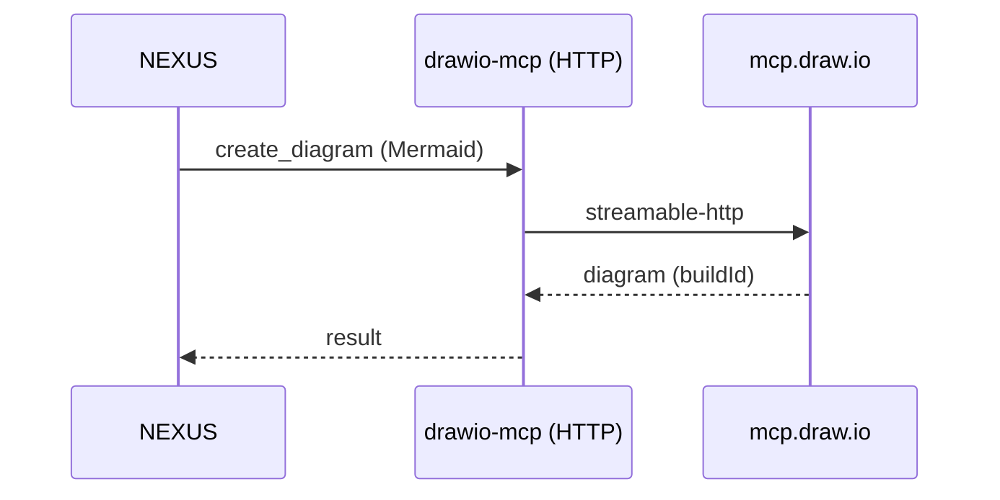

# OpenClaw MCP セットアップ＆動作確認ガイド

OpenClaw に 3 つの MCP（Model Context Protocol）サーバ — **aws-mcp / github-mcp / drawio-mcp** — を接続し、Discord チャットから AWS・GitHub・図作成を操作できるようにするための手順と動作確認の記録です。

- **作成日:** 2026-06-01
- **対象:** AL2023（Amazon Linux 2023）on EC2 上の OpenClaw
- **方針:** ホスト名・ユーザ名等の固有情報は placeholder（`<your-user>` 等）に伏字化。トークン類は一切記載しない（`.env` 参照）

> **MCP（Model Context Protocol）とは:** AI エージェントが外部ツール・サービスを統一的な手順で呼び出すためのプロトコル。OpenClaw は `mcp.servers` 設定で MCP サーバを起動し、そのツール群を NEXUS（エージェント）から利用できるようにする。

---

## 📚 用語ミニ辞典

| 略語 | 綴り | 意味 |
|---|---|---|
| `MCP` | Model Context Protocol | AI が外部ツールを呼び出すための共通プロトコル |
| `PAT` | Personal Access Token | GitHub の個人アクセストークン（パスワード代替の認証鍵） |
| `SigV4` | Signature Version 4 | AWS API リクエストの署名方式 |
| `stdio` | standard input/output | 標準入出力経由でプロセス間通信する方式 |
| `uvx` | — | Python 製ツールを隔離環境で実行する `uv` 同梱コマンド |
| `HITL` | Human-in-the-Loop | 人間が判断ループに介在する仕組み |

---

## 🏗 全体アーキテクチャ

NEXUS（エージェント）が 3 つの MCP サーバを介して外部サービスへアクセスする構成。



| サーバ | 役割 | 起動方式 | 認証 | モード |
|---|---|---|---|---|
| **aws-mcp** | AWS リソース参照・ドキュメント検索 | `uvx`（ローカルプロセス） | AWS 認証情報 + SigV4 | read-only |
| **github-mcp** | GitHub リポジトリ操作 | go バイナリ（stdio） | PAT | 参照＋書込 |
| **drawio-mcp** | 図（Mermaid/draw.io）生成 | リモート HTTP | 不要 | — |

---

## 🧱 共通前提

セットアップ済みのベース環境（バージョンは検証時点）。

| ツール | バージョン | 用途 |
|---|---|---|
| Node.js | v24.16.0 | OpenClaw 実行基盤 |
| npm / npx | 11.13.0 | パッケージ実行 |
| uv / uvx | 0.11.17 | aws-mcp 起動 |
| Go | 1.25.10 | github-mcp ビルド |
| AWS CLI | 2.34.57 | aws-mcp の前提 |

---

## 🔧 セットアップ全体フロー



---

## 1. aws-mcp（AWS リソース参照）

### 🎯 役割
AWS のドキュメント検索・リージョン情報・各種サービス仕様を、read-only（参照専用）で取得する。

### 💻 導入

```bash
# uv / uvx 導入（未導入の場合）
curl -LsSf https://astral.sh/uv/install.sh | sh

# 確認
~/.local/bin/uvx --version    # uvx 0.11.x

# AWS CLI（前提）と認証情報の確認
aws --version                 # aws-cli/2.x
aws sts get-caller-identity   # 認証情報が有効か確認
```

### ⚙️ openclaw.json 設定

```json
"aws-mcp": {
  "command": "~/.local/bin/uvx",
  "args": [
    "mcp-proxy-for-aws@latest",
    "https://aws-mcp.us-east-1.api.aws/mcp",
    "--metadata",
    "AWS_REGION=ap-northeast-1",
    "--read-only"
  ]
}
```

- `--read-only`: 書き込み系操作を禁止（安全側のデフォルト）
- `AWS_REGION=ap-northeast-1`: 東京リージョンを既定に

### 🔄 通信フロー



### ✅ 動作確認

- `list_regions` — 利用可能リージョン一覧の取得 ✅
- `read_documentation` / `search_documentation` — AWS 公式ドキュメント取得 ✅
- Lambda 関数の仕様ドキュメント取得・要約 ✅

---

## 2. github-mcp（GitHub 操作）

### 🎯 役割
リポジトリ一覧・ファイル取得・コミット push・PR 操作などを GitHub API 経由で実行する。

### 💻 導入

```bash
# go install でビルド（go 1.25.x 前提）
go install github.com/github/github-mcp-server/cmd/github-mcp-server@latest

# 生成物の確認
ls -la ~/go/bin/github-mcp-server
```

### 🔑 PAT（Personal Access Token）の登録

1. GitHub で Fine-grained PAT を発行（参照系はフル、書込系は必要分）
2. `.env`（`~/.openclaw/.env`）に登録:

```bash
# ~/.openclaw/.env （※値は実トークン。ドキュメントには絶対に書かない）
GITHUB_PERSONAL_ACCESS_TOKEN=<REDACTED — 実値は ~/.openclaw/.env を参照>
```

> 🔒 **セキュリティ:** PAT の実値は `.env` にのみ保持し、本ドキュメント・コミット・ログには一切残さない。`.env` は systemd の `EnvironmentFiles` 経由で gateway に読み込まれる。

### ⚙️ openclaw.json 設定

```json
"github-mcp": {
  "command": "~/go/bin/github-mcp-server",
  "args": ["stdio"]
}
```

### 🔄 通信フロー



### ✅ 動作確認

- `get_me` — 認証ユーザ情報の取得 ✅
- `search_repositories` — リポジトリ一覧取得 ✅
- `get_file_contents` — ファイル/ディレクトリ取得 ✅
- `push_files` / `create_or_update_file` — コミット push ✅（本ガイド自体も push 済）

---

## 3. drawio-mcp（図生成）

### 🎯 役割
Mermaid または draw.io XML からアーキテクチャ図・シーケンス図等を生成する。

### ⚙️ openclaw.json 設定

リモート HTTP サーバなので、ローカル導入は不要。URL を指定するだけ。

```json
"drawio-mcp": {
  "url": "https://mcp.draw.io/mcp",
  "transport": "streamable-http",
  "connectionTimeoutMs": 10000
}
```

### 🔄 通信フロー



### ✅ 動作確認

- `create_diagram`（Mermaid）— flowchart / sequenceDiagram 生成 ✅
- 本ガイド内の全図は drawio-mcp で生成・検証済み

> 💡 **補足:** drawio-mcp はリモートで図を処理する方式。生成した Mermaid ソースを `.md` / `.mmd` に保存しておけば、GitHub 上ではネイティブレンダリングされ、draw.io アプリでもインポート可能。

---

## 🩺 トラブルシューティング

| 症状 | 原因 | 対処 |
|---|---|---|
| `MCP error -32001: Request timed out`（aws-mcp） | 初回 `uvx` がパッケージ取得中／ネットワーク遅延 | 数十秒待って `openclaw doctor` 再実行。`connectionTimeoutMs` を延ばす |
| `MCP error -32000: Connection closed`（github-mcp） | PAT 未設定／バイナリ未ビルド／起動失敗 | `.env` の PAT、`~/go/bin/github-mcp-server` の存在を確認 |
| doctor で MCP が `could not expose runtime tools` | サーバ起動失敗 | 該当サーバの設定・依存を修正してから doctor 再実行 |
| 設定変更が反映されない | gateway 未再起動 | `openclaw gateway restart` |

> ⚠️ `openclaw gateway restart` を実行すると、その時点の対話セッション接続は一旦切れる（exit 137 等）。これは想定挙動で、設定変更自体は反映済み。

---

## 📊 検証サマリ

| サーバ | 接続 | 主な確認ツール | 結果 |
|---|---|---|---|
| aws-mcp | 🟢 | list_regions / read_documentation | OK |
| github-mcp | 🟢 | get_me / search_repositories / push_files | OK |
| drawio-mcp | 🟢 | create_diagram | OK |

---

## 📎 関連

- MCP 仕様: <https://modelcontextprotocol.io/>
- mcp-proxy-for-aws: <https://github.com/awslabs/mcp>
- github-mcp-server: <https://github.com/github/github-mcp-server>
- OpenClaw 公式: <https://openclaw.ai/>
