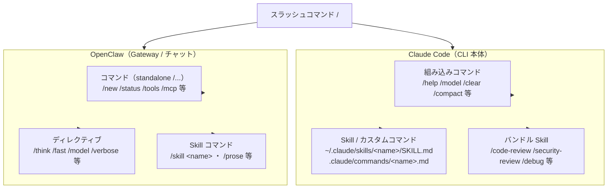
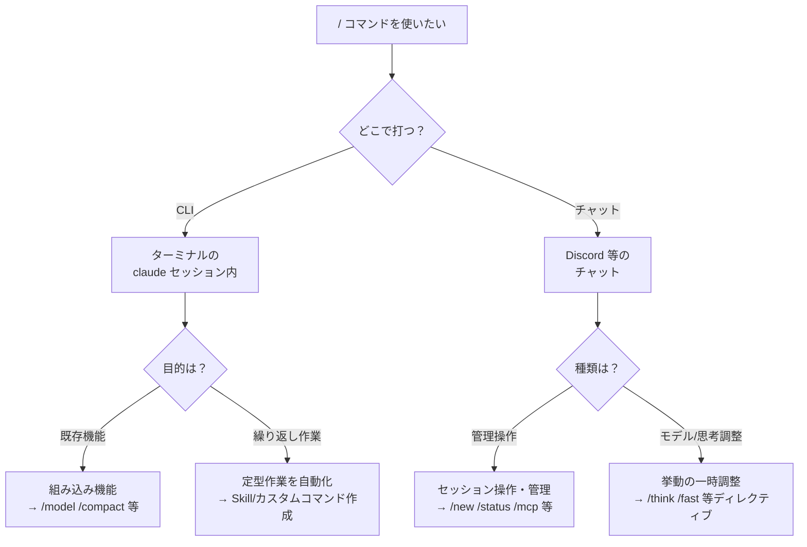

# スラッシュコマンド チートシート（Claude Code & OpenClaw）

`/` で始まるスラッシュコマンドの実用リファレンス。**Claude Code（CLI 本体）** と **OpenClaw（Gateway / チャット）** は別系統のコマンド体系を持つため、両者をまとめて整理し、使い分けとベストプラクティスを示す。

- **作成日:** 2026-06-01
- **対象:** Claude Code v2.1.x / OpenClaw 2026.5.x
- **方針:** 固有情報は placeholder（`<your-user>` 等）に伏字化

> ⚠️ **最重要の前提:** スラッシュコマンドには 2 つの独立した世界がある。
> - **Claude Code のコマンド** … ターミナルの `claude` セッション内で打つ。CLI が解釈する。
> - **OpenClaw のコマンド** … Discord 等のチャットで打つ。Gateway が解釈する。
>
> 名前が同じでも（例 `/model` `/status` `/mcp`）、**動作主体と挙動が異なる**。混同しないこと。

---

## 📚 用語ミニ辞典

| 用語 | 意味 |
|---|---|
| **組み込みコマンド** | ツールに最初から備わる固定コマンド（`/help` 等） |
| **Skill** | `SKILL.md` で定義する拡張機能。`/skill-name` で起動 |
| **カスタムコマンド** | `.claude/commands/*.md` で定義する自作コマンド（現在は Skill に統合） |
| **ディレクティブ（OpenClaw）** | メッセージから除去される挙動ヒント（`/think` 等） |
| **frontmatter** | Markdown 冒頭の `---` で囲う YAML メタデータ |
| **HITL** | Human-in-the-Loop、人間が判断ループに介在する仕組み |

---

## 🗺 全体像



### どれを使う？（判断フロー）



---

# Part 1. Claude Code（CLI 本体）

ターミナルの `claude` セッション内で `/` を打つと候補が出る。コマンドは**メッセージの先頭でのみ**認識され、後続テキストは引数として渡される。

## 1-1. よく使う組み込みコマンド（チートシート）

| コマンド | 用途 |
|---|---|
| `/help` | ヘルプ・コマンド一覧 |
| `/clear` | コンテキストを空にして新会話（別名 `/reset` `/new`） |
| `/compact [指示]` | 会話を要約してコンテキスト圧縮 |
| `/context [all]` | コンテキスト使用量を可視化 |
| `/model [名]` | モデル切替（既定として保存） |
| `/effort [level]` | 推論の effort 調整（low〜max, ultracode） |
| `/plan [説明]` | プランモードに入る |
| `/rewind` | 会話/コードを過去地点に巻き戻し（別名 `/undo`） |
| `/resume [名]` | 過去セッションを再開（別名 `/continue`） |
| `/branch [名]` | 現会話を分岐（別名 `/fork`） |
| `/btw <質問>` | 履歴を汚さない一時的な横道質問 |
| `/usage` | コスト・利用状況（別名 `/cost` `/stats`） |
| `/permissions` | 権限ルール管理（別名 `/allowed-tools`） |
| `/config` | 設定 UI（別名 `/settings`） |
| `/memory` | `CLAUDE.md` メモリ編集 |
| `/mcp` | MCP サーバ接続・OAuth 管理 |
| `/agents` | サブエージェント設定管理 |
| `/hooks` | フック設定の確認 |
| `/skills` | 利用可能 Skill の一覧 |
| `/doctor` | インストール診断（`f` で自動修正） |
| `/init` | `CLAUDE.md` 雛形生成 |
| `/login` `/logout` | Anthropic アカウントのサインイン/アウト |
| `/status` | バージョン・モデル・接続状況 |
| `/vim` | ⚠️ v2.1.92 で廃止（`/config`→Editor mode へ） |

> 完全な一覧は CLI 内で `/help` または `/` を入力して確認するのが最速。

## 1-2. バンドル Skill（プロンプト型コマンド）

固定ロジックではなく、Claude に詳細指示を与えて実行させる組み込み Skill。

| コマンド | 用途 |
|---|---|
| `/code-review [low\|medium\|high\|max\|ultra] [--fix] [--comment]` | 差分のバグ・改善レビュー。`ultra` でクラウド多エージェントレビュー |
| `/security-review` | 差分のセキュリティ脆弱性レビュー |
| `/simplify [target]` | 変更コードのクリーンアップ（バグ探索はしない）|
| `/debug [説明]` | デバッグログ有効化 → ログ解析 |
| `/verify` | アプリを実際に起動して変更を確認 |
| `/run` | プロジェクトのアプリを起動・操作 |
| `/loop [間隔] [prompt]` | プロンプトを繰り返し実行（別名 `/proactive`） |
| `/batch <指示>` | 大規模変更を 5〜30 単位に分解し並列実行（要 git） |
| `/claude-api` | Claude API リファレンス読込・モデル移行 |
| `/deep-research <問い>` | Web 横断調査 → 出典付きレポート |

## 1-3. カスタムコマンド / Skill の作り方

> **重要:** カスタムコマンドは Skill に統合された。`.claude/commands/deploy.md` と `.claude/skills/deploy/SKILL.md` はどちらも `/deploy` を作る。既存の `commands/` も引き続き動作するが、新規は Skill 推奨。

### 配置場所

| レベル | パス | スコープ |
|---|---|---|
| Personal | `~/.claude/skills/<name>/SKILL.md` | 全プロジェクト |
| Project | `.claude/skills/<name>/SKILL.md` | そのプロジェクトのみ |
| 旧形式 | `.claude/commands/<name>.md` | 同上（後方互換） |

優先順位: enterprise > personal > project。Skill と command が同名なら Skill 優先。

### SKILL.md の基本形

```markdown
---
description: Summarizes uncommitted changes and flags anything risky. Use when the user asks what changed.
---

Summarize the staged and unstaged changes below and flag anything risky.

!`git diff HEAD`
```

### frontmatter 主要フィールド

| フィールド | 役割 |
|---|---|
| `description` | Claude が自動起動を判断する説明文（必須級） |
| `disable-model-invocation: true` | Claude の自動起動を禁止し、手動 `/name` のみに |
| `argument-hint` | 引数のヒント表示 |
| `allowed-tools` | 使用可能ツールの制限 |
| `model` | 使用モデルの指定 |

### 動的機能

- **動的コンテキスト注入:** `` !`command` `` … 実行結果を Skill 本文に埋め込む（Claude が読む前に展開）
- **引数:** `$ARGUMENTS`（全体）、`$1` `$2`（位置引数）
- **ファイル参照:** `@path/to/file` でファイル内容を取り込む
- **名前空間:** サブディレクトリで分類（例 `.claude/skills/git/commit/`）

### ライブ反映
`~/.claude/skills/` や プロジェクト `.claude/skills/` の追加・編集・削除は**セッション中に自動反映**（最上位ディレクトリの新規作成のみ再起動が必要）。`/reload-skills` で手動再スキャンも可能。

## 1-4. ベストプラクティス（Claude Code）

- **繰り返す指示は Skill 化する** — 同じ手順を毎回貼っているなら Skill にする。Skill 本文は使用時のみ読み込まれ、未使用時のコストはほぼゼロ
- **`CLAUDE.md` は「事実」、Skill は「手順」** — 手順化したものは Skill へ切り出す
- **`description` を具体的に書く** — Claude の自動起動判定の精度が上がる
- **手動専用にしたいコマンドは `disable-model-invocation: true`** — デプロイ等の危険操作
- **長い参照資料は supporting files に分離** — 本体 Skill を軽く保つ
- **コンテキスト管理を習慣に** — `/context` で確認 → `/compact` で圧縮 → 横道は `/btw`

---

# Part 2. OpenClaw（Gateway / チャット）

Discord 等のチャットで使う。コマンドは Gateway が処理し、**先頭が `/` の standalone メッセージ**が基本。`! <cmd>` はホスト bash（`/bash` 別名）。

## 2-1. 3 つのサブシステム

| 種類 | 説明 | 例 |
|---|---|---|
| **コマンド** | standalone `/...` メッセージ | `/new` `/status` `/tools` |
| **ディレクティブ** | モデルに渡る前に除去される挙動ヒント。ディレクティブのみのメッセージは設定として永続化 | `/think` `/fast` `/model` `/verbose` `/reasoning` `/elevated` `/exec` `/queue` |
| **インラインショートカット** | 通常文中に埋め込んでも即実行（認可済み送信者のみ） | `/help` `/commands` `/status` `/whoami` |

## 2-2. コマンド一覧（チートシート）

### セッション・実行制御
| コマンド | 用途 |
|---|---|
| `/new [model]` | 現セッションを保管して新規開始 |
| `/reset [soft]` | 現セッションをその場で初期化 |
| `/compact [指示]` | コンテキスト圧縮 |
| `/stop` | 実行中の run を中断 |
| `/export-session [path]` | セッションを HTML 出力（別名 `/export`） |
| `/export-trajectory` | JSONL トラジェクトリ出力（別名 `/trajectory`、要承認） |

### モデル・run 調整（ディレクティブ）
| コマンド | 用途 |
|---|---|
| `/think <level>` | 思考レベル設定（off/low/medium/high 等。別名 `/t`） |
| `/model [名\|#\|status]` | モデル表示・切替 |
| `/models [provider]` | 構成/認可済みモデル一覧 |
| `/fast [on\|off]` | fast モード |
| `/reasoning [on\|off\|stream]` | 推論可視性（別名 `/reason`） |
| `/verbose [on\|off\|full]` | 詳細出力（別名 `/v`、通常は off 推奨） |
| `/elevated [on\|off\|ask\|full]` | 昇格モード（別名 `/elev`） |
| `/queue <mode>` | run キュー挙動（steer/followup/collect/interrupt） |
| `/steer <message>` | 実行中の run に指示注入（別名 `/tell`） |

### 発見・状況
| コマンド | 用途 |
|---|---|
| `/help` | 短いヘルプ |
| `/commands` | コマンドカタログ |
| `/tools [compact\|verbose]` | 今このagentが使えるツール |
| `/status` | 実行/ランタイム状況・稼働時間・利用量 |
| `/context [list\|detail\|map\|json]` | コンテキスト構成（`map` は treemap 画像） |
| `/usage off\|tokens\|full\|cost` | 利用量フッター制御 |
| `/whoami` | 送信者 ID 表示（別名 `/id`） |
| `/diagnostics [note]` | owner 専用サポートレポート（毎回承認必須） |
| `/tasks` | バックグラウンドタスク一覧 |

### Skill・承認
| コマンド | 用途 |
|---|---|
| `/skill <name> [input]` | Skill を名前で実行 |
| `/approve <id> <decision>` | exec/plugin 承認プロンプトの解決 |
| `/btw <質問>` | 文脈を変えない横道質問（別名 `/side`） |
| `/allowlist [list\|add\|remove]` | allowlist 管理（text のみ） |

### owner 専用・管理（書込）
| コマンド | 用途 | 必要フラグ |
|---|---|---|
| `/config show\|get\|set\|unset` | `openclaw.json` 読み書き | `commands.config: true` |
| `/mcp show\|get\|set\|unset` | `mcp.servers` 読み書き | `commands.mcp: true` |
| `/plugins list\|install\|enable\|disable` | プラグイン管理 | `commands.plugins: true` |
| `/debug show\|set\|unset\|reset` | ランタイム限定の設定上書き | `commands.debug: true` |
| `/restart` | OpenClaw 再起動 | 既定有効 |
| `/bash <command>` | ホストシェル実行（別名 `! <cmd>`） | `commands.bash: true` + elevated |

### その他（バンドルプラグイン等）
| コマンド | 用途 |
|---|---|
| `/dock-discord` 等 | セッションの返信ルートを別チャネルへ |
| `/focus <target>` / `/unfocus` | スレッドをセッションに束縛/解除 |
| `/tts ...` | 音声読み上げ制御 |
| `/pair ...` | デバイスペアリング |
| `/dreaming [on\|off]` | メモリ dreaming |

## 2-3. 主要設定フラグ（`commands.*`）

owner 専用の書込系コマンドは既定で**無効**。`openclaw.json` で明示的に有効化する。

```json5
{
  commands: {
    text: true,           // チャット内 /... の解釈（既定 true）
    native: "auto",       // ネイティブコマンド登録（Discord/Telegram は auto=on）
    bash: false,          // ! <cmd> / /bash（要 elevated）
    config: false,        // /config
    mcp: false,           // /mcp
    plugins: false,       // /plugins
    debug: false,         // /debug
    restart: true,        // /restart
    ownerAllowFrom: ["discord:<owner-id>"],  // owner 許可リスト
  },
}
```

## 2-4. ベストプラクティス（OpenClaw）

- **`/verbose` `/reasoning` `/trace` はグループでは off** — 内部推論・ツール出力・診断が漏れうる。特に複数人チャットで危険
- **owner 専用書込（`/config` `/mcp` 等）は必要時だけ有効化** — 既定の無効を維持し、攻撃面を絞る
- **`/diagnostics` `/export-trajectory` は allow-all 承認しない** — 毎回内容を確認して承認（HITL）
- **モデル切替は `/model`** — idle なら即時、run 中は安全な区切りで pending 反映
- **コマンドのみメッセージは「fast path」** — 認可済み送信者ならキュー/モデルをバイパスして即処理。グループの mention 要件も回避
- **インラインショートカットは限定的** — `/help` `/commands` `/status` `/whoami` のみ文中で有効

---

## 🔍 Claude Code と OpenClaw の使い分け（同名コマンド注意）

| コマンド | Claude Code（CLI） | OpenClaw（チャット） |
|---|---|---|
| `/model` | CLI のモデル切替（既定保存） | セッションのモデル切替（ディレクティブ） |
| `/status` | 設定 UI の Status タブ | 実行/ランタイム状況テキスト |
| `/mcp` | MCP 接続・OAuth 管理 UI | `mcp.servers` 設定の読み書き（owner） |
| `/compact` | 会話要約 | セッションコンテキスト圧縮 |
| `/config` | 設定 UI | `openclaw.json` 読み書き（owner） |

> **覚え方:** ターミナルで打てば Claude Code、チャットで打てば OpenClaw が解釈する。

---

## 📎 関連

- Claude Code コマンドリファレンス: <https://code.claude.com/docs/en/commands>
- Claude Code Skills: <https://code.claude.com/docs/en/skills>
- Agent Skills 標準: <https://agentskills.io>
- OpenClaw スラッシュコマンド: <https://docs.openclaw.ai/tools/slash-commands>
- OpenClaw Skill 作成: <https://docs.openclaw.ai/tools/creating-skills>
