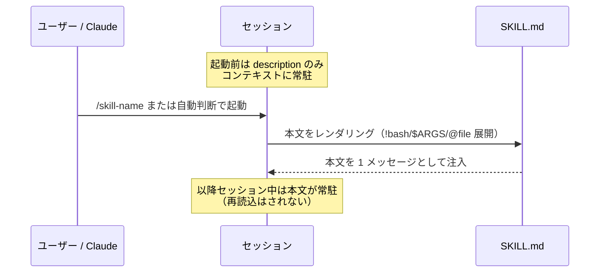
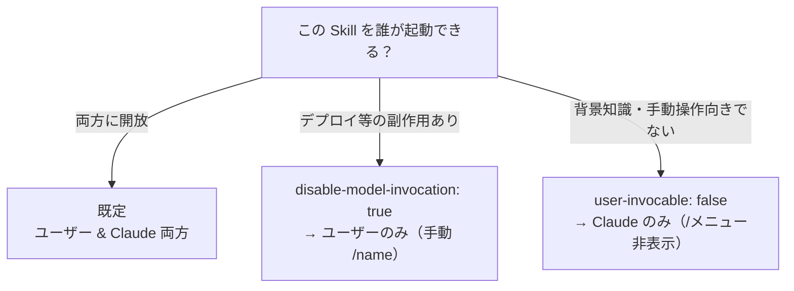

# Skills チートシート（Claude Code & OpenClaw）

Skill（スキル）の実用リファレンス。**Claude Code** と **OpenClaw** はどちらも [AgentSkills](https://agentskills.io) 標準互換の `SKILL.md` を使うため、共通点が多い。両者をまとめて整理し、作成方法とベストプラクティスを示す。

- **作成日:** 2026-06-01
- **対象:** Claude Code v2.1.x / OpenClaw 2026.5.x
- **方針:** 固有情報は placeholder（`<your-user>` 等）に伏字化。秘密情報は記載しない

> 💡 **Skill とは:** `SKILL.md`（YAML frontmatter + 指示文）を置くだけでエージェントに能力を追加できる仕組み。`/skill-name` で手動起動、または description に基づき自動起動される。**本文は使用時のみ読み込まれる**ため、未使用時のコストはほぼゼロ。
>
> ✅ **共通点:** 両者とも AgentSkills 互換。`name` / `description` / `disable-model-invocation` / `user-invocable` 等の frontmatter は共通。
> ⚠️ **相違点:** 配置パス・優先順位・設定方法・gating（読込条件）の仕組みが異なる。

---

## 📚 用語ミニ辞典

| 用語 | 意味 |
|---|---|
| **SKILL.md** | Skill 本体。frontmatter（メタデータ）+ 指示文 |
| **frontmatter** | 冒頭 `---` で囲う YAML メタデータ |
| **gating（OpenClaw）** | 環境・config・バイナリ有無で読込可否を判定する仕組み |
| **動的コンテキスト注入** | `` !`cmd` `` の実行結果を本文に埋め込む |
| **AgentSkills** | 複数 AI ツールで共通の Skill オープン標準 |
| **ClawHub** | OpenClaw 公開 Skill レジストリ |

---

## 🔄 Skill が起動する仕組み（共通）



> **重要:** 一度起動すると `SKILL.md` 本文はセッション中ずっとコンテキストに残る（毎ターン再読込されない）。だから本文は**簡潔に**書く（各行が継続的なトークンコスト）。

## 🔐 誰が起動できるか（共通の招待制御）



| frontmatter | ユーザー起動 | Claude 自動起動 | 用途 |
|---|---|---|---|
| （既定） | ✅ | ✅ | 汎用 |
| `disable-model-invocation: true` | ✅ | ❌ | デプロイ・コミット等、タイミングを握りたい操作 |
| `user-invocable: false` | ❌ | ✅ | 背景知識（コマンド化が無意味なもの） |

---

# Part 1. Claude Code Skills

## 1-1. いつ作るか

- 同じ指示・チェックリスト・手順を**繰り返し貼っている**とき
- `CLAUDE.md` の一節が「事実」でなく「手順」に育ったとき

→ `CLAUDE.md` は常時読み込まれるが、Skill 本文は**使用時のみ**。長い参照資料を Skill に逃がすとコンテキストを節約できる。

## 1-2. 作り方（最短）

```bash
mkdir -p ~/.claude/skills/summarize-changes
```

`~/.claude/skills/summarize-changes/SKILL.md`:

```markdown
---
description: Summarizes uncommitted changes and flags anything risky. Use when the user asks what changed.
---

## Current changes

!`git diff HEAD`

## Instructions

Summarize the changes above in 2-3 bullets, then list risks (missing error handling, hardcoded values, tests to update).
```

- `/summarize-changes` で手動起動、または description に合う質問で自動起動
- ディレクトリ名がコマンド名になる

## 1-3. 配置場所と優先順位

| レベル | パス | スコープ |
|---|---|---|
| Enterprise | managed settings | 組織全体 |
| Personal | `~/.claude/skills/<name>/SKILL.md` | 全プロジェクト |
| Project | `.claude/skills/<name>/SKILL.md` | そのプロジェクト |
| Plugin | `<plugin>/skills/<name>/SKILL.md` | プラグイン有効範囲 |

優先順位: **enterprise > personal > project**。Plugin は `plugin-name:skill-name` で名前空間化され衝突しない。`.claude/commands/` と同名なら Skill 優先。

- **ライブ反映:** 既存 skills ディレクトリ配下の追加/編集/削除はセッション中に自動反映。新規トップレベル作成のみ再起動が必要（`/reload-skills` で手動再スキャンも可）
- **親/ネスト探索:** プロジェクトはリポジトリルートまでの親、および作業対象サブディレクトリの `.claude/skills/` も探索（monorepo 対応）

## 1-4. frontmatter リファレンス（主要）

| フィールド | 役割 |
|---|---|
| `name` | 表示名（既定はディレクトリ名） |
| `description` | 自動起動判定に使う説明（推奨。1,536 字で切詰め） |
| `when_to_use` | トリガー語・例。description に追記される |
| `argument-hint` | 補完時の引数ヒント |
| `arguments` | 名前付き位置引数（`$name` 展開用） |
| `disable-model-invocation` | `true` で Claude 自動起動を禁止 |
| `user-invocable` | `false` で `/` メニュー非表示 |
| `allowed-tools` | 起動中に承認不要で使えるツール |
| `disallowed-tools` | 起動中に外すツール |
| `model` / `effort` | 起動中のモデル / effort 上書き |
| `context: fork` | サブエージェントで実行 |
| `agent` | `context: fork` 時のサブエージェント種別 |
| `paths` | glob で自動起動を限定 |
| `hooks` | Skill ライフサイクルにスコープしたフック |

## 1-5. 文字列置換 / 動的注入

| 変数 | 意味 |
|---|---|
| `$ARGUMENTS` | 起動時の全引数 |
| `$ARGUMENTS[N]` / `$N` | N 番目（0始まり）の引数 |
| `$name` | `arguments` で宣言した名前付き引数 |
| `${CLAUDE_SESSION_ID}` | 現セッション ID |
| `${CLAUDE_SKILL_DIR}` | Skill の `SKILL.md` があるディレクトリ |
| `` !`command` `` | 実行結果を本文に埋め込み（Claude が読む前に展開） |
| `@path/to/file` | ファイル内容を取込 |

## 1-6. supporting files（補助ファイル）

```text
my-skill/
├── SKILL.md       # 必須・概要とナビゲーション（500行以内推奨）
├── reference.md   # 詳細API（必要時のみ読込）
├── examples.md    # 例
└── scripts/
    └── helper.py  # 実行用（読込されない）
```

`SKILL.md` から `[reference.md](reference.md)` のように参照を書いておくと、Claude が必要時のみ読み込む。

## 1-7. ベストプラクティス（Claude Code）

- **本文は簡潔に** — 起動後セッション中ずっと常駐する。「何をするか」を述べ、冗長な説明は避ける
- **`description` を具体的に** — 自動起動の精度が上がる。主要ユースケースを先頭に
- **副作用のある操作は `disable-model-invocation: true`** — Claude が勝手にデプロイしないように
- **背景知識は `user-invocable: false`** — コマンド化が無意味なものを隠す
- **`allowed-tools` はプロジェクト trust 後に有効** — 取り込む前にレビュー（Skill は自身に広い権限を付与しうる）
- **長い資料は supporting files へ** — 本体を 500 行以内に保つ
- **compaction 後に効きが弱ければ再起動** — 再 invoke で本文を復元

---

# Part 2. OpenClaw Skills

OpenClaw も AgentSkills 互換。バンドル Skill + ローカル上書きを読み込み、**load 時に環境・config・バイナリ有無で gating（フィルタ）**する点が特徴。

## 2-1. 配置場所と優先順位

| # | ソース | パス | 優先 |
|---|---|---|---|
| 1 | Workspace | `<workspace>/skills` | 最高 |
| 2 | Project agent | `<workspace>/.agents/skills` | ↑ |
| 3 | Personal agent | `~/.agents/skills` | ↑ |
| 4 | Managed/local | `~/.openclaw/skills` | ↑ |
| 5 | Bundled | インストール同梱 | ↓ |
| 6 | Extra dirs | `skills.load.extraDirs` | 最低 |

同名は**最高ソースが勝つ**。フォルダ階層は整理用で、コマンド名は frontmatter `name`（無ければディレクトリ名）由来 → `skills/personal/research/SKILL.md` でも `name: research` なら `/research`。

## 2-2. 作り方（最短）

```bash
mkdir -p ~/.openclaw/workspace/skills/hello-world
```

`SKILL.md`:

```markdown
---
name: hello-world
description: A simple skill that says hello.
---

When the user asks for a greeting, use the `echo` tool to say
"Hello from your custom skill!".
```

反映:
```bash
openclaw skills list      # 読込確認
/new                      # 新セッションで反映（または gateway 再起動）
```

## 2-3. OpenClaw 固有の frontmatter

| フィールド | 役割 |
|---|---|
| `name` / `description` | 必須 |
| `user-invocable` | `true`（既定）でスラッシュコマンド化 |
| `disable-model-invocation` | `true` で通常プロンプトから除外（手動 `/name` は可） |
| `command-dispatch: tool` | スラッシュコマンドをモデルを介さず直接ツールへ |
| `command-tool` | dispatch 先のツール名 |
| `metadata.openclaw.*` | gating（読込条件）。**単一行 JSON** で書く |

## 2-4. gating（読込条件フィルタ）

```markdown
---
name: image-lab
description: Generate or edit images via a provider-backed image workflow
metadata: { "openclaw": { "requires": { "bins": ["uv"], "env": ["GEMINI_API_KEY"], "config": ["browser.enabled"] }, "primaryEnv": "GEMINI_API_KEY" } }
---
```

| フィールド | 意味 |
|---|---|
| `always: true` | 他ゲートを無視し常に含める |
| `os` | `["darwin"\|"linux"\|"win32"]` で対象OS限定 |
| `requires.bins` | PATH に全て必要 |
| `requires.anyBins` | いずれか1つ必要 |
| `requires.env` | env か config に必要 |
| `requires.config` | `openclaw.json` パスが truthy 必要 |
| `primaryEnv` | `skills.entries.<name>.apiKey` と紐づく env 名 |

`metadata.openclaw` が無ければ常に eligible（config 無効化や `allowBundled` を除く）。

## 2-5. 設定（`openclaw.json`）

```json5
{
  skills: {
    allowBundled: ["gemini", "peekaboo"],   // バンドル限定の許可リスト
    load: { extraDirs: ["~/Projects/skills"], watch: true, watchDebounceMs: 250 },
    install: { preferBrew: true, nodeManager: "npm", allowUploadedArchives: false },
    entries: {
      "image-lab": {
        enabled: true,
        apiKey: { source: "env", provider: "default", id: "GEMINI_API_KEY" },
      },
      sag: { enabled: false },              // 無効化
    },
  },
}
```

### エージェント別の可視性（allowlist）
```json5
{
  agents: {
    defaults: { skills: ["github", "weather"] },
    list: [
      { id: "writer" },                    // defaults を継承
      { id: "docs", skills: ["docs-search"] }, // defaults を置換（マージしない）
      { id: "locked-down", skills: [] },   // skill なし
    ],
  },
}
```

> **location（どのコピーが勝つか）** と **visibility（agent が使えるか）** は別制御。

## 2-6. ClawHub（インストール / 更新）

| 操作 | コマンド |
|---|---|
| ClawHub から導入 | `openclaw skills install <slug>` |
| Git から導入 | `openclaw skills install git:owner/repo@ref` |
| 全エージェント向け | `openclaw skills install <slug> --global` |
| 全更新 | `openclaw skills update --all` |
| 検証 | `openclaw skills verify <slug>` |

## 2-7. ベストプラクティス（OpenClaw）

- **第三者 Skill は未信頼コードとして扱う** — 有効化前に必ず中身を読む。リスクある入力/ツールは sandbox 実行を推奨
- **秘密情報をプロンプト/ログに出さない** — `skills.entries.*.env` / `apiKey` はホストプロセスに注入。秘密は SecretRef か `.env` で管理
- **gating で条件付き読込** — `requires.bins/env/config` で依存が揃う時だけ有効化
- **トークンコストを意識** — eligible skill は system prompt に圧縮XMLで載る（1 skill ≈ 24 tokens + フィールド長）
- **反映タイミング** — snapshot はセッション開始時。watcher 有効なら次ターンで hot reload、基本は `/new`
- **sandbox 時の env 注意** — `skills.entries.*.env` はホストのみ。sandbox には `sandbox.docker.env` 等で別途渡す

---

## 🔍 Claude Code と OpenClaw の対比

| 観点 | Claude Code | OpenClaw |
|---|---|---|
| 配置（個人） | `~/.claude/skills/` | `~/.openclaw/skills` / `~/.agents/skills` |
| 配置（プロジェクト） | `.claude/skills/` | `<workspace>/skills` |
| 優先順位 | enterprise > personal > project | workspace > project-agent > personal-agent > managed > bundled > extra |
| 読込条件 | `paths` glob 等 | `metadata.openclaw.requires.*`（gating） |
| 設定 | settings.json / frontmatter | `skills.entries.*` / `agents.*.skills` |
| 配布 | plugin | ClawHub / plugin |
| 反映 | ライブ反映 | snapshot + watcher（`/new`） |

> **共通の心得:** 本文は簡潔に、`description` は具体的に、副作用ありは手動限定、第三者 Skill はレビューしてから。

---

## 📎 関連

- Claude Code Skills: <https://code.claude.com/docs/en/skills>
- Claude Code コマンド: <https://code.claude.com/docs/en/commands>
- Agent Skills 標準: <https://agentskills.io>
- OpenClaw Skills: <https://docs.openclaw.ai/tools/skills>
- OpenClaw Skill 作成: <https://docs.openclaw.ai/tools/creating-skills>
- OpenClaw Skills config: <https://docs.openclaw.ai/tools/skills-config>
- ClawHub: <https://clawhub.ai>
