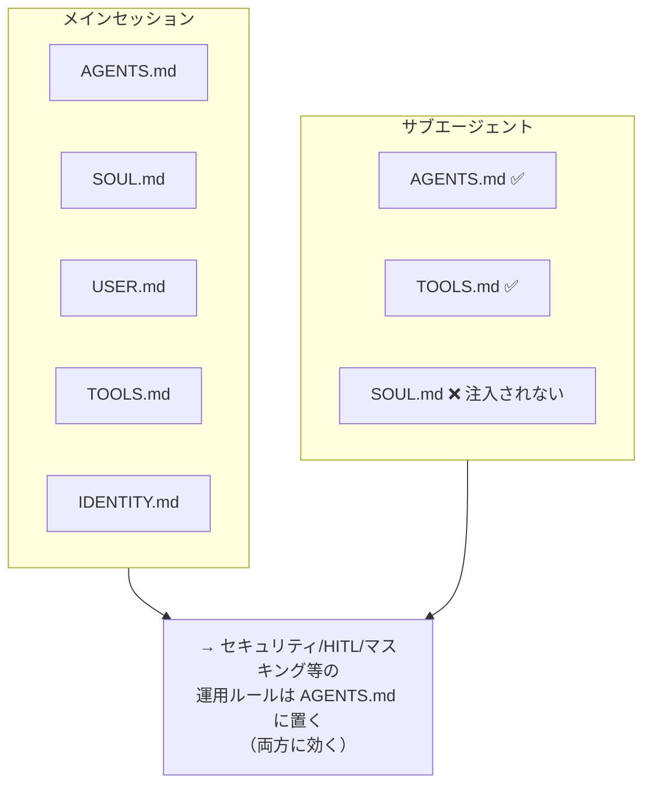

# OpenClaw ワークスペース チューニングガイド（監査と適用記録）

OpenClaw のワークスペースファイル（`AGENTS.md` / `SOUL.md` / `IDENTITY.md` / `USER.md` / `TOOLS.md` / `HEARTBEAT.md`）を公式ベストプラクティスに照らして監査し、チューニングを実施した記録。

- **作成日:** 2026-06-01
- **対象:** OpenClaw 2026.5.x のエージェントワークスペース（`~/.openclaw/workspace`）
- **方針:** 固有情報は placeholder（`<your-user>` 等）に伏字化

---

## 📚 前提：ワークスペースファイルの役割（公式）

| ファイル | 役割 | 注入タイミング |
|---|---|---|
| `AGENTS.md` | 運用指示・ルール・優先順位・振る舞い | 毎セッション + **サブエージェント** |
| `SOUL.md` | 人格・トーン・境界線（声） | 毎セッション（サブエージェントには注入されない） |
| `USER.md` | ユーザーは誰か・呼び方 | 毎セッション |
| `IDENTITY.md` | エージェントの名前・vibe・emoji | 毎セッション |
| `TOOLS.md` | ローカルツールの慣習メモ | 毎セッション + **サブエージェント** |
| `HEARTBEAT.md` | ハートビート用の小さなチェックリスト | heartbeat 有効時のみ |

出典:
- <https://docs.openclaw.ai/concepts/agent-workspace>
- <https://docs.openclaw.ai/concepts/soul>
- <https://docs.openclaw.ai/concepts/system-prompt>

---

## 🔑 公式ベストプラクティスの要点

1. **役割を混ぜない** — `SOUL.md` は「声・トーン・境界線」専用。「セキュリティポリシーの羅列」「運用規約のダンプ」を入れてはいけない。運用ルールは `AGENTS.md`。
2. **サブエージェントは `AGENTS.md` と `TOOLS.md` のみ注入** — `SOUL.md` 等は除外される。**全エージェントに効かせたいルールは `AGENTS.md` に置く**必要がある。
3. **注入サイズ上限** — 1 ファイルあたり `agents.defaults.bootstrapMaxChars`（既定 12,000 字）。超過分は truncation（切り捨て）。全ファイル合計は `bootstrapTotalMaxChars`（既定 60,000 字）。
4. **簡潔に保つ** — 注入ファイルはコンテキストコストに直結。`MEMORY.md` は要約のみ、詳細は `memory/*.md`。
5. **タイムゾーン** — `agents.defaults.userTimezone` を設定するとプロンプトに反映。

---

## 🔍 監査結果（Before）



| # | 重要度 | 指摘 | 詳細 |
|---|---|---|---|
| ① | 🔴 高 | **SOUL.md 肥大化＋切り詰めリスク** | 11,641 字 / 12,000 字上限（97%）。あと少しで truncation。さらに公式設計（声専用）に反し、運用ルールで膨張 |
| ② | 🔴 高 | **サブエージェントに重要ルールが届かない** | セキュリティ/マスキング/HITL が SOUL.md にあり、サブエージェント起動時に無効 |
| ③ | 🟡 中 | **`userTimezone` 未設定** | USER.md は JST だが config 未設定でシステム時刻が UTC 表示 |
| ④ | 🟢 低 | **MEMORY.md 不在 / memorySearch 無効** | 長期記憶ファイル未作成。memorySearch は意図的に無効（ローカル LLM 導入後に再検討） |

---

## 🛠️ 実施した変更（After）

### 1. 役割の再分離（①②の解決）

- **`SOUL.md`** → 声・トーン・境界線のみに圧縮（**11,641 → 約 2,300 字**）。運用ルールは `AGENTS.md` を参照する旨を明記。
- **`AGENTS.md`** → 冒頭に「🧭 NEXUS 運用ルール（全エージェント適用）」を新設し、以下を移設:
  - 🔒 セキュリティ原則（最重要）
  - 判断の自律性 / HITL（Human-in-the-Loop）+ 👍 リアクション承認
  - コードへの介入度 / コミュニケーション密度 / メッセージ分割禁止
  - 作業計画と公式ドキュメント参照
  - ドキュメンテーション規約（保管場所・権限・図解・多言語・マスキング・GitHub 公開・README 必須セクション）
  - 接続経路

→ これでサブエージェントにも最重要ルールが届く。

### 2. 注入サイズ上限の引き上げ（②の副作用対策）

ルール移設で `AGENTS.md` が約 16,000 字となり 12,000 字上限を超過したため:

```bash
openclaw config set agents.defaults.bootstrapMaxChars 20000
```

全ファイル合計は約 22,000 字で `bootstrapTotalMaxChars`（60,000）内のため問題なし。

### 3. タイムゾーン設定（③の解決）

```bash
openclaw config set agents.defaults.userTimezone Asia/Tokyo
openclaw config set agents.defaults.timeFormat '"24"'
```

### 適用後のファイルサイズ

| ファイル | Before | After |
|---|---|---|
| `SOUL.md` | 11,641 | ~2,300 |
| `AGENTS.md` | 7,938 | ~15,900 |
| 合計（全注入ファイル） | ~23,200 | ~21,900 |

> ⚠️ config 変更は **gateway 再起動で反映**。再起動時は実行中の対話セッション接続が一旦切れる（想定挙動）。

---

## ✅ 効果

- **truncation リスク解消** — どのファイルも上限内（per-file 20,000、合計 60,000）。
- **サブエージェントの安全性向上** — セキュリティ・マスキング・HITL が全エージェントに適用。
- **設計準拠** — SOUL.md は声、AGENTS.md は運用、と公式の役割分担に整合。
- **時刻精度** — JST がプロンプトに反映。

---

## 📌 今後の課題（任意）

- **AGENTS.md の boilerplate 整理** — テンプレート由来の汎用セクション（heartbeat の詳細手順等）は現在 heartbeat 無効のため低価値。将来必要に応じて削減しトークン節約可能。
- **MEMORY.md の整備** — 長期記憶の要約ファイルを作成し、詳細は `memory/*.md` に分離。
- **memorySearch の再有効化** — ローカル LLM（Ollama 等）導入後に semantic recall を有効化検討。

---

## 📎 関連

- Agent workspace: <https://docs.openclaw.ai/concepts/agent-workspace>
- SOUL.md personality guide: <https://docs.openclaw.ai/concepts/soul>
- System prompt: <https://docs.openclaw.ai/concepts/system-prompt>
- 設定リファレンス: <https://docs.openclaw.ai/gateway/configuration-reference>
