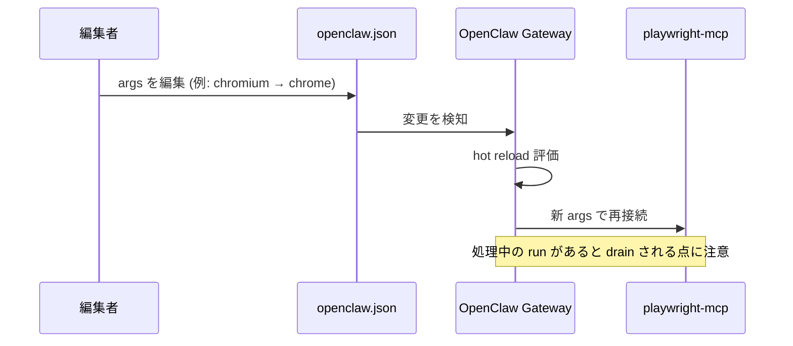

# playwright-mcp 設定手順書

OpenClaw に組み込んでいる **playwright-mcp**（ブラウザ自動操作を行う MCP サーバ）の設定を抜粋し、各項目の意味・変更方法・確認コマンドをまとめた手順書です。

> 用語: **MCP**（Model Context Protocol）= AI エージェントに外部ツールを提供する仕組み。**playwright-mcp** はその一つで、Playwright を使ってブラウザ（Chrome / Chromium）を遠隔操作します。

---

## 1. 該当設定の抜粋

設定ファイル: `~/.openclaw/openclaw.json` の `mcp.servers.playwright-mcp` セクション。

```json
{
  "mcp": {
    "servers": {
      "playwright-mcp": {
        "command": "/usr/bin/npx",
        "args": [
          "-y",
          "@playwright/mcp@latest",
          "--headless",
          "--browser",
          "chrome"
        ]
      }
    }
  }
}
```

---

## 2. 各パラメータの意味

| 項目 | 値 | 意味 |
|---|---|---|
| `command` | `/usr/bin/npx` | MCP サーバを起動するコマンド。`npx` で npm パッケージを直接実行する。 |
| `-y` | — | `npx` の確認プロンプトを自動承認（未取得パッケージを自動ダウンロード）。 |
| `@playwright/mcp@latest` | — | 起動する MCP パッケージ。`@latest` で常に最新版を取得。 |
| `--headless` | — | 画面表示なし（ヘッドレス）でブラウザを起動。サーバ環境向け。 |
| `--browser` | `chrome` | 使用するブラウザの種類。`chrome` または `chromium` を指定可能。 |

### `--browser chrome` と `--browser chromium` の違い

- **`chromium`**: Playwright が同梱する Chromium バイナリを使用。
- **`chrome`**: Google Chrome（安定版チャネル相当）を使用。playwright-mcp が管理する Chrome for Testing を利用する。

> ⚠️ **注意（重要）**: `--browser` の値に関わらず、ブラウザを実際に起動するには OS 側の共有ライブラリ（`libatk`, `libcups`, `libX11`, `libgbm`, `libpango` など）が必要です。これらが未導入の環境では、`chrome` / `chromium` のどちらを指定しても起動に失敗します。導入手順は別途「ブラウザ依存ライブラリ導入手順」を参照（作成予定）。

---

## 3. 設定変更の反映方法

OpenClaw は `openclaw.json` の変更を検知して **ホットリロード**します。`mcp.servers.*.args` の変更は、原則 gateway の再起動なしで反映されます。

反映ログの例（gateway ログに出力）:

```
config change detected; evaluating reload (mcp.servers.playwright-mcp.args)
config hot reload applied (mcp.servers.playwright-mcp.args)
```

> ⚠️ **運用上の注意**: 設定変更（ホットリロード）や `gateway restart` は、**処理中のエージェント実行（embedded run）を drain（中断）**します。チャット応答の処理中に設定を編集すると、その応答が強制終了し「Something went wrong」エラーになることがあります。**設定変更は処理が走っていないアイドル時に行ってください。**

### 反映フロー



---

## 4. 確認コマンド集

```bash
# 設定の妥当性
python3 -c "import json;json.load(open('$HOME/.openclaw/openclaw.json'));print('JSON OK')"

# playwright-mcp 設定の抜粋表示
grep -nA6 '"playwright-mcp"' ~/.openclaw/openclaw.json

# npx の存在確認
ls -l /usr/bin/npx

# Playwright がダウンロード済みのブラウザ一覧
ls -d ~/.cache/ms-playwright/* 2>/dev/null

# ブラウザの不足ライブラリ確認（"not found" が出れば OS 依存が未導入）
ldd ~/.cache/ms-playwright/chromium-*/chrome-linux64/chrome | grep "not found"

# gateway のホットリロード/エラーログ確認
grep -iE "hot reload|playwright" /tmp/openclaw/openclaw-*.log | tail
```

---

## 5. 関連リンク

- Playwright MCP: <https://github.com/microsoft/playwright-mcp>
- Playwright 本体: <https://playwright.dev/>
- OpenClaw 設定リファレンス: <https://docs.openclaw.ai/gateway/configuration-reference>

---

## Author and Ownership / 著作権と所属について

This project was created as a personal initiative and is not connected to any organization or group.
It is published as an individual creative work.

本プロジェクトは個人の活動として作成したものであり、特定の組織や団体の業務とは関係ありません。
個人の創作物として公開しています。
