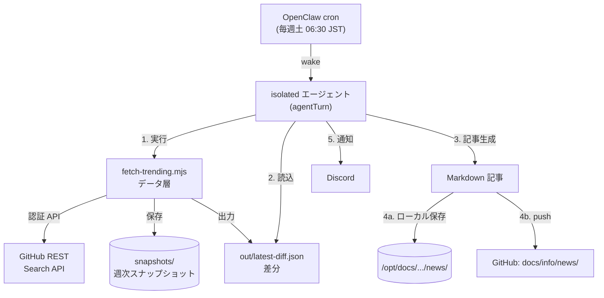
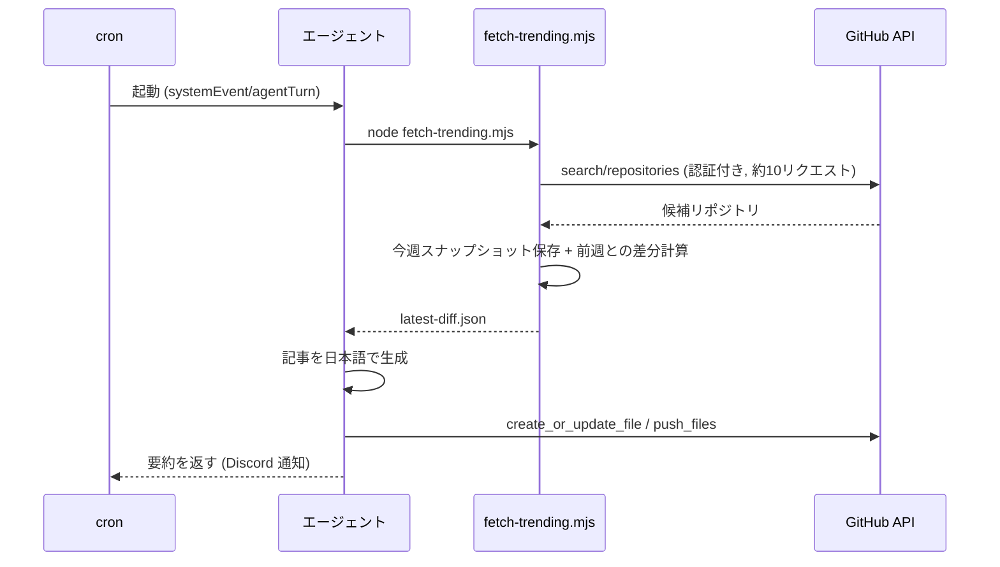

# 週次 GitHub トレンド記事タスク 構築手順

> STATUS: DONE / CATEGORY: SETUP / 作成日: 2026-06-07
> OpenClaw の永続 cron と GitHub 公式 API を使い、毎週「急上昇リポジトリ」の紹介記事を自動生成・公開するタスクの構築手順です。

## 0. 概要（何をするタスクか）

毎週 **土曜 06:30 JST** に自動実行され、次を行います。

1. GitHub 公式 REST Search API で人気・活発なリポジトリを取得
2. 前週に保存しておいた「スナップショット（その時点のスター数一覧）」と比較し、**今週の差分**（スター急増 = riser／新規ランクイン = newcomer）を算出
3. 差分をもとに日本語の紹介記事（Markdown）を生成
4. ドキュメント公開リポジトリの `docs/info/news/` へ push
5. 結果を Discord に通知

> 用語: **スナップショット** … ある時点の状態を丸ごと記録したもの。ここでは「リポジトリ名→スター数」の一覧を週ごとに保存し、週をまたいだ増減を測る基準にします。

### 採用方式（案A）
- **公式 REST Search API + 自前の週次スナップショット差分**。
- Web スクレイピング（画面の自動読み取り）は使いません。GitHub 公式 API はプログラム利用が公式に許諾されており、レート制限を守れば規約上問題ないためです。

## 1. アーキテクチャ





## 2. 前提

- Node.js（`fetch` が使える v18 以降。本番は v24 系）。
- 環境変数 **`GITHUB_PERSONAL_ACCESS_TOKEN`** が設定済みであること（GitHub API の認証に使用）。
  - ⚠️ トークンの**値は本書にもログにも残しません**。実値は OpenClaw gateway の起動 unit（環境変数）で管理。
  - 権限は public リポジトリへの `contents:write`（記事 push 用）と、Search API 用の読み取りで十分。
- OpenClaw の `cron` ツールが利用可能（永続スケジューラ）。
- ※ ブラウザ自動化（playwright/chrome）は本タスクには**不要**（API のみで完結）。

## 3. ディレクトリ構成

作業ディレクトリ（ワークスペース）配下に以下を作成します。

```
~/.openclaw/workspace/tasks/github-trending/
├── fetch-trending.mjs        # データ層スクリプト
├── snapshots/                # 週次スナップショット (snapshot-YYYY-MM-DD.json)
└── out/                      # 差分出力 (diff-YYYY-MM-DD.json, latest-diff.json)
```

```bash
mkdir -p ~/.openclaw/workspace/tasks/github-trending/snapshots \
         ~/.openclaw/workspace/tasks/github-trending/out
```

## 4. データ層スクリプト（fetch-trending.mjs）

役割は「**取得 → スナップショット保存 → 差分計算 → JSON 出力**」まで。記事生成と push は行いません（その方が部品として再利用・テストしやすいため）。

主な仕様:
- **掲載基準**: スター 10,000 以上 / 開発者向け。
- **取得クエリ**（認証付き Search、合計約10リクエスト・各間隔を空けてレート制限回避）:
  - 大規模かつ活発: `stars:>10000 pushed:>=<14日前>`
  - 若手で急成長: `stars:>10000 created:>=<365日前>`
  - 優先トピック別: `go / rust / typescript / python / nextjs / claude / openclaw`
- **優先トピック**: 上記7分類は記事で優先的に扱う。1万未満でも「注目枠」として保持。
- **差分**:
  - `newcomers` … 前週スナップショットに無かったリポジトリ
  - `risers` … 両週に存在し、スター増加量が大きい順
  - 初回は基準（baseline）のみ。差分は翌週から本格化。
- **出力**: `snapshots/snapshot-<日付>.json`、`out/diff-<日付>.json`、`out/latest-diff.json`。

> スクリプト全文はワークスペースの実ファイル `tasks/github-trending/fetch-trending.mjs` を参照（環境固有値・トークンは含めない方針）。

## 5. 動作テスト（手動実行）

```bash
cd ~/.openclaw/workspace/tasks/github-trending
node fetch-trending.mjs
```

- 初回は `prior=none(baseline)` と表示され、スナップショットが1つ作られる（差分は翌週から）。
- `out/latest-diff.json` が生成されていれば成功。

## 6. cron 登録（OpenClaw 永続スケジューラ）

OpenClaw の `cron` ツールで以下のジョブを登録します（`action=add`）。

| 項目 | 値 |
|---|---|
| name | `weekly-github-trending` |
| schedule | `{ kind: cron, expr: "30 6 * * 6", tz: "Asia/Tokyo" }` |
| sessionTarget | `isolated`（バックグラウンドタスク） |
| payload.kind | `agentTurn` |
| payload.model | 最新 Opus 系 |
| payload.timeoutSeconds | `1200` |
| delivery | `{ mode: announce, channel: discord, to: <自分の宛先> }` |

> `expr "30 6 * * 6"` は「分 時 日 月 曜日」で **土曜 06:30**（曜日 6 = 土）。`tz` を付けると JST の壁時計時刻でそのまま指定でき、UTC 変換は不要。
> 登録後に発行される `<job-id>` で、以後の更新（`action=update`）や削除（`action=remove`）を行います。

`payload.message`（エージェントへの指示文）に、第3〜7項の手順を日本語で自己完結的に記述します。要点:
- 利用規約・セキュリティ（トークン値を残さない）の厳守
- `node fetch-trending.mjs` 実行 → `latest-diff.json` 読込 → 記事生成
- 優先トピックを先に・手厚く、`isBaseline` 時は基準データとして紹介
- ローカルマスター保存 ＋ GitHub push（**branch は `master`**）
- 最終出力に要約（この出力がそのまま Discord 通知される）

## 7. 公開先と命名規則

- **ローカルマスター**: `/opt/docs/<docs-project>/info/news/`
- **GitHub**: `<owner>/<docs-repo>` の **`master`** ブランチ `docs/info/news/`
- **ファイル名**: `YYYYMMDD_INFO_TRENDING_github-weekly-trending.md`
  - `docs/info/` 配下の命名規則 `YYYYMMDD_STATUS_TOPIC_title` に準拠（STATUS=INFO, TOPIC=TRENDING）。

## 8. 運用・メンテナンス

- **掲載基準やトピックの変更**: 優先トピックや取得クエリは `fetch-trending.mjs` 上部の定数で調整。掲載文面・構成は cron の `payload.message` を `action=update` で更新。
- **スケジュール変更**: `schedule.expr` を変更（例: 07:00 にするなら `0 7 * * 6`）。`:00` ちょうどは負荷集中しやすいため数分ずらすのが無難。
- **手動実行（即時テスト）**: cron `action=run` に `<job-id>` を渡す。
- **スナップショットの扱い**: `snapshots/` はローカルに保持（git push 不要）。差分計算の基準になるため削除しない。

## 9. トラブルシュート

| 症状 | 原因 / 対処 |
|---|---|
| push で `Branch main not found` | デフォルトブランチが `master` のリポジトリに `main` 指定で push した。`branch=master` に修正。 |
| `rate-limited (403/429)` | Search API のレート制限。スクリプトは指数バックオフ＋リクエスト間隔で自動回避。多すぎる場合はクエリ数を削減。 |
| 記事の差分が空 | 初回（baseline）は差分が出ない。翌週以降に riser/newcomer が出る。 |
| 優先トピックの誤分類 | キーワード一致が緩いと別言語に誤タグ。分類定数（language 一致 + 限定キーワード）を調整。 |

## 10. 利用規約の確認（重要）

- 値を取得するタスクは、**作成時に対象サイトの利用規約（自動取得可否）を必ず確認**する運用ルール。
- 本タスクは GitHub 公式 REST API のみ（公式許諾・レート制限遵守）のため適合。スクレイピングへ変更する場合は、再度規約確認し、違反時はタスク作成を中断して報告すること。

---

## Author and Ownership / 著作権と所属について

This project was created as a personal initiative and is not connected to any organization or group.
It is published as an individual creative work.

本プロジェクトは個人の活動として作成したものであり、特定の組織や団体の業務とは関係ありません。
個人の創作物として公開しています。
