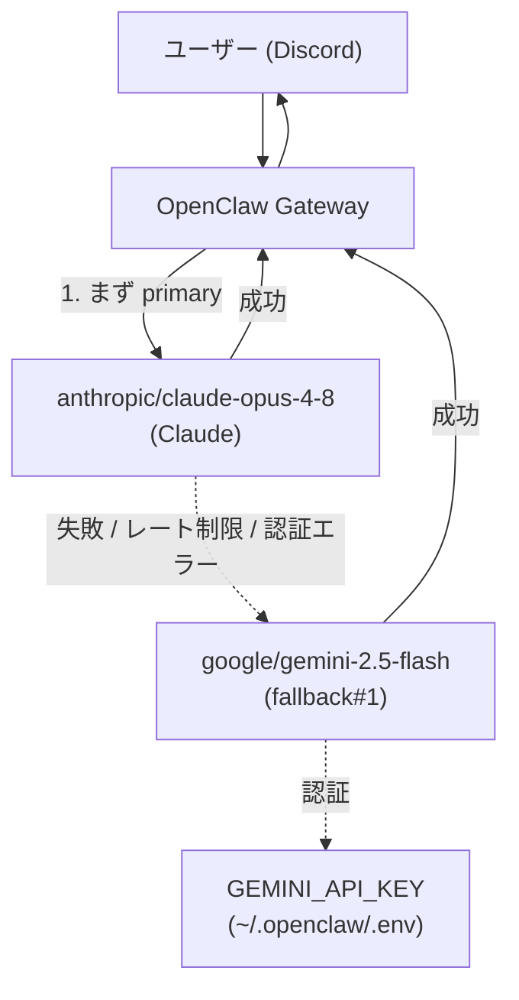

# Gemini フォールバック（無料枠）導入手順

> STATUS: DONE / CATEGORY: SETUP / 作成日: 2026-06-07
> Claude（primary）が利用不可・エラー時に、Google Gemini（無料枠）へ自動フォールバックさせる構成の構築手順です。OpenClaw サーバの可用性強化が目的。

## 0. 概要（何を実現するか）

OpenClaw のモデル設定には **primary（主モデル）** と **fallbacks（代替モデルの順序付きリスト）** があります。primary がレート制限・障害・認証エラー等で応答できない場合、OpenClaw は自動的に fallbacks を先頭から順に試します。

本構成では次を実現します。

- **primary**: `anthropic/claude-opus-4-8`（Claude、通常利用）
- **fallback#1**: `google/gemini-2.5-flash`（Claude が落ちた時の受け皿）

> 用語: **フォールバック（fallback）** … 主たる手段が使えない時に切り替える「予備」のこと。ここでは Claude API が使えない時に Gemini へ切り替える仕組み。
> 用語: **Gemini 2.5 Flash** … Google の軽量・高速な LLM。Google AI Studio の無料枠で利用でき、フォールバック用途に十分な性能・コンテキスト長（約 1024k トークン）を持つ。

### なぜ Gemini か（採用理由）
- Google AI Studio の **API キーが無料枠で取得でき**、追加コストなしでフォールバックを構成できる。
- OpenClaw が `google` プロバイダを公式サポートしており、設定が最小限で済む。
- 最小構成（キー 1 本 + 設定 2 行）で確実にメリットがある（primary 障害時も会話が継続できる）。

## 1. アーキテクチャ



## 2. 前提

- OpenClaw Gateway が systemd user service として稼働していること。
- 設定ファイル: `~/.openclaw/openclaw.json`
- 環境変数ファイル: `~/.openclaw/.env`（Gateway がデーモン起動時に読み込む）

## 3. 構築手順（STEP 1〜5）

### STEP 1: Gemini API キーの取得

Google AI Studio（<https://aistudio.google.com/apikey>）でアカウントにログインし、API キーを発行する。無料枠で取得可能。

> 取得したキーは機密情報。ドキュメント・ログ・コミットには絶対に書かない（実値は `~/.openclaw/.env` のみに保持）。

### STEP 2: API キーを `.env` に設定

`~/.openclaw/.env` に以下を追記する（`GEMINI_API_KEY` または `GOOGLE_API_KEY` のどちらでも可）。

```dotenv
GEMINI_API_KEY=<REDACTED  # 実値は ~/.openclaw/.env を参照>
```

> Gateway は systemd user service として動くため、シェルの環境変数ではなく `~/.openclaw/.env` に置くことで、デーモンプロセスからも読める。

### STEP 3: `openclaw.json` に fallback を追記

`agents.defaults.model` に `fallbacks` を追加する。

```json5
{
  agents: {
    defaults: {
      model: {
        primary: "anthropic/claude-opus-4-8",
        fallbacks: ["google/gemini-2.5-flash"],
      },
    },
  },
}
```

### STEP 4: Gateway 再起動（設定反映）

```bash
openclaw gateway restart
```

> 再起動すると Discord 接続が一瞬切れるが、systemd が自動復帰させる。再起動前の状態確認は `openclaw gateway status`。

### STEP 5: 動作検証

**(参照) モデルが fallback として認識され、認証が通っているか確認:**

```bash
openclaw models list --provider google
```

期待出力（`google/gemini-2.5-flash` が `Auth=yes` かつ `fallback#1` タグ）:

```text
Model                         Input      Ctx     Local Auth  Tags
google/gemini-2.5-flash       text+image 1024k   no    yes   fallback#1
...
```

**(書き込み/API 消費あり) Gemini へ実際にワンショット推論を投げて疎通確認:**

```bash
openclaw capability model run --gateway \
  --model google/gemini-2.5-flash \
  --prompt "Reply with exactly: FALLBACK_OK"
```

期待出力:

```text
model.run via gateway
provider: google
model: gemini-2.5-flash
outputs: 1
FALLBACK_OK
```

`FALLBACK_OK` が返れば、API キー・プロバイダ・Gateway 経路すべてが正常で、フォールバックが実働する状態。

## 4. 検証結果（2026-06-07 実施）

| 項目 | 結果 |
|---|---|
| `models list` で fallback#1 / Auth=yes 確認 | ✅ |
| Gateway 再起動（pid 更新・active） | ✅ |
| 再起動後の Gemini ワンショット疎通（FALLBACK_OK） | ✅ |

## 5. 補足・注意

- `openclaw status` に「scope upgrade pending approval」警告が出る場合があるが、これは Discord プラグインのペアリング承認待ちで、Gemini フォールバックとは無関係。
- `capability model run` は `--local` ではモデル解決できず `Unknown model` になる場合がある。検証は `--gateway` を使う。
- フォールバックは primary 障害時のみ作動する。通常利用は常に Claude（primary）が優先される。
- 無料枠にはレート制限があるため、フォールバックは「一時的な受け皿」と位置づける。

## 6. 関連

- 公式: Google (Gemini) provider — <https://docs.openclaw.ai/providers/google>
- モデル選択・フォールバック挙動: <https://docs.openclaw.ai/concepts/model-providers>
